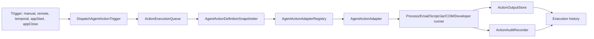
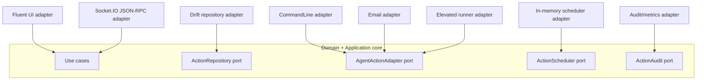

# Plano para Acoes Agendadas e Execucoes

## Objetivo

Adicionar ao Plug Agente uma area de acoes e execucoes para rodar comandos e
processos locais enquanto o aplicativo estiver aberto. A funcionalidade deve
substituir gradualmente cenarios hoje resolvidos por tarefas do Windows e
arquivos `.bat`, mantendo execucao local e execucao via Hub por Socket.IO sem
quebrar o contrato existente. A execucao remota via JSON-RPC depende de handlers
em `RpcMethodDispatcher` para `agent.action.*` (**roteamento implementado** no
agente). O corpo do plano usa "apos roteamento em `RpcMethodDispatcher`" em vez do
marcador historico `NOTA "Fase 6"` (gap do `switch` — superado em 2026-05-19).
Endurecimento de **producao** (allowlist fina no Hub, live E2E, COM real, campo
elevado) segue em **Backlog pos-MVP** e **Riscos aceitos (MVP agente)**.

O plano esta dividido em fases porque o escopo envolve dominio, persistencia,
execucao de processo, elevacao no Windows, contrato JSON-RPC, UI desktop,
seguranca de parametros sensiveis, auditoria, idempotencia, fila de execucao e
historico operacional.

## Backlog de implementacao (atalho)

Resumo executivo para quem implementa; detalhes e checklists completos seguem nas
secoes linkadas.

**Status oficial (2026-05-21):** implementacao obrigatoria no `plug_agente`
para acoes agendadas/execucoes esta **fechada** para CI/local. Ver
[Encerramento MVP agente](#encerramento-mvp-agente-2026-05-20) e gate
`run_agent_actions_operational_gate.py`. Rollout de producao segue bloqueado
ate fechar `COM` real aprovado (RA-01), policy fina no Hub (RA-02) e live E2E
assinado contra Hub real (RA-05). Nao reabrir checklist de codigo no agente ate
nova decisao registrada
([Processo ao desbloquear TODO bloqueado](#processo-ao-desbloquear-todo-bloqueado-futuro))
ou item em **Backlog pos-MVP** abaixo.

Codigo atual do dominio vive em `lib/domain/actions/` (e espelhos em
`application`/`infrastructure`), nao em `lib/domain/agent_actions/` — o
[checklist de arquivos provaveis](#checklist-de-arquivos-provaveis-por-camada)
e aspiracional.

### Backlog pos-MVP (trabalho restante)

Ordem sugerida alinhada a [Roteiro operacional pos-MVP](#roteiro-operacional-pos-mvp-agente)
e [Riscos aceitos (MVP agente)](#riscos-aceitos-mvp-agente).

| Prioridade | ID | Entrega | Dono | Gate / referencia |
| --- | --- | --- | --- | --- |
| P0 | RA-05 | Live Hub E2E opt-in | QA + `.env` | `validate_live_hub_agent_actions_env.dart`; `python tool/homologate_hub_agent_actions.py --validate-live-env --run-live-tests`; `docs/testing/e2e_setup.md` |
| P0 | RA-02 | Allowlist fina e rate limit no **Hub** | repositorio Hub | Policy alinhada a `AgentActionRemoteAuthorizationService` no agente |
| P1 | RA-01 | Handlers **COM** de producao | agente | `com_object_production_registrations.dart`; ou manter stub + RA-01 documentado |
| P1 | RA-06 | Elevado em campo (UAC, distribuicao assinada) | ops | `homologate_elevated_runner.py`; helper instalado |
| P1 | RA-04 | Threat model + sign-off por tipo | PR humano | `agent_action_security_gate_checklist.dart <tipo>` |
| P2 | RA-03 | Contexto remoto inline no RPC | agente + Hub | TODOs em [Fase 6 - Socket.IO e JSON-RPC](#fase-6---socketio-e-json-rpc); decisao MVP 3 contexto |
| P2 | — | Homologacao **developer**/Data7 em campo | ops | Matriz MVP 5; sem override remoto de paths |
| P3 | — | Refino kill/`replaceRunning`, dialogo app-close | agente | Kill TODO em [Regra para Bifurcacoes](#regra-para-bifurcacoes-durante-a-implementacao); DECISAO MVP 2 app-close |
| P3 | — | Subdocs por contexto remanescentes (opcional) | doc | `runner_local`, `runner_elevado`, `tipos_de_acao` ainda planejados; entry-point (`contrato_remoto`, `ui_acoes`, `seguranca_acoes`) entregue |

Refino agente opcional (nao bloqueia CI): crash/kill forcado sem restart;
`replaceRunning` na fila; validacao de contexto remoto quando RA-03 for aceito.

## Sincronizacao plano ↔ codigo (checkpoint)

## Reclassificacao do backlog

Para reduzir a mistura entre historico e trabalho real, considerar o backlog
atual nestes tres grupos:

### Ja entregue

- CRUD base, repositorios, fila local, historico e limpeza inicial de execucoes.
- Nucleo do runner elevado Windows (`plug_agente_elevated_runner`, bridge,
  installer, UI de preparacao) e adapter `developer` Data7.
- Scheduler em memoria com gatilhos `once`, `interval`, `daily`, `weekly`,
  `appStart` e `appClose`.
- Roteamento JSON-RPC `agent.action.*` no agente com auditoria remota,
  idempotencia, correlacao por runtime e testes de dispatcher.
- Pagina **Acoes** operacional com editor principal, execucao local, painel de
  auditoria, riscos remotos, confirmacoes e export de diagnostico de execucao.
- Retencao operacional editavel (`AgentActionRetentionSettings` + card na pagina
  **Acoes**, purge/cleanup e TTL de idempotencia RPC alinhados; gate local/CI
  `python tool/homologate_hub_agent_actions.py --run-contract-tests`).

### Estabilizacao UI/operacao (fechado 2026-05-19)

- Fechar regressao de viewport/layout e manter widget tests da tela **Acoes**
  como gate obrigatorio. **Feito:** manifesto UI (`agent_actions_ui_test_paths.txt`:
  pagina, summary card, risk labels, confirmacoes); repetir ao alterar layout da pagina.
- Consolidar diagnostico de runtime no bootstrap/suporte para investigar falso
  positivo de `Windows Server` sem mudar a policy por hipotese. **Feito (2026-05-19):**
  Win10+ Server usa `RuntimeCapabilities.serverShellLimited()` (modo full com tray/
  notificacoes/auto-update off); probe `isServer` exige regex `windows server`;
  card de runtime degradado na pagina **Acoes** so quando policy injetada como
  degradada no harness.
- Revisar/atualizar itens marcados como TODO generico que hoje descrevem partes
  ja implementadas da UI, runtime guard e diagnosticos. **Feito (2026-05-19):**
  checkpoint, gate (manifestos contrato/UI), health (`retention`/`scheduler`/
  `instance_lock_held`/`last_start_issue_reason`, schema
  `agent_runtime`/`odbc_runtime_tuning`), correlacao auditoria/historico,
  lock do scheduler + `schedulerOperationalIssueReason` no provider/UI,
  UTC no RPC, dropdown de tipo degradado; repetir apos mudancas grandes de
  protocolo ou UI.

### Roadmap real (pos-MVP agente)

Itens abaixo nao reabrem MVP 0–5 no agente; ver tabela **Backlog pos-MVP** no
topo e RA-01..RA-08 em **Riscos aceitos (MVP agente)**.

- Live Hub e policy no consumidor Hub (RA-05, RA-02).
- Handlers COM de producao ou manter stub documentado (RA-01).
- Elevado: validacao em campo com UAC e distribuicao assinada (RA-06).
- Endurecimento por tipo: threat model recorrente e sign-off humano (RA-04).
- Contexto remoto inline no wire quando produto aceitar (RA-03).
- Governanca documental: subdocs entry-point (`contrato_remoto`, `ui_acoes`,
  `seguranca_acoes`) ja entregues; subdocs remanescentes (`runner_local`,
  `runner_elevado`, `tipos_de_acao`) ficam opcionais ate o arquivo passar de
  ~5k linhas (ver politica de subdocs em "Politica para quebrar em
  subdocumentos").

**Ja entregue no agente (nao repetir no backlog):** lock do scheduler
(`AgentActionSchedulerInstanceLock`, 2026-05-19); sete tipos MVP 5 no DI;
auditoria append-only; retencao UI; correlacao auditoria/historico.

Revisao alinhada ao repositorio em **2026-05-20** (backlog pos-MVP); checkpoint
tecnico abaixo mantido desde **2026-05-18** com atualizacoes pontuais.

### Implemented architecture (2026)

Refactor delivered focused execution and presentation boundaries; details below
are in English for technical cross-referencing.

- **`AgentActionExecutionGateChain`** (`lib/application/actions/`): shared
  pre-execution gate pipeline for local runs and remote dry-run validation;
  composes runtime validators, secret resolution, elevated readiness, and
  **`AgentActionDangerousCommandPolicyEnforcer`** (block/warn policy by request
  source).
- **`AgentActionExecutionOrchestrator`** (`lib/application/actions/`):
  post-gate orchestration — queue admission, idempotency reuse, persistence,
  retry loop, elevated routing, and terminal metrics/audit hooks. Consumed by
  `RunAgentActionLocally` after the gate chain succeeds.
- **`AgentActionProcessLifecycle`** (`lib/infrastructure/actions/`): extracted
  process start/wait/kill/output capture shared by command-line, script,
  executable, JAR, and developer runners.
- **RPC split modules** (`lib/application/rpc/`): `AgentActionRpcMethodHandlerOperations`
  delegates to `agent_action_rpc_execution_operations.dart`,
  `agent_action_rpc_audit_operations.dart`, `agent_action_rpc_remote_infrastructure.dart`,
  and `agent_action_rpc_method_handler_support.dart` (replacing a single monolith).
- **Provider controllers pattern** (`lib/presentation/providers/agent_actions/`):
  `AgentActionsProvider` composes focused `ChangeNotifier` controllers
  (definitions, executions, triggers, secrets, remote audit, runtime, bundle
  transfer, history) instead of monolithic provider mixins.

Contract gate: `test/application/actions/agent_action_execution_orchestrator_test.dart`,
`test/presentation/providers/agent_actions/agent_actions_definitions_controller_test.dart`.

- **Roteamento `agent.action.*`:** `RpcMethodDispatcher.dispatch` consulta o
  registry de handlers (`_handlersByMethod`) montado em
  `lib/application/rpc/handlers/rpc_method_handlers.dart` e delega para
  `AgentActionRunRpcHandler`, `AgentActionValidateRunRpcHandler`,
  `AgentActionCancelRpcHandler` e `AgentActionGetExecutionRpcHandler`. A logica
  efetiva vive em `AgentActionRpcMethodHandlerOperations`
  (`lib/application/rpc/agent_action_rpc_method_handler_operations.dart`),
  injetada via `RpcMethodHandlerOperations`. DI em
  `lib/core/di/plug_dependency_registrar.dart` injeta `RunAgentActionLocally`,
  `RunAgentActionViaRemoteTrigger`, `CancelAgentActionExecution`,
  `GetAgentActionExecution`, `AgentActionRemoteRateLimiter`,
  `AgentActionRemoteAuthorizationService`, `BackfillAgentActionExecutionCorrelation`
  e `AgentRuntimeIdentity`. *(O nome `_handleAgentAction*` no dispatcher e
  historico — apos a refatoracao para registry+handlers, nao existe mais.)*
- **Testes:** `test/application/rpc/rpc_method_dispatcher_agent_action_test.dart`
  cobre o fluxo com mocks; manter ao evoluir contrato ou politicas.
  Leitura recente na UI: `ListRecentAgentActionRemoteAudit` +
  `test/application/use_cases/list_recent_agent_action_remote_audit_test.dart`;
  correlacao com historico: `AgentActionsProvider.focusExecutionFromRemoteAudit`
  (inclui `GetAgentActionExecution` quando a execucao nao veio no `listExecutions` da carga).
- **Auditoria append-only (remoto `agent.action.*`):** ao concluir cada RPC
  (`run` / `validateRun` / `cancel` / `getExecution`), o dispatcher grava uma
  linha append-only em Drift (`agent_action_remote_audit` / schema 20). Desde o
  schema **22**, `client_id` e `token_jti` sao preenchidos quando a policy do
  token foi resolvida no fluxo de autorizacao (`enableClientTokenAuthorization`
  ligado) ou, com autorizacao de token desligada mas `enableAgentActionRemoteAudit`
  ligado e credencial presente, por uma resolucao extra via `GetClientTokenPolicy`
  apenas para a linha de auditoria (sem SQL de autorizacao da acao). `traceId` e
  `requestedBy` derivam de `meta` quando a flag de auditoria remota esta ligada.
  Desde o schema **24**, `idempotency_key` do params RPC e gravado na auditoria.
  Negacoes `missing_client_token` e `agent_action_permission_denied` classificam
  outcome `authorization_denied`; labels localizados no painel (EN/PT).
  Registro em
  `plug_dependency_registrar.dart` (implementacao Drift; append continua
  condicionado a flag no dispatcher). Purge periodico da mesma tabela: schema
  independente; retencao efetiva via `AgentActionRetentionSettings` (UI > env >
  default), incluindo auditoria remota e TTL de idempotencia RPC de acoes.
- **`runtimeInstanceId` / `runtimeSessionId`:** `AgentRuntimeIdentity` em
  `lib/core/runtime/agent_runtime_identity.dart` (persistido + sessao por boot),
  registrado em `service_locator.dart`, injetado em `RunAgentActionLocally` e
  persistido em `AgentActionExecution` (Drift schema **21**). Campos opcionais
  no resultado `agent.action.getExecution` (`runtime_instance_id`,
  `runtime_session_id` no JSON).
- **Marcador `NOTA "Fase 6"`:** historicamente apontava para o gap do `switch` no
  dispatcher (fechado). **Varredura (2026-05-20):** menções no corpo foram
  removidas ou substituidas por "apos roteamento em `RpcMethodDispatcher`"; so
  permanecem referencias meta neste checkpoint e na
  [secao de contrato](#padrao-de-comunicacao-remota-a-seguir).
- **MVP 3 no agente (implementacao):** considerado **fechado** para o escopo
  deste repositorio: roteamento `agent.action.*`, gates (`remote_disabled`,
  `feature_disabled`, `maintenance`, `draining`), scopes/allowlist via token,
  idempotencia RPC (TTL dedicado + dedup de execucao), auditoria append-only
  (incl. `idempotency_key`, outcomes de auth), erros com `category: action` e
  `reason` estavel, contexto remoto inline **rejeitado** (`supportsContext:
  false`), capability `extensions.agentActions` documentada, fixtures em
  `test/fixtures/rpc/` (incl. auth, remote disabled, contexto remoto,
  `remote_action_not_approved`, `environment_profile_denied`,
  `action_secret_unavailable`) validados por `contract_fixtures_test.dart`
  (20 erros + requests/results). `failure_to_rpc_error_mapper_test.dart` e
  `rpc_method_dispatcher_agent_action_test.dart` cobrem mapeamento de gates do
  runner (incl. os tres `reason` acima). E2E opt-in
  `hub_agent_action_rpc_live_e2e_test.dart` (`docs/testing/e2e_setup.md`).
  **Categoria no wire:** falhas `Action*` via mapper usam `category: action`;
  respostas montadas no dispatcher (`maintenance`, `rate_limited`, token
  ausente) seguem `getCategory(code)` (`transport` / `auth`). Decisoes MVP 0–1
  e nucleo MVP 4 (Fase 5) alinhados ao codigo (2026-05-19).
- **O que segue para MVP 3 “fechado” de producao (cross-repo / processo):**
  homologacao Hub real com flags `RUN_LIVE_HUB_AGENT_ACTION_RPC_TESTS` /
  `E2E_HUB_EXPECT_*`, allowlist fina e rate limit **no Hub**, metricas de
  produto, threat model recorrente por PR, e goldens finais do lado Hub em CI —
  nao o roteamento basico no agente. **Auditoria append-only:** implementada no
  agente; refinamentos de produto (export avancado) seguem opcionais.

### Proximos passos imediatos (pos-roteamento no agente)

> **Encerrado no agente (2026-05-19):** itens 1–6 abaixo estao implementados; validacao atual
> em **Encerramento MVP agente**. Trabalho novo: live Hub (`.env`), Hub producao ou COM real.

1. [x] **Auditoria append-only (feito no agente, 2026-05-18):** uma linha por
   conclusao de RPC `agent.action.*` em Drift, com `traceId` / `requestedBy` e
   outcome; ver checkpoint. **Retencao/purge (2026-05-18):** use case
   `CleanupExpiredAgentActionRemoteAudit` + timer `AgentActionRemoteAuditPeriodicPurge`
   no bootstrap (`AppInitializer`), retencao configuravel por
   `AGENT_ACTION_REMOTE_AUDIT_RETENTION_DAYS` (ver `ConnectionConstants`).
   **Correlacao com historico (2026-05-19):** `focusExecutionFromRemoteAudit` rejeita destaque quando
   `runtime_instance_id` da auditoria difere do da execucao (incl. apos fetch via
   `GetAgentActionExecution`; linhas antigas sem runtime continuam aceitas). UI:
   `AgentActionRemoteAuditFocusResult` + InfoBar dedicado para mismatch de instancia.
   **Parcial (2026-05-19):** cada linha de auditoria remota grava
   `runtime_instance_id` / `runtime_session_id` (Drift schema 23) a partir de
   `AgentRuntimeIdentity` no `RpcMethodDispatcher`; painel e export JSON exibem
   `inst` / `sess` junto a trace/client.
   **Parcial (2026-05-18):** link "Ver no historico" / "Show in history" no painel de
   auditoria, destaque da linha de execucao e, se necessario, carga pontual via
   `GetAgentActionExecution` quando o id nao estava na janela listada no `load`.
   **UI (2026-05-18):** painel na pagina **Acoes** (`AgentActionsRemoteAuditPanel`)
   quando `enableAgentActions` e `enableAgentActionRemoteAudit` estao ligados: lista
   recente (via `ListRecentAgentActionRemoteAudit` /
   `IAgentActionRemoteAuditStore.listRecent`), botao recarregar e exportar JSON para
   a area de transferencia.
2. [x] **Scopes no payload** — enforcement fino no agente/Hub alem do SQL de client
   token quando `enableClientTokenAuthorization` estiver ativo.
   **Implementado (2026-05-18):** `ClientTokenPolicyAgentActionAuthorization` +
   `RpcMethodDispatcher` resolve policy (`GetClientTokenPolicy`), valida scopes
   (`token_scope`, `agent_action_scopes`, `agent_actions.scopes`) e allowlist
   opcional `agent_actions.action_ids`; compativel com payload sem metadados de
   acao (comportamento legado). `cancel` / `getExecution` fazem prefetch da
   execucao para obter `action_id` antes da checagem de allowlist. Negacao retorna
   `-32002` com `reason` `agent_action_permission_denied`.
3. **`runtimeInstanceId` / `runtimeSessionId`** (parcial **2026-05-18**): valores
   por instalacao (`IAppSettingsStore`) e por boot gravados em cada
   `AgentActionExecution` ao enfileirar (`RunAgentActionLocally` + Drift schema
   21) e expostos em `agent.action.getExecution` / snapshots RPC como
   `runtime_instance_id` / `runtime_session_id`. **Idempotencia RPC (2026-05-18):**
   fingerprint de `agent.action.run` / `validateRun` inclui `runtime_instance_id`
   e `runtime_session_id` quando `AgentRuntimeIdentity` esta injetada no
   `RpcMethodDispatcher` (evita hit de cache de outra sessao/boot). **Health
   (2026-05-18):** `agent.getHealth` inclui bloco `agent_runtime` com
   `instance_id` / `session_id` quando `HealthService` recebe identidade.
   **Metricas (2026-05-19):** contador agregado
   `agent_action_remote_audit_execution_correlated` quando a auditoria remota
   grava `execution_id` + `runtime_instance_id` (callback no
   `RpcMethodDispatcher`; exposto em `agent.getHealth` →
   `execution_counters.remote_audit_execution_correlated_total`).
   **Auditoria remota (2026-05-19):** linhas append-only incluem
   `runtime_instance_id` / `runtime_session_id` para alinhar com execucoes e
   `agent.getHealth` / `agent_runtime`. **Health
   (2026-05-19):** `agent.getHealth` inclui `agent_actions` quando `FeatureFlags`
   esta injetado: flags efetivas, `status` do `AgentActionRuntimeStateGuard`,
   `supported_types` / `unavailable_types`, `remote_audit_enabled`,
   `queue_counters` / `queue_wait_ms` (totais da fila local) e `remote_rpc_counters`
   (conclusoes remotas `agent.action.*`).    **UI execucoes (2026-05-18):** diagnostico
   na pagina **Acoes** mostra `runtime_instance_id` / `runtime_session_id` quando
   presentes em `AgentActionExecution` (alinhado a `agent.getHealth` / RPC).
   **UI politicas de runtime (2026-05-19):** formulario de acao na pagina **Acoes**
   edita `allowedProfiles` (ambiente), `acceptedExitCodes` e `onAppExit`
   (`AgentActionOnAppExitBehavior`), com perfil operacional atual via
   `AGENT_OPERATIONAL_PROFILE`; persistencia em `saveCommandLineAction` /
   `saveDeveloperData7Action` e secao **Restricoes de runtime** no editor.
   **UI estado operacional (2026-05-19):** pagina **Acoes** exibe InfoBar para
   `AgentActionRuntimeStateGuard` (`starting`, `draining`, `degraded`,
   `disabled`); `canRunSelected` / `canTestSelected` respeitam o guard para UI
   local; toggle de manutencao sincroniza `markMaintenance` / `markReady` no
   guard. Testes: rejeicao de notification em `agent.action.*` em
   `rpc_method_dispatcher_agent_action_test.dart`.
   **UI risco e confirmacoes (2026-05-19):** chips de risco (remoto, ad-hoc,
   reaprovacao, gatilho app-close, saida sem redacao, processo ao fechar agente);
   secao **Execucao remota** no editor com confirmacao ao habilitar remoto/ad-hoc
   e gravacao de `approvedAt`/`approvedBy`; confirmacao ao escolher gatilho
   `appClose` no dialogo de gatilhos (`agent_action_risk_labels.dart`,
   `agent_action_confirmations.dart`).
   **Reaprovacao remota (2026-05-19):** `AgentActionDefinitionSnapshotter.riskFingerprint`
   sobre campos de risco; `AgentActionRemoteApprovalReconciler` em
   `SaveAgentActionDefinition` marca `requiresReapproval` quando o fingerprint muda
   apos aprovacao; UI exige nova confirmacao (`confirmReapproveRemoteAgentAction`).
   Testes: `agent_action_definition_snapshotter_test.dart` e caso em
   `agent_action_use_cases_test.dart`; widget tests de chips/reaprovacao e export
   de diagnostico em `agent_actions_page_test.dart`.
   **Segredos e historico (2026-05-19):** `AgentActionSecretPlaceholderScanner` +
   `AgentActionSecretAvailabilityChecker` + `IAgentActionSecretStore`
   (`FlutterSecureAgentActionSecretStore` com fallback noop) +
   `AgentActionSecretPlaceholderResolver` em `RunAgentActionLocally` (substitui
   `${secret:name}` na execucao; falha `action_secret_unavailable` quando ausente);
   UI com chips/InfoBar para placeholders `${secret:name}`, segredos ausentes (quando
   store indisponivel), secao **Segredos da acao** com configurar/atualizar/remover
   (`SaveAgentActionSecret` / `DeleteAgentActionSecret`, `AgentActionSecretsSection`),
   `needsValidation`, tipo sem editor e filtro de historico por execution id / trace /
   idempotency key. Testes: `agent_action_secret_placeholder_scanner_test.dart`,
   `agent_action_secret_availability_checker_test.dart`,
   `save_agent_action_secret_test.dart`, `delete_agent_action_secret_test.dart`,
   widget tests da secao e do dialogo de configuracao em `agent_actions_page_test.dart`.
   `AgentActionSecretPlaceholderResolver` resolve placeholders em command line,
   executable/script/jar (argumentos), email, COM e Developer (`connectionLabel`).
   **Indicadores de fila e runner degradado (2026-05-19):** `AgentActionsProvider`
   recebe `ActionExecutionQueue` (DI) e expõe contadores da fila em memoria no resumo
   e na toolbar; chip/InfoBar **Runner indisponivel** quando
   `AgentActionRuntimeStateSnapshot.blocksType` para o tipo da acao.
   Testes: `agent_action_risk_labels_test.dart`, widget test degradado em
   `agent_actions_page_test.dart`.
   **Export diagnostico (2026-05-19):** `AgentActionExecutionSupportExport`
   (`agent_action_execution_support_export.dart`) gera JSON redigido com metadados
   de falha/corretiva; botao **Copiar JSON de suporte** no painel de diagnostico
   da execucao (pagina **Acoes**). Teste unitario:
   `agent_action_execution_support_export_test.dart`.
4. **Cleanups + metricas** — retencao ampla, purge coordenado, metricas dedicadas
   com labels seguros.
   **Parcial (2026-05-18):** purge no boot + timer `AgentActionExecutionPeriodicPurge`
   (intervalo `ConnectionConstants.agentActionExecutionPurgeInterval`) para linhas
   terminais antigas em `agent_action_execution`, retencao `agentActionExecutionRetention`
   (env `AGENT_ACTION_EXECUTION_RETENTION_DAYS`, default 3 dias, clamp 1..3650);
   `CleanupAgentActionExecutions` usa essa retencao por defeito.
   **Retencao na UI (2026-05-19):** card **Retencao de dados** na pagina **Acoes**
   (`AgentActionsRetentionCard` + `AgentActionRetentionSettings`; salvar, descartar
   edicao e **Usar defaults de ambiente** via `clearPersistedOverrides`); valores salvos
   em `IAppSettingsStore` precedem env; purge/cleanup e TTL de idempotencia RPC
   (`agent.action.run` / `validateRun`) leem o settings no DI. Testes:
   `agent_action_retention_settings_test.dart`,
   `agent_action_retention_cleanup_test.dart`, widget de persistencia em
   `agent_actions_page_test.dart`. **Health retencao (2026-05-19):** quando
   `AgentActionRetentionSettings` esta injetado, `agent.getHealth` →
   `agent_actions.retention` expoe dias/horas efetivos, `persisted_override` e
   `rpc_idempotency_ttl_seconds` (schema
   `rpc.result.agent-get-health.schema.json`, incl. `agent_runtime` e
   `odbc_runtime_tuning` opcional); testes em
   `health_service_test.dart` e `agent_get_health_result_schema_test.dart` (shell
   minimo com `agent_actions` + snapshot tipico de `HealthService` contra o schema
   publicado).    **Health scheduler (2026-05-19):**
   `agent_actions.scheduler` com `started`, `bootstrap_disabled`, `temporal_timer_count`,
   `instance_lock_held` e `last_start_issue_reason` (quando o temporal nao arrancou);
   `com_object_handlers_registered_count` / `com_object_invocation_ready` (2026-05-19).
   Contadores agregados
   (sem labels dinamicos) em `MetricsCollector` / `IRpcDispatchMetricsCollector`:
   `rpc_remote_agent_action_{run|validate_run|cancel|get_execution}_{success|error}`,
   incrementados ao concluir cada RPC remoto `agent.action.*` em
   `_finishAgentActionRpcWithAudit`. Desfechos terminais locais, duracao de execucao,
   `agent_action_remote_permission_denied` e contadores de purge de historico/auditoria/
   idempotencia via `AgentActionExecutionMetricsCollector` (implementado em
   `MetricsCollector`; testes em
   `test/application/actions/agent_action_execution_metrics_test.dart`).
   **Fila local (2026-05-18):** `ActionExecutionQueue` recebe opcionalmente
   `ActionExecutionQueueMetricsCollector` (`MetricsCollector` na DI); contadores
   `agent_action_queue_*` (concorrencia rejeitada/ignorada, fila cheia, pendente
   enfileirado, replay idempotente, inicio de execucao, timeout/cancel na fila) e
   amostras `agent_action_queue_wait_*` no `getSnapshot` (espera pendente ate
   `start()`). Testes: `test/application/actions/action_execution_queue_metrics_test.dart`.
5. **E2E / homologacao** — cenario minimo Socket.IO quando fizer sentido para o
   time (variaveis em `E2EEnv`). **Feito no agente (2026-05-19):** runner
   `tool/homologate_hub_agent_actions.py` (`--run-contract-tests`, `--run-live-tests`);
   teste opt-in
   `test/integration/hub_agent_action_rpc_live_e2e_test.dart` (tags `live`):
   `RUN_LIVE_HUB_AGENT_ACTION_RPC_TESTS=true` exige tambem `RUN_LIVE_HUB_TESTS`,
   `RUN_LIVE_HUB_SIGNING_TESTS`, `E2E_HUB_URL`, `E2E_HUB_TOKEN` e chaves de assinatura;
   valida `agent:register` assinado, `agent:capabilities`, emissao de `agent:ready`
   assinado e socket permanece conectado; opcional `E2E_HUB_EXPECT_AGENT_ACTION_RPC=true`
   aguarda `rpc:request` com metodo `agent.action.*` apos o ready (hub precisa emitir);
   opcional `E2E_HUB_EXPECT_AGENT_ACTIONS_CAPABILITY=true` valida extensao
   `agentActions` em `agent:capabilities` (campos minimos alinhados ao agente).
   Documentacao das variaveis: `docs/testing/e2e_setup.md` (secao Hub
   `agent.action.*` e **Retencao de acoes**). Runner elevado: mesma doc (secao
   Elevated action runner). **Gate local (2026-05-19):** `homologate_hub_agent_actions.py
   --run-contract-tests` inclui contrato RPC/fixtures, Data7, retencao, redator,
   health, lock do scheduler,    `agent_actions_provider_test.dart` (correlacao auditoria/historico,
   `schedulerOperationalIssueReason`), kill/timeout (`command_line_action_process_runner_test`,
   `agent_action_process_kill_guard_test`, `reconcile_agent_action_executions_test`,
   `apply_agent_action_on_app_exit_policies_test`),
   `agent_action_trigger_scheduler_test.dart` e
   `agent_actions_page_test.dart` (shim que delega para `agent_actions_actions_tab_test.dart` (~73 cenarios) e `agent_actions_settings_tab_test.dart` (~5 cenarios), incl. lock do scheduler, mismatch de auditoria, aviso COM sem handlers e metrica COM no summary card);
   `agent_actions_summary_card_test.dart` (metricas isoladas do summary);
   `com_object_invocation_bootstrap_test.dart` no gate;
   repetir apos mudancas no gate. **CI (2026-05-20):** listas em
   `tool/agent_actions_contract_test_paths.txt` e `tool/agent_actions_ui_test_paths.txt`
   (fonte unica para `python tool/homologate_hub_agent_actions.py --run-contract-tests` e
   `flutter_ci.yml`); preflight estatico antes do bundle de testes.
   **Live (2026-05-19):** `--validate-live-env` valida `.env` antes de `--run-live-tests`;
   Hub opt-in no job `live-hub-e2e` (`workflow_dispatch` + secrets).
6. **Varredura deste .md** — **Feito (2026-05-19/20):** Contrato Remoto, ordem
   normativa, Criterios de Aceite, rollback e checkpoint alinhados ao roteamento
   em `RpcMethodDispatcher.dispatch` (nao `method_not_found` para `agent.action.*`
   publicados). **2026-05-20:** limpeza em massa de `NOTA "Fase 6"` no corpo
   (permanecem apenas notas meta no checkpoint). Regressao:
   `rpc_method_dispatcher_agent_action_test.dart` (todos os metodos publicados).

## Decisoes Ja Fixadas

- A primeira versao nao inclui DLL/BPL.
- A funcionalidade so precisa funcionar com o Plug Agente aberto.
- O scheduler de acoes deve operar por usuario/sessao do Windows, nao como
  servico global da maquina.
- Deve existir execucao local pela UI e execucao remota pelo Hub via Socket.IO
  (`rpc:request`/`rpc:response` em `PayloadFrame`; execucao no agente apos
  roteamento de `agent.action.*`).
- A evolucao do protocolo deve ser incremental, sem breaking changes.
- A execucao remota deve usar o canal JSON-RPC existente (`rpc:request` e
  `rpc:response`) dentro de `PayloadFrame`; nao criar evento Socket.IO paralelo
  para acoes.
- A implementacao remota deve respeitar o handshake atual: o Hub so pode chamar
  metodos de acoes depois de `agent:capabilities` e, quando negociado, depois do
  `agent:ready`. A **execucao** desses metodos no agente ocorre pelos handlers em
  `RpcMethodDispatcher`; gates de capability, flags e estado
  operacional continuam podendo rejeitar antes de side effect.
- A descoberta do contrato remoto deve continuar por `rpc.discover`, lendo o
  `docs/communication/openrpc.json` (pode refletir o contrato alvo antes de
  refinamentos de producao; ver secao **Fase 6 — Socket.IO e JSON-RPC** deste plano).
- Execucao remota de acoes (apos roteamento JSON-RPC) deve usar
  autorizacao propria de acoes, nao autorizacao SQL.
- A autenticacao remota pode reutilizar o portador de credencial atual
  (`client_token`, `clientToken` ou `auth`), mas a decisao de permissao para
  `agent.action.*` deve ser feita por um resolver de politica de acoes, separado
  das regras SQL (**apos** roteamento em `RpcMethodDispatcher`).
  O token pode estar presente no transporte antes do metodo de acao existir no
  dispatcher.
- Autorizacao remota (scopes/allowlist no Hub) deve usar permissoes explicitas
  de acoes, como executar, cancelar e consultar execucoes, com possibilidade de
  allowlist por actionId (**apos** roteamento).
- Rate limit dedicado a `agent.action.*` no Hub (enforcement no handler apos
  roteamento) deve existir por token/agente/acao, alem dos
  limites da fila local.
- `agent.action.run` deve aceitar `idempotency_key` para evitar execucao
  duplicada em retry do Hub (**apurado** no handler remoto apos roteamento).
- Idempotencia de acoes remotas (JSON-RPC `agent.action.run` apos roteamento)
  deve ser independente do `id` JSON-RPC e da replay protection do
  transporte; retries do Hub podem usar novo `id` com a mesma `idempotency_key`.
- Idempotencia remota de acoes (mesmo caminho Hub) deve persistir o vinculo
  `idempotency_key -> executionId` pelo menos durante a janela operacional
  definida para acoes, nao depender apenas de cache em memoria.
- A execucao remota deve prever validacao sem side effect via
  `agent.action.validateRun` (contrato; apos roteamento; ver
  DECISAO MVP 3 neste plano). `options.dry_run` em `run` permanece fora do
  contrato publicado neste ciclo, mas pode ser revisitado em versao futura do
  OpenRPC; o alvo e validar autorizacao, parametros, contexto, fila e capability
  antes de executar.
- A execucao remota deve carregar `runtimeInstanceId` e `runtimeSessionId` do
  agente para reduzir risco de duplicidade quando houver reconnect,
  multi-instancia acidental ou processo antigo ainda vivo (registro em execucao
  quando o pedido Hub atinge o use case).
- A feature deve manter um threat model explicito, revisado antes de habilitar
  execucao remota, elevada ou ad-hoc.
- Acoes devem ter limites de concorrencia, fila e timeout.
- Acoes devem ter estado explicito alem de ativo/inativo, incluindo `paused`,
  para manter configuracao e historico sem aceitar execucao manual, remota
  (Hub JSON-RPC apos roteamento ou origem `remoteHub`) ou por
  gatilho.
- Deve existir modo de manutencao operacional para bloquear execucoes remotas
  (Hub JSON-RPC apos roteamento) e agendadas temporariamente sem
  desligar toda a feature.
- Acoes devem poder restringir execucao por ambiente/perfil do agente, como
  `dev`, `homolog`, `prod` ou outro ambiente configurado localmente.
- Cada acao deve definir politica para chamada concorrente da mesma acao:
  permitir paralelo, enfileirar, ignorar ou rejeitar.
- A politica de concorrencia deve deixar explicito o comportamento quando UI
  local e Hub tentarem executar a mesma acao ao mesmo tempo (caso pleno apos
  roteamento de `agent.action.*` em `RpcMethodDispatcher` (roteamento implementado; antes do gap,
  o gatilho logico `remote` ja disputa a fila com a UI via o mesmo use case).
- Comando livre completo deve aceitar pipes, redirecionamentos e composicao de
  linha de comando, executando via `cmd.exe /C`.
- Runners devem definir politica de quoting, encoding/codepage, variaveis de
  ambiente e diretorio de trabalho para evitar comportamento diferente entre UI,
  Hub JSON-RPC (apos roteamento) e helper elevado.
- Execucoes devem ser nao interativas por padrao: stdin fechado, sem prompt
  bloqueante e com politica explicita para janela/console do processo.
- Cada execucao deve usar snapshot/versionamento da definicao da acao no momento
  do enfileiramento, para nao mudar comportamento se a acao for editada depois.
- Cada execucao deve guardar `definitionSnapshotHash` redigido para diagnostico
  e prova operacional da versao executada, sem expor comando sensivel.
- A primeira versao deve definir criterio de sucesso por exit code, com default
  `0` e possibilidade de lista de codigos aceitos por acao.
- Retry automatico deve ser opcional e conservador, nunca aplicado por padrao em
  acoes sensiveis, remotas ad-hoc ou elevadas.
- Arquivos de parametros/contexto aceitos na primeira versao: `.txt` e `.json`.
- Contexto `.json` deve poder ter schema opcional por acao, alem de extensao e
  tamanho, para evitar aceitar JSON arbitrario sem contrato.
- Contexto remoto (payload Hub apos roteamento) ou arquivo local
  deve gerar hash redigido no historico para auditoria do conteudo usado sem
  salvar dados sensiveis.
- Arquivo/contexto e parametros variaveis devem ter modo explicito de injecao:
  argumento, arquivo, variavel de ambiente ou stdin quando este for permitido.
- Agendamentos perdidos enquanto o app estiver fechado devem ser ignorados por
  padrao (`skipMissedRuns`).
- Todas as acoes devem poder usar os mesmos gatilhos comuns: manual, remoto
  (gatilho `remote`/`remoteHub` no use case), temporal, ao iniciar o app e ao
  fechar o app. Chamadas Hub por JSON-RPC sao caminho adicional apos roteamento
  em `RpcMethodDispatcher`.
- Gatilhos temporais devem seguir conceitos semelhantes ao Agendador de Tarefas
  do Windows, mas executando apenas enquanto o Plug Agente estiver aberto.
- Gatilhos temporais usam o timezone local da maquina do agente; horarios
  inexistentes por mudanca de horario devem ser ignorados e horarios duplicados
  devem executar apenas uma vez.
- Gatilho ao iniciar o app equivale a "quando o Plug Agente iniciar", nao
  necessariamente "quando o Windows iniciar", salvo quando o app estiver
  configurado no auto-start.
- Gatilho ao fechar o app deve ser best-effort, com timeout curto, porque nao e
  garantido em crash, kill do processo ou desligamento forcado do Windows.
- Gatilho ao fechar o app deve ter limite mais restritivo e, por padrao, nao
  deve aceitar execucoes longas, elevadas ou remotas (`remoteHub`/Hub JSON-RPC
  apos roteamento).
- O historico de execucoes deve reter dados por 3 dias.
- Cache de idempotencia, saidas capturadas, auditoria redigida e status files
  devem ter politica de limpeza propria, alinhada ou mais restritiva que a
  retencao do historico.
- Cleanup de historico, saida capturada, idempotencia e auditoria nao deve
  remover dados necessarios para execucoes ainda `queued` ou `running`.
- Comandos podem conter parametros sensiveis; segredos nao devem ir para logs,
  historico visivel, Drift em texto puro ou definicao de tarefa do Windows.
- Configuracoes estruturadas devem usar Drift; segredos e credenciais devem usar
  `flutter_secure_storage`.
- Remocao ou rotacao de segredo usado por uma acao deve invalidar teste,
  bloquear execucao quando necessario, registrar failure segura e exigir
  re-aprovacao remota quando a acao estiver habilitada para Hub JSON-RPC (apos
  roteamento).
- Kill deve encerrar somente o processo principal registrado, nao a arvore de
  processos.
- Kill deve validar identidade do processo quando possivel, porque PID pode ser
  reutilizado pelo Windows.
- Acoes em execucao durante fechamento do Plug Agente precisam de politica
  explicita: aguardar ate timeout curto, matar processo principal, ou deixar
  rodando quando o sistema permitir. **Implementado (2026-05-19):**
  `AgentActionOnAppExitBehavior` + `ApplyAgentActionOnAppExitPolicies` no
  `shutdownApp` apos gatilhos app-close.
- Execucoes `queued` ou `running` encontradas no bootstrap apos fechamento ou
  crash anterior devem ser marcadas como interrompidas/orfas antes de reativar o
  scheduler.
- Durante fechamento, migration, update, bootstrap incompleto ou pausa
  operacional, o subsistema de acoes deve entrar em estado `draining` e rejeitar
  novas execucoes com origem remota (Hub JSON-RPC apos roteamento ou `remoteHub`)
  com erro seguro antes de aceitar side effects.
- Execucao elevada deve usar uma tarefa elevada registrada uma vez no Windows,
  evitando UAC em toda execucao.
- O runner elevado recomendado e um helper separado, nao o executavel Flutter
  principal.
- O runner elevado deve retornar status por arquivo JSON seguro por execucao.
- A solicitacao para o runner elevado deve usar request file/nonce protegido ou
  mecanismo equivalente, para evitar execucao elevada forjada apenas com
  `executionId`.
- O ciclo de vida do runner elevado deve prever instalar, validar, reparar,
  atualizar caminho apos update do app e remover quando necessario.
- O tipo `developer` deve existir como adapter especifico para ferramentas de
  desenvolvimento. O primeiro subescopo aprovado e executar `Executor.exe`
  para arquivos `.7Proj`, usando o parametro `-p` para o projeto e `-c` para o
  id de conexao do `Data7.Config`.
- A acao `developer` nao deve virar comando livre paralelo. Ela deve montar uma
  invocacao estruturada do Executor, validar `Executor.exe`, `.7Proj`,
  `Data7.Config` e `connectionId`, e entao entrar pela mesma fila, historico,
  auditoria, redacao e gatilhos das demais acoes.
- O `Data7.Config` deve ser descoberto inicialmente em
  `C:\Data7\bin\Data7.Config` e `C:\Data7\Data7.Config`. Se nao for encontrado
  em busca rapida e restrita, a UI deve solicitar o caminho ao usuario.
- O `Data7.Config` pode conter credenciais de banco. A feature deve ler somente
  o necessario para listar conexoes e validar o `connectionId`; nao persistir,
  logar, incluir em payload remoto ao Hub (apos roteamento) ou
  exibir `Senha` e outros valores sensiveis brutos.
- Execucao remota conservadora deve iniciar por acoes salvas e aprovadas
  localmente (pedido Hub que atinge o use case).
- Habilitar execucao remota de uma acao deve registrar aprovacao local
  (`approvedBy`, `approvedAt`, `approvalReason`) e exigir re-aprovacao quando
  mudarem comando, runner, elevacao, contexto, parametros sensiveis ou politica
  remota.
- Comando livre remoto ad-hoc deve continuar desabilitado por padrao e protegido
  por feature flag propria.
- `agent.action.run` deve ser assincrono do ponto de vista remoto: enfileira ou
  inicia a execucao e retorna `execution_id` e status inicial, sem bloquear o
  request ate o processo terminar. Parcial: `RunAgentActionLocally` honra
  `AgentActionExecutionRequest.returnWhenQueued`; a resposta JSON-RPC inicial para
  o Hub exige handler em `RpcMethodDispatcher` (ver **Fase 6**); a conclusao
  continua em background e e consultada por `agent.action.getExecution` quando o
  roteamento existir.
- Status remoto no MVP deve ser consultado por polling com
  `agent.action.getExecution` (**apos** roteamento do metodo;
  notificacoes de progresso ficam como evolucao futura.
- Metodos remotos com efeito colateral, como `agent.action.run` e
  `agent.action.cancel`, nao devem aceitar JSON-RPC notification sem `id` (**apos**
  roteamento).
- Quando uma notification sem `id` chegar para metodo com efeito colateral, o
  agente deve nao executar a acao (**apos** o handler existir em
  `RpcMethodDispatcher`). Em modo estrito de notification, nao ha
  `rpc:response`; registrar auditoria/metrica local para diagnostico.
- `agent.action.run` nao deve ser permitido em JSON-RPC batch no MVP, salvo
  decisao futura explicita. `agent.action.getExecution` pode ser batchable por
  ser somente leitura.
- O health/diagnostico do agente deve expor estado agregado do subsistema de
  acoes quando a feature estiver habilitada.
- `agent.action.getExecution` deve suportar limite/paginacao de output capturado
  para nao retornar stdout/stderr grande em uma unica response (**apos**
  roteamento).
- Auditoria de execucao remota (eventos originados no caminho Hub apos
  roteamento) deve ser append-only, registrando recebido,
  autorizado/negado, enfileirado, iniciado, cancelamento solicitado e finalizado.
- Exportacao, importacao e backup de acoes devem preservar apenas placeholders
  de segredos, nunca valores reais.
- Falhas de runtime ou capabilities indisponiveis devem degradar a feature de
  acoes sem quebrar o restante do app.
- Quando `enableRemoteAgentActions=false`, a capability `agentActions` deve ser
  omitida; chamadas `agent.action.*` ainda recebidas pelo agente devem falhar de
  forma documentada **no caminho Hub** (handlers existem; alvo: erro de feature
  dedicado mapeado pelo use case/mapper, nao `method_not_found` por ausencia de
  roteamento), sem parecer permissao SQL negada.
- Failures de dominio/aplicacao devem ter mapeamento explicito para mensagens
  de UI e erros JSON-RPC seguros.
- A extensao por novos tipos de acao deve seguir um modelo de adapter
  registrado, evitando `switch` central grande e contratos paralelos.

## Fora de Escopo Inicial

Estes itens nao fazem parte da primeira implementacao, mesmo que a arquitetura
deixe caminho para evolucao posterior:

- Plugin dinamico externo carregado em runtime.
- Execucao de acoes com o Plug Agente fechado.
- DLL/BPL.
- Kill de arvore de processos.
- Comando remoto ad-hoc habilitado por padrao.
- Criacao ou alteracao remota de gatilhos temporais pelo Hub.
- Streaming remoto de stdout/stderr em tempo real.
- Garantia forte de execucao em `appClose`, crash, queda de energia ou
  desligamento forcado do Windows.
- Marketplace ou SDK externo para terceiros criarem acoes fora do repositorio.

## Threat Model Inicial

Esta feature executa comandos e processos locais, portanto deve ser tratada
como superficie de alto risco. O threat model deve ser revisado antes de
habilitar remoto, elevado, ad-hoc ou novos tipos de acao.

Ativos sensiveis:

- comandos, argumentos, contexto `.txt`/`.json` e variaveis de ambiente;
- segredos resolvidos em `flutter_secure_storage`;
- credenciais existentes em arquivos externos usados por adapters, como
  `Data7.Config`;
- capacidade de executar processo local, script, e-mail, COM e runner elevado;
- historico, stdout/stderr, auditoria e status files;
- token remoto, policy de autorizacao e idempotency keys;
- integridade do helper elevado e da tarefa registrada no Windows.

Atores e vetores principais:

- Hub autorizado mas mal configurado tentando executar acao fora do escopo via
  JSON-RPC (apos roteamento em `RpcMethodDispatcher`);
- token roubado ou com policy permissiva tentando executar acao remota pelo
  mesmo caminho Hub (apos roteamento em `RpcMethodDispatcher`);
- usuario local habilitando remoto/elevado sem perceber risco;
- processo local tentando forjar request elevado ou alterar status file;
- arquivo `Data7.Config` malformado, adulterado ou com multiplas conexoes
  ambiguas levando o usuario a selecionar base errada;
- contexto remoto malicioso tentando path traversal, payload grande ou JSON fora
  do contrato;
- comando com segredo inline vazando em logs, historico ou lista de processos;
- duas instancias do agente processando o mesmo pedido Hub de execucao remota
  (apos roteamento) ou corridas na mesma fila entre UI e
  agendador;
- cleanup removendo evidencia de execucao ainda ativa;
- backup/exportacao vazando placeholders resolvidos ou detalhes sensiveis.

Mitigacoes obrigatorias no plano:

- scopes proprios de acoes, allowlist por actionId e politica por ambiente;
- aprovacao local e re-aprovacao quando campos de risco mudarem;
- feature flags para remoto, ad-hoc e elevado;
- parser seguro para arquivos externos de configuracao, sem persistir senhas ou
  dados sensiveis lidos do arquivo;
- redacao antes de log, historico, telemetria ou `rpc:response` ao Hub (apos
  roteamento;
- schema opcional para contexto JSON, limite de tamanho e hash redigido;
- estado `draining`/maintenance mode para bloquear side effects em momentos
  inseguros;
- idempotencia persistida e runtimeInstanceId/runtimeSessionId;
- request file/nonce/ACL para runner elevado;
- auditoria append-only;
- cleanup que preserva dados de execucoes ativas;
- testes de contrato e fixtures para sucesso, negacao e erro.

TODOs do threat model:

- [x] TODO: Checklist minimo de threat model antes de habilitar remoto, elevado ou
  ad-hoc (ver subsecao abaixo). Expandir por adapter/tipo antes de producao.
- [x] TODO: Revisar threat model em cada mudanca de protocolo remoto,
  permissao, runner elevado, segredo ou contexto.
  **Processo:** checklist minimo + tabela por adapter; revalidar em cada PR que
  toque RPC, policy, runner, segredo ou contexto (nao automatizado no CI).
- [x] TODO: Registrar riscos aceitos explicitamente nas decisoes pendentes ou em
  documento futuro de seguranca.
  **Agente (2026-05-20):** secao **Riscos aceitos (MVP agente)** abaixo; gate de
  seguranca §4195 documenta rollback via `FeatureFlags`.

### Checklist minimo de threat model (MVP)

Antes de habilitar **remoto**, **elevado** ou **ad-hoc** para um tipo de acao,
revalidar pelo menos:

- **Autorizacao e superficie RPC**: scopes em `AgentActionRpcConstants`, policy
  por `client_token`, aprovacao remota onde aplicavel; preferir `validateRun`
  sem efeito colateral quando o fluxo permitir dry-run antes de `run`.
- **Contrato e dados**: schemas/OpenRPC alinhados ao validador e ao contrato
  publicado; roteamento `agent.action.*` em `RpcMethodDispatcher` (fechado);
  limites (`max_payload_bytes`, batch); contexto JSON
  com limite e schema opcional; paths e snapshot de path (`ActionPathValidator` /
  preflight) onde aplicavel.
- **Exposicao e operacao**: redacao em logs/historico/RPC; idempotencia de negocio
  via historico/execucao para `agent.action.run` quando a stack remota existir;
  idempotencia RPC namespaced **apos** o metodo ser roteado no dispatcher;
  `AgentActionRuntimeStateGuard` + manutencao/draining para bloquear efeitos em
  transicao; segredos fora de armazenamento simples; runner elevado apenas com
  processo/tarefa dedicados quando a fase existir.

Revisar estes pontos em cada mudanca de protocolo remoto, permissao, runner
elevado, segredo ou contexto (TODO processual acima).

### Threat model baseline por adapter (agente, 2026-05-20)

Baseline para revisao de PR antes de tratar um tipo como **fechado para producao**
(remoto/elevado/ad-hoc). Nao substitui revisao humana; cobre riscos ja mitigados
no codigo e o que ainda exige gate operacional.

| Tipo | Superficie principal | Riscos | Mitigacoes no agente | Gate remoto/elevado |
| --- | --- | --- | --- | --- |
| `commandLine` | Shell via `cmd` / PowerShell implicito | Injecao de comando; vazamento em stdout; ad-hoc remoto | `ActionCommandNormalizer`; `ActionPathValidator`; allowlist de dirs; `capturePolicy` + redator; fase `definition_validation` / `execution_preflight` | Remoto so acao salva + aprovacao; ad-hoc **off** por default; elevado opcional com bridge |
| `executable` | `CreateProcess` em binario | Executavel trocado (snapshot); path fora de allowlist | Path snapshot + hash; working dir allowlist; exit codes configuraveis | Idem commandLine |
| `script` | Interpretador + script | Interpreter hijack; script path drift | Validacao de interpreter/script paths; encoding policy | Idem; interpreter path fixo na definicao |
| `jar` | `java` + JAR | Java ausente; JAR alterado | `JarActionAdapter` valida paths e Java; preflight | Idem |
| `email` | SMTP + anexos | Credencial SMTP; anexos como exfil; spam | Segredos em secure storage; placeholders; validacao de enderecos; paths de anexo com `ActionPathValidator` | Remoto com aprovacao; sem ad-hoc; anexos limitados a paths validados |
| `comObject` | COM local | ProgId arbitrario; sem handler = falha segura | Registry de handlers (`com_object_production_registrations.dart` / stub E2E); argumentos validados | Remoto apenas acoes salvas; handlers de producao obrigatorios fora de homologacao |
| `developer` | Data7 executor + `.7Proj` + XML config | Credencial em XML; catalogo vazado | Parser XML; catalogo so id/label; hash sem senha; paths allowlist; preview redigido | Remoto **sem** override de executor/projeto/config/conexao; homologacao de campo pendente |

**Erros acionaveis (todos os tipos):** adapters e validators devem preencher
`ActionFailure.context['user_message']` e `phase` onde aplicavel; UI e RPC usam
`AgentActionFailureDiagnosticsResolver` / mapper com `user_message` (gate §4190).

**Revisao de PR (checklist curto):**

1. Confirmar linha da tabela acima para o tipo alterado.
2. Rodar `python tool/run_agent_actions_operational_gate.py` (ou `python tool/homologate_hub_agent_actions.py --run-contract-tests`).
3. Imprimir checklist por tipo: `dart run tool/agent_action_security_gate_checklist.dart [tipo]`.
4. Se habilitar remoto/elevado/ad-hoc: atualizar OpenRPC/schemas e validar
   `FeatureFlags` + aprovacao remota na UI.
5. Registrar risco aceito em "Decisoes Pendentes" ou **Riscos aceitos** se algo ficar
   temporariamente aberto (ex.: COM handler stub em homologacao).

## Padrao de Comunicacao Remota a Seguir

Contrato, schemas e transporte foram alinhados ao roteamento em
`RpcMethodDispatcher.dispatch` para `agent.action.*` (2026-05-19). Os bullets
abaixo descrevem o padrao vigente (roteamento em `RpcMethodDispatcher`, 2026-05-19).
O marcador historico `NOTA "Fase 6"` foi removido do corpo do plano em 2026-05-20.

A execucao remota deve ser modelada como extensao do Plug JSON-RPC Profile
existente, nao como transporte novo. A leitura de `docs/communication` indica
estas regras para a implementacao futura:

- Todo evento de aplicacao trafega em `PayloadFrame`.
- O payload logico continua sendo JSON UTF-8, com `cmp: gzip` ou `cmp: none`
  negociado por mensagem.
- O Hub envia chamadas de negocio por `rpc:request` e o agente responde por
  `rpc:response`.
- `rpc.discover` publica o OpenRPC carregado de
  `docs/communication/openrpc.json`.
- Schemas por metodo ficam em `docs/communication/schemas/`.
- `api_version` e `meta` sao recomendados para rastreabilidade, com
  `meta.trace_id`, `traceparent`, `tracestate`, `request_id`, `agent_id` e
  `timestamp`.
- `agent:capabilities` negocia `extensions` e `limits`; novas capacidades
  opcionais devem entrar nesse mecanismo.
- O contrato de erro exige `error.data` com `reason`, `category`, `retryable`,
  `user_message`, `technical_message`, `correlation_id` e `timestamp`.
- Notification JSON-RPC sem `id` nao gera response. Para acoes com efeito
  colateral, o agente deve impedir a execucao antes de enfileirar.
- Batch JSON-RPC nao e atomico por padrao. No MVP, evitar `agent.action.run`
  dentro de batch para nao criar varios efeitos colaterais em uma unica
  mensagem.
- Delivery guarantee e replay protection ja existem no transporte; por isso
  `idempotency_key` de negocio e obrigatorio para `agent.action.run`.
- Nao existe API generica de upload/download de arquivo. Contexto remoto deve
  ser serializado no payload logico do metodo e respeitar `max_payload_bytes`;
  contexto grande deve ser rejeitado no MVP, nao enviado fora do frame.
- Assinatura HMAC do `PayloadFrame`, quando negociada, vale tambem para os
  novos metodos sem mudanca de contrato.

Implicacoes praticas para `agent.action.*`:

- [x] TODO: Nao criar eventos Socket.IO como `agent:action:run`; usar apenas
  `rpc:request` com `method: "agent.action.run"`.
- [x] TODO: Atualizar `docs/communication/openrpc.json` somente junto da
  implementacao real dos metodos, incrementando a versao do contrato de forma
  minor/aditiva. Contrato publicado em `2.11.0` para `agent.action.run`,
  `agent.action.cancel` e `agent.action.getExecution`; `2.11.1` adiciona
  `agent.action.validateRun`; `2.11.2` adiciona status/flag explicitos de
  `skipped` em `agent.action.getExecution` e contador de health
  `terminal_skipped_total`. **Execucao remota no agente:** handlers em
  `RpcMethodDispatcher.dispatch` (fechado); manter OpenRPC/schemas sincronizados ao
  evoluir contrato.
- [x] TODO: Atualizar `socket_communication_standard.md` quando os metodos
  estiverem implementados, porque esse documento descreve o estado atual
  implementado. Parcial: texto alinhado ao contrato e as bordas existentes
  (validador, batch, capability); revisar de novo quando `agent.action.*` for
  roteado em `RpcMethodDispatcher`.
- [x] TODO: Schemas separados para params/result de cada metodo `agent.action.*`
  (`docs/communication/schemas/`):
  `rpc.params.agent-action-run.schema.json`,
  `rpc.params.agent-action-validate-run.schema.json`,
  `rpc.result.agent-action-validate-run.schema.json`,
  `rpc.params.agent-action-cancel.schema.json`,
  `rpc.result.agent-action-cancel.schema.json`,
  `rpc.params.agent-action-get-execution.schema.json` e
  `rpc.result.agent-action-get-execution.schema.json`.
  Implementados no repositorio; `agent.action.run` reutiliza o schema de result
  seguro de `getExecution` no MVP; result proprio de `run` apenas se o contrato
  divergir.
- [x] TODO: Garantir que `rpc.discover` passe a refletir os metodos de acoes
  assim que o OpenRPC for atualizado.
  Parcial: `test/docs/openrpc_contract_test.dart` verifica que `openrpc.json`
  lista exatamente os `agent.action.*` em
  `AgentActionRpcConstants.remotePublishedRpcMethodNames` (mesma ordem que
  `remotePublishedRpcMethodNamesOrdered`), refs de params/result por metodo via
  `TransportSchemaIds` (incl. `run` → result de `getExecution` no MVP), cobertura
  dos sete schemas publicados de acao e leitura via `OpenRpcDocumentLoader` como em
  `rpc.discover`; capacidade
  `agentActions.supportedMethods`, `authorizationScopes` e o bloqueio de batch
  para `run`/`cancel` usam as mesmas constantes (`remotePublishedRpcMethodNamesOrdered`,
  `remotePublishedAuthorizationScopesOrdered`,
  `jsonRpcBatchDisallowedAgentActionMethods`).
  Parcial de codigo Dart: literais de nome de metodo remoto (`agent.action.*`)
  concentram-se em `AgentActionRpcConstants` (validador de params, handler de
  batch, capabilities, testes); mensagens tecnicas estaveis, `reason` /
  `errorReason`, `failure_code` e textos de validacao do `RpcInboundHandler`
  consolidados em `RpcInboundConstants` (inclui guardas `protocol_not_ready`,
  concorrencia de handlers, batch vazio, payloads invalidos, assinatura e
  `RpcRequestGuard`); validacao estrita de batch usa `RpcBatchConstants` para
  `reason` e prefixos de `technical_message`; falha de contrato na preparacao de
  `rpc:response` usa `RpcResponseConstants`; `NotFoundFailure` mapeia
  `resource_not_found` via `RpcErrorDataConstants`; guards de subsistema de
  acoes usam `AgentActionRuntimeStateConstants` e `AgentActionGateConstants`
  para `reason` estaveis em falhas de autorizacao. Fixtures JSON em
  `test/fixtures/rpc/` permanecem como amostras de fio literais.
- [x] TODO: Usar `meta.trace_id`/`traceparent` e `meta.request_id` para
  preencher `traceId`, `requestedBy` e auditoria da execucao.
  Implementado: `AgentActionRpcMethodHandlerOperations.handleAgentActionRun` /
  `handleAgentActionValidateRun` propagam `traceId` via `meta.trace_id` ou
  segmento de `meta.traceparent` (W3C) e `requestedBy` via `meta.request_id`
  (fallbacks documentados no codigo). Auditoria append-only por conclusao de RPC
  `agent.action.*` (`_finishAgentActionRpcWithAudit` em
  `agent_action_rpc_method_handler_operations.dart` + tabela Drift
  `agent_action_remote_audit`) grava `traceId` / `requestedBy` / `idempotency_key`
  (schema 24). **Backfill (2026-05-19):** `BackfillAgentActionExecutionCorrelation` preenche
  `traceId` / `requestedBy` ausentes na execucao quando `agent.action.cancel` ou
  `agent.action.getExecution` chegam com `meta.trace_id` / `meta.request_id`
  (sem sobrescrever valores ja gravados no `run`).
- [x] TODO: Tratar `request.id`, `meta.request_id` e `idempotency_key` como
  conceitos diferentes:
  - `request.id`: correlacao JSON-RPC e replay protection do transporte;
  - `meta.request_id`: rastreabilidade operacional;
  - `idempotency_key`: deduplicacao de efeito de negocio da acao.
  Fechado no agente: respostas reutilizam `request.id` do pedido; cache de
  idempotencia RPC usa chave namespaced `method:key` (`_namespacedRpcIdempotencyStoreKey`)
  para `agent.action.run` e `agent.action.validateRun` quando
  `enableSocketIdempotency` e store estao ativos; deduplicacao por negocio
  continua no use case via historico `actionId` + `idempotency_key`.
- [x] TODO: Se `agent.action.run` chegar em batch no MVP, rejeitar o item antes
  de enfileirar com erro seguro de contrato/metodo nao permitido em batch.
- [x] TODO: Se `agent.action.cancel` chegar em batch no MVP, rejeitar ou tratar
  como operacao idempotente somente apos decisao explicita; documentar a escolha
  no OpenRPC. Decisao MVP: rejeitar em batch antes de dispatch, com motivo
  `method_not_allowed_in_batch`.
- [x] TODO: Permitir `agent.action.getExecution` em batch, se a validacao de
  schema e rate limit suportarem o volume. Parcial: `RpcInboundHandler`
  **bloqueia** em batch `agent.action.run` e `agent.action.cancel`;
  `getExecution` e `validateRun` **nao** estao nessa lista e seguem para
  `RpcMethodDispatcher.dispatch` com handlers reais. O teste em
  `test/infrastructure/external_services/transport/rpc_inbound_handler_test.dart`
  usa mock do dispatcher para isolar a politica de batch.

## Politica de Atualizacao de Documentacao

A documentacao deve acompanhar a implementacao real da feature, sem publicar
contrato como disponivel antes do codigo existir.

Regras gerais:

- [x] TODO: Cada MVP deve revisar este plano e marcar/ajustar os TODOs
  relacionados ao que foi implementado.
  **Feito no agente (2026-05-20):** checkpoint, backlog, Test Plan (gate manifestos contrato/UI),
  estabilizacao, encerramento MVP agente e checklist de processo futuro; Hub/COM
  producao permanecem cross-repo.
- [x] TODO: Quando uma decisao tecnica for fechada durante a implementacao,
  atualizar a secao "Decisoes Pendentes" ou mover a decisao para a parte
  definitiva do plano.
  **Parcial (2026-05-19):** decisoes fixadas (JSON-RPC, idempotencia, batch, runtime
  identity) refletidas no checkpoint; bifurcacoes novas seguem regra operacional abaixo.
- [x] TODO: Toda mudanca de protocolo deve atualizar, no mesmo ciclo de
  implementacao, os schemas, OpenRPC, documentacao de comunicacao e testes de
  contrato correspondentes.
  **Parcial (2026-05-19):** gate local (`contract_fixtures_test`, `openrpc_contract_test`,
  `python tool/homologate_hub_agent_actions.py --run-contract-tests`, job CI); repetir ao alterar
  contrato publicado.
- [x] TODO: Nao comunicar ao operador que o caminho Hub esta **pronto para producao**
  antes de fechar endurecimento: allowlist fina de acoes/scopes no Hub, auditoria
  append-only dedicada, metricas dedicadas, testes de contrato/E2E minimos e
  revisao de threat model. Handlers em `RpcMethodDispatcher`, schemas e
  validadores ja existem; capability `agentActions` continua condicionada a
  flags (`enableRemoteAgentActions`, etc.).
  **Agente (2026-05-19):** gate local e CI cobrem contrato + UI + purge com
  `AgentActionRetentionSettings`; **producao Hub** ainda exige homologacao live
  (`live-hub-e2e` / `--run-live-tests`) e endurecimento no repositorio do Hub.
- [x] TODO: Quando `rpc.discover` passar a expor novos metodos, garantir que o
  arquivo publicado em `docs/communication/openrpc.json` esteja alinhado ao
  runtime.
  **Parcial (2026-05-20):** `test/docs/openrpc_contract_test.dart` valida
  `agent.action.*` em `openrpc.json` e `OpenRpcDocumentLoader` vs
  `AgentActionRpcConstants.remotePublishedRpcMethodNames`, ordem estavel no
  documento, wiring de schemas publicados por metodo (alinhado a
  `TransportSchemaIds`), os sete arquivos de schema de acao referenciados e `$ref`
  resolviveis; repetir ao adicionar metodo ou schema.
- [x] TODO: Quando defaults operacionais mudarem, atualizar o plano e a
  documentacao relevante de configuracao/operacao.
  **Parcial (2026-05-19):** retencao de acoes documentada em `docs/testing/e2e_setup.md`,
  `.env.example` e UI **Retencao de dados** (`AgentActionRetentionSettings`).
- [x] TODO: Quando um novo tipo de acao for adicionado, atualizar a matriz de
  riscos, o checklist "Como adicionar uma nova acao", a capability remota se
  aplicavel e o test plan.
  **Parcial (2026-05-19):** matriz MVP 5 e checklist reestruturado
  (ver [Definition of Done por MVP](#definition-of-done-por-mvp)); repetir
  ao adicionar tipo 8+ ou mudar wire/capability.
- [~] **Regra continua (nao e backlog de implementacao):** quando uma feature flag
  mudar de experimental para default, atualizar rollback/desativacao e docs de
  comunicacao no mesmo ciclo de release.

Documentos a revisar por area:

- Dominio/persistencia: este plano, migrations planejadas e criterios de aceite.
- UI: este plano, rotas/menu, strings localizadas e comportamento operacional.
- Socket.IO/JSON-RPC: `docs/communication/openrpc.json`,
  `docs/communication/socket_communication_standard.md`,
  `docs/communication/socket_communication_roadmap.md` quando a ordem mudar, e
  `docs/communication/schemas/`.
- Testes E2E/integracao: `docs/testing/e2e_setup.md` quando a feature exigir
  variaveis, setup ou passos novos de homologacao.
- Seguranca/operacao: este plano e qualquer documento operacional futuro que
  descreva segredos, runner elevado, auditoria ou rollback.

Politica para quebrar em subdocumentos (**governanca — adiar ate necessidade**):

Este arquivo permanece a fonte canonica enquanto o MVP agente estiver fechado.
Quebrar em subdocs so quando revisao por PR ficar impraticavel (~5k linhas).

Subdocs (indice; regra canonica permanece aqui):

- [`docs/implemente/acoes/contrato_remoto.md`](acoes/contrato_remoto.md) — 2026-05-20
- [`docs/implemente/acoes/ui_acoes.md`](acoes/ui_acoes.md) — 2026-05-20
- [`docs/implemente/acoes/seguranca_acoes.md`](acoes/seguranca_acoes.md) — 2026-05-20
- `docs/implemente/acoes/runner_local.md` (planejado)
- `docs/implemente/acoes/runner_elevado.md` (planejado)
- `docs/implemente/acoes/tipos_de_acao.md`
- `docs/implemente/acoes/developer_data7_executor.md` (se o adapter `developer`
  crescer alem deste plano)

Cada subdoc futuro deve referenciar este plano e manter TODOs menores, sem
duplicar regra canonica do repositorio (`.cursor/rules`, `docs/communication`).

## Regra para Bifurcacoes Durante a Implementacao

Durante a implementacao, se surgir um ponto nao previsto no plano, uma
bifurcacao tecnica ou uma incompatibilidade entre o plano e o codigo real, a
decisao nao deve ficar implicita no codigo. O plano deve acompanhar a decisao
antes ou junto da implementacao.

Regra operacional (**vigente apos encerramento MVP agente**; nao sao itens `[ ]`
de implementacao — usar ao reabrir trabalho sensivel):

1. Registrar bifurcacao neste plano antes de seguir se afetar comportamento,
   contrato, seguranca, persistencia, UI visivel, testes ou operacao.
2. Marcar o TODO relacionado como `[ ] TODO (bloqueado)` quando a decisao puder
   mudar arquitetura, contrato, dados persistidos, permissao, runner, protocolo
   ou experiencia do usuario.
3. Registrar em **Decisoes Pendentes** (final do plano) quando exigir confirmacao
   tecnica ou de produto.
4. Nao escolher caminho irreversivel ou com impacto de seguranca sem decisao
   explicita e plano de rollback.
5. Alternativa reversivel: documentar premissa e transformar em decisao pendente
   se precisar validacao posterior.
6. Se alterar comportamento documentado, atualizar criterios de aceite, Test
   Plan, rollback e docs de comunicacao no mesmo ciclo.

Ver tambem [Processo ao desbloquear TODO bloqueado](#processo-ao-desbloquear-todo-bloqueado-futuro).

Niveis de autonomia:

| Nivel | Quando aplicar | Acao esperada |
| --- | --- | --- |
| Reversivel e local | Nome interno, organizacao pequena de arquivo, detalhe sem impacto publico | Documentar premissa no TODO e seguir |
| Reversivel mas transversal | Afeta mais de uma camada, testes, UI ou operacao local | Registrar decisao pendente curta e seguir somente se houver fallback claro |
| Sensivel | Afeta protocolo, Drift, seguranca, segredos, remoto, elevado, scheduler, kill/processos ou adapters | Bloquear TODO e solicitar decisao antes de implementar |
| Risco de breaking change | Pode quebrar Hub, schemas, dados existentes, compatibilidade ou seguranca | Nao implementar sem aprovacao explicita e plano de rollback |

Template para registrar bifurcacao (copiar ao abrir decisao nova):

```text
- [ ] DECISAO MVP X: <titulo curto>
  - Contexto encontrado: <o que apareceu no codigo real ou na implementacao>
  - Opcoes: <opcao A>, <opcao B>, <opcao C se existir>
  - Impacto: <protocolo, seguranca, persistencia, UI, testes, operacao>
  - Recomendacao tecnica: <caminho sugerido e motivo>
  - Decisao tomada: <preencher quando fechado>
  - TODOs afetados: <ids, secoes ou itens do plano>
```

Areas que exigem decisao explicita **antes de um caminho novo** (baseline MVP 1–5 ja
entregue no agente; ver **Sincronizacao plano ↔ codigo**). Reabra o checklist ao
alterar comportamento, contrato ou dados persistidos:

- [x] TODO: Protocolo Socket.IO/JSON-RPC — baseline: `agent.action.*` roteados,
  schemas/OpenRPC, fixtures e gate local; novas mudancas exigem ciclo de contrato.
- [x] TODO: Persistencia Drift — baseline: execucoes, auditoria remota, retencao
  (`AgentActionRetentionSettings`), purge/cleanup; novas tabelas exigem migracao.
- [x] TODO: Segredos/redacao — baseline: `flutter_secure_storage`, redator, placeholders,
  export de suporte; revisar threat model ao expandir superficie.
- [x] TODO: Execucao remota — baseline no agente; producao Hub (allowlist fina,
  metricas) continua cross-repo.
- [x] TODO: Execucao elevada — baseline no repo; homologacao UAC/distribuicao em campo.
- [x] TODO: Scheduler — baseline: gatilhos, IANA (`IanaTimezoneIdField`), catch-up,
  lock de instancia (`AgentActionSchedulerInstanceLock`); aviso na pagina **Acoes**
  quando `lastStartIssueReason` e `scheduler_instance_locked` ou
  `scheduler_bootstrap_failed` (2026-05-19).
- [x] TODO: Kill, timeout, retry, PID principal, identidade do processo,
  processos orfaos e politica no fechamento do app (revisar ao mudar runners).
  **Baseline (2026-05-19):** runners com `maxRuntime`, `killMainProcessOnTimeout`,
  `AgentActionProcessKillGuard` + `AgentActionProcessKiller`, cancel/kill com
  validacao de PID/identidade; `ApplyAgentActionOnAppExitPolicies` no shutdown;
  `ReconcileAgentActionExecutions` no bootstrap; metricas em `agent.getHealth`
  (`execution_counters`, fila); gate local inclui
  `command_line_action_process_runner_test.dart`,
  `agent_action_process_kill_guard_test.dart`,
  `apply_agent_action_on_app_exit_policies_test.dart`. **Orfaos no bootstrap
  (2026-05-19):** `IAgentActionOrphanProcessTerminator` + kill por PID com
  validacao de identidade antes de `ReconcileAgentActionExecutions` marcar
  `interrupted`; testes `reconcile_agent_action_executions_test.dart`. Pendente:
  crash/kill forcado sem restart, `replaceRunning`, refinamentos cross-runner.
- [x] TODO: Adapters novos ou alterados — checklist **Como adicionar uma nova acao**
  ao introduzir tipo ou variante de runner.
  **Baseline (2026-05-19):** sete tipos em `AgentActionAdapterRegistry` +
  `AgentActionLocalRunnerRegistry` (DI); contrato
  `agent_action_type_registry_contract_test.dart`; gates de producao/threat model
  por PR permanecem antes de anunciar tipo como fechado (ver
  [Definition of Done por MVP](#definition-of-done-por-mvp)).
- [x] TODO: UI operacional — revisar l10n/fluxos quando mudar confirmacoes, diagnostico
  ou superficies visiveis.
  **Baseline (2026-05-19):** pagina **Acoes** com formularios por tipo (`commandLine`,
  `executable`, `script`, `jar`, `email`, `comObject`, `developer`), riscos,
  segredos, retencao, scheduler, auditoria, diagnostico, aviso COM sem handlers
  (`agent_actions_com_object_handlers_missing`), metrica **COM handlers** no summary
  card; gate UI: manifesto `agent_actions_ui_test_paths.txt` (pagina + summary + riscos + confirmacoes);
  repetir l10n/UX ao alterar confirmacoes ou superficies.
- [x] TODO: Dependencias externas novas ou troca de pacote existente.
  **MVP agente (2026-05-19):** nenhum pacote novo em `pubspec.yaml` para acoes
  agendadas; reutiliza stack existente (`drift`, `flutter_secure_storage`, `uuid`,
  etc.). Reabrir este TODO ao adicionar ou trocar dependencia com impacto em
  licenca, CI ou distribuicao.

### Processo ao desbloquear TODO bloqueado (futuro)

Aplicar **somente** ao marcar `[ ] TODO (bloqueado)` ou reabrir item sensivel
(protocolo, Drift, seguranca, kill, adapter em producao). O MVP agente
(2026-05-19) **nao** exige preencher esta lista retroativamente. Gate e testes:
secao **Gate local, CI e live Hub** no Test Plan.

1. Registrar a decisao em secao definitiva do plano (ou **Decisoes Pendentes**).
2. Atualizar o Test Plan; no agente, incluir casos no gate
   `homologate_hub_agent_actions.py` quando aplicavel.
3. Revisar rollback/feature flags e `AgentActionSubsystemCoordinator` quando a
   mudanca for transversal.
4. Atualizar OpenRPC/schemas/docs de comunicacao no mesmo ciclo se o wire mudar.
5. So entao marcar o item como `[ ] TODO (em andamento)` ou `[ ] TODO`.

### Encerramento MVP agente (2026-05-20)

Implementacao obrigatoria no `plug_agente` para acoes agendadas/execucoes esta
**fechada** para CI/local. Nao ha checklist de codigo pendente no agente ate decisao
nova (secao **Processo**) ou item em **Backlog pos-MVP** (topo deste arquivo).
Trabalho restante: live Hub, Hub producao, COM real, elevado em campo — ver RA-01..RA-08.

**Atualizacao local (2026-05-21):** `skipIfRunning` agora persiste
`status=skipped`; UI, notificacao, metricas e health distinguem skip de
cancelamento; `agent.action.getExecution` publica `status=skipped` e
`flags.skipped`; OpenRPC/schemas/fixtures foram sincronizados com esse wire.

**Ultimo endurecimento documentado no agente (2026-05-20):** UI de fila/allowlist de
paths; mensagens acionaveis e fase no preview de teste; baseline de threat model por
adapter; riscos aceitos RA-01..RA-08; contrato de registry (`validateDefinition` por tipo);
preflight estatico de producao; manifestos de teste + sync CI/homologate; checklist PR
(`agent_action_security_gate_checklist.dart`); gate ampliado (runtime, Data7, path/segredos/remoto/elevado,
`validate_agent_action_definition`, rate limiter, subsystem coordinator, remote capability builder,
output pager/getExecution, process invocation diagnostics, preview sem side effect,
segredos (save/delete/availability), auditoria remota, failure RPC mapper, fila/metricas,
email template, client token policy, use cases, dominio, inbound handler (batch/notification),
backfill de correlacao, mensagens de notificacao, constantes RPC/gates/queues, elevado
(readiness, request protection, status file, bridge, purge) e widgets de risco/confirmacao/auditoria).

| Validacao | Comando |
| --- | --- |
| Preflight `.env` | `dart run tool/check_e2e_env.dart` |
| Live Hub `.env` only | `dart run tool/validate_live_hub_agent_actions_env.dart` |
| Sugestão URL (Windows) | `dart run tool/suggest_e2e_hub_from_local_config.dart` (`--apply-url` grava `E2E_HUB_URL` se vazio) |
| Token E2E (Windows) | `dart run tool/fetch_e2e_hub_token_from_local_config.dart --apply-token` (`--force`; DB, credenciais salvas ou `E2E_HUB_USERNAME`/`PASSWORD` no `.env`; não imprime token) |
| Sync completo (Windows) | `dart run tool/sync_e2e_hub_env_from_local.dart --export-secure` (inclui `--apply-agent-id`) |
| Agent id E2E | `dart run tool/suggest_e2e_hub_from_local_config.dart --apply-agent-id` |
| Prepare live | `python tool/homologate_hub_agent_actions.py --prepare-live-env` (sync `.env`, signing monorepo/dev, `fetch_e2e_hub_token --apply-token --force`) |
| Signing do monorepo | `dart run tool/promote_e2e_signing_from_monorepo_env.dart` (`plug_server/.env`) |
| Signing dev (par novo) | `dart run tool/generate_dev_e2e_signing.dart --write` (agente + `plug_server/.env` no monorepo, se existir) |
| Smoke Hub (sem signing) | `flutter test test/integration/hub_socket_live_e2e_test.dart --name "should connect"` |
| Smoke Hub (HMAC) | `flutter test test/integration/hub_socket_live_e2e_test.dart --name "signed PayloadFrame"` |
| Preflight producao (estatico) | `python tool/preflight_agent_actions_production.py` ou `dart run tool/preflight_agent_actions_production.dart` (`--strict-com` exige handlers COM ou stub completo) |
| Manifesto de testes | `tool/agent_actions_contract_test_paths.txt`, `tool/agent_actions_ui_test_paths.txt` |
| Security gate (PR) | `dart run tool/agent_action_security_gate_checklist.dart` ou `[tipo]` |
| Gate local/CI (atalho) | `python tool/run_agent_actions_operational_gate.py` (= preflight estatico + homologate contrato/UI) |
| Gate local/CI | `python tool/homologate_hub_agent_actions.py --run-contract-tests` (preflight + manifesto) |
| Preflight + contrato | `python tool/preflight_agent_actions_production.py --run-contract-tests` |
| Live Hub (opt-in) | `python tool/homologate_hub_agent_actions.py --validate-live-env --run-contract-tests --run-live-tests` (connect + capabilities smoke antes de `hub_agent_action_rpc_live_e2e_test.dart`) |

### Roteiro operacional pos-MVP (agente)

Ordem sugerida antes de tratar o agente como pronto para campo/Hub de producao:

1. `python tool/run_agent_actions_operational_gate.py` — preflight estatico + homologate contrato/UI (passos 1–2).
2. Alternativa manual: `dart run tool/preflight_agent_actions_production.dart` e
   `python tool/homologate_hub_agent_actions.py --run-contract-tests`.
3. Por tipo que ganhar remoto/elevado: `dart run tool/agent_action_security_gate_checklist.dart <tipo>` + sign-off humano (RA-04).
4. Windows: `python tool/homologate_hub_agent_actions.py --prepare-live-env` quando for rodar live Hub.
5. `dart run tool/validate_live_hub_agent_actions_env.dart` — validar `.env` (JWT, signing, variaveis).
6. `python tool/homologate_hub_agent_actions.py --validate-live-env --run-live-tests` — smoke + `hub_agent_action_rpc_live_e2e_test.dart`.
7. Registrar handlers COM em `com_object_production_registrations.dart` ou manter RA-01 documentado.
8. Hub (outro repo): allowlist/rate limit alinhados ao agente (RA-02).

Variaveis obrigatorias para live Hub (`agent.action.*`):

| Variavel | Valor esperado |
| --- | --- |
| `RUN_LIVE_HUB_TESTS` | `true` |
| `RUN_LIVE_HUB_SIGNING_TESTS` | `true` |
| `RUN_LIVE_HUB_AGENT_ACTION_RPC_TESTS` | `true` |
| `E2E_HUB_URL` | URL base do hub (ex. `https://host:port`) |
| `E2E_HUB_TOKEN` | token do agente no handshake Socket.IO |
| `PAYLOAD_SIGNING_KEY_ID` ou `PAYLOAD_SIGNING_ACTIVE_KEY_ID` | id da chave HMAC |
| `PAYLOAD_SIGNING_KEY` | segredo HMAC (mesmo valor no hub) |

Preencha URL, token e chaves no `.env` (linhas vazias nao passam no validate; o script
marca `(empty in .env)`). Fontes: `docs/testing/e2e_setup.md` secao **Onde obter os
valores** (URL/token do Hub em uso; signing igual ao servidor Hub).

**Live — bloqueios frequentes (2026-05-20):** DB local sem `auth_token` exige login
no app ou `E2E_HUB_USERNAME`/`PASSWORD` no `.env` antes de
`fetch_e2e_hub_token --apply-token --force`; `sync_e2e_hub_env_from_local.dart`
falha com `dart:ui` fora do Flutter — use credenciais manuais ou app instalado;
`suggest_e2e_hub_from_local_config.dart --apply-url --apply-agent-id` preenche URL/id
sem imprimir segredos. Detalhes: [`acoes/seguranca_acoes.md`](acoes/seguranca_acoes.md).

Opcionais: `E2E_HUB_EXPECT_AGENT_ACTIONS_CAPABILITY=true`,
`E2E_HUB_EXPECT_AGENT_ACTION_RPC=true` (hub deve emitir `agent.action.*` apos ready).

Pendencias fora do agente: ver tabela **Backlog pos-MVP** (topo) e RA-01..RA-08
em **Riscos aceitos (MVP agente)** — Hub (allowlist/rate limit), live E2E
(`live-hub-e2e`), handlers COM de producao, elevado em campo (UAC/distribuicao).

## Arquitetura Recomendada

Seguir as fronteiras atuais do repositorio:

- `domain`: entidades, value objects, enums de tipo/status, contratos de
  repositories/services e failures especificas de acao.
- `application`: use cases para criar, atualizar, executar, testar, cancelar,
  consultar historico e limpar execucoes expiradas.
- `infrastructure`: Drift, secure storage, runners de processo, scheduler em
  memoria, fila de execucao, runner elevado do Windows, adaptadores
  Socket.IO/JSON-RPC, redator de dados sensiveis e servico de e-mail.
- `presentation`: pagina Fluent, provider/controller, formularios, lista de
  acoes, painel de detalhes, historico, indicadores de fila e feedback de
  execucao.
- `core`: rotas, DI, feature flags, limites globais, capabilities de protocolo e
  metricas transversais.

Componentes recomendados:

Alguns itens usam nome conceitual; no codigo atual os equivalentes costumam ter
prefixo `AgentAction*` ou ser use cases explicitos, por exemplo
`AgentActionRedactor`, `AgentActionDefinitionSnapshotter`,
`DispatchAgentActionTrigger`, `ReconcileAgentActionExecutions` e
`AgentActionRemoteRateLimiter` (`lib/application/`, `lib/domain/actions/`).

O restante da lista mistura **alvo de design** (nomes genericos `Action*`) com
tipos ja extraidos no codigo (`AgentAction*`, `ActionExecutionQueue` em
`lib/application/queue/`). Itens marcados **planejado** abaixo nao bloqueiam o
MVP agente fechado; fatorar apenas quando uma feature nova exigir. Se nao
houver classe homonima em `lib/`, a regra esta em adapters, use cases
(`RunAgentActionLocally`, validadores, etc.) ou policies em `action_policies.dart`.

- `ActionExecutionQueue`: fila propria com backpressure para acoes, separada da
  fila SQL/ODBC.
- `AgentActionRedactor`: mascara comando, argumentos, stdout, stderr, payloads
  JSON-RPC e contexto tecnico antes de logar ou persistir.
- `SecretPlaceholderResolver` (**planejado**; padrao `${secret:}` reconhecido no
  `AgentActionRedactor` e resolucao incremental nos fluxos de execucao): resolve
  placeholders como `${secret:name}` no momento da execucao.
- `ActionPathValidator`: canonicaliza caminhos, valida extensoes, tamanho,
  existencia e allowlist opcional de diretorios.
- `ActionPathSnapshotter` (**nao existe como classe dedicada**; papel coberto
  por `AgentActionPathReference` no dominio +
  `ActionPathValidator.ensurePathSnapshotMatchesCurrent` /
  `ActionPathValidator.guardPathSnapshot` em infrastructure + metadados no
  `AgentActionDefinitionSnapshotter`): captura metadados redigidos do caminho no
  momento do cadastro/teste, como caminho canonico, tipo esperado, tamanho, data
  de modificacao e hash opcional. Extracao em tipo dedicado permanece opcional.
- `ActionExecutionPreflight` (no codigo: `AgentActionPreflight` + checagens nos
  adapters e em `RunAgentActionLocally`): revalida arquivos, diretorios,
  segredos, ambiente e pre-requisitos antes de enfileirar/iniciar processo.
- `ActionConfigValidator` (espalhado em `ValidateAgentActionDefinition`,
  `ValidateAgentActionTrigger`, adapters): valida configuracoes especificas por
  tipo de acao antes de salvar, testar ou executar.
- `AgentActionAdapterRegistry`: registra adapters por tipo de acao e resolve
  validator, runner, configuracao, UI metadata e capability daquele tipo.
- `AgentActionAdapter`: contrato comum para plugar novos tipos de acao sem duplicar
  scheduler, fila, historico, auditoria e seguranca.
- `DeveloperData7ConfigLocator`: localiza `Data7.Config` em caminhos padrao ou
  caminho informado, usando busca rapida e restrita.
- `DeveloperData7ConnectionCatalog`: le o XML do `Data7.Config` e retorna
  apenas resumo seguro das conexoes, como id, descricao, servidor, base e
  RDBMS, sem expor senha.
- `DeveloperExecutorCommandBuilder`: monta a invocacao estruturada de
  `Executor.exe` com `-p` e `-c`, sem concatenar comando livre.
- `DeveloperActionValidator` (nao existe como classe unica; hoje
  `DeveloperData7DefinitionResolver`, `DeveloperData7ActionAdapter` e
  `ActionPathValidator`): valida `Executor.exe`, `.7Proj`, `Data7.Config`,
  `connectionId`, allowlist de diretorios e politicas de remoto/elevado.
- `ActionRuntimeParameterValidator` (`AgentActionRuntimeRequestValidator` no
  codigo): valida parametros informados na execucao contra o schema permitido
  pela acao.
- `ActionContextSchemaValidator` (**planejado**; validacao parcial via
  constantes/motivos em `AgentActionValidationConstants` e fluxos de
  definicao/execucao): valida contexto `.json` por schema opcional da acao, alem
  de extensao, tamanho e origem.
- `ActionContextHasher` (**planejado**; hashing redigido parcial no historico /
  redator conforme evolucao): gera hash redigido de contexto inline ou arquivo
  local para auditoria sem persistir conteudo sensivel.
- `AgentActionDefinitionSnapshotter`: cria snapshot/versionamento imutavel da
  configuracao usada por cada execucao.
- `ActionEnvironmentResolver` (**planejado**; variaveis e placeholders tratados
  incrementalmente em adapters/runners): monta variaveis de ambiente permitidas,
  aplica placeholders de segredo e redige valores antes de persistir ou logar.
- `ActionEnvironmentPolicyGuard` (`AgentActionEnvironmentPolicy` em
  `action_policies.dart` + checagens no fluxo de execucao): valida se a acao pode
  executar no ambiente ou perfil local do agente (`dev`, `homolog`, `prod` ou
  equivalente).
- `ActionCommandNormalizer`: centraliza quoting, shell policy, encoding/codepage
  e montagem segura da invocacao efetiva.
- `ActionProcessLifecyclePolicy` (**planejado**; hoje politicas em
  `action_policies.dart` + runners): decide janela/console, stdin, retry, exit
  codes aceitos e comportamento no fechamento do app.
- `ActionOutputStore` (**planejado**; saida redigida persistida via Drift /
  repositorio de execucoes): guarda stdout/stderr redigidos com limite de
  tamanho, truncamento e possibilidade de tabela separada por chunks.
- `ElevatedActionRunnerBridge` (**planejado** — MVP elevado): integra app, tarefa
  elevada e status file JSON por execucao.
- `ElevatedActionRequestProtector` (**planejado** — MVP elevado): protege request
  file/nonce/ACL usado para acionar o helper elevado.
- `ActionAuditRecorder` (**planejado**): registra origem, usuario/credencial,
  traceId, idempotencyKey, actionId e resultado redigido.
- `ActionAuditTrail` (**planejado**): persiste eventos append-only de ciclo de
  vida remoto e local, sem permitir sobrescrever historico de decisoes sensiveis.
- `ActionRemoteAuthorizationService` (**planejado**; escopo Hub apos NOTA
  "Fase 6"): resolve autenticacao do request remoto e aplica scopes/allowlist de
  acoes sem usar permissao SQL como atalho.
- `ActionRemoteApprovalGuard` (**planejado**): verifica aprovacao local, validade
  da aprovacao e necessidade de re-aprovacao quando campos de risco mudarem.
- `AgentActionRemoteRateLimiter`: limita chamadas remotas por token, agente, actionId
  e metodo antes de criar execucao.
- `ActionRemoteValidationService` (**planejado**; `PreviewAgentActionDefinition`
  / validadores aproximam validacao sem side effect local; Hub exige NOTA
  "Fase 6"): valida uma solicitacao remota sem side effect, retornando permissao,
  erros de contrato, limites e estado de fila.
- `ActionSecretRotationGuard` (**planejado**): detecta segredo ausente, removido
  ou rotacionado e invalida teste/aprovacao remota quando necessario.
- `ActionIdempotencyStore` (alvo; parcial: `IIdempotencyStore` /
  `DriftIdempotencyStore` para JSON-RPC generico; deduplicacao por
  `idempotency_key` em `AgentActionRepository` / historico para execucoes;
  `agent.action.run` / `validateRun` usam o mesmo mecanismo de fingerprint no
  `RpcMethodDispatcher` quando `enableSocketIdempotency` + store ativos):
  persiste fingerprint e resposta JSON-RPC durante a janela operacional.
- `ActionRpcMethodHandler`: nome **alvo** para o concentrador que integra
  `RpcMethodDispatcher` aos use cases de acoes, mantendo schema validation,
  notification/batch policy e mapeamento de failures no padrao JSON-RPC. **No
  repositorio atual** esse papel esta coberto por
  `AgentActionRpcMethodHandlerOperations` (`lib/application/rpc/`) consumido
  pelas classes handler (`AgentActionRunRpcHandler`,
  `AgentActionValidateRunRpcHandler`, `AgentActionCancelRpcHandler`,
  `AgentActionGetExecutionRpcHandler`) registradas em
  `lib/application/rpc/handlers/rpc_method_handlers.dart`, mais
  `RpcRequestSchemaValidator`, `RpcInboundHandler` e `AgentActionRpcConstants`.
- `ActionRpcSchemaMapper`: converte params/result dos schemas remotos para DTOs
  de aplicacao sem expor entidades internas diretamente no protocolo. **Planejado**
  como tipo dedicado; validacao de params para `agent.action.*` ja existe em
  `RpcRequestSchemaValidator`; consolidar em mapper unico pode seguir refino de
  contrato.
- `ActionTriggerScheduler` (`AgentActionTriggerScheduler` no codigo): registra e
  dispara gatilhos temporais e de ciclo de vida do app.
- `DispatchAgentActionTrigger`: converte qualquer gatilho em uma solicitacao comum
  para a fila de execucao.
- `ActionRateLimiter` (**planejado** para limite local generico; fila aplica
  `AgentActionQueuePolicy`): aplica limites locais e politicas compartilhadas
  antes de entrar na fila.
- `ActionRuntimeInstanceGuard` (**planejado**): identifica a instancia/sessao
  atual do runtime e evita aceitar execucoes quando houver conflito de instancia
  ou estado operacional invalido.
- `AgentActionRuntimeStateGuard`: controla estados `starting`, `ready`, `draining`,
  `maintenance`, `degraded` e `disabled`, bloqueando novas execucoes quando
  necessario. Parcial: integrado ao `RunAgentActionLocally` antes da fila/runner
  e marcado como `draining` no dispose do `AppRoot`.
- `ActionMaintenanceModeGuard` (**planejado**; hoje `enableAgentActionsMaintenanceMode`
  em `FeatureFlags`, `AgentActionTriggerScheduler` e `AgentActionRuntimeStateGuard`
  aplicam bloqueios): aplica bloqueio operacional manual para remoto e agendado
  sem desativar a feature inteira.
- `ActionCleanupGuard` (**planejado**; `CleanupAgentActionExecutions` e guards de
  retencao em evolucao): impede cleanup de remover idempotencia, output,
  auditoria ou historico necessario para execucoes `queued` ou `running`.
- `ReconcileAgentActionExecutions`: reconcilia execucoes pendentes/orfas no bootstrap.
- `ActionRuntimeCapabilityGuard` (**planejado**; `AgentActionRuntimeStateGuard`
  cobre parte do estado operacional): bloqueia apenas os runners indisponiveis em
  runtime degradado.
- `ActionBackupSanitizer` (**planejado**): prepara exportacao/importacao sem vazar
  segredos.
- `ActionNotificationDispatcher` (**planejado**): opcionalmente mostra
  notificacoes locais de sucesso, falha ou timeout quando o runtime suportar.
- `ActionFailureMapper` (`FailureToRpcErrorMapper` no codigo; cobertura de
  motivos especificos de acao em evolucao): converte failures tipadas para
  mensagens de UI, logs tecnicos e erros JSON-RPC sem vazar detalhes internos.
- `ActionExecutionErrorCatalog` (**planejado**; `AgentActionFailureDiagnostics` /
  `AgentActionFailureCode` cobrem parte do diagnostico): define codigos estaveis,
  mensagens seguras, acoes corretivas e mapeamento para UI/JSON-RPC para que o
  usuario saiba o que corrigir quando uma tarefa falhar.
- `ActionErrorLocalizer` (`RpcErrorUserMessageLocalizer` + implementacao ARB
  `ArbRpcErrorUserMessageLocalizer` no codigo; strings dedicadas `agentActions*`
  na UI): mapeia codigos de erro para mensagens localizadas, mantendo detalhes
  tecnicos redigidos fora das strings visiveis.
- `ActionSupportBundleExporter` (**planejado**): gera pacote de diagnostico
  redigido para suporte, contendo definicao segura, execucao, erro, traceId,
  versao do app e estado dos runners.
- `ActionImportValidationGuard` (**planejado**): importa acoes como
  `needsValidation` ou `disabled` quando caminhos/segredos/pre-requisitos nao
  forem validos na maquina atual.
- `ActionHealthReporter` (**planejado**; hoje nao ha agregador dedicado de
  metricas de acoes na health RPC): publica health/metricas agregadas de fila,
  runners, scheduler, elevated bridge e estado degradado.

Todos os fluxos faliveis devem retornar `Result<T>` com failures tipadas,
preservando contexto tecnico para log e mensagem segura para o usuario. Widgets
e providers nao devem acessar Drift, processos, Socket.IO ou APIs Windows
diretamente.

## Arquitetura de Extensao por Adapters

A base de acoes deve funcionar como nucleo comum, com tipos especificos plugados
por adapters registrados. O objetivo e aproximar a feature do paradigma
Ports and Adapters sem criar plugin dinamico externo na primeira versao.

O nucleo comum deve conter:

- gatilhos e scheduler;
- dispatcher de gatilhos;
- fila e concorrencia;
- idempotencia;
- historico;
- auditoria;
- trilha append-only de auditoria;
- redacao e seguranca;
- threat model e gate de seguranca;
- policies de timeout, retry, captura, ambiente e fechamento;
- policies de ambiente/perfil e modo de manutencao;
- contratos de execution/cancel/getExecution;
- mapeamento de failures e metricas.

Cada tipo de acao deve fornecer apenas o que e especifico daquele tipo:

- config discriminada;
- validator de configuracao;
- validator de parametros runtime;
- runner adapter;
- metadata de UI;
- suporte remoto/capability;
- testes de contrato daquele tipo.

Contrato conceitual do adapter:

```text
AgentActionAdapter
|-- type
|-- metadata
|-- validateConfig(config)
|-- validateRuntimeParams(params)
|-- buildExecutionPlan(snapshot, params)
|-- run(executionPlan, context)
|-- cancel(executionId)
|-- capabilities()
```

O `AgentActionAdapterRegistry` deve ser o unico ponto que conhece quais adapters
existem. Application/use cases devem depender de contratos e do registry, nao de
classes concretas de `commandLine`, `email`, `jar` ou qualquer outro tipo.

Tipos desconhecidos devem falhar de forma segura:

- UI mostra a acao como tipo nao suportado, sem crash;
- scheduler nao executa e registra failure tipada;
- Hub recebe erro seguro de tipo nao suportado quando a chamada atinge a stack
  de execucao remota (apos roteamento em `RpcMethodDispatcher`;
- historico continua legivel;
- dados persistidos nao sao apagados automaticamente.

### Diagramas

Fluxo comum de execucao:



Visao Ports and Adapters:



## Quebra em Contextos Menores

Para reduzir o tamanho dos proximos contextos de decisao e implementacao,
dividir a feature nestes contextos independentes:

1. **Modelo e persistencia base**: entidades, enums, policies, Drift, secure
   storage, migrations e repositories.
2. **Seguranca transversal**: redacao, placeholders de segredo, validacao de
   caminhos, allowlist, catalogo de failures, limites e suporte a diagnostico.
3. **Fila e orquestracao**: `ActionExecutionQueue`, concorrencia, timeout,
   idempotencia, snapshots, auditoria, historico e status.
4. **Runner local de referencia**: `commandLine` por `cmd.exe /C`, captura de
   saida, PID principal, kill e criterios de sucesso por exit code.
5. **UI minima operacional**: menu, pagina, formulario, teste de acao, executar,
   historico, estado de fila e diagnostico basico.
6. **Gatilhos e scheduler**: gatilhos temporais, app start, app close, catch-up,
   timers em memoria e dispatch para a fila comum.
7. **Contrato Hub Socket.IO**: metodos JSON-RPC, schemas, OpenRPC, capability,
   autorizacao propria e idempotencia remota.
8. **Runner elevado Windows**: helper separado, tarefa elevada, status file e
   sincronizacao.
9. **Tipos de acao plugados**: implementacao incremental por `executable`,
   `script`, `jar`, `email`, `comObject` e `developer`.

Cada contexto deve poder virar uma tarefa ou conversa separada. Os contextos de
gatilho, fila, seguranca, historico e protocolo devem ser implementados como
infraestrutura comum, nao duplicados dentro de cada tipo de acao.

Ordem recomendada para reavaliar em contextos menores:

1. Modelo de dados e enums.
2. Seguranca transversal, failures e redacao.
3. Fila, idempotencia, snapshots, historico e auditoria.
4. Runner `commandLine` como adapter de referencia.
5. UI minima de acoes, teste e historico.
6. Gatilhos e scheduler usando a fila comum.
7. Socket.IO remoto usando os mesmos use cases.
8. Runner elevado.
9. Demais tipos de acao, um por vez.

## Fatias de Entrega Recomendadas

Para reduzir risco e permitir validacao incremental, separar implementacao em
fatias menores que possam ser revisadas e testadas isoladamente:

- [x] TODO MVP 0 - Preparacao: confirmar modelo, migrations, flags, limites,
   policies e rotas vazias sem runners reais. Base entregue: dominio e
   persistencia Drift para definicoes/execucoes/gatilhos com migracoes
   incrementais; flags de acoes remotas/manutencao/streaming; rota e shell de
   UI `AppRoutes.agentActions`; politicas base em dominio/application.
   Refinamentos posteriores deixam de ser backlog deste MVP e passam para
   estabilizacao/roadmap.
- [x] TODO MVP 1 - Execucao local manual: `commandLine` local, execucao manual,
   historico, captura limitada e redacao. Base entregue: adapter
   `commandLine` com runner, fila, cancelamento, persistencia de saida
   redigida, pagina de acoes com execucao manual e historico. Ajustes de
   captura/retencao seguem como endurecimento operacional, nao como ausencia do
   MVP.
- [x] TODO MVP 2 - Gatilhos locais: `once`, `interval`, `daily`, `weekly`,
   `monthly`, `appStart` e `appClose` usando a mesma fila. Base entregue:
   modelo, validacao, CRUD application/repository e Drift; calculador de
   proxima execucao, scheduler em memoria com `Timer`, bootstrap do scheduler,
   dispatcher comum, disparo `appStart` e disparo `appClose` best-effort no
   shutdown centralizado; UI na `AgentActionsPage` com secao de gatilhos
   (lista, vazio/loading, adicionar/editar via
   `AgentActionTriggerSaveDialog`, labels l10n para tipos, timezone IANA e
   resumo de proxima execucao). Wizard, presets e validacoes visuais avancadas
   ficam como melhoria de UX.
- [x] TODO MVP 3 - Hub conservador: `agent.action.run`, `validateRun`, `cancel` e
   `getExecution`
   apenas para acoes salvas, aprovadas e com permissao explicita. Parcial:
   contrato (OpenRPC/schemas), validador de params, capability, batch policy no
   `RpcInboundHandler`, use cases (`RunAgentActionLocally`, cancel, leitura de
   execucao), flags e **roteamento** em `RpcMethodDispatcher.dispatch` com rate
   limit remoto, idempotencia RPC opcional (incl. fingerprint com
   `AgentRuntimeIdentity` em `run`/`validateRun`), auth por client token quando
   habilitada (`missing_client_token` quando ausente), **scopes/allowlist** via
   `AgentActionRemoteAuthorizationService` + `ClientTokenPolicyAgentActionAuthorization`,
   auditoria append-only por RPC e lifecycle (`AgentActionRemoteLifecycleAuditRecorder`),
   purge de auditoria e de execucoes terminais, contadores agregados
   `rpc_remote_agent_action_*`, fixtures de erro auth em `test/fixtures/rpc/`,
   testes `rpc_method_dispatcher_agent_action_test` e homologacao opt-in
   `hub_agent_action_rpc_live_e2e_test.dart`. **Agente:** escopo de implementacao
   considerado fechado (2026-05-19). **Producao cross-repo:** endurecimento no Hub
   (allowlist fina, rate limit), metricas avancadas, threat model recorrente e
   homologacao live com `E2E_HUB_EXPECT_*` antes de declarar MVP fechado em prod.
- [x] TODO MVP 4 - Runner elevado: helper separado, tarefa elevada, status file
   seguro, instalacao/reparo e UI de preparacao.
   **Parcial (implementado no repo, 2026-05-19):** pacote
   `tool/plug_agente_elevated_runner/` (`plug_agente_elevated_runner.exe` via
   `tool/build_elevated_runner.py`), `ElevatedActionRunnerInstaller` + tarefa
   `PlugAgente\ElevatedActionRunner`, bridge request/status/cancel em
   `lib/infrastructure/actions/elevated_action_runner_bridge.dart`,
   `elevated_action_execution_canceller.dart`,
   `elevated_action_execution_materializer.dart` (artefatos persistidos sob
   `<app data>/agent_actions/elevated/{requests,status,cancel,materialized}`),
   `ElevatedActionRequestProtector` + ACL
   (`ElevatedActionDirectoryAclHardener`), `ElevatedAgentActionExecutionService`,
   sync Drift (`ElevatedActionStatusFileSyncer`), purge de artefatos, UI
   `prepareElevatedRunner` na aba **Configuracoes** da `AgentActionsPage`.
   *Resolucao de segredos ocorre no app (`ElevatedActionExecutionMaterializer`),
   nao no helper.* Endurecimento operacional (distribuicao assinada, reparo em
   campo, E2E elevado) segue em aberto.
- [x] TODO MVP 5 - Tipos adicionais: `executable`, `script`, `jar`, `email`,
   `comObject` e `developer`, sempre um tipo por contexto menor.
  **Parcial (developer fechado no MVP):** adapter `developer` com engine
  `data7Executor` (`DeveloperData7ActionAdapter`, catalogo/gateway, locator
  `Data7.Config`, process runner, UI de conexoes, decisoes Developer no fim
  deste plano). **`executable` (parcial):** `ExecutableActionAdapter`,
  `ExecutableActionProcessRunner`, `ActionCommandNormalizer.normalizeExecutable`,
  registry/DI, UI de cadastro (path/args/working directory) e testes de adapter/
  normalizer. **`script` (parcial):** `ScriptActionAdapter`,
  `ScriptActionProcessRunner`, `normalizeScript` (PowerShell/CMD/Python padrao),
  registry/DI, UI de cadastro e testes.   **`jar` (parcial):** `JarActionAdapter`,
  `JarActionProcessRunner`, `normalizeJar` (`java -jar`), registry/DI, UI e testes.
  **`email` (parcial):** `EmailActionAdapter`, `EmailActionMailerRunner` (`mailer`),
  perfil SMTP em segredo JSON (`AgentActionSmtpProfileLoader`), templates `{{campo}}` com
  contexto JSON, validacao de destinatarios/anexos, registry/DI, UI e testes.
  **`comObject` (parcial):** `ComObjectActionAdapter`, `ComObjectActionRunner`,
  `ComObjectInvocationRegistry` com handlers explicitos (sem IDispatch generico),
  validacao de argumentos, registry/DI vazio por padrao (stub homologacao via
  `AGENT_ACTION_COM_STUB_ENABLED` + `ComObjectInvocationBootstrap`), UI e testes.
  Novas integracoes COM exigem registrar `RegisteredComObjectInvocation` em
  `lib/infrastructure/actions/com_object_production_registrations.dart` (merge no
  `ComObjectInvocationBootstrap`); homologacao continua via `AGENT_ACTION_COM_STUB_*`.
  **Contrato registry:**
  `test/infrastructure/actions/agent_action_type_registry_contract_test.dart`
  garante adapter + runner para os sete tipos MVP 5 (espelha `plug_dependency_registrar`).

Cada MVP deve manter compatibilidade com o anterior e evitar contratos
paralelos. A fila, auditoria, redacao, idempotencia, historico e seguranca
devem continuar comuns para todos os tipos.

## Auditoria Geral de Coerencia

Esta auditoria existe para evitar que o plano seja lido como uma lista de
implementacoes independentes. A regra principal e: primeiro criar o nucleo
comum de acoes; depois provar o nucleo com um adapter simples; por ultimo
plugar adapters especificos como e-mail, COM e `developer`.

Achados da revisao:

- O plano ja define arquitetura por adapters, mas a ordem anterior de
  contextos podia sugerir implementar scheduler antes de fila, idempotencia e
  snapshots. A ordem normativa passa a colocar orquestracao e seguranca antes
  dos gatilhos.
- O tipo `commandLine` deve ser tratado como adapter de referencia do MVP, nao
  como excecao ao nucleo. Ele serve para validar fila, redacao, historico, PID,
  timeout, kill e mensagens de erro claras antes dos adapters especializados.
- Gatilhos temporais, `appStart`, `appClose`, UI local e Hub remoto devem
  convergir para o mesmo dispatcher e a mesma fila. Nenhuma origem deve chamar
  runner diretamente.
- O roteamento JSON-RPC central (`RpcMethodDispatcher.dispatch`) ja inclui
  `agent.action.*` para o Hub usar a mesma fila/use cases da UI; o contrato pode
  antecipar refinamentos, mas o gap de `method_not_found` por falta de `switch`
  foi fechado (ver **Sincronizacao plano ↔ codigo**).
- O adapter `developer`/Data7 (primeiro contexto menor) ja segue a mesma fila e
  os mesmos use cases que `commandLine` no registro atual; para constar em
  `agentActions.supportedTypes` o tipo precisa ter runner local registrado no
  `AgentActionLocalRunnerRegistry`. Os 7 tipos MVP 5 (`commandLine`,
  `executable`, `script`, `jar`, `email`, `comObject`, `developer`) estao
  registrados; adapter sem runner equivalente nao entra na lista anunciada ao
  Hub.
- Adapters adicionais so devem ser anunciados em UI, capability remota ou
  documentacao de contrato quando passarem pelo checklist "Como adicionar uma
  nova acao".
- Acoes especificas, inclusive `developer`/Data7, nao podem criar fila,
  historico, redator, scheduler, permissao remota ou protocolo proprio.

Ordem normativa de implantacao:

1. [x] TODO: Implantar dominio, policies, failures, Drift, repositories,
   secure storage, feature flags e migrations. Parcial: nucleo de acoes em
   `lib/domain/actions`, failures tipados, tabelas Drift + repositorio
   `AgentActionRepository`, flags em `FeatureFlags` para remoto/manutencao/etc.;
   segredos por acao via fluxos existentes de secure storage onde aplicavel;
   revisoes de escopo e migrations adicionais seguem por MVP.
2. [x] TODO: Implantar nucleo transversal: redator, path validator, secret
   resolver, snapshotter, runtime parameter validator, failure mapper,
   catalogo de erros, auditoria, historico e pacote de suporte redigido. Parcial:
   `AgentActionRedactor`, `ActionPathValidator`, snapshotter de definicao,
   validadores de runtime/trigger, `FailureToRpcErrorMapper` + constantes de
   `reason`, historico de execucoes persistido e UI de diagnostico basica;
   auditoria append-only remota, export de suporte (`AgentActionExecutionSupportExport`,
   `AgentActionRemoteAuditSupportExport`), labels l10n de `reason`; catalogo ARB
   unificado por `failure_code` fica refinamento futuro.
3. [x] TODO: Implantar fila, idempotencia, concorrencia, timeout de fila,
   reconciliacao de bootstrap, estado operacional e cleanup. Parcial: fila em
   memoria, idempotencia RPC generica persistida em SQLite (`DriftIdempotencyStore`)
   para metodos roteados no `RpcMethodDispatcher` (SQL e, com flag/store,
   `agent.action.run` / `agent.action.validateRun`);
   reutilizacao por historico de execucao no use case, concorrencia por acao,
   fila cheia, timeout de fila e reconciliacao idempotente no bootstrap para
   execucao local manual; estado operacional do subsistema via
   `AgentActionRuntimeStateGuard`
   (com `reason` estaveis em `AgentActionRuntimeStateConstants` /
   `AgentActionGateConstants`) e purge periodico de entradas expiradas na cache
   de idempotencia RPC (`RpcIdempotencyCachePeriodicPurge` no bootstrap),
   purge de execucoes (`CleanupAgentActionExecutions` + `AgentActionExecutionPeriodicPurge`)
   e metricas de fila/RPC implementados. Refinamentos operacionais por MVP seguem
   em metricas de produto e homologacao Hub.
4. [x] TODO: Implantar o adapter `commandLine` local de validacao/preparacao
   como prova inicial do contrato de adapter, registrado no DI e usando os
   mesmos use cases que serao chamados pela UI, scheduler e Hub.
5. [x] TODO: Evoluir o adapter `commandLine` para runner real por `cmd.exe /C`,
   com captura, timeout, PID, kill e redacao antes de liberar execucao.
   Implementado inicio do MVP local com `CommandLineActionProcessRunner`,
   `ActionPathValidator`, `AgentActionRedactor`, `RunAgentActionLocally`,
   persistencia de stdout/stderr redigidos, fila, cancelamento de execucao
   queued/running e testes focados.
6. [x] TODO: Implantar UI minima para cadastrar, testar, executar, consultar
   historico e diagnosticar falhas do adapter de referencia. Parcial: cadastro
   e edicao basica de `commandLine`, teste de configuracao, execucao manual,
   historico, cancelamento e painel de diagnostico (codigo/fase/corretivo,
   hashes, idempotencia/trace/gatilhos, saida) com valores copiaveis em
   `AgentActionsPage`; fluxo `developer`/Data7 com formulario dedicado (paths
   Executor/.7Proj/Data7.Config, seletores nativos, catalogo de conexoes, preview
   redigido) e strings l10n; refinamentos de UX e cobertura de estados podem seguir.
7. [x] TODO: Implantar gatilhos temporais, `appStart` e `appClose` chamando
   apenas o dispatcher comum. Parcial: persistencia e validacao de gatilhos
   implementadas; dispatcher comum para converter gatilho em execucao local
   implementado; calculador de agenda, timers em memoria, disparo `appStart`
   no bootstrap e `appClose` best-effort no shutdown centralizado implementados;
   bloqueio de gatilhos de ciclo de vida em modo de manutencao alinhado ao
   scheduler temporal; timezone/DST cobertos no calculador com IANA
   (`package:timezone`) e testes em `agent_action_trigger_scheduler_test`;
   UI de gatilhos na `AgentActionsPage` (lista, dialogo, timezone, proxima
   execucao) implementada; refinamentos de UX alinhados ao MVP 2.
8. [x] TODO: Implantar contrato remoto conservador por Socket.IO/JSON-RPC,
   chamando os mesmos use cases, sem evento paralelo e sem comando ad-hoc por
   padrao. **Agente fechado (2026-05-19):** handlers, schemas, OpenRPC, auth,
   scopes, auditoria append-only, 20 fixtures de erro, idempotencia (TTL + fingerprint),
   rate limit, output paging, gates de subsistema; testes de dispatcher/schema/
   contrato; E2E opt-in Hub. **Producao:** allowlist/rate limit no Hub, threat
   model recorrente, homologacao live `E2E_HUB_EXPECT_*`.
9. [x] TODO: Implantar runner elevado depois do core local e remoto estar
   estabilizado, mantendo helper separado e status file seguro.
   **Parcial:** nucleo em `tool/plug_agente_elevated_runner/` + bridge/installer/UI;
   homologacao Windows com UAC em campo (`docs/testing/e2e_setup.md`).
10. [x] TODO: Implantar adapters adicionais um por contexto menor para
   `executable`, `script`, `jar`, `email` e `comObject`. **Parcial:** `developer`/Data7
   fechado no registry com UI e testes; `executable`, `script`, `jar`, `email` e `comObject` com
   adapter/runner/UI local (COM sem handler generico; registro explicito por ProgID/membro).

Gates obrigatorios antes de plugar qualquer adapter adicional:

- [x] TODO: O adapter implementa `AgentActionAdapter` e esta registrado no
  `AgentActionAdapterRegistry`. (`commandLine`, `executable`, `script`, `jar`, `email`,
  `comObject`, `developer`/Data7.)
- [x] TODO: O adapter possui config discriminada, validator de cadastro,
  validator de runtime params e mapeamento Drift/DTO isolados. (Data7 + commandLine.)
- [x] TODO: O adapter reusa fila, snapshots, idempotencia, historico, redator,
  auditoria, policies de timeout/retry/captura e failure mapper comuns.
- [x] TODO: O adapter possui teste de configuracao sem side effect e preflight
  antes da execucao real. `TestAgentActionDefinition` + `agent.action.validateRun`
  (adapter `prepareExecution` quando `adapterRegistry` injetado em
  `RunAgentActionLocally.validateRemoteRun`)
  para remoto; preflight por tipo adicional segue por MVP.
- [x] TODO: O adapter tem threat model revisado e erros acionaveis localizados.
  **Parcial (2026-05-20):** baseline por tipo em "Threat model baseline por
  adapter"; `user_message` + fase na UI/teste; revisao humana por PR permanece
  obrigatoria antes de remoto/elevado/ad-hoc em producao.
- [x] TODO: O adapter so aparece em `agentActions.supportedTypes` depois de
  schema, capability, permissao, fixtures e testes remotos estarem prontos.
  (`commandLine` + `developer` anunciados; tipos futuros so apos checklist.)
- [x] TODO: A UI mostra adapter indisponivel como `disabled` ou
  `needsValidation`, sem apagar dados persistidos.
  **Parcial (2026-05-19):** lista de acoes e formulario marcam tipo degradado
  (`runnerUnavailable`, chip/InfoBar); dropdown de tipo desabilita itens quando
  `AgentActionRuntimeStateGuard.blocksType` (`agent_actions_page.dart`).

Implementacao atual: `agentActions.supportedTypes` lista os tipos com runner em
`AgentActionLocalRunnerRegistry` (registrados no DI); o checklist acima cobre
readiness de producao para novos tipos, nao a ausencia mecanica na lista.

Nota (`developer`/Data7): o adapter esta no `AgentActionAdapterRegistry` e o tipo
aparece em `agentActions.supportedTypes` no `agent:capabilities` porque o
transporte monta a lista a partir de `AgentActionLocalRunnerRegistry.supportedTypes`
(`SocketIoTransportClientV2._agentActionSupportedTypeNames`, com runners
`CommandLineActionProcessRunner` e `DeveloperData7ProcessRunner` registrados no
DI). Os gates acima continuam validos como checklist de endurecimento (testes
remotos, fixtures, revisao de threat model) antes de tratar o tipo como “fechado”
para producao.

Gaps a fechar durante MVP 0/MVP 1:

- [x] TODO: Definir explicitamente se a numeracao de "Fases de Implementacao"
  representa ordem de release ou agrupamento tematico.
  **Decisao (2026-05-20):** "Fases de Implementacao" = agrupamento tematico no plano;
  **ordem de release** = secao "Ordem normativa de implantacao" (prevalece em conflito).
- [x] TODO: Criar checklist de prontidao do nucleo antes do primeiro runner:
  failures, redacao, path validation, secrets, snapshots, fila, auditoria,
  historico e cleanup exercitados por testes de dominio, application,
  infrastructure, RPC e contrato (2026-05-19).
- [x] TODO: Definir criterios de bloqueio para adapter que ainda nao tem runner
  real: cadastro pode existir, mas execucao deve falhar com failure segura de
  tipo nao suportado. **Agente:** `RunAgentActionLocally` + registry; tipo sem
  runner retorna failure tipada (`unsupportedLocalActionRunner`) antes de
  enfileirar; UI desabilita tipo via `AgentActionRuntimeStateGuard`.
- [x] TODO: Definir padrao de metricas com baixa cardinalidade para nao expor
  paths, comandos, nomes de arquivos ou actionIds sensiveis em labels.
  **Parcial (2026-05-20):** contadores `agent_action_*` e RPC `rpc_remote_agent_action_*`
  em `MetricsCollector` sao **sem labels dinamicos** (apenas nome de contador +
  agregados de duracao/purge); status terminal usa enum fixo internamente, nao
  `actionId`. Nao adicionar labels com path, comando ou id de acao; detalhe fica
  em historico Drift redigido e auditoria.
- [x] TODO: Persistir timestamps em UTC e exibir/agendar em timezone local da
  maquina, documentando conversao em scheduler, historico e JSON-RPC.
  **Parcial (2026-05-19):** gatilhos usam fuso IANA (`package:timezone`); RPC
  `agent.action.getExecution` serializa `requested_at`, `trigger.*` e `timestamps.*`
  com `toUtc().toIso8601String()` (`agent_action_execution_rpc_mapper.dart`; teste
  em `agent_action_execution_rpc_mapper_test.dart`); UI de historico usa
  `requestedAt.toLocal()`; Drift persiste `DateTime` na instancia local.
- [x] TODO: Definir trava de instancia do subsistema de acoes para evitar dois
  processos do Plug Agente executando o mesmo scheduler local.
  **Feito (2026-05-19):** `IAgentActionSchedulerInstanceLock` +
  `AgentActionSchedulerInstanceLock` (arquivo com `RandomAccessFile.lock` exclusivo
  na pasta global de dados); `AgentActionTriggerScheduler` adquire no `start` e
  libera no `stop`/falha de bootstrap; motivo `scheduler_instance_locked`.

## Modelo Funcional

### Tipos de acao

Tipos previstos para o modelo inicial:

- `none`: valor neutro para telas e estados iniciais.
- `commandLine`: comando livre completo executado por `cmd.exe /C`.
- `executable`: executavel, `.bat` ou arquivo chamavel com argumentos
  estruturados.
- `script`: script PowerShell, CMD, Python ou outro interpretador configurado.
- `jar`: execucao via `java -jar`.
- `comObject`: reservado para automacao COM em fase posterior.
- `email`: envio SMTP usando pacote de e-mail.
- `developer`: execucoes especificas de desenvolvimento. Primeiro adapter:
  Data7 Executor para arquivos `.7Proj`.

DLL/BPL ficam explicitamente fora do escopo da primeira versao.

### Contextos por tipo de acao

Cada tipo de acao deve usar o mesmo contrato de execucao, fila, gatilhos,
auditoria e historico. A diferenca fica apenas no validador e no runner
especifico do tipo.

| Tipo | Contexto de implementacao | Primeira entrega |
| --- | --- | --- |
| `none` | Estado neutro para UI/modelo | Sem runner; usado apenas como valor inicial |
| `commandLine` | Shell livre via `cmd.exe /C` | MVP principal; aceita pipes e redirecionamentos |
| `executable` | Arquivo executavel ou `.bat` com argumentos estruturados | Validar caminho, working directory e args |
| `script` | Interpretador configurado, como PowerShell, CMD ou Python | Validar interpretador, arquivo e policy de execucao |
| `jar` | `java -jar` | Validar Java disponivel e caminho do `.jar` |
| `email` | SMTP via `mailer` | Fase posterior; validar SMTP e segredo |
| `comObject` | Automacao COM via Windows | Fase posterior; exigir allowlist e spike proprio |
| `developer` | Adapter Data7 Executor para `.7Proj` e `Data7.Config` | Em progresso: adapter, catalogo, gateway, locator e runner no mesmo pipeline que `commandLine` |

O motor de gatilhos deve conseguir disparar qualquer tipo de acao. Se um tipo
ainda nao tiver runner implementado, a execucao deve falhar com failure clara de
tipo nao suportado, sem fallback silencioso.

### Configuracoes por tipo

Evitar uma definicao unica cheia de campos opcionais sem semantica clara. A
definicao comum deve guardar campos compartilhados e apontar para uma
configuracao discriminada por tipo:

- `CommandLineActionConfig`: comando completo, shell policy, working directory
  e placeholders permitidos.
- `ExecutableActionConfig`: caminho do executavel ou `.bat`, argumentos
  estruturados, working directory e allowlist.
- `ScriptActionConfig`: interpretador, arquivo de script, argumentos, politica
  de execucao e validacao de extensao.
- `JarActionConfig`: caminho do `.jar`, argumentos, working directory e
  validacao de Java disponivel.
- `EmailActionConfig`: servidor SMTP, remetente, destinatarios, assunto,
  corpo, anexos permitidos e referencias de segredo.
- `ComObjectActionConfig`: identificador COM permitido, metodo/operacao e
  parametros validados por allowlist.
- `DeveloperActionConfig`: engine especifico, inicialmente `data7Executor`,
  caminho do `Executor.exe`, caminho do `.7Proj`, caminho opcional do
  `Data7.Config`, `connectionId`, label segura da conexao, working directory,
  politica de descoberta, allowlist e argumentos extras permitidos.

No Dart, avaliar sealed classes/value objects ou mapeadores dedicados para nao
expor campos de infraestrutura diretamente ao dominio.

### Acao developer - Data7 Executor

O primeiro comportamento concreto do tipo `developer` deve ser o adapter Data7
Executor. Ele continua usando os mesmos gatilhos, fila, historico, auditoria,
redacao, timeout, concorrencia, idempotencia e contrato remoto conservador da
base comum. A diferenca fica no validador, no catalogo de conexoes e no runner
especifico.

Comando de referencia:

```cmd
C:\Data7\bin\Executor.exe -p "C:\Data7\Transmissao\Transmissor.7Proj" -c "<connection-id>"
```

Observacoes:

- `CALL` e sintaxe de arquivo `.bat`; o runner estruturado nao deve incluir
  `CALL` quando iniciar `Executor.exe` diretamente.
- O comando efetivo deve ser montado como executavel + lista de argumentos
  (`-p`, caminho `.7Proj`, `-c`, id da conexao), evitando concatenar string de
  shell livre.
- O tipo `developer` nao deve aceitar pipe/redirecionamento como
  `commandLine`; se for necessario pipe, usar uma acao `commandLine` separada
  com risco e aprovacao proprios.
- O exit code aceito deve seguir `successExitCodes` (alias de
  `acceptedExitCodes` no Drift), com default `0`.
- O working directory padrao recomendado e a pasta do `Executor.exe`, salvo
  configuracao explicita validada.

Campos recomendados para `DeveloperActionConfig` no engine `data7Executor`:

- `engine`: `data7Executor`.
- `executorPath`: caminho do `Executor.exe`; default sugerido
  `C:\Data7\bin\Executor.exe`.
- `projectPath`: caminho do arquivo `.7Proj`.
- `data7ConfigPath`: caminho opcional do `Data7.Config`; quando vazio, usar
  descoberta padrao.
- `connectionId`: GUID do item de conexao usado no parametro `-c`.
- `connectionDisplayName`: label segura derivada da descricao da conexao para
  UI/historico, sem senha.
- `connectionSnapshotHash`: hash redigido do item selecionado para detectar
  alteracao relevante sem persistir credenciais.
- `workingDirectory`: opcional, validado por allowlist quando configurada.
- `extraArguments`: inicialmente vazio ou allowlist estrita; nao permitir
  argumento arbitrario remoto no MVP.
- `capturePolicy`: default conservador, com redacao obrigatoria de stdout e
  stderr.
- `remoteRuntimeParameterSchema`: no MVP, remoto deve executar a acao salva sem
  sobrescrever `executorPath`, `projectPath`, `data7ConfigPath` ou
  `connectionId`.

Descoberta do `Data7.Config`:

1. Procurar `C:\Data7\bin\Data7.Config`.
2. Procurar `C:\Data7\Data7.Config`.
3. Se nao encontrar, permitir caminho informado pelo usuario.
4. A busca rapida nao deve varrer o disco inteiro; manter escopo restrito aos
   caminhos padrao do Data7 ou caminho informado.
5. Canonicalizar o caminho encontrado antes de validar allowlist e extensao.

Catalogo de conexoes:

- Usar parser XML estruturado; a dependencia `xml` ja existe no `pubspec.yaml`
  e deve ser preferida a parse manual por string.
- O parser deve suportar os nomes reais das tags do arquivo, inclusive quando
  existirem acentos em `Configuracoes`, `Descricao` e `Conexao`.
- Cada `Item` deve expor para a UI apenas dados seguros: `ID`, descricao, RDBMS,
  servidor e base de dados quando permitido pela politica de redacao.
- `Senha` nunca deve ser persistida no Drift, incluida em payload remoto ao Hub
  (apos roteamento), colocada em log, historico, auditoria,
  metricas ou preview de comando.
- `Usuario` e `Servidor` podem ser sensiveis em alguns ambientes; passar pelo
  `AgentActionRedactor` antes de historico, auditoria ou resposta remota.
- O parser deve detectar `ID` duplicado e falhar com erro claro antes de salvar
  ou executar.
- XML invalido, tag obrigatoria ausente, encoding inesperado ou arquivo vazio
  devem gerar failure especifica de configuracao invalida.
- A acao deve guardar label segura e hash redigido da conexao selecionada para
  diagnostico, sem guardar senha ou string de conexao completa.
- Se houver uma unica conexao, a UI pode sugerir selecao automatica, mas deve
  mostrar validacao clara antes de salvar.
- Se houver varias conexoes, a UI deve exigir selecao explicita pelo usuario.
- Se o `connectionId` salvo nao existir mais no arquivo, a acao deve falhar no
  teste/configuracao com failure segura e orientar o usuario a selecionar outra
  conexao.
- Se a descricao da conexao mudar, a UI deve indicar que a conexao foi alterada
  desde o ultimo teste e permitir recarregar/confirmar a selecao.
- A UI deve ter acao "Recarregar conexoes" para reler `Data7.Config` e atualizar
  a lista sem recriar a acao.

Validacao antes de salvar, testar ou executar:

- `Executor.exe` existe, e arquivo executavel e esta em diretorio permitido.
- `projectPath` existe, tem extensao `.7Proj` e esta em diretorio permitido.
- `Data7.Config` existe, e XML valido e possui pelo menos um `Item` de conexao.
- `connectionId` e GUID valido e existe no catalogo carregado.
- A acao nao depende de valores sensiveis copiados do XML para a configuracao
  persistida.
- A montagem do comando redigido produz preview seguro, por exemplo:
  `Executor.exe -p "<project.7Proj>" -c "<connection-id>"`.
- O teste de configuracao deve validar arquivos e conexao selecionada sem
  executar o `.7Proj`, salvo se for criado futuramente um modo dry-run real do
  Executor.

Seguranca e remoto:

- Execucao remota deve iniciar apenas para acao salva e aprovada localmente
  (pedido Hub que atinge o use case).
- Mudanca em `executorPath`, `projectPath`, `data7ConfigPath`, `connectionId`,
  elevacao, captura ou politica remota deve exigir re-aprovacao remota.
- No contrato conservador, o Hub nao deve poder enviar caminho de `.7Proj` ou
  `connectionId` ad-hoc no MVP (**apos** roteamento em `RpcMethodDispatcher` —
 ; isso fica para decisao futura com schema e feature flag proprios.
- A capability `agentActions.supportedTypes` so deve incluir `developer` quando
  o adapter Data7 Executor estiver implementado, testado e habilitado.
- Elevacao deve seguir a politica comum. O default recomendado para Data7
  Executor e nao elevado, habilitando elevado apenas com aprovacao explicita.

### Gatilhos de execucao

Separar gatilhos de definicao de acao. Uma mesma acao pode ter zero ou mais
gatilhos ativos.

Gatilhos previstos:

- `manual`: usuario executa pela UI.
- `remote`: Hub dispara execucao via JSON-RPC quando `agent.action.*` estiver
  roteado em `RpcMethodDispatcher` (implementado). Historicamente, chamadas sem handler retornavam
  `method_not_found`.
- `once`: execucao unica em data/hora.
- `interval`: repeticao a cada N minutos/horas enquanto o app estiver aberto.
- `daily`: execucao diaria em horario definido.
- `weekly`: execucao semanal com dias da semana e horario.
- `monthly`: execucao mensal por dia do mes e horario.
- `appStart`: execucao quando o Plug Agente concluir bootstrap e carregar as
  acoes.
- `appClose`: execucao best-effort antes do fechamento do Plug Agente.

Regras dos gatilhos:

- Gatilhos temporais ficam ativos somente com o app aberto ou em tray.
- Gatilhos temporais perdidos com o app fechado usam `skipMissedRuns` por
  padrao.
- `appStart` deve disparar depois da inicializacao de DI, Drift, secure storage
  e scheduler.
- `appClose` deve ter timeout curto e nao deve bloquear fechamento por tempo
  indefinido.
- `appClose` deve ter hard limit proprio e, por padrao, bloquear execucoes
  elevadas, remotas ou longas.
- `appClose` nao e garantido em crash, kill do processo, falha fatal de bootstrap
  ou desligamento forcado do Windows.
- Gatilhos devem sempre passar por `DispatchAgentActionTrigger` e pela fila comum,
  exceto se for definido explicitamente um modo best-effort de fechamento.
- Cada gatilho deve registrar `triggerKind`, `triggerId`, horario planejado,
  horario real e politica de catch-up na execucao.
- Gatilhos em horario local devem definir comportamento para mudancas de
  timezone/horario de verao: horario inexistente e ignorado, horario duplicado
  executa apenas uma vez.

### Dados principais

Modelar ao menos:

- definicao da acao: id, nome, tipo, descricao, estado (`active`, `paused`,
  `disabled`, `needsValidation`), origem, comando ou alvo, diretorio de
  trabalho, politica de captura de saida, politica de segredo, elevacao,
  agenda, `remotePolicy`,
  `maxRuntime`, `queuePolicy`, `timeoutPolicy`, `concurrencyPolicy`,
  `allowedContextExtensions`, `retryPolicy`, `successExitCodes`,
  `allowedWorkingDirectories`, `capturePolicy`, `environmentPolicy`,
  `allowedAgentEnvironments`, `maintenancePolicy`, `encodingPolicy`,
  `stdinPolicy`, `windowMode`, `onAppExitPolicy`, `runtimeParameterSchema`,
  `remoteRuntimeParameterSchema`, `contextInjectionMode`,
  `contextJsonSchema`, `remoteContextPolicy`, `notificationPolicy`,
  `backupPolicy`, dados de aprovacao remota, hash de risco para re-aprovacao,
  referencias de segredo e versao/hash dessas referencias, versao da definicao
  e timestamps;
- gatilho da acao: id, actionId, tipo, habilitado, expressao temporal ou dados
  de calendario, timezone local, politica de catch-up, timeout para app close e
  timestamps;
- referencia de caminho: `pathKind` (`executable`, `workingDirectory`,
  `contextFile`, `scriptFile`, `jarFile`, `projectFile`, `configFile`,
  `attachment` ou equivalente), caminho original informado pelo usuario,
  caminho normalizado/canonico no momento do cadastro, extensoes permitidas,
  tipo esperado (`file` ou `directory`), allowlist aplicada, existencia no
  cadastro, tamanho, `lastModifiedAt`, hash opcional quando seguro/viavel,
  ultima validacao, resultado da ultima validacao e politica para mudanca
  posterior (`allowChanged`, `warnIfChanged`, `failIfChanged`);
- execucao: id, actionId opcional, status, trigger local/remoto/agendado,
  `triggerId`, `triggerKind`, horario planejado, `idempotencyKey`,
  `idempotencyFingerprint`, `requestedBy`, `requestSource`, `traceId`,
  `jsonRpcRequestId`, `runtimeInstanceId`, `runtimeSessionId`,
  `queueStartedAt`, `preflightStartedAt`, `preflightFinishedAt`,
  `processStartedAt`, `startedAt`, `finishedAt`, `timeoutAt`, exitCode, pid
  principal, erro seguro, codigo de erro tipado, acao corretiva sugerida,
  contexto tecnico redigido,
  `redactionApplied`, identidade do processo quando disponivel, resumo/hash do
  comando redigido, `definitionSnapshotHash`, bytes capturados, indicador de
  truncamento, offset/cursor de output quando aplicavel, versao/snapshot da
  definicao, tentativa atual, maximo de tentativas e metadados do Hub quando
  aplicavel (p.ex. correlacao JSON-RPC, `meta.*`, identidade de token quando
  `requestSource` for `remoteHub` **e** a execucao tiver entrado pelo caminho Hub
  apos roteamento em `RpcMethodDispatcher`);
- arquivo de contexto: tipo `.txt` ou `.json`, caminho local ou conteudo
  serializado, hash redigido, tamanho, origem, schema JSON opcional por acao e
  validacao de formato;
- configuracao `developer`/Data7: engine, caminho do Executor, caminho
  `.7Proj`, caminho do `Data7.Config`, `connectionId`, label segura da
  conexao, hash redigido do item de conexao, working directory e policy de
  argumentos extras;
- segredo: referencia logica para valor armazenado em `flutter_secure_storage`,
  nunca valor sensivel em Drift, com metadados suficientes para detectar segredo
  ausente/removido/rotacionado sem persistir o valor real;
- variaveis de ambiente: allowlist de nomes, valores literais nao sensiveis ou
  placeholders de segredo, escopo local/remoto e politica de redacao;
- idempotencia remota: chave, fingerprint canonico dos params/contexto,
  actionId, requester, executionId associado, status do vinculo, criado em,
  expira em e ultimo acesso;
- auditoria: eventos append-only com origem da chamada, metodo, actionId,
  executionId, idempotencyKey, credencial resolvida ou usuario local,
  `clientId`, `tokenId`/`jti`, scopes resolvidos, versao da policy, decisao de
  autorizacao, runtimeInstanceId, runtimeSessionId e resultado redigido.
- modo de manutencao: estado habilitado/desabilitado, motivo, origem local,
  timestamps e se bloqueia remoto, agendado ou ambos.

### Matriz de armazenamento

Separar claramente o que fica em cada storage evita vazamento de segredo e
facilita rollback, importacao e diagnostico.

| Dado | Armazenamento | Observacao |
| --- | --- | --- |
| Definicao da acao | Drift | Config estruturada, sem segredo bruto |
| Config discriminada por tipo | Drift | JSON/colunas tipadas conforme migration definida |
| Caminhos e snapshots redigidos | Drift | Caminho original/canonico, metadados e hash opcional |
| Segredos e credenciais | `flutter_secure_storage` | Apenas por referencia logica na acao |
| `Senha` do `Data7.Config` | Nao persistir | Ler somente para validar/listar quando necessario, nunca salvar |
| Historico de execucao | Drift | Retencao inicial de 3 dias |
| stdout/stderr capturados | Drift ou tabela/chunks propria | Sempre redigido, limitado e paginado |
| Processos ativos/PID | Memoria + snapshot em execucao | Reconciliar no bootstrap; PID pode ficar obsoleto |
| Auditoria append-only | Drift | Evento redigido, sem sobrescrever decisoes sensiveis |
| Idempotencia remota | Drift | TTL alinhado a retry/reconnect e retencao |
| Status file elevado | Arquivo seguro temporario | Sincronizar para Drift e remover/rotacionar |
| Feature flags leves | Preferencias/config local | Sem misturar com segredo |
| Pacote de suporte | Arquivo exportado sob demanda | Gerado redigido, nunca automatico sem acao do usuario |

Importacao/exportacao de acoes:

- exportar apenas configuracao redigida, referencias de segredo e metadados
  seguros;
- nunca exportar valor de segredo, senha do `Data7.Config`, token remoto,
  stdout/stderr completo sensivel ou status file elevado bruto;
- ao importar em outra maquina, marcar a acao como `needsValidation` ou
  `disabled` ate o usuario testar caminhos, segredos e pre-requisitos;
- importar gatilhos como pausados quando a acao depender de paths locais ainda
  nao validados;
- registrar no historico/auditoria que a acao veio de importacao e exige nova
  validacao local.

### Validacao no cadastro, teste e execucao

A validacao deve acontecer em camadas, porque uma acao valida no cadastro pode
falhar depois se um arquivo for apagado, renomeado, movido, bloqueado por
permissao ou alterado por update externo.

No cadastro/salvamento:

- validar formato dos campos obrigatorios por tipo de acao;
- normalizar e canonicalizar caminhos antes de persistir metadados;
- validar se o caminho aponta para arquivo ou diretorio conforme esperado;
- validar extensao permitida, por exemplo `.txt`, `.json`, `.jar`, `.7Proj`,
  `.ps1`, `.bat` ou `.exe` conforme o tipo;
- validar existencia no momento do cadastro quando o campo for obrigatorio;
- validar permissao minima de leitura/execucao quando possivel sem executar a
  acao;
- validar working directory, allowlist de diretorios e tamanho maximo de
  arquivos de contexto;
- calcular metadados redigidos: tamanho, data de modificacao e hash opcional;
- validar segredos referenciados por placeholder sem expor o valor;
- salvar snapshot de validacao para diagnostico futuro, sem tratar o snapshot
  como garantia de execucao.

No botao "Testar acao":

- executar as mesmas validacoes de cadastro;
- validar pre-requisitos do runner sem executar o side effect principal quando
  nao houver dry-run real;
- para `developer`/Data7, validar `Executor.exe`, `.7Proj`, `Data7.Config`,
  XML, `connectionId` e preview redigido sem executar o projeto;
- retornar lista objetiva de pendencias, agrupando por campo quando houver mais
  de um erro.

Na execucao:

- repetir a validacao de paths e pre-requisitos imediatamente antes de iniciar o
  processo;
- falhar antes de enfileirar ou antes de iniciar o processo quando arquivo
  obrigatorio nao existir mais;
- comparar metadados atuais com o snapshot salvo quando a politica exigir
  `warnIfChanged` ou `failIfChanged`;
- validar novamente segredos, ambiente/perfil, modo de manutencao, aprovacao
  remota, timeout, fila e concorrencia;
- registrar no historico qual validacao falhou e em qual fase:
  `saveValidation`, `testValidation`, `preflight`, `processStart` ou
  `processExit`;
- nao tentar "corrigir" caminho automaticamente procurando outro arquivo com
  nome parecido; orientar o usuario a editar a acao.

Exemplos de falhas esperadas:

- `action_path_not_found`: arquivo ou diretorio salvo nao existe mais.
- `action_path_type_mismatch`: era esperado arquivo, mas o caminho aponta para
  diretorio, ou o inverso.
- `action_path_not_allowed`: caminho fora da allowlist configurada.
- `action_extension_not_allowed`: extensao nao permitida para aquele tipo.
- `action_file_changed`: arquivo mudou desde o ultimo teste/snapshot e a policy
  exige bloqueio.
- `action_file_too_large`: arquivo de contexto excede o limite configurado.
- `action_access_denied`: sem permissao para ler ou executar.
- `action_runner_missing`: executavel/interpreter/Java/Executor nao encontrado.
- `action_secret_unavailable`: segredo ausente, removido ou rotacionado.
- `action_precondition_failed`: pre-requisito do adapter nao foi atendido.

Casos especificos de caminho no Windows:

- paths UNC (`\\servidor\share\...`) devem ser permitidos apenas quando a
  policy da acao aceitar rede e o preflight conseguir validar acesso;
- drives mapeados podem nao existir em execucao elevada, outro usuario ou
  sessao diferente; preferir path canonico/UNC quando aplicavel;
- paths longos devem seguir a capacidade real do runtime e retornar erro claro
  se excederem limite suportado;
- symlinks, junctions e atalhos devem ser resolvidos/canonicalizados antes da
  allowlist, para evitar path traversal indireto;
- arquivo bloqueado por outro processo deve gerar failure clara e, se
  apropriado, retryable;
- arquivo removido por antivirus/update deve falhar no preflight com acao
  corretiva para selecionar novamente o arquivo;
- working directory inexistente, removido ou sem permissao deve falhar antes de
  iniciar o processo;
- diferencas de maiusculas/minusculas nao devem criar duplicidade logica de
  path em Windows;
- path relativo deve ser rejeitado ou resolvido explicitamente contra working
  directory validado, nunca contra o diretorio atual acidental do app.

### Matriz de validacao por fase

| Fase | Objetivo | Exemplos de verificacao | Side effect |
| --- | --- | --- | --- |
| `saveValidation` | Bloquear cadastro invalido | Campos obrigatorios, extensao, path canonico, allowlist | Nao executa processo |
| `testValidation` | Provar configuracao local | Paths, segredos, parser XML, Java/interpreter/Executor | Nao executa side effect principal sem dry-run real |
| `preflight` | Revalidar antes de rodar | Arquivo removido, permissao, tamanho, hash/policy, runtime state | Ainda nao iniciou processo |
| `processStart` | Iniciar processo | Falha de CreateProcess/shell, working directory, permissao de execucao | Pode ter tentado iniciar processo |
| `processExit` | Interpretar resultado | exitCode, timeout, stdout/stderr, successExitCodes | Processo ja terminou ou foi encerrado |

Cada adapter deve declarar quais validacoes pertencem a cada fase. A UI (e
consumidores locais) devem receber a fase em que a falha ocorreu; o Hub recebe
o mesmo campo **apos** roteamento de `agent.action.*` em `RpcMethodDispatcher`.

### Erros claros e acionaveis

Todo erro de tarefa deve ser claro o suficiente para o usuario corrigir sem
ficar no escuro. O erro seguro na UI e, quando `agent.action.*` for roteado no
`RpcMethodDispatcher`, o payload de erro ao Hub deve compartilhar
o mesmo contrato e ter:

- codigo estavel da failure;
- titulo curto;
- mensagem objetiva com o que falhou;
- campo ou recurso afetado, quando aplicavel;
- acao corretiva sugerida;
- se e retryable;
- `executionId`, `actionId`, `traceId`/correlation id e horario;
- detalhes tecnicos redigidos para log/diagnostico, nunca stack trace bruto na
  UI nem no payload de erro exposto ao Hub.

Exemplos de mensagens seguras:

- `action_path_not_found`: "O arquivo do projeto nao foi encontrado no caminho
  salvo. Edite a acao e selecione o arquivo novamente."
- `action_runner_missing`: "O executor configurado nao existe ou nao pode ser
  acessado. Confira o caminho do executavel."
- `action_access_denied`: "O Plug Agente nao tem permissao para acessar o
  arquivo. Ajuste permissoes ou escolha outro caminho."
- `action_process_start_failed`: "Nao foi possivel iniciar o processo. Confira
  executor, argumentos e diretorio de trabalho."
- `action_process_exit_failed`: "O processo terminou com codigo de saida nao
  aceito. Consulte a saida capturada redigida e ajuste a configuracao."
- `action_timeout`: "A execucao excedeu o tempo maximo configurado."
- `action_kill_failed`: "A solicitacao de encerramento falhou. O processo pode
  ja ter finalizado ou o Windows negou permissao."

Catalogo inicial recomendado:

| Codigo | Fase comum | Retryable | Acao corretiva |
| --- | --- | --- | --- |
| `action_path_not_found` | `preflight` | false | Selecionar novamente o arquivo ou diretorio |
| `action_path_not_allowed` | `saveValidation` | false | Ajustar allowlist ou escolher caminho permitido |
| `action_path_type_mismatch` | `saveValidation` | false | Trocar arquivo por diretorio, ou inverso |
| `action_extension_not_allowed` | `saveValidation` | false | Escolher arquivo com extensao permitida |
| `action_file_changed` | `preflight` | false | Retestar e aprovar a acao novamente |
| `action_file_locked` | `preflight` | true | Fechar processo que bloqueia o arquivo e tentar de novo |
| `action_access_denied` | `preflight` | false | Ajustar permissao ou escolher outro caminho |
| `action_working_directory_invalid` | `preflight` | false | Selecionar diretorio de trabalho valido |
| `action_runner_missing` | `testValidation` | false | Instalar/configurar executor, Java ou interpretador |
| `action_secret_unavailable` | `preflight` | false | Reconfigurar segredo e testar a acao |
| `action_process_start_failed` | `processStart` | false | Conferir runner, argumentos e working directory |
| `action_process_exit_failed` | `processExit` | depende | Avaliar exit code e saida capturada redigida |
| `action_timeout` | `processExit` | depende | Aumentar timeout ou corrigir tarefa longa |
| `action_kill_failed` | `processExit` | false | Verificar permissao/processo no Windows |
| `developer_data7_config_invalid` | `testValidation` | false | Corrigir ou selecionar outro `Data7.Config` |
| `developer_data7_connection_missing` | `testValidation` | false | Selecionar conexao existente no `Data7.Config` |
| `developer_data7_connection_duplicated` | `testValidation` | false | Corrigir IDs duplicados no `Data7.Config` |

O historico deve guardar o erro seguro e contexto tecnico redigido. A UI deve
mostrar o erro principal, a acao sugerida e um painel de detalhes tecnicos
redigidos para suporte. No caminho Hub, a resposta JSON-RPC deve expor
`error.data.reason`, `user_message`, `technical_message` redigida, `retryable`
e correlation id no padrao do contrato existente (**apos** handlers em
`RpcMethodDispatcher`).

### Politica de concorrencia por acao

Definir explicitamente o que acontece quando uma nova execucao chega para uma
acao que ja esta `queued` ou `running`:

- `allowParallel`: permite mais de uma execucao da mesma acao dentro dos limites
  globais.
- `queueIfRunning` (no codigo: `AgentActionConcurrencyBehavior.enqueue`):
  enfileira se ja existir execucao ativa da mesma acao.
- `skipIfRunning` (no codigo: `AgentActionConcurrencyBehavior.ignore`): ignora
  o disparo e registra resultado seguro de skip. Implementado (2026-05-21):
  persistir `status=skipped` com `failureCode=ACTION_QUEUE_IGNORED` e
  `failurePhase=queue`, sem tratar o caso como falha terminal comum.
- `rejectIfRunning` (no codigo: `AgentActionConcurrencyBehavior.reject`):
  rejeita com failure tipada.
- `replaceRunning`: manter como opcao futura, porque exige politica de kill
  mais cuidadosa.

Essa politica deve ser aplicada antes da fila global para evitar acumulo
involuntario causado por gatilhos temporais.

Quando origem local e origem remota competirem pela mesma acao, a mesma politica
de concorrencia deve decidir o resultado. Competicao com o **Hub via JSON-RPC**
pressupoe `agent.action.*` roteado em `RpcMethodDispatcher` ; ate
la, a disputa pratica e entre UI, agendador e gatilho `remote` (origem
`remoteHub` no use case). A UI local pode exibir uma confirmacao ou preferencia
visual, mas nao deve furar fila/rate limit sem regra explicita e auditavel.

### Politica de superficie remota (cadastro e Hub)

**Escopo:** campos abaixo definem o que o Hub **pode** fazer apos `agent.action.*`
ser roteado em `RpcMethodDispatcher`. Validacao de cadastro,
snapshots e politicas locais valem para todas as origens. Cada definicao de acao
deve incluir os campos abaixo quando houver superficie remota.

`localOnly` e campos de aprovacao (`remoteApproved*`, `remoteApprovalFingerprint`,
`requiresRemoteReapproval`) valem no cadastro e para **todas** as origens.
Onde o texto cita o **Hub** com permissao de envio/execucao, a permissao **efetiva**
no socket pressupoe o JSON-RPC roteado (mesmo **Escopo**; roteamento implementado).

- `localOnly`: so pode rodar pela UI local.
- `remoteRunAllowed`: Hub pode rodar acao salva.
- `remoteApprovedAt`, `remoteApprovedBy` e `remoteApprovalReason`: registram a
  aprovacao local que habilitou execucao remota.
- `remoteApprovalFingerprint`: hash redigido dos campos de risco aprovados.
- `requiresRemoteReapproval`: fica verdadeiro quando mudarem comando, alvo,
  runner, elevacao, contexto, parametros sensiveis, working directory ou
  politica remota.
- `remoteParamsAllowed`: Hub pode enviar parametros permitidos pela acao.
- `remoteRuntimeParameterSchema`: define exatamente quais parametros runtime o
  Hub pode mandar; campos fora do schema devem ser rejeitados.
- `remoteContextAllowed`: Hub pode enviar contexto dentro dos limites aceitos.
- `remoteContextPolicy`: define formatos (`txt`/`json`), tamanho maximo,
  origem permitida (`inline` ou referencia local salva) e se conteudo deve ser
  redigido/descartado apos execucao.
- `allowedRemoteEnvironments`: limita execucao remota a ambientes/perfis
  especificos do agente.
- `remoteAdHocAllowed`: reservado para comando livre remoto, default `false`.
- `elevatedAllowed`: acao pode usar runner elevado quando habilitado.
- `remoteBatchAllowed`: default `false` para `run`; pode ser avaliado depois
  para metodos somente leitura.

### Status de execucao

Usar estados explicitos:

- `queued`
- `running`
- `succeeded`
- `failed`
- `skipped`
- `cancelled`
- `killed`
- `timedOut`
- `expired`
- `interrupted`
- `unknown`

Evitar `bool` ou `null` como contrato de sucesso/falha.

`interrupted` deve representar execucao que estava `queued` ou `running` quando
o app encerrou sem finalizar o ciclo normal. `unknown` deve ser usado com
parcimonia para reconciliacoes onde nao ha evidencia suficiente para afirmar o
resultado.

### Estado da acao e do runtime

A definicao de acao deve separar estado de cadastro e estado de execucao:

- `active`: pode receber execucao manual, remota e por gatilho conforme
  policies.
- `paused`: preserva configuracao, historico e gatilhos, mas nao aceita novas
  execucoes.
- `disabled`: fica indisponivel para uso normal e pode ser escondida por filtros
  da UI, sem apagar historico.

O subsistema de acoes tambem deve ter estado operacional:

- `starting`: bootstrap ainda nao terminou.
- `ready`: pode aceitar execucoes.
- `draining`: fechamento, update, migration ou pausa operacional em andamento;
  novas execucoes remotas devem ser rejeitadas com erro seguro antes de side
  effect. Parcial: o runtime guard rejeita novas execucoes antes do enqueue.
- `maintenance`: modo manual de manutencao; bloqueia remoto e/ou agendado sem
  desligar toda a feature. Parcial: o runtime guard permite somente origem
  `localUi`; a feature flag de maintenance ja bloqueia fluxos nao manuais.
- `degraded`: parte dos runners/capabilities indisponivel, bloqueando somente o
  recurso afetado. Parcial: o runtime guard bloqueia apenas tipos presentes em
  `unavailableActionTypes`.
- `disabled`: feature flag geral desligada.

Cada processo do Plug Agente deve gerar `runtimeInstanceId` por instalacao e
`runtimeSessionId` por boot para auditoria, health e protecao contra execucao
duplicada em multi-instancia acidental.

## Controle de Implementacao

Esta secao existe para usar o documento como trilha de execucao. Cada TODO pode
ser marcado conforme a implementacao avancar, mantendo decisoes, dependencias e
criterios de pronto visiveis no mesmo arquivo.

### Como marcar progresso

- `[ ] TODO`: item ainda nao iniciado.
- `[ ] TODO (em andamento)`: item iniciado, mas ainda nao entregue.
- `[ ] TODO (bloqueado)`: item depende de decisao, dependencia externa,
  mudanca previa ou bifurcacao tecnica ainda nao resolvida.
- `[x] TODO`: item implementado, revisado e validado conforme o Test Plan.

Quando um TODO for marcado como concluido, adicionar no mesmo item uma nota curta
com PR, commit, arquivo principal ou referencia local quando existir.

Leitura operacional deste arquivo a partir de **2026-05-18**:

- A secao **Reclassificacao do backlog** e o checkpoint **Sincronizacao plano <-> 
  codigo** sao a fonte principal para distinguir backlog real de trilha
  historica.
- TODOs antigos nas secoes de MVP, DoD e ordem normativa que descrevem base ja
  entregue devem ser tratados como registro de rollout, nao como ausencia de
  implementacao atual.
- Onde a entrega ja e inequivoca, os itens foram promovidos para `[x] TODO`;
  itens mantidos em aberto devem ser lidos como estabilizacao, endurecimento ou
  decisao pendente.

### Definition of Done por MVP

- [x] TODO DoD MVP 0 - Preparacao: modelo de dominio, enums, policies,
  failures, migrations Drift, repositories, flags, limites, maintenance mode e
  rotas vazias existem e estao cobertos por testes de dominio/application
  relevantes. Threat model continuo permanece como rotina de endurecimento.
- [x] TODO DoD MVP 1 - Execucao local manual: `commandLine` executa localmente
  pela UI, registra historico, captura saida dentro dos limites, redige dados
  sensiveis e permite teste de configuracao.
- [x] TODO DoD MVP 2 - Gatilhos locais: scheduler em memoria executa gatilhos
  temporais, `appStart` e `appClose`, respeitando timezone, `skipMissedRuns`,
  fila comum e limites de fechamento. CRUD de gatilhos na `AgentActionsPage`
  (lista, dialogo, timezone IANA, proxima execucao) e disparos de ciclo de
  vida ja estao alinhados ao scheduler; edge cases adicionais seguem como
  regressao/UX, nao como falta do DoD base.
- [x] TODO DoD MVP 3 - Hub conservador: metodos `agent.action.*` rodam apenas
  acoes salvas/aprovadas, exigem idempotencia no contrato remoto de execucao e
  preflight (`run`/`validateRun`), scopes, rate limit, schemas,
  OpenRPC, capability `agentActions`, auditoria append-only, fixtures de
  contrato, estado `draining`, re-aprovacao remota e output limitado.
  **Agente (2026-05-19):** DoD tecnico atendido (handlers, 20 fixtures, mapper,
  dispatcher, UI auditoria). **Producao cross-repo:** allowlist fina **no Hub**,
  metricas de produto, threat model recorrente, homologacao live
  (`E2E_HUB_EXPECT_*`).
- [x] TODO DoD MVP 4 - Runner elevado: helper separado, tarefa elevada,
  instalacao/reparo, status file seguro, sincronizacao para Drift e fluxo de UI
  de preparacao estao funcionais.
  **Parcial:** componentes acima implementados com testes em
  `elevated_*_test.dart`; validacao em maquina real com UAC e helper instalado
  permanece gate de release.
- [x] TODO DoD MVP 5 - Tipos adicionais: cada tipo novo entra por runner,
  config, validacao, testes e UI proprios, sem duplicar fila, scheduler,
  auditoria, redacao ou historico.
  **Agente (2026-05-20):** sete tipos com adapter+runner+UI no DI;
  `agent_action_type_registry_contract_test.dart`; threat model por PR antes de
  producao por tipo; homologacao COM real e campo Data7/elevado seguem release.

### Dependencias entre TODOs

| Antes | Depois | Motivo |
| --- | --- | --- |
| Enums, entities e policies | Drift, repositories e use cases | Persistencia e aplicacao precisam do contrato de dominio |
| Drift e repositories | Scheduler, fila e UI | Orquestradores precisam de fonte de verdade persistida |
| Failures tipadas | UI, JSON-RPC e logs | Mensagens seguras dependem de mapeamento central |
| Feature flags e limites | Runners e Socket.IO | Execucao precisa poder ser desativada e limitada |
| `AgentActionRedactor` e placeholders | Runner local, remoto e elevado | Nenhum fluxo deve persistir segredo antes da redacao existir |
| `ActionPathValidator` | `executable`, `script`, `jar`, email com anexos | Caminhos precisam ser canonicalizados antes de executar |
| `AgentActionDefinitionSnapshotter` | Fila, retry e idempotencia | Execucoes precisam usar configuracao imutavel |
| `ActionProcessLifecyclePolicy` | Runner local, app close e UI | Processo precisa ter stdin, janela, retry e saida definidos |
| `ActionExecutionQueue` | Gatilhos temporais, Hub e UI executar | Toda origem deve passar pela mesma fila; Hub via JSON-RPC apos roteamento em `RpcMethodDispatcher`  |
| Historico e idempotencia | `agent.action.run` | Retry remoto precisa retornar estado consistente; `validateRun` compartilha checagens de idempotencia sem side effect |
| Threat model | Remoto, elevado e ad-hoc | Tipos de alto risco nao devem ser habilitados sem revisao |
| Maintenance mode | Scheduler e Hub | Bloqueio operacional local antes de side effect; rejeicao de `agent.action.*` no Hub apos roteamento  |
| Context schema/hash | Runner local e remoto | Contexto precisa ser validado e auditavel sem vazar conteudo |
| Secret rotation guard | Runner local/remoto/elevado | Segredo removido ou rotacionado nao pode falhar silenciosamente |
| Runner local `commandLine` | UI operacional minima | A tela precisa executar ao menos o MVP principal |
| Runtime/capability guard | UI e runners avancados | Recursos indisponiveis devem degradar sem quebrar o app |
| Spike do helper elevado | Implementacao elevada final | Empacotamento e UAC precisam ser provados antes do fluxo completo |
| Schemas e OpenRPC | Exposicao remota real | Contrato versionado com docs; **execucao Hub** end-to-end exige agente com handlers + politicas/producao no Hub  |

### Ordem recomendada de implementacao real

1. [x] TODO: Criar dominio minimo de acoes, status, gatilhos, policies e
   failures.
2. [x] TODO: Criar tabelas Drift, migrations, repositories e secure storage para
   segredos (`FlutterSecureAgentActionSecretStore` + use cases save/delete).
3. [x] TODO: Criar redator, path validator, secret resolver, failure mapper e
   limites globais. Parcial: redator e path validator iniciais implementados;
   `commandLine` agora valida `workingDirectory` no preflight/cadastro e o
   runner continua revalidando `workingDirectory` e `contextPath` na execucao
   para evitar erro silencioso quando arquivo/diretorio foi removido,
   renomeado ou saiu da allowlist; o validador agora tambem marca fase
   (`definition_validation` ou `execution_preflight`) e detecta drift de
   `workingDirectory` quando o caminho canonicalizado mudou depois do save.
4. [x] TODO: Criar snapshotter, runtime parameter validator e lifecycle policy
   de processos. Parcial: `RunAgentActionLocally` agora usa
   `AgentActionRuntimeRequestValidator` antes de fila/persistencia para barrar
   `contextPath` vazio, campos textuais opcionais em branco e
   `runtimeParameters` com valores nao compativeis com JSON; o save da
   definicao agora gera `definitionSnapshotHash` deterministico via
   `AgentActionDefinitionSnapshotter` e persiste snapshot validado de
   `workingDirectory` via `ActionPathReference` canonicalizado no adapter
   `commandLine`; lifecycle policy completo ainda pendente.
5. [x] TODO: Criar use cases de CRUD, teste de configuracao, execucao,
   cancelamento, historico e cleanup. Parcial: CRUD, execucao local,
   cancelamento de execucao `running`, cancelamento de item `queued`, cleanup e
   teste de configuracao sem side effect implementados.
6. [x] TODO: Criar fila de execucao, idempotencia e reconciliacao de bootstrap.
   Parcial: fila em memoria; reconciliacao com `ReconcileAgentActionExecutions`
   no `AppInitializer` como acima; reutilizacao por `actionId + idempotencyKey`
   no historico; cache de idempotencia JSON-RPC e `agent.action.run` remoto
   persistido em Drift (`rpc_idempotency_cache_table`, `DriftIdempotencyStore`,
   `IIdempotencyStore` assincrono, TTL/LRU). `purgeExpiredEntries` no contrato,
   use case `CleanupExpiredRpcIdempotencyCache` e purge best-effort no
   `AppInitializer` apos reconciliacao implementados. `RpcIdempotencyCachePeriodicPurge`
   (`ConnectionConstants.rpcIdempotencyExpiredPurgeInterval`, default 15 min)
   inicia no `AppInitializer` apos o purge de bootstrap para limpar linhas
   expiradas periodicamente; `shutdownApp` chama `stop()` antes dos gatilhos
   `appClose` para evitar timer durante teardown. TTL por entrada configuravel
   via ambiente (`RPC_IDEMPOTENCY_CACHE_TTL_SECONDS`, ver `ConnectionConstants.rpcIdempotencyEntryTtl`).
   **Retencao na UI (2026-05-19):** `AgentActionRetentionSettings` + card editavel na
   pagina **Acoes**; purge/cleanup e TTL de idempotencia de acoes alinhados.
7. [x] TODO: Implementar runner local `commandLine` com captura/redacao de
   saida. Implementado primeiro runner local com PID, timeout, exitCode,
   stdout/stderr redigidos e testes.
8. [x] TODO: Criar UI minima com menu, lista, formulario, teste, executar e
   historico. Rota `/agent-actions`, item de menu acima de
   Configuracoes, provider, lista de acoes salvas, formulario basico de
   criacao/edicao/exclusao para `commandLine`, teste de configuracao, execucao
   manual da acao selecionada, cancelamento de execucao, resumo operacional,
   historico recente por acao com filtros iniciais por status/origem/periodo,
   diagnostico basico com PID/timestamps/duracao/failure code/stdout/stderr
   redigidos, estados loading/empty/error e toggle de modo de manutencao
   implementados; widget tests da pagina cobrem estado vazio, cadastro pelo
   formulario, diagnostico e cancelamento; formularios por tipo MVP 5 na pagina
   **Acoes** (2026-05-19); **filtros da lista por tipo e busca** (2026-05-20);
   polish de UX adicional ainda opcional.
9. [x] TODO: Implementar scheduler e gatilhos locais. Parcial: calculador de
   proxima execucao, scheduler em memoria, timers, persistencia de `nextRunAt`,
   disparos `appStart`/`appClose`, bloqueio de agendador temporais e de
   gatilhos de ciclo de vida quando `enableAgentActionsMaintenanceMode` esta
   ativo (alinhado a `RunAgentActionLocally` para execucoes nao manuais).
   Parcial: dados IANA embutidos (`package:timezone/data/latest.dart`) carregados
   no bootstrap (`ensureIanaTimeZoneDataLoaded`); `ValidateAgentActionTrigger`
   exige fuso valido para gatilhos diarios/semanais/mensais e rejeita `timezoneId`
   em gatilhos nao temporais, `once` e `interval`; `AgentActionTriggerScheduleCalculator`
   interpreta `timeOfDay` em `America/*`, `UTC`, etc. para diario/semanal/mensal
   quando `timezoneId` esta definido (DST coberto pelo pacote `timezone`).
   **UX IANA (2026-05-19):** `IanaTimezoneIdField` no dialogo de gatilhos (busca +
   lista clicavel; teste `iana_timezone_id_field_test.dart`). Pendente: semantica de
   fuso em `once`/`interval` se o produto exigir; refinamentos operacionais.
10. [x] TODO: Implementar contrato Socket.IO conservador para acoes salvas,
   com fixtures, auditoria append-only, re-aprovacao remota e bloqueio em
   `draining`. **Agente fechado (2026-05-19);** producao Hub/threat model segue.
11. [x] TODO: Fazer spike e depois implementar runner elevado.
   **Parcial:** nucleo + testes unitarios; pre-flight
   `tool/homologate_elevated_runner.py`; homologacao UAC/UI em campo pendente.
12. [x] TODO: Implementar tipos adicionais um por vez.
   **Parcial (2026-05-19):** MVP 5 com adapter+runner+UI para `executable`, `script`,
   `jar`, `email`, `comObject`; `developer`/Data7 operacional; producao por tipo
   segue [Definition of Done por MVP](#definition-of-done-por-mvp)
   (threat model, COM handlers, homologacao elevada/campo).

### Checklist de arquivos provaveis por camada

Os nomes finais devem seguir o padrao real encontrado no codigo durante cada
MVP, mas estes caminhos indicam o local esperado por responsabilidade:

- [x] TODO: `lib/domain/agent_actions/`: entidades, enums, value objects,
  contracts, `AgentActionAdapter` e failures de acoes. Implementado em
  `lib/domain/actions/` (layout final difere do rascunho do plano).
- [x] TODO: `lib/application/agent_actions/`: use cases, validators,
  orchestrators, `AgentActionAdapterRegistry` e mappers de failures. Implementado
  em `lib/application/actions/` e `lib/application/use_cases/`.
- [x] TODO: `lib/infrastructure/agent_actions/`: Drift data sources,
  repositories, runners, scheduler, elevated bridge e Socket.IO adapters.
  Implementado em `lib/infrastructure/actions/` e repositorios correlatos.
- [x] TODO: `lib/presentation/pages/agent_actions/`: pagina, provider,
  controller, formularios e componentes da tela. Implementado em
  `agent_actions_page.dart`, `agent_actions_provider.dart` e
  `presentation/widgets/agent_actions/`.
- [x] TODO: `lib/core/routes/`: rota `/agent-actions` e integracao com
  `go_router`.
- [x] TODO: `lib/presentation/navigation/`: novo `NavDestination` antes de
  `config`.
- [x] TODO: `lib/l10n/`: labels ARB e geracao de localizacao.
- [x] TODO: `docs/communication/schemas/`: schemas JSON-RPC dos novos metodos.
  Implementado: `rpc.params|result.agent-action-{run,cancel,getExecution,validateRun}.schema.json`,
  `rpc.params|result.agent-get-health.schema.json` (metricas `agent_actions`).
- [x] TODO: `docs/communication/openrpc.json`: contrato OpenRPC versionado.
  Implementado: metodos `agent.action.run`, `agent.action.cancel`,
  `agent.action.getExecution`, `agent.action.validateRun` com refs aos schemas.
- [x] TODO: `test/fixtures/` ou caminho equivalente: fixtures/goldens JSON de
  requests, responses e erros dos metodos `agent.action.*`.
  Implementado: `test/fixtures/rpc/` + `contract_fixtures_test.dart` (fixtures RPC +
  erros `agent.action.*`); homologacao local agrega mais suites (RPC mapper, health,
  scheduler, Data7, UI). Gate: `tool/python tool/homologate_hub_agent_actions.py --run-contract-tests`
  (**183** testes de contrato + **32** de UI, 2026-05-19).
- [x] TODO: `test/domain/agent_actions/`: testes de enums, policies, status e
  validacao. **Nao migrado** para subpasta dedicada; cobertura em
  `test/domain/actions/` (ex.: `agent_action_domain_test.dart`).
- [x] TODO: `test/application/agent_actions/`: testes de use cases, failures,
  idempotencia, fila e cleanup. **Nao migrado**; cobertura em
  `test/application/actions/`, `test/application/use_cases/` e
  `test/application/rpc/`.
- [x] TODO: `test/infrastructure/agent_actions/`: testes de runners, Drift,
  scheduler, status file e protocolo. **Nao migrado**; cobertura em
  `test/infrastructure/actions/` e repositorios correlatos.
- [x] TODO: `test/presentation/agent_actions/`: widget tests da tela e menu.
  **Nao migrado**; cobertura em `test/presentation/pages/agent_actions_page_test.dart`,
  `test/presentation/providers/agent_actions_provider_test.dart` (inclui
  export/import de bundle) e widgets em `test/presentation/widgets/agent_actions/`.

### Dependencias externas

| Dependencia | Status | Uso esperado | Decisao inicial |
| --- | --- | --- | --- |
| `process` | Avaliar | Runner mockavel e testes de processo | Provavel para MVP 1 |
| `cron` | Avaliar | Scheduler em memoria | Usar apenas se reduzir complexidade real |
| `process_run` | Avaliar | Helpers de shell e descoberta de executaveis | Opcional; evitar se duplicar `process` |
| `mailer` | Avaliar | Acao `email` | Fase posterior |
| `win32` | Avaliar | Task Scheduler, COM e integracoes Windows | Usar por spike especifico |
| `xml` | Ja existente | Parse seguro de `Data7.Config` para acao `developer` | Usar no adapter Data7 Executor |
| `flutter_secure_storage` | Ja obrigatoria | Segredos e credenciais | Usar desde MVP 0 |
| `drift` | Ja obrigatoria | Configuracao, historico, auditoria e migrations | Usar desde MVP 0 |

### Matriz de risco por tipo de acao

| Tipo | Risco principal | Mitigacao minima |
| --- | --- | --- |
| `commandLine` | Execucao arbitraria, pipes e redirecionamentos | Feature flag, local approval, redacao, timeout e limites |
| `executable` | Caminho malicioso ou working directory inseguro | Canonicalizacao, allowlist e argumentos estruturados |
| `script` | Interpretador permissivo e policy de execucao | Validar interpretador, extensao, args e ambiente |
| `jar` | Java ausente, versao errada ou jar nao confiavel | Validar Java, caminho, allowlist e timeout |
| `email` | Vazamento de credenciais, anexos e destinatarios | Secure storage, validacao SMTP, allowlist e redacao |
| `comObject` | Superficie Windows ampla e dificil de auditar | Spike separado, allowlist estrita e testes isolados |
| `developer` | Executor/Data7 pode executar `.7Proj` errado ou vazar dados do `Data7.Config` | Validar `.7Proj`, `connectionId`, redigir XML e bloquear override remoto no MVP |

### Como adicionar uma nova acao

Checklist para plugar um **tipo novo** (ou endurecer um tipo MVP 5) sem quebrar a
base comum. Passos 1–7 e 11–13 da **plataforma** ja existem no repositorio; ao
adicionar variante, revalidar o que for especifico do tipo.

**Plataforma compartilhada (nao repetir por tipo):**

1. [x] TODO: Enum/tipo e metadata — `AgentActionType` + labels na UI.
2. [x] TODO: Config discriminada — `lib/domain/actions/action_config.dart`.
3. [x] TODO: Mapper Drift/DTO — `agent_action_drift_mapper.dart`.
4. [x] TODO: Validator de cadastro — `ValidateAgentActionDefinition` + adapter.
5. [x] TODO: Parametros runtime — `AgentActionRuntimeRequestValidator` + adapter `prepareExecution`.
6. [x] TODO: Adapter — `AgentActionAdapter` em `lib/infrastructure/actions/*_action_adapter.dart`.
7. [x] TODO: Registro — `AgentActionAdapterRegistry` em `plug_dependency_registrar.dart`.
8. [x] TODO: Runner local com side effect — obrigatorio por tipo (ver matriz MVP 5).
9. [x] TODO: Politicas comuns — timeout/kill/fila/redacao via `AgentActionDefinitionPolicies`.
10. [x] TODO: UI do tipo — formulario e save no provider (ver matriz MVP 5).
11. [x] TODO: Capability remota — `agentActions.supportedTypes` via `AgentActionLocalRunnerRegistry` no transporte.
12. [x] TODO: Testes do tipo — registry contract + suites por adapter/runner; gate
   `agent_action_type_registry_contract_test.dart`.
13. [x] TODO: Seguranca base — redator, failures tipadas, kill guard (runners de processo).
14. [x] TODO: Threat model do tipo — revisao por PR antes de producao (processo; nao codigo).
  **Processo:** `dart run tool/agent_action_security_gate_checklist.dart [tipo]` + sign-off humano;
  baseline em "Threat model baseline por adapter"; gate CI imprime checklist ao final de `--run-contract-tests`.
15. [x] TODO: Contexto/hash — `AgentActionContextPolicy` + `contextHash` quando aplicavel.
16. [x] TODO: Segredos do tipo — `${secret:}` + store (email/COM/commandLine e demais via policy).
17. [x] TODO: Plano/contrato — schemas/OpenRPC/fixtures publicados para `agent.action.*` (evoluir no mesmo ciclo se o wire mudar).

**Matriz MVP 5 (2026-05-19)** — adapter + runner registrados no DI; producao exige linha 14+testes dedicados:

| Tipo | Runner | UI save | Remoto MVP | Notas |
| --- | --- | --- | --- | --- |
| `commandLine` | [x] | [x] | [x] | Referencia operacional |
| `developer` | [x] | [x] | bloqueio override | Data7; homologacao em campo |
| `executable` | [x] | [x] | gates comuns | Formulario basico na pagina **Acoes** |
| `script` | [x] | [x] | gates comuns | Idem |
| `jar` | [x] | [x] | gates comuns | Idem |
| `email` | [x] | [x] | gates comuns | SMTP/segredos |
| `comObject` | [x] | [x] | gates comuns | Handlers em `ComObjectInvocationRegistry`; health expoe `com_object_invocation_ready` (2026-05-19); homologacao: `AGENT_ACTION_COM_STUB_*` no `.env` |

Contrato mecanico: `test/infrastructure/actions/agent_action_type_registry_contract_test.dart`
espelha o registro de producao (`buildMvp5AgentActionRegistries`).

Nenhum tipo novo deve criar scheduler, fila, auditoria, historico, redator,
idempotencia ou contrato remoto proprio. Esses recursos pertencem a base comum.

## Fases de Implementacao

As fases abaixo detalham os blocos tecnicos, mas a ordem de release deve seguir
a "Ordem normativa de implantacao" da auditoria geral quando houver conflito.
Em especial, fila, idempotencia, snapshots, redacao, failures e historico devem
existir antes de qualquer gatilho ou adapter adicional executar side effects.

### Fase 1 - Fundacao de dominio e persistencia

- [x] TODO: Criar enums, entidades, contratos e failures de acoes em `domain`.
- [x] TODO: Modelar configuracoes discriminadas por tipo de acao, evitando campos
  opcionais sem dono claro.
- [x] TODO: Criar politicas de execucao remota, idempotencia, fila, timeout, captura,
  concorrencia por acao, segredo, backup/exportacao e auditoria no modelo.
  Implementado em `AgentActionDefinitionPolicies` e policies correlatas em
  `lib/domain/actions/action_policies.dart`; backup/export em
  `AgentActionBackupSanitizer` + use cases; auditoria remota em Drift.
- [x] TODO: Criar policies de snapshot/versionamento, parametros runtime,
  retry, exit codes aceitos, stdin, janela/console e fechamento do app.
  Implementado: `AgentActionContextPolicy`, `AgentActionRetryPolicy`,
  `AgentActionExitCodePolicy`, `AgentActionProcessPolicy`, `AgentActionLifecyclePolicy`,
  `AgentActionElevatedPolicy`, etc.
- [x] TODO: Modelar estado da acao (`active`, `paused`, `disabled`,
  `needsValidation`) separado do status de execucao.
  Implementado: `AgentActionState` vs `AgentActionExecutionStatus`.
- [x] TODO: Modelar estado operacional do subsistema (`starting`, `ready`,
  `draining`, `maintenance`, `degraded`, `disabled`).
  Implementado: `AgentActionRuntimeStateGuard` + `AgentActionSubsystemCoordinator`;
  UI InfoBar e bloqueio de run/test local quando degradado.
- [x] TODO: Modelar `runtimeInstanceId` e `runtimeSessionId` para auditoria,
  health, idempotencia e reconciliacao de multi-instancia.
  Implementado: `AgentRuntimeIdentity`, Drift schema 21 nas execucoes, schema 23
  na auditoria remota, `agent.getHealth` → `agent_runtime`, fingerprint de
  idempotencia RPC e correlacao UI/auditoria.
- [x] TODO: Modelar `definitionSnapshotHash` redigido para cada execucao.
  Implementado: `AgentActionDefinitionSnapshotter` + persistencia em definicao/execucao;
  `SaveAgentActionDefinition` gera hash canonico; `RunAgentActionLocally` propaga
  para `AgentActionExecution.definitionSnapshotHash`.
- [x] TODO: Modelar `contextHash` redigido e `contextJsonSchema` opcional por
  acao. Implementado em `AgentActionExecution.contextHash` e
  `AgentActionContextPolicy.contextJsonSchema`.
- [x] TODO: Modelar `ActionPathReference`/equivalente para caminhos usados por
  acoes, com snapshot redigido de validacao e politica de mudanca posterior.
  Implementado em `AgentActionPathReference`; o save da definicao agora pode
  persistir `canonicalPath`, `existsAtValidation` e `validatedAt` do
  `workingDirectory` do adapter `commandLine`.
- [x] TODO: Modelar politica por ambiente/perfil do agente e modo de manutencao.
  Implementado: `AgentOperationalProfileResolver`, gates em `RunAgentActionLocally`,
  `FeatureFlags.enableAgentActionsMaintenanceMode` e scheduler.
- [x] TODO: Modelar metadados de segredo suficientes para detectar segredo
  ausente/removido/rotacionado sem persistir valor sensivel.
  Implementado: `IAgentActionSecretStore` (secure storage), placeholders
  `${secret:name}`, `AgentActionSecretAvailabilityChecker` e UI de segredos.
- [x] TODO: Modelar `DeveloperActionConfig` com engine `data7Executor`,
  executor, `.7Proj`, `Data7.Config`, `connectionId`, label segura e
  snapshot/hash redigido da conexao.
- [x] TODO: Modelar aprovacao remota com `approvedBy`, `approvedAt`,
  `approvalReason`, fingerprint dos campos de risco e flag de re-aprovacao.
  Implementado: `AgentActionRemotePolicy`, validacao em `RunAgentActionLocally`,
  `AgentActionDefinitionSnapshotter.riskFingerprint`,
  `AgentActionRemoteApprovalReconciler` em `SaveAgentActionDefinition`, UI de
  confirmacao/reaprovacao.
- [x] TODO: Modelar auditoria append-only para eventos de execucao e decisao
  remota.
  Implementado: tabela Drift `agent_action_remote_audit` (RPC + lifecycle via
  `AgentActionRemoteLifecycleAuditRecorder`), purge periodico, UI/export e correlacao
  com historico de execucao.
- [x] TODO: Criar contrato `AgentActionAdapter` e `AgentActionAdapterRegistry` para
  registrar tipos de acao sem contratos paralelos.
- [x] TODO: Definir taxonomia de failures de acoes e mapeamento para UI,
  logs tecnicos e JSON-RPC.
  Implementado: `AgentActionFailureCode`, failures tipadas, `FailureToRpcErrorMapper`,
  `AgentActionFailureDiagnostics`, localizacao via `user_message` no contexto.
- [x] TODO: Definir catalogo inicial de erros acionaveis para validacao,
  preflight, start de processo, exit code, timeout, kill, fila, autorizacao e
  runners especificos.
  Implementado: codigos estaveis + fixtures RPC de erro em `test/fixtures/rpc/`;
  testes de mapper/diagnostics.
- [x] TODO: Definir matriz de armazenamento: Drift, secure storage, memoria,
  auditoria, historico, status files e pacote de suporte redigido.
  Implementado: Drift (definicoes/execucoes/gatilhos/auditoria/idempotencia),
  secure storage (segredos), fila em memoria, status files elevados, purge periodico.
- [x] TODO: Definir importacao/exportacao redigida de acoes, marcando dados
  importados como `needsValidation` ou `disabled` ate novo teste local.
  Implementado: `ExportAgentActionsBundle` / `ImportAgentActionsBundle`, UI na toolbar.
- [x] TODO: Criar use cases basicos em `application` para CRUD de definicoes de
  acoes, validacao/teste de definicao sem side effect, consulta de execucoes e
  cleanup inicial.
- [x] TODO: Criar use cases basicos em `application` para CRUD de gatilhos com
  validacao por tipo.
- [x] TODO: Criar dispatcher comum de gatilhos para converter `manual`,
  `remote`, temporais, `appStart` e `appClose` em solicitacao padrao de
  execucao.
- [x] TODO: Criar tabelas Drift para definicoes e execucoes de acoes,
  aumentando `schemaVersion`. Parcial evolutivo: migration v17 adiciona
  identidade auxiliar segura da execucao (`processExecutable`,
  `processArgumentCount`, `processCommandPreview`) e possui teste abrindo banco
  legado v16 sem essas colunas.

  **Schema evolution (2026):** o banco local evoluiu desde v17; a versao atual
  e **Drift v30** (`agent_config_drift_database.dart`). Destaques pos-v17:
  auditoria remota, chunks de saida capturada, externalizacao de credenciais
  ODBC para `flutter_secure_storage` via `OdbcCredentialStore` (v29 lazy
  migration on read; **v30** remove a coluna plaintext `password` de
  `config_table` apos migrar stragglers). Ao citar migrations neste plano,
  trate v17 como marco historico, nao como versao vigente.
- [x] TODO: Criar tabelas Drift para gatilhos, auditoria redigida, cache de
  idempotencia e saidas capturadas quando necessario. Parcial: tabela de
  gatilhos, `agent_action_remote_audit` (auditoria remota append-only),
  `rpc_idempotency_cache_table` para idempotencia JSON-RPC; saidas capturadas
  continuam nas colunas da execucao (sem tabela de chunks dedicada no MVP).
- [x] TODO: Criar repository para isolar Drift nas definicoes e execucoes de
  acoes.
- [x] TODO: Evoluir repository para secure storage quando metadados/valores de
  segredos entrarem nas acoes.
  Implementado: `IAgentActionSecretStore` + `SaveAgentActionSecret` /
  `DeleteAgentActionSecret`; resolucao de placeholders nos runners/adapters.
- [x] TODO: Adicionar cleanup de historico com retencao fixa inicial de 3 dias.
- [x] TODO: Definir cleanup separado para cache de idempotencia, saidas
  capturadas, auditoria redigida e status files. Implementado: cache RPC
  (`CleanupExpiredRpcIdempotencyCache` + purge periodico); auditoria remota
  append-only (`CleanupExpiredAgentActionRemoteAudit` + purge periodico);
  colunas stdout/stderr em execucoes terminais antigas (`CleanupAgentActionCapturedOutput`
  + purge periodico, retencao default 24h via `AGENT_ACTION_CAPTURED_OUTPUT_RETENTION_HOURS`);
  artefatos do bridge elevado request/status/cancel/materialized
  (`CleanupExpiredElevatedBridgeArtifacts` + purge periodico, TTL derivado de
  `AgentActionElevatedConstants.requestTtl`). Todos no bootstrap via `AppInitializer`.
- [x] TODO: Garantir que cleanup nao remova dados necessarios para execucoes
  `queued` ou `running`. Implementado no cleanup de historico: somente
  execucoes terminais podem ser removidas por retencao, mesmo quando linhas
  nao terminais tiverem datas antigas ou inconsistentes.
- [x] TODO: Adicionar reconciliacao de bootstrap para marcar execucoes antigas `queued` ou
  `running` como `interrupted` ou `unknown`. Implementado com filtro por status
  no repositorio, use case idempotente e chamada no `AppInitializer`.
- [x] TODO: Definir permissoes remotas de acoes, separadas de SQL, com scopes e allowlist
  opcional por actionId. Implementado: `ClientTokenPolicyAgentActionAuthorization`
  (scopes `agent_actions.*` + allowlist `agent_actions.action_ids`); enforcement em
  `AgentActionRemoteAuthorizationService` com recursos SQL sinteticos dedicados
  (nao permissoes de tabela SQL gerais); testes em
  `client_token_policy_agent_action_authorization_test.dart` e dispatcher.
- [x] TODO: Adicionar feature flags:
  - `enableAgentActions`;
  - `enableRemoteAgentActions`;
  - `enableRemoteAdHocAgentActions`, default `false`;
  - `enableElevatedAgentActions`, default `false` ate o runner elevado existir;
  - `enableAgentActionsMaintenanceMode`, ou flag/preferencia equivalente para
    bloqueio operacional temporario.
  Implementado: `FeatureFlags` com defaults conservadores; gates em
  `RunAgentActionLocally`, scheduler e RPC remoto; UI com toggle de manutencao;
  capabilities Socket.IO (`remoteAdHoc`/`elevatedAllowed`) e health `agent_actions`.
- [x] TODO: Adicionar limites configuraveis com defaults conservadores:
  - `maxConcurrentActions`;
  - `maxQueuedActions`;
  - `defaultActionQueueTimeout`;
  - `defaultActionMaxRuntime`;
  - `defaultActionMaxRetries`;
  - `maxActionContextBytes`;
  - `maxCapturedOutputBytes`.
  Implementado: defaults no dominio (`AgentActionQueuePolicy`, `AgentActionTimeoutPolicy`,
  etc.); tetos por deployment em `AgentActionPolicyDefaults` (env `AGENT_ACTION_MAX_*`);
  validacao em `ValidateAgentActionDefinition` (`policy_deployment_ceiling_exceeded`);
  capabilities Socket.IO via `AgentActionRpcConstants` alinhadas aos tetos.
- [x] TODO: Definir estrategia de backup/exportacao sem valores de segredo e com
  placeholders preservados.
  Implementado: schema `plug_agente.agent_actions.export.v1`
  (`AgentActionBackupConstants`); `AgentActionPortableCodec` + drift mapper
  portable JSON; `AgentActionBackupSanitizer` (redacao literal por segmento,
  placeholders `${secret:name}` preservados, aprovacao remota removida, gatilhos
  exportados pausados); `ExportAgentActionsBundle` / `ImportAgentActionsBundle`
  (import com `needsValidation`, remoto desabilitado e `requiresReapproval`);
  DI em `plug_dependency_registrar`; testes em
  `agent_action_backup_sanitizer_test.dart`. UI na toolbar de acoes
  (`AgentActionsToolbarCard`: export/import JSON via `file_picker`,
  `AgentActionsProvider.exportBundleToFile` / `importBundleFromFile`).

### Fase 2 - Gatilhos e scheduler

- [x] TODO: Implementar modelo de gatilho separado da definicao da acao.
- [x] TODO: Implementar CRUD de gatilhos com validacao por tipo.
- [x] TODO: Implementar scheduler em memoria carregado no bootstrap do app.
  Implementado com `AgentActionTriggerScheduler`, timers em memoria e chamada
  no `AppInitializer`.
- [x] TODO: Garantir que o scheduler rode por usuario/sessao, sem prometer execucao
  global da maquina. Implementado como servico em memoria do processo do Plug
  Agente, sem servico global do Windows.
- [x] TODO: Implementar `manual` e `remote` como gatilhos logicos que entram pela mesma
  fila de execucao. Implementado: `DispatchAgentActionTrigger` mapeia origens;
  `agent.action.run` roteia via `RunAgentActionViaRemoteTrigger` (gatilho
  `remote` habilitado unico ou `trigger_id` explicito) antes de
  `RunAgentActionLocally`; testes em `run_agent_action_via_remote_trigger_test.dart`
  e `rpc_method_dispatcher_agent_action_test.dart`.
- [x] TODO: Definir prioridade/resultado quando UI local e Hub remoto solicitam
  a mesma acao simultaneamente (relevante apos o Hub usar a mesma fila via
  JSON-RPC roteado). Implementado: mesma fila
  `ActionExecutionQueue` + politica de concorrencia por acao em
  `RunAgentActionLocally` (ignore/reject/queue) para qualquer origem, incluindo
  `localUi` e `remoteHub`.
- [x] TODO: Implementar gatilhos temporais iniciais:
  - `once`;
  - `interval`;
  - `daily`;
  - `weekly`;
  - `monthly`.
  Implementado no calculador de agenda e no scheduler em memoria.
- [x] TODO: Implementar `appStart` depois que DI, Drift, secure storage e scheduler
  estiverem inicializados. Implementado no bootstrap apos setup de DI,
  reconciliacao de execucoes e warm-up inicial.
- [x] TODO: Implementar `appClose` como best-effort antes do fechamento, com timeout curto
  por gatilho e sem bloquear indefinidamente a janela. Implementado no
  `shutdownApp()` antes de derrubar transporte, pool e Drift, usando
  `AgentActionTriggerScheduler.dispatchAppCloseTriggers()`.
- [x] TODO: Aplicar limites mais restritivos em `appClose`, bloqueando por padrao acoes
  longas, elevadas ou remotas. Implementado: scheduler e `SaveAgentActionTrigger`
  rejeitam `appClose` quando `maxRuntime` excede o budget de shutdown, quando
  `remote.canRunSavedAction` ou quando `elevated.runElevated`
  (`ACTION_APP_CLOSE_ELEVATED_ACTION_BLOCKED`); testes no scheduler e use cases.
- [x] TODO: Registrar `triggerId`, `triggerKind`, horario planejado e horario real em
  cada execucao disparada por gatilho. Implementado em `AgentActionExecution`
  e persistido no Drift; scheduler passa `scheduledAt`/`triggeredAt` ao
  dispatcher.
- [x] TODO: Aplicar `skipMissedRuns` como politica default para horarios perdidos enquanto
  o app estava fechado. Implementado na primeira fatia: gatilho `once` vencido
  e horarios passados sao ignorados/recalculados para a proxima ocorrencia,
  sem catch-up automatico.
- [x] TODO: Definir comportamento de timezone/horario de verao em testes de scheduler:
  horario inexistente e ignorado; horario duplicado executa uma vez. Coberto no
  grupo `AgentActionTriggerScheduleCalculator` em `agent_action_trigger_scheduler_test`
  (spring-forward, fold window, distincao de instantes no fallback de outono).
- [x] TODO: Planejar `runOnceOnResume` apenas como opcao futura, sem habilitar no MVP.
  Decisao: fora do MVP; nenhum codigo ou gatilho `runOnceOnResume` no agente.
- [x] TODO: Garantir que todos os tipos de acao possam ser disparados por qualquer gatilho
  comum, desde que o runner do tipo ja exista.
  Implementado: gatilhos sao independentes do tipo; `DispatchAgentActionTrigger` +
  `AgentActionLocalRunnerRegistry` / adapters por tipo; contrato
  `agent_action_type_registry_contract_test.dart`.
- [x] TODO: Modo de manutencao deve bloquear gatilhos temporais/agendados quando
  configurado, preservando a configuracao para reativacao.
  Implementado: `AgentActionTriggerScheduler` bloqueia bootstrap, timers temporais
  e gatilhos `appStart`/`appClose` quando `enableAgentActionsMaintenanceMode`;
  `RunAgentActionLocally` bloqueia execucoes nao manuais.

### Fase 3 - Execucao local sem elevacao

- [x] TODO: Implementar runner local mockavel para processos. Implementado
  `CommandLineActionProcessRunner` com `AgentActionProcessStarter` injetavel.
- [x] TODO: Para `commandLine`, executar `cmd.exe /C <command>` para suportar pipes e
  redirecionamentos.
- [x] TODO: Para execucao estruturada, usar executavel + argumentos quando nao houver
  necessidade de shell. Implementado: `.exe`, scripts (ps1/py/bat via interpretador),
  `jar` e `developer` usam `Process.start` com lista de argumentos e
  `runInShell=false`; tipo `executable` com `.bat`/`.cmd` passa por
  `cmd.exe /C <arquivo> [args]` estruturado em vez de `runInShell=true`.
- [x] TODO: Implementar `ActionCommandNormalizer` para quoting, shell policy,
  encoding/codepage e montagem da invocacao efetiva. Parcial: normalizador
  criado para centralizar `cmd.exe /C`, comando normalizado, preview redigido,
  `runInShell=false` e `ProcessStartMode.normal`; captura stdout/stderr usa
  `ActionProcessOutputDecoder` (`systemEncoding` no Windows, UTF-8 nos demais);
  captura centralizada em `ActionProcessOutputCapture`; politica
  `AgentActionEncodingPolicy` (`utf8` / `systemConsole` por stream) persistida em
  `policies.encoding` no Drift; UI (2026-05-18): formulario de Acoes com dropdowns
  de stdout/stderr encoding para tipos de processo (`commandLine`, `executable`,
  `script`, `jar`, `developer`); quoting avancado (2026-05-18):
  `WindowsCommandLineQuoter` (regras MSVC) para previews redigidos,
  rejeicao de argumentos com `\\n`/`\\r`/NUL em invocacoes estruturadas;
  `tool/homologate_hub_agent_actions.py` inclui normalizer + RPC mapper nos
  testes de contrato locais.
- [x] TODO: Implementar `ActionEnvironmentResolver` para variaveis de ambiente
  permitidas e placeholders de segredo. Parcial: `AgentActionEnvironmentPolicy`
  com `allowedVariableNames` e `variables`; `ActionEnvironmentResolver` valida
  nomes, allowlist, resolve `${secret:*}` e injeta `runtimeParameters` quando
  `contextInjectionMode` e `environment`; runners MVP5 de processo passam mapa
  ao `Process.start` com `includeParentEnvironment`; persistencia/snapshot Drift
  atualizados. UI (2026-05-18): secao de runtime na pagina Acoes com allowlist de
  nomes e mapa `NAME=valor` (inclui `${secret:*}`), validacao local via
  `ActionEnvironmentResolver.validatePolicy` antes de salvar.
- [x] TODO: Implementar stdin fechado por padrao e modo explicito para entrada
  por stdin quando permitido. Implementado: `ActionProcessStdinSetup` nos runners
  MVP5 de processo + `developer` — fecha `stdin` nos modos padrao; modo
  `AgentActionContextInjectionMode.stdin` envia `runtimeParameters.stdin` (UTF-8,
  limite `maxContextBytes`, placeholders `${secret:*}`) antes de fechar;
  validacao em `AgentActionRuntimeExecutionValidator` e testes dedicados.
- [x] TODO: Implementar politica de janela/console do processo, como hidden,
  minimized ou normal quando suportado. Parcial: `AgentActionProcessPolicy.windowMode`
  (`normal` / `hidden` / `minimized`), `ActionProcessWindowModeResolver` nos runners
  MVP5 de processo (`hidden` usa `ProcessStartMode.detached` no Windows; minimized
  documentado como best-effort), UI na pagina Acoes para tipos com subprocesso.
- [x] TODO: Validar arquivo de contexto `.txt` e `.json` antes da execucao.
  Implementado no `ActionPathValidator`, com existencia, extensao e JSON valido.
- [x] TODO: Validar contexto `.json` contra schema opcional definido pela acao,
  quando existir. Implementado no `ActionPathValidator` usando `json_schema`,
  com failure segura para schema invalido e conteudo fora do contrato.
- [x] TODO: Calcular e persistir hash redigido do contexto usado na execucao.
  Implementado hash `sha256:` no `ActionPathValidator`, propagado pelo runner
  local e persistido em `AgentActionExecution.contextHash`.
- [x] TODO: Validar schema de parametros runtime e modo de injecao de contexto
  antes da execucao. Parcial: `AgentActionRuntimeExecutionValidator` valida
  `runtimeParameterSchema` (JSON Schema) e regras de `contextInjectionMode`
  (`file` exige `contextPath`, `stdin` rejeita path) em `RunAgentActionLocally` e
  `validateRemoteRun`; save/teste validam definicao do schema; UI em politicas de
  execucao (modo de injecao, schema JSON, politica de mudanca de path).
- [x] TODO: Rejeitar execucao quando segredo requerido estiver ausente,
  removido, rotacionado de forma incompativel ou exigir re-aprovacao remota.
  Parcial: `AgentActionSecretPlaceholderResolver.ensureResolvable` bloqueia
  `RunAgentActionLocally`, `validateRemoteRun` e `ValidateAgentActionDefinition`
  quando segredo referenciado falta ou store indisponivel; re-aprovacao remota
  por `riskFingerprint`/`requiresReapproval` ja reconciliada em
  `AgentActionRemoteApprovalReconciler`; rotacao de segredo entra no
  `riskFingerprint` via `AgentActionSecretReferenceFingerprinter` (hash `sha256:` por
  nome, sem valor); save usa `reconcileAsync`; execucao remota bloqueia com
  `remote_risk_fingerprint_stale` quando o fingerprint aprovado ficou obsoleto.
  Gate: `agent_action_secret_reference_fingerprinter_test.dart`,
  `agent_action_definition_snapshotter_test.dart`, `agent_action_use_cases_test.dart`.
- [x] TODO: Canonicalizar caminhos para evitar path traversal e validar allowlist opcional
  de diretorios. Implementado `AgentActionPathPolicy` com allowlist separada
  para diretorio de trabalho e arquivos de contexto, validada apos
  canonicalizacao no `ActionPathValidator`.
- [x] TODO: Validar tamanho maximo de contexto antes de ler ou serializar conteudo.
- [x] TODO: Implementar preflight de execucao para revalidar paths, permissao,
  tipo de arquivo/diretorio, extensao, tamanho e metadados antes de iniciar o
  processo. Implementado: path, extensao, tamanho, JSON, schema, allowlist,
  snapshot de path/conteudo, leitura (`path_permission_denied`, codigos 5/13),
  lancamento Windows para `.exe`/`.com` via `WindowsExecutableLaunchAccessChecker`
  (CreateFile GENERIC_EXECUTE) apenas em `execution_preflight` com
  `requireLaunchAccess` explicito (nao em `definition_validation`), `lastModifiedUtc` + `size_bytes` em
  `AgentActionValidatedPath`,   `ActionPathPreflightMetadata` nos diagnostics de preflight dos adapters
  MVP5 (`commandLine`, `executable`, `script`, `jar`, `email`, `developer`);
  COM stub opcional via
  `AGENT_ACTION_COM_STUB_*` + `ComObjectInvocationBootstrap` no DI.
- [x] TODO: Tratar casos Windows de caminho: UNC, drive mapeado, path longo,
  symlink/junction, arquivo bloqueado, antivirus/update removendo arquivo e
  working directory invalido. Parcial: `WindowsActionPathNormalizer` (UNC,
  prefixo `\\?\`, comparacao estavel, IO local com path estendido) integrado ao
  `ActionPathValidator`; junction/symlink via `resolveSymbolicLinks`; arquivo
  ausente/bloqueado continua mapeado para failures tipadas existentes.
- [x] TODO: Comparar metadados atuais dos arquivos com snapshot salvo quando a
  politica da acao for `warnIfChanged` ou `failIfChanged`. Parcial:
  `AgentActionPathChangePolicy` em `AgentActionPathReference`; preflight via
  `ActionPathValidator.guardPathSnapshot` (canonical + `validationHash`/conteudo)
  nos adapters MVP 5; `warnIfChanged` expoe `path_snapshot_warnings` em
  `redactedDiagnostics`; `allowChanged` ignora drift; contexto runtime sem
  referencia salva na definicao segue fora do snapshot.
- [x] TODO: Diferenciar erros de cadastro/teste/preflight/start/exit para que a
  UI (e o Hub apos roteamento de `agent.action.*`) saibam onde a execucao falhou. Parcial: failures de preflight,
  start, timeout e exit code foram separadas no primeiro runner; `RunAgentActionLocally`
  possui teste garantindo que exit code rejeitado persiste
  `ACTION_EXIT_CODE_REJECTED`, mensagem acionavel, `exitCode` e saida redigida
  no historico; validadores de `commandLine` e `ActionPathValidator` agora
  carregam `phase` explicita (`definition_validation`, `execution_preflight`,
  `start_process`, `stdin_setup`, `process_runtime`) para melhorar diagnostico
  na UI; `AgentActionExecution.failurePhase` persiste a fase no Drift e no
  historico e segue no payload alinhado ao contrato de
  `agent.action.getExecution`/`agent.action.run` quando o Hub for roteado
  .   Parcial (2026-05-18): lista de execucoes exibe fase localizada
  no resumo quando `failurePhase` esta persistida; painel de diagnostico usa
  labels l10n. Parcial (2026-05-18): constantes `definition_validation` /
  `execution_preflight` / `elevated_submit` / `bootstrap_reconciliation` em
  `AgentActionProcessConstants`; runners MVP5, COM registry, elevado e adapters
  `validateDefinition` passam `failure.context['phase']`; fallback por codigo
  elevado em `RunAgentActionLocally`; `ValidateAgentActionDefinition` e schemas
  de runtime/contexto incluem `phase` em falhas de cadastro; falhas de runner com
  diagnostico redigido (`executable`, `argument_count`, `command_preview`)
  persistem snapshot de processo via `AgentActionFailureProcessMetadata`; RPC Hub
  (`agent.action.run` / `getExecution`) inclui `failure.phase`,
  `failure.corrective_action` (fase preferida sobre codigo runtime generico) e
  metadados redigidos de processo. **UI (2026-05-20):** filtro de historico por
  `failurePhase` localizada na pagina **Acoes**; preview de **Testar acao**
  exibe fase localizada (`definition_validation`, etc.) quando o teste falha.
  Homologacao end-to-end com Hub ainda pendente.
- [x] TODO: Validar pre-requisitos por tipo, como Java disponivel para `jar` e
  interpretador configurado para `script`. Implementado nos adapters MVP 5
  (`JarActionAdapter`, `ScriptActionAdapter`, etc.) com `canRun`/`blockingIssues`
  quando o executavel/interpretador nao resolve ou o path falha.
- [x] TODO: Para `developer`/Data7, validar `Executor.exe`, `.7Proj`,
  `Data7.Config`, parser XML, `connectionId` e preview redigido antes de
  salvar, testar ou executar. Implementado no adapter/runner local com
  `DeveloperData7DefinitionResolver`, `DeveloperData7ConnectionCatalog` e
  failures tipadas para XML invalido, conexao ausente/duplicada e snapshot
  alterado.
- [x] TODO: Para `developer`/Data7, usar `DeveloperExecutorCommandBuilder` para
  executar `Executor.exe` com argumentos estruturados `-p` e `-c`, sem montar
  shell livre. Implementado no runner local `DeveloperData7ProcessRunner`.
- [x] TODO: Registrar PID principal e status em memoria e no historico.
  Implementado para `commandLine`: processo ativo fica registrado por
  `executionId` durante a execucao e o historico persiste PID/status.
- [x] TODO: Registrar identidade auxiliar do processo quando disponivel, como caminho do
  executavel, horario de inicio do processo e resumo redigido do comando.
  Implementado (2026-05-18): runners MVP5 persistem `processExecutable`,
  `processArgumentCount`, `processCommandPreview`, `processStartedAt` e PID;
  falhas propagam via `AgentActionFailureProcessMetadata`; validacao Windows
  antes do kill (`WindowsProcessIdentityVerifier` + `AgentActionProcessKillGuard`);
  `AgentActionDefinitionSnapshotter` cobre configs por adapter e politica
  `encoding` no snapshot/risk fingerprint.
- [x] TODO: Permitir captura configuravel de `stdout`/`stderr`, com limite de tamanho,
  truncamento e redacao de valores conhecidos como sensiveis.
- [x] TODO: Guardar saida capturada em estrutura propria quando o volume justificar, sem
  inflar a linha principal da execucao. Implementado (2026-05-20): tabela Drift
  `agent_action_captured_output_chunk_table` (schema 25), spill quando UTF-8 excede
  `AgentActionCapturedOutputConstants.inlineMaxUtf8Bytes` (env
  `AGENT_ACTION_CAPTURED_OUTPUT_INLINE_MAX_BYTES`); flags `stdout_stored_in_chunks` /
  `stderr_stored_in_chunks`; `getExecution` hidrata chunks; purge/cleanup apagam chunks.
- [x] TODO: Expor saida capturada por offset/cursor e limite de bytes, evitando
  retornar stdout/stderr inteiro em uma unica consulta remota ou tela local.
  Implementado: helpers UTF-8 em `lib/application/rpc/agent_action_execution_output_pager.dart`;
  `agent.action.getExecution` aplica `stdout_offset` / `stderr_offset` /
  `stdout_cursor` / `stderr_cursor` (alias), `output_offset` (legado stdout),
  `max_output_bytes`, `include_output` e politica `captureStdout`/`captureStderr`
  via `resolveAgentActionGetExecutionOutputOptions` + schema params atualizado.
  **UI local (2026-05-18):** pagina **Acoes** com `sliceUtf8TextWindow` e
  "Carregar mais" por fluxo; encoding no formulario.
  **Chunks:** spill em Drift quando UTF-8 excede limite inline (ver TODO de estrutura propria acima).
  **RPC + chunks (2026-05-20):** `agent.action.getExecution` carrega metadados com
  `hydrateCapturedOutput: false` e pagina stdout/stderr via
  `SliceAgentActionCapturedOutput` / `sliceStreamWindow` (sem concatenar o stream
  inteiro em memoria no caminho remoto).
  **UI local (2026-05-20):** historico/diagnostico na pagina **Acoes** carrega
  stdout/stderr em chunks via `SliceAgentActionCapturedOutput` (Carregar mais +
  indicador de segmentos); foco de auditoria remota usa `getExecution` sem
  hidratar corpo inteiro. Widget test
  `should load chunked stdout on demand in execution diagnostics` em
  `agent_actions_page_test.dart`; provider tests em
  `agent_actions_provider_test.dart`. Gate local inclui
  `agent_action_repository_test.dart` (spill/slice Drift).
- [x] TODO: Permitir politica "nao capturar saida" para acoes sensiveis.
- [x] TODO: Nao registrar comando completo em log quando a acao estiver marcada como
  sensivel ou usar placeholders de segredo.
  **Implementado (2026-05-18):** `ActionProcessOutputCapture` respeita
  `capture.redactBeforePersisting`; runners propagam `redactionApplied` da policy;
  `AgentActionProcessInvocationDiagnostics` + `LogSanitizer` redigem
  `command_preview`/`process_command_preview`; materializador elevado usa preview
  do normalizador em vez do comando bruto.
- [x] TODO: Criar use case de "testar configuracao" sem executar o comando principal.
  Implementado: `TestAgentActionDefinition` chama `ValidateAgentActionDefinition` e
  retorna `AgentActionPreflight` (UI "Testar acao" / provider).
- [x] TODO: Manter validadores especificos por tipo de acao, para que cada contexto do
  enum possa evoluir separadamente.
  **Agente (2026-05-20):** sete adapters MVP (`commandLine`, `executable`, `script`,
  `jar`, `email`, `comObject`, `developer`) com `validateDefinition`/`prepareExecution`
  proprios + validadores transversais (`ValidateAgentActionDefinition`,
  `AgentActionRuntimeExecutionValidator`); contrato em
  `agent_action_type_registry_contract_test.dart`.
- [x] TODO: Garantir que tipo de acao desconhecido falhe com failure segura, sem
  crash na UI, scheduler ou Hub. Implementado por `AgentActionLocalRunnerRegistry`
  e `AgentActionAdapterRegistry`; UI e scheduler encaminham pela fila e use cases
  comuns; Hub remoto depende de roteamento em `RpcMethodDispatcher` (ver NOTA
  "Fase 6") para chegar aos mesmos use cases.

### Fase 4 - Fila, historico, observabilidade e kill

- [x] TODO: Implementar `ActionExecutionQueue` propria, sem compartilhar fila com SQL.
  Implementada fila em memoria em `application/actions`.
- [x] TODO: Aplicar politica de concorrencia por acao antes de entrar na fila global.
- [x] TODO: Aplicar `maxConcurrentActions`, `maxQueuedActions` e timeout de fila.
- [x] TODO: Rejeitar fila cheia com failure tipada e mensagem segura.
- [x] TODO: Expor consulta de historico dos ultimos 3 dias. Implementado
  filtro `requestedAfter` no use case/repository e carregamento da UI limitado
  a janela visivel de 3 dias.
- [x] TODO: Registrar metricas de fila, tempo de espera, execucao, timeout, cancelamento,
  kill, falha de autorizacao, rejeicao por limite e skips por concorrencia.
  Parcial (2026-05-18): metricas da fila **local** de acoes (`ActionExecutionQueue` →
  `MetricsCollector`, contadores `agent_action_queue_*` + espera pendente em
  `getSnapshot`).   Parcial (2026-05-20): `agent_action_remote_rate_limited` no
  `RpcMethodDispatcher` + `agent.getHealth` (`remote_rate_limited_total`).
  Parcial (2026-05-20): `agent_action_local_authorization_denied` em
  `RunAgentActionLocally` + `agent.getHealth` (`local_authorization_denied_total`).
  Parcial (2026-05-18): desfechos terminais locais
  (`agent_action_execution_terminal_*`), duracao (`agent_action_execution_*` no
  snapshot), negacao remota por policy (`agent_action_remote_permission_denied` via
  `RpcMethodDispatcher._agentActionClientTokenScopeDeniedRpc`), gravados em
  `RunAgentActionLocally` / `CancelAgentActionExecution`.
  Parcial (2026-05-18): falhas de cancelamento (`agent_action_cancel_*` em
  `CancelAgentActionExecution`, incluindo `agent_action_cancel_kill_permission_denied`
  separado de `kill_failed`), truncamento de stdout/stderr persistido
  (`agent_action_captured_output_*_truncated` em `RunAgentActionLocally`) e leitura/
  timeout de status file elevado (`agent_action_elevated_status_file_*` em
  `ElevatedActionStatusFileSyncer`); expostos em `agent.getHealth` /
  `rpc.result.agent-get-health.schema.json` (`execution_counters`).
  Parcial (2026-05-21): skips por concorrencia saem como contador terminal
  dedicado `agent_action_execution_terminal_skipped`, exposto em
  `agent.getHealth.execution_counters.terminal_skipped_total`; o contrato
  `agent.action.getExecution` tambem publica `status=skipped` e
  `flags.skipped=true`.
- [x] TODO: Registrar metricas de cleanup de historico, idempotencia, saida
  capturada e status files.
  Parcial (2026-05-18): purges agregados em `CleanupAgentActionExecutions`,
  `CleanupExpiredAgentActionRemoteAudit`, `CleanupExpiredRpcIdempotencyCache`,
  `CleanupAgentActionCapturedOutput` e `CleanupExpiredElevatedBridgeArtifacts`
  (`agent_action_execution_history_purge`, `agent_action_remote_audit_purge`,
  `agent_action_rpc_idempotency_cache_purge`, `agent_action_captured_output_cleared`,
  `agent_action_elevated_bridge_artifacts_purge`); expostos em `agent.getHealth`
  / `execution_counters`.
  Parcial (2026-05-18): truncamento de saida e leitura/timeout de status file elevado
  cobertos nos contadores de execucao.
  Parcial (2026-05-19): volume agregado de bytes UTF-8 persistidos por stream
  (`agent_action_captured_output_stdout_bytes` / `_stderr_bytes` em
  `recordCapturedOutputPersisted`; exposto em `agent.getHealth` como
  `captured_stdout_bytes_total` / `captured_stderr_bytes_total`).
- [x] TODO: Cleanup deve pular ou preservar dados vinculados a execucoes
  `queued` ou `running`. Implementado para historico de execucoes no Drift com
  teste cobrindo `queued` e `running` antigos; cleanup de caches/status files
  fica em TODO separado.
- [x] TODO: Criar registro em memoria dos processos ativos por executionId.
  Implementado no runner local `commandLine`.
- [x] TODO: Implementar cancelamento/kill somente do PID principal.
  Implementado `CancelAgentActionExecution` para execucoes `running` e
  cancelamento de itens `queued` antes de iniciar o runner.
- [x] TODO: Nao usar `/T` no `taskkill`, porque essa opcao mata a arvore de processos.
  Implementacao atual usa `Process.kill()` no processo registrado, sem
  `taskkill /T`.
- [x] TODO: Validar PID antes de matar quando possivel, reduzindo risco de PID reutilizado.
  Implementado (2026-05-18): `CancelAgentActionExecution` repassa `pid`,
  `processExecutable` e `processStartedAt` ao runner; `AgentActionProcessKillGuard`
  compara PID em memoria e, no Windows, `WindowsProcessIdentityVerifier` confirma
  imagem (`QueryFullProcessImageNameW`) e horario de criacao (`GetProcessTimes`)
  antes de `Process.kill()`. Falhas: `ACTION_PROCESS_ID_MISMATCH`,
  `ACTION_PROCESS_IDENTITY_MISMATCH`, `ACTION_PROCESS_IDENTITY_UNAVAILABLE`
  (conservador quando a identidade nao pode ser lida).
- [x] TODO: Diferenciar cancelamento solicitado, kill forcado, timeout, falha de permissao
  e processo ja finalizado. Implementado: `already_finished`, `not_running`,
  `queued_execution_not_found`, `queue_cancelled`, `process_not_active`,
  `kill_failed`, `kill_permission_denied` (`AgentActionProcessKiller` + codigo
  `ACTION_KILL_PERMISSION_DENIED`), `timedOut` e `killed` separados; Windows
  usa `OpenProcess(PROCESS_TERMINATE)` e `ProcessException` com codigo 5/13.
- [x] TODO: Aplicar `maxRuntime` por acao e `onTimeout` com opcoes iniciais:
  `markFailed` ou `killMainProcess`. Implementado `killMainProcessOnTimeout`
  no runner `commandLine`/`developer`: quando `false`, timeout nao mata o processo
  e o status terminal e `failed` em vez de `timedOut`.
- [x] TODO: Aplicar `successExitCodes` e `retryPolicy`, garantindo que retry
  nao rode por padrao em acao sensivel, remota ad-hoc ou elevada.
  Implementado: `AgentActionExitCodePolicy.acceptedExitCodes` (default `{0}`)
  nos runners; `AgentActionRetryPolicy` com `effectiveMaxAttempts` forcando 1
  para `remoteHub` sem `allowRemote` e para `runElevated`; validacao em
  `ValidateAgentActionDefinition` rejeita `maxAttempts > 1` com elevacao;
  loop em `RunAgentActionLocally` + testes (`agent_action_retry_and_environment_test`,
  `agent_action_use_cases_test`). UI: `maxAttempts`, `allowRemote`, `maxRuntime`,
  `killMainProcessOnTimeout`.
- [x] TODO: Aplicar `onAppExitPolicy` para processos ativos quando o Plug
  Agente fechar de forma controlada.
  Implementado (2026-05-19): `AgentActionLifecyclePolicy` +
  `ApplyAgentActionOnAppExitPolicies` no `shutdownApp` (apos gatilhos app-close):
  cancela `queued`, aplica `killMainProcess` / `waitThenKillMainProcess` /
  `leaveRunning` em execucoes `running` via `CancelAgentActionExecution`.
- [x] TODO: Enviar notificacao local opcional de sucesso, falha ou timeout quando o
  runtime suportar notificacoes e a acao permitir.
  Implementado (2026-05-20): `AgentActionNotificationPolicy` +
  `NotifyAgentActionExecutionIfConfigured` apos terminal em `RunAgentActionLocally`;
  no-op quando `RuntimeCapabilities.supportsNotifications` e falso (degraded/server);
  testes em `notify_agent_action_execution_if_configured_test.dart`. UI + l10n na
  `AgentActionsPage` para todos os tipos MVP 5 (`_draftNotificationPolicy` no save).
- [x] TODO: Expor health/metricas de acoes para diagnostico do agente quando a
  feature estiver habilitada (2026-05-19): `agent.getHealth` inclui `agent_actions` com
  flags, status (`AgentActionRuntimeStateGuard`), tipos suportados/indisponiveis,
  `remote_audit_enabled`, contadores agregados da fila local (`queue_counters`,
  `queue_wait_ms`), desfechos/duracao de execucao local (`execution_counters`,
  `execution_duration_ms`), totais de RPC remoto `agent.action.*`
  (`remote_rpc_counters`), politica efetiva de retencao (`retention`: dias/horas,
  `persisted_override`, `rpc_idempotency_ttl_seconds`); schema
  `rpc.result.agent-get-health.schema.json` atualizado; `health_service_test.dart`.

### Fase 5 - Execucao elevada no Windows

**Nota (2026-05-19):** nucleo implementado em `tool/plug_agente_elevated_runner/`,
`lib/infrastructure/actions/elevated_*`, `lib/application/actions/elevated_*` e
UI `prepareElevatedRunner`. Itens abaixo marcados conforme o codigo atual.

- [x] TODO: Fazer spike de empacotamento do runner elevado antes da implementacao final.
  `tool/build_elevated_runner.py` + `ELEVATED_ACTION_RUNNER_EXE` em
  `AgentActionElevatedConstants`.
- [x] TODO: Escolher helper separado como caminho padrao, seguindo o padrao conceitual do
  update helper, mas sem reutiliza-lo.
  Pacote Dart/console em `tool/plug_agente_elevated_runner/`.
- [x] TODO: Nao usar o executavel Flutter principal como runner elevado na primeira
  implementacao, para evitar conflito com boot, single instance, tray e UI.
- [x] TODO: Registrar uma tarefa do Windows uma unica vez com privilegio alto.
  `ElevatedActionRunnerInstaller` + `PlugAgente\ElevatedActionRunner`.
- [x] TODO: Prever comandos/fluxos para instalar, validar, reparar, atualizar caminho e
  remover a tarefa elevada/helper.
  `PrepareElevatedActionRunner` + `getStatus`/`install` no installer; reparo/remocao
  fino em campo ainda manual/documental.
- [x] TODO: A tarefa elevada deve receber apenas `executionId`, nunca comando completo nem
  segredo.
  Request file: `executionId` + `nonce` + TTL; materializacao local no helper.
- [x] TODO: Proteger a solicitacao ao helper elevado com request file/nonce/ACL
  ou mecanismo equivalente.
  `ElevatedActionRequestProtector` + `ElevatedActionDirectoryAclHardener`.
- [x] TODO: O runner elevado deve ler a definicao local pelo id, resolver segredos via
  armazenamento seguro permitido e escrever status por arquivo JSON seguro da
  execucao.
  Helper: `elevated_materialized_reader`, `elevated_sqlite_store`, `elevated_status_writer`.
- [x] TODO: O status file deve ficar em diretorio controlado, com nome derivado do
  executionId, ACL endurecida quando possivel e conteudo redigido.
  Paths em `AgentActionElevatedConstants`; sync redigido no app.
- [x] TODO: O app deve sincronizar o status file para Drift e remover/rotacionar o arquivo
  apos leitura.
  `ElevatedActionStatusFileSyncer` + `CleanupExpiredElevatedBridgeArtifacts` +
  `ElevatedBridgeArtifactsPeriodicPurge`.
- [x] TODO: Se a tarefa elevada nao estiver registrada, a UI deve oferecer fluxo de
  preparacao com UAC uma vez.
  InfoBar + `AgentActionsProvider.prepareElevatedRunner()`.
- [x] TODO: Manter fallback claro para execucao nao elevada quando a acao nao exigir
  privilegio alto.
  `runElevated` na policy; `CommandLineActionProcessRunner` quando false.

### Fase 6 - Socket.IO e JSON-RPC

Indice resumido: [`docs/implemente/acoes/contrato_remoto.md`](acoes/contrato_remoto.md).

**Nota (alinhamento implementacao vs plano):** contrato, bordas e **roteamento no
agente** existem: schemas em `docs/communication/schemas/`, `openrpc.json`,
`ProtocolVersion`, `RpcRequestSchemaValidator` para `agent.action.*`,
`RpcInboundHandler` bloqueando `agent.action.run` e `agent.action.cancel` em
batch JSON-RPC, use cases `RunAgentActionLocally`, `CancelAgentActionExecution`,
`GetAgentActionExecution`, `ValidateAgentActionDefinition` / dry-run via
`TestAgentActionDefinition`, capability `agentActions` no
`SocketIoTransportClientV2`, e despacho em `RpcMethodDispatcher.dispatch`
(`lib/application/rpc/rpc_method_dispatcher.dart`) para
`agent.action.run` / `validateRun` / `cancel` / `getExecution` com rate limit,
idempotencia RPC opcional, auth por client token quando habilitada, scopes de
acao no token quando a policy expoe metadados, auditoria append-only por RPC e
testes em
`test/application/rpc/rpc_method_dispatcher_agent_action_test.dart`.

Itens `[ ]` abaixo que ainda citam "pendente de roteamento" ou "falta o switch"
referem-se a **refinos** (allowlist fina e rate limit **no Hub**, threat model
recorrente, contexto remoto inline, paginacao avancada de output, etc.), nao a
ausencia do roteamento. Autorizacao dedicada no agente:
`AgentActionRemoteAuthorizationService`; scopes/allowlist e auditoria com
`client_id`/`token_jti`/`idempotency_key` ja implementados. Ver **Sincronizacao
plano ↔ codigo** no inicio deste documento. Ver tambem **Politica de Atualizacao
de Documentacao**, **Politica de superficie remota (cadastro e Hub)** e **Schemas
e OpenRPC (arquivos)**.

- [x] TODO: Adicionar metodos JSON-RPC novos e aditivos:
  - `agent.action.run`;
  - `agent.action.cancel`;
  - `agent.action.getExecution`.
  Fechado no agente: contrato OpenRPC/schemas/validator, batch policy no
  `RpcInboundHandler`, use cases e **handlers** em `RpcMethodDispatcher.dispatch`
  (inclui `agent.action.validateRun` além dos três bullets originais).
- [x] TODO: Nao alterar comportamento dos metodos existentes.
- [x] TODO: Usar apenas o transporte atual `rpc:request`/`rpc:response` dentro
  de `PayloadFrame`; nao criar evento Socket.IO novo para acoes.
- [x] TODO: Garantir que os metodos so sejam aceitos depois de
  `agent:capabilities` e readiness efetiva do protocolo.
  Parcial: gates em `RpcMethodDispatcher` / `RpcInboundHandler` e handshake
  Socket.IO existente; homologacao Hub opt-in em `hub_agent_action_rpc_live_e2e_test.dart`.
- [x] TODO: Rejeitar `agent.action.run` quando o subsistema estiver `starting`,
  `draining`, `maintenance`, `degraded` para o runner solicitado ou `disabled`.
  Implementado: `_agentActionRpcGateResponse` (maintenance/feature flag) +
  `_agentActionRuntimeSubsystemGateResponse` via `AgentActionRuntimeStateGuard`;
  degradacao por tipo no `RunAgentActionLocally` apos carregar definicao;
  fixtures `maintenance_mode`, `draining`, `starting`, `feature_disabled`.
- [x] TODO: Quando `enableRemoteAgentActions=false`, omitir capability e
  retornar erro seguro documentado se algum Hub chamar `agent.action.*`
  (**apos** roteamento). Parcial: `RunAgentActionLocally` rejeita `remoteHub` com
  `ACTION_REMOTE_FEATURE_DISABLED`; `RpcMethodDispatcher` retorna `-32002` com
  `reason` `agent_actions_remote_disabled` antes do use case em todos os metodos
  `agent.action.*`; capability `agentActions` omitida no Socket.IO quando a flag
  esta desligada.
- [x] TODO: Validar ambiente/perfil permitido antes de autorizar execucao
  remota.
  Parcial (2026-05-19): `AgentActionEnvironmentPolicy` + `AGENT_OPERATIONAL_PROFILE`
  via `AgentOperationalProfileResolver`, checado em `RunAgentActionLocally` para
  qualquer origem (inclui remoto).
- [x] TODO: Propagar `runtimeInstanceId` e `runtimeSessionId` nos metadados
  seguros de execucao, health e auditoria remota.
  Implementado: execucoes (schema 21), auditoria remota (schema 23), RPC
  `getExecution`, `agent.getHealth`, fingerprint de idempotencia e UI.
- [x] TODO: Exigir `idempotency_key` em `agent.action.run` remoto.
  `RunAgentActionLocally` ja rejeita source `remoteHub` sem idempotencia com
  `ACTION_REMOTE_IDEMPOTENCY_REQUIRED`; o dispatcher de gatilho aceita chave
  externa; `RpcRequestSchemaValidator` valida o campo quando a validacao por
  schema esta ativa; schema JSON-RPC `rpc.params.agent-action-run` documentado.
- [x] TODO: Persistir idempotencia remota de acoes com fingerprint canonico de
  actionId, params permitidos, contexto permitido e requester. Parcial: infra
  generica `IIdempotencyStore` / `DriftIdempotencyStore` e `_consumeIdempotentCacheIfAny`
  / `_storeIdempotentSuccessIfApplicable` no `RpcMethodDispatcher` aplicam-se a
  `agent.action.run` e `agent.action.validateRun` quando `enableSocketIdempotency`
  e store estao ativos (chave namespaced por metodo). O use case reutiliza historico
  persistido por `actionId + idempotencyKey` na mesma stack.
- [x] TODO: Retornar a execucao existente quando a mesma `idempotency_key` for
  repetida com fingerprint igual. Parcial: deduplicacao em memoria no
  `RunAgentActionLocally` para corridas na mesma instancia; cache RPC namespaced
  e replay via `IIdempotencyStore` no dispatcher para run/validate quando habilitado.
- [x] TODO: Rejeitar com `invalid_params` quando a mesma `idempotency_key` for
  repetida com fingerprint diferente. Parcial: mecanismo generico de mismatch
  no `RpcMethodDispatcher` para metodos com idempotencia de socket; aplicado ao
  fluxo remoto de `agent.action.run` / `validateRun` quando a idempotencia RPC
  esta ativa.
- [x] TODO: Rejeitar `agent.action.run` e `agent.action.cancel` quando vierem
  como JSON-RPC notification sem `id`.
  Implementado: handlers retornam `invalid_params` com motivo estavel (requer id).
- [x] TODO: Em modo estrito de notification, nao emitir response para request
  sem `id`; apenas nao executar e registrar auditoria/metrica local.
  Implementado: JSON-RPC notification (`id` ausente) retorna erro sem side effect,
  metrica `*_notification_rejected` e auditoria `notification_rejected` (duas
  linhas: `received` + conclusao) quando `enableAgentActionRemoteAudit` esta ligado.
- [x] TODO: Rejeitar `agent.action.run` em JSON-RPC batch no MVP antes de criar
  efeito colateral.
- [x] TODO: Decidir e documentar se `agent.action.cancel` sera permitido em
  batch; default recomendado para MVP e rejeitar. Decisao aplicada no handler
  de entrada: `run` e `cancel` retornam `method_not_allowed_in_batch` e nao
  chamam o dispatcher.
- [x] TODO: Permitir `agent.action.getExecution` em batch somente se rate limit,
  schema validation e limites negociados cobrirem a carga. Implementado (2026-05-20):
  `RpcInboundHandler` rejeita batch com excesso de `getExecution`/`validateRun`
  (`agent_action_batch_read_limit_exceeded`; limite
  `AgentActionPolicyDefaults.maxAgentActionReadRpcMethodsPerBatch`, env
  `AGENT_ACTION_MAX_READ_RPC_PER_BATCH`, anunciado em `limits.maxReadMethodsPerBatch`);
  contador `rpc_remote_agent_action_batch_read_limit_rejected` em `MetricsCollector` e
  `agent.getHealth` → `agent_actions.remote_rpc_counters.batch_read_limit_rejected_total`;
  rate limit por item via `AgentActionRemoteRateLimiter`; schema/batch strict do protocolo.
- [x] TODO: Aceitar portadores de credencial nos aliases atuais
  `client_token`, `clientToken` e `auth`, mantendo autorizacao por politica de
  acoes.
- [x] TODO: Autorizar execucao por politica propria de acao, sem reutilizar autorizacao
  SQL como autorizacao de comando do sistema. Implementado: `remoteHub` exige
  `AgentActionRemotePolicy.canRunSavedAction`; `AgentActionRemoteAuthorizationService`
  valida client token, scopes (`agent_actions.*`) e allowlist de `action_id` via
  `ClientTokenPolicyAgentActionAuthorization`; negacao `-32001` (`missing_client_token`)
  ou `-32002` (`agent_action_permission_denied`) com auditoria `authorization_denied`.
- [x] TODO: Aplicar rate limit remoto por token/agente/actionId antes de enfileirar.
  Parcial: `AgentActionRemoteRateLimiter` registrado no DI e invocado nos handlers
  `agent.action.*` antes do use case. Parametros previstos:
  `AGENT_ACTION_REMOTE_MAX_PER_MINUTE` e `AGENT_ACTION_REMOTE_MAX_SCOPE_KEYS`.
- [x] TODO: Definir scopes de permissao, como `agent_actions.run`,
  `agent_actions.validate_run`, `agent_actions.cancel` e `agent_actions.read_execution`.
  Implementado: strings canonicas em `AgentActionRpcConstants` (`agentActionsRunScope`,
  etc. e `remotePublishedAuthorizationScopesOrdered`); capability
  `authorizationScopes` e documentacao de contrato referenciam essas constantes.
  Enforcement no agente via `AgentActionRemoteAuthorizationService` quando a policy
  expoe metadados; allowlist fina **no Hub** permanece endurecimento operacional.
- [x] TODO: Definir se os scopes de acoes entram no modelo de policy existente
  como `global_permissions`/metadata ou em bloco especifico de acoes, sem
  misturar com allow/deny de tabela SQL.
  Decisao MVP: bloco `payload.agent_actions` (scopes + `action_ids` opcional),
  com aliases `agent_action_scopes` / `token_scope` para compatibilidade.
- [x] TODO: Atualizar schemas em `docs/communication/schemas/`. Params/result
  para `run`, `validateRun`, `getExecution` e `cancel`; `run` reutiliza snapshot
  seguro de execucao; validados por `contract_fixtures_test.dart`.
- [x] TODO: Atualizar `docs/communication/openrpc.json` e versionar o contrato.
  OpenRPC e `ProtocolVersion` com os quatro metodos `agent.action.*`.
- [x] TODO: Atualizar `docs/communication/socket_communication_standard.md`
  como espelho do estado implementado (metodos, flags, erros, idempotencia).
  Revisar texto residual apenas se surgir contradicao com o checkpoint.
- [x] TODO: Integrar no `RpcMethodDispatcher` chamando os mesmos use cases da UI.
  Implementado: `GetAgentActionExecution`, `RunAgentActionLocally`,
  `CancelAgentActionExecution` e `validateRemoteRun` via dispatcher.
- [x] TODO: Atualizar `RpcRequestSchemaValidator` para validar parametros dos novos
  metodos quando schema validation estiver ativa. Coberto para os quatro metodos
  + testes `rpc_request_schema_validator_test.dart`.
- [x] TODO: Mapear failures de acoes para erros JSON-RPC seguros e
  documentados. `FailureToRpcErrorMapper` + 20 fixtures + testes de mapper e
  dispatcher (`runner failure RPC mapping`).
- [x] TODO: Reservar ou decidir uma faixa de codigos JSON-RPC para dominio de
  acoes, evitando conflito com `-321xx` usado por SQL.
  Reservado `-32299`..`-32200`; documentado em `socket_communication_standard.md`.
- [x] TODO: Para MVP, mapear falhas comuns para categorias existentes
  (`validation`, `auth`, `transport`, `internal`) e documentar se uma categoria
  `action` sera adicionada em versao posterior.
  Implementado: `category: action` para failures `Action*`; codigos numericos
  permanecem nos buckets compartilhados ate bump futuro.
- [x] TODO: Anunciar capability em `ProtocolCapabilities.extensions`, por exemplo:
  `agentActions`. Implementado: anunciada quando `enableRemoteAgentActions=true`
  via `AgentActionsRemoteCapabilityBuilder` + `SocketIoTransportClientV2`.
- [x] TODO: Incluir limites na capability: tipos suportados, `maxConcurrentActions`,
  `maxQueuedActions`, suporte a cancelamento, suporte a contexto e politica de
  ad-hoc. Implementado no builder (`supportsCancel`, `supportsContext`,
  `remoteAdHoc`, `limits`, `defaultQueueLimits`, topo `maxConcurrentActions` /
  `maxQueuedActions`).
- [x] TODO: Publicar shape estavel para `extensions.agentActions`, incluindo:
  `enabled`, `profile`, `methods`, `supportedTypes`, `requiresIdempotencyKey`,
  `supportsCancel`, `supportsContext`, `supportsElevated`, `remoteAdHoc`,
  `batchPolicy` e `limits`. Centralizado em
  `lib/application/actions/agent_actions_remote_capability_builder.dart` +
  teste `agent_actions_remote_capability_builder_test.dart` no gate CI/local.
- [x] TODO: Nao usar transferencia de arquivo fora do protocolo; contexto remoto
  deve ser inline e limitado no payload logico ou referencia a contexto salvo
  localmente.
  MVP: contexto remoto inline **rejeitado**; contexto local continua por arquivo
  na UI. Futuro: inline no `PayloadFrame` com limites documentados.
- [x] TODO: Para `developer`/Data7, remoto deve executar apenas acao salva e
  aprovada; nao aceitar override remoto de `executorPath`, `projectPath`,
  `data7ConfigPath` ou `connectionId` no MVP.
  Implementado: schema RPC so aceita params publicados; sem override remoto de config.
- [x] TODO: Rejeitar contexto remoto que exceda `max_payload_bytes`,
  `maxContextBytes` ou as extensoes permitidas pela acao.
  MVP: rejeicao antecipada (sem contexto remoto); limites anunciados em capability
  (`maxContextBytes`) para evolucao.
- [~] **Roadmap pos-MVP (RA-03):** validar contexto remoto `.json` contra schema
  opcional da acao — depende de aceitar contexto inline (`supportsContext: true`).
- [~] **Roadmap pos-MVP (RA-03):** registrar hash redigido do contexto remoto
  aceito — mesmo prerequisito; hash local de arquivo ja existe (`contextHash`).
- [x] TODO: Garantir que `agent.action.getExecution` nunca retorne comando bruto,
  segredo, stdout/stderr sem redacao ou request de contexto sensivel.
  Implementado: `sanitizeForRemoteHub` em `agentActionExecutionToGetExecutionResult`
  omite `command_preview` e streams quando `redactionApplied` e falso; dispatcher
  remoto passa `sanitizeForRemoteHub: true` (run/cancel/getExecution).
- [x] TODO: Adicionar paginacao/limite de output em `agent.action.getExecution`
  (`output_offset`, `output_cursor`, `max_output_bytes`, `truncated` ou shape
  equivalente). Implementado: `agent_action_execution_output_pager.dart`,
  params schema e `resolveAgentActionGetExecutionOutputOptions`; gate:
  `agent_action_execution_output_pager_test.dart`,
  `agent_action_get_execution_output_options_test.dart`.
- [x] TODO: Prever validacao remota sem side effect por `agent.action.validateRun`
  ou `options.dry_run=true`, documentando a escolha antes de publicar contrato.
  Implementado: metodo separado `agent.action.validateRun`; fluxo em
  `RunAgentActionLocally.validateRemoteRun`; roteado em `RpcMethodDispatcher`;
  `dry_run` em `run` permanece fora do contrato publicado.
- [x] TODO: Integrar health/diagnostico de acoes ao metodo de health existente
  quando a feature estiver habilitada (2026-05-19): `agent.getHealth` inclui
  `agent_actions` (status, flags, fila, execucao, RPC remoto, retencao efetiva).
- [x] TODO: Comecar com execucao remota de acoes salvas e aprovadas localmente.
  Implementado: `RunAgentActionLocally` para `remoteHub` exige acao salva,
  `canRunSavedAction` e re-aprovacao quando o fingerprint de risco muda.
- [x] TODO: Permitir comando livre remoto somente se `enableRemoteAdHocAgentActions`
  estiver ativo e houver autorizacao explicita. Implementado: politica
  `remote.allowAdHoc` na definicao (UI com confirmacao); save normaliza quando flag
  global off; `RunAgentActionLocally` rejeita `remoteHub` com `allowAdHoc` e flag
  off (`ACTION_REMOTE_AD_HOC_DISABLED` / `agent_actions_remote_ad_hoc_disabled`).
- [x] TODO: Registrar auditoria remota com traceId, idempotencyKey, origem e decisao de
  autorizacao.
  Implementado: `AgentActionRemoteAuditRecord` com `traceId`, `requestedBy`,
  `idempotencyKey` (schema 24), `clientId`/`tokenJti`, `outcome`/`reasonCode` e
  runtime ids; export JSON de suporte.
- [x] TODO: Registrar auditoria remota append-only para recebido,
  autorizado/negado, enfileirado, iniciado, cancelamento solicitado e
  finalizado.
  Implementado: outcomes por conclusao de RPC no dispatcher; lifecycle
  (`lifecycle_enqueued`, `lifecycle_started`, `lifecycle_cancel_requested`,
  `lifecycle_finished`) via `AgentActionRemoteLifecycleAuditRecorder`.
- [x] TODO: Criar fixtures/goldens JSON de request, response e erro para
  `agent.action.run`, `agent.action.cancel`, `agent.action.getExecution` e
  validacao/dry-run quando existir.
  Implementado: fixtures de exemplo em `test/fixtures/rpc/` para
  `rpc_request_agent_action_run.json`, `rpc_request_agent_action_run_with_trigger.json`,
  `rpc_request_agent_action_cancel.json`,
  `rpc_request_agent_action_get_execution.json`,
  `rpc_request_agent_action_validate_run.json`,
  `rpc_response_agent_action_run_queued.json`,
  `rpc_response_agent_action_get_execution_queued.json`,
  `rpc_response_agent_action_cancel_queued.json`,
  `rpc_response_agent_action_remote_disabled_error.json`,
  `rpc_response_agent_action_validate_run_success.json`,
  `rpc_response_agent_action_validate_run_replay.json`,
  `rpc_response_agent_action_permission_denied_error.json`,
  `rpc_response_agent_action_missing_client_token_error.json`,
  `rpc_response_agent_action_remote_trigger_required_error.json`,
  `rpc_response_agent_action_remote_trigger_ambiguous_error.json`,
  `rpc_response_agent_action_get_execution_failed.json`,
  `rpc_response_agent_action_batch_read_limit_error.json`, validados pelo
  teste de contrato `contract_fixtures_test.dart` (envelope `rpc.request` /
  `rpc.response`).
- [x] TODO: Usar polling por `agent.action.getExecution` no MVP; notificacoes de progresso
  devem ser planejadas como extensao posterior e aditiva. Decisao MVP 3: polling
  documentado; push de progresso fora do escopo inicial.
- [x] TODO: Permitir que o Hub dispare apenas o gatilho logico `remote`; criacao ou
  alteracao remota de gatilhos temporais deve ficar fora do MVP, salvo decisao
  explicita futura. Implementado: `agent.action.run` exige gatilho `remote`
  habilitado (`RunAgentActionViaRemoteTrigger`); param opcional `trigger_id` no
  schema/validator; criacao remota de gatilhos continua fora do contrato RPC.

### Fase 7 - UI desktop Fluent

- [x] TODO: Criar rota nova, recomendada: `/agent-actions`.
- [x] TODO: Criar pagina operacional para acoes e execucoes. `AgentActionsPage`
  com lista, historico, `commandLine` + `developer`/Data7, gatilhos, diagnostico,
  auditoria remota, segredos, riscos remotos, export de suporte, widget tests
  (`agent_actions_page_test.dart`); refinamentos por tipo adicional seguem MVP 5.
- [x] TODO: Inserir novo item em `NavDestination.navOrder` imediatamente antes de
  `config`.
- [x] TODO: Usar icone Fluent adequado, recomendado: `FluentIcons.processing` ou
  `FluentIcons.developer_tools`.
- [x] TODO: Adicionar strings localizadas nos ARB e atualizar gerados de l10n.
- [x] TODO: A tela deve conter:
  - lista de acoes salvas;
  - formulario de criacao/edicao;
  - seletor de tipo de acao;
  - campos para comando, alvo, argumentos, diretorio de trabalho e arquivo de
    contexto;
  - opcoes de elevacao, captura de saida, segredo, timeout e execucao remota;
  - restricao por ambiente/perfil do agente;
  - schema opcional para contexto JSON;
  - estado da acao (`active`, `paused`, `disabled`, `needsValidation`);
  - estado de aprovacao remota e necessidade de re-aprovacao;
  - estado do modo de manutencao quando estiver ativo;
  - botao de testar configuracao;
  - botao de executar;
  - indicadores de fila e processos em execucao;
  - filtros de historico por status, tipo, origem e periodo;
  - etiquetas de risco para remoto, elevado, sensivel e app close;
  - historico dos ultimos 3 dias;
  - estado atual de processos em execucao;
  - painel de diagnostico da execucao com fase da falha, comando redigido,
    working directory, exit code, tempo, timeout, stdout/stderr redigidos e
    acao corretiva;
  - exportacao sob demanda de pacote de suporte redigido;
  - acao de kill do processo principal.
  **Agente (2026-05-20):** `AgentActionsPage` cobre lista, editor por tipo MVP 5,
  gatilhos, segredos, notificacoes, retencao, auditoria remota, riscos, diagnostico
  copiavel, export de suporte, filtros de historico (incl. fase da falha) e lista de
  acoes (tipo + busca), filtro de conexoes Data7, capture policy na UI, kill/cancelamento
  e **45** testes UI
  no gate (`agent_actions_page_test.dart` + summary card). Refinamentos de
  UX (wizard, presets) ficam opcionais.
- [x] TODO: A experiencia deve ser desktop-first, Fluent, com loading/empty/error na
  propria superficie e validacao inline. Coberto na `AgentActionsPage`; validacoes
  avancadas por tipo adicional seguem MVP 5.
- [x] TODO: A tela deve avisar quando a acao e sensivel e a captura de saida estiver
  desabilitada ou redigida. `agentActionsRiskSensitiveOutput` em
  `AgentActionRiskChips`.
- [x] TODO: A UI deve diferenciar acao local, remota, agendada e elevada. Filtro e
  rotulos por `AgentActionRequestSource`; chip `agentActionsRiskElevated` (2026-05-19).
- [x] TODO: A UI deve exibir tipo desconhecido como nao suportado, sem apagar
  dados persistidos. `agentActionsRiskUnsupportedType` + formulario somente leitura.
- [x] TODO: A UI deve exigir confirmacao explicita para habilitar execucao remota,
  comando ad-hoc, execucao elevada ou gatilho `appClose`. Dialogos para remoto,
  ad-hoc, reaprovacao, gatilho `appClose` e elevacao (`agent_action_confirmations.dart`,
  incl. `confirmEnableElevatedAgentAction` ao marcar execucao elevada).
- [x] TODO: A UI deve mostrar estado degradado quando runtime/capability impedir algum
  runner, notificacao, elevacao ou agendamento. InfoBar de subsistema + risco
  `agentActionsRiskRunnerUnavailable`.
- [x] TODO: A UI deve permitir ativar/desativar modo de manutencao para bloquear
  remoto/agendado temporariamente.
- [x] TODO: A UI deve avisar quando segredo usado por acao estiver ausente,
  removido ou exigir revalidacao. Placeholders + `agentActionsRiskSecretPlaceholders`
  + fluxo de segredos na pagina.
- [x] TODO: Mensagens visiveis de erro devem usar ARB/localizacao; detalhes
  tecnicos redigidos ficam em painel de diagnostico e logs, nao em strings
  soltas. Superficie principal em l10n; refinamento por `failure_code` ARB segue.
- [x] TODO: A UI deve marcar acoes importadas, com path alterado ou segredo
  rotacionado como `needsValidation`, bloqueando execucao ate novo teste.
- [x] TODO: A UI deve permitir gerenciar gatilhos da acao em painel separado do runner,
  para manter claro que qualquer tipo de acao pode ter gatilhos temporais,
  `appStart` e `appClose`. Secao de gatilhos + `AgentActionTriggerSaveDialog`.
- [x] TODO: A UI de `developer`/Data7 deve permitir localizar `Executor.exe`,
  selecionar `.7Proj`, localizar/validar `Data7.Config`, escolher conexao por
  descricao segura e mostrar preview redigido do comando. Parcial: editor
  visual basico ja permite salvar/editar `executorPath`, `projectPath`,
  `data7ConfigPath`, `connectionId` e `connectionLabel`; a UI ja recarrega o
  catalogo Data7, lista conexoes por label segura e preenche automaticamente
  quando houver apenas uma conexao, e o fluxo de "Testar acao" agora mostra o
  preview redigido montado pelo adapter sem side effect. A UI agora tambem abre
  seletor nativo para `Executor.exe`, `.7Proj` e `Data7.Config`, oferece
  atalhos para caminhos padrao do Data7 e mostra hints visuais locais para nome
  de arquivo/extensao esperados antes do save/teste, alem de aviso local para
  arquivo ausente ou pasta em caminho que deveria apontar para arquivo. A UI
  tambem ja mostra quando o catalogo foi carregado de um `Data7.Config`
  resolvido diferente do caminho digitado e diferencia conexao salva ausente de
  `connectionId` digitado fora do catalogo carregado. **Filtro de busca nas conexoes
  carregadas** (2026-05-20) na UI developer/Data7. Ainda faltam refinamentos de
  descoberta e validacao visual mais profunda do arquivo selecionado.
- [x] TODO: Quando o `Data7.Config` tiver uma unica conexao, a UI pode sugerir
  selecao automatica; quando tiver varias, deve exigir escolha explicita.
- [x] TODO: A UI de `developer`/Data7 deve permitir "Recarregar conexoes".
- [x] TODO: A UI de `developer`/Data7 deve mostrar quando a conexao salva nao
  existe mais ou mudou desde o ultimo teste.

### Fase 8 - Tipos adicionais

- [x] TODO: `email`: usar `mailer`; avaliar upgrade do `pubspec.yaml` antes da
  implementacao. **Parcial:** `mailer ^6.6.0` ja no `pubspec.yaml`; adapter/runner local.
- [x] TODO: Para `email`, validar SMTP, destinatarios, anexos, segredo de senha/token e
  politica de logs antes de permitir envio. **Parcial:** validacao de enderecos, perfil SMTP
  em segredo, limites de anexo e preview redigido; homologacao SMTP real em campo pendente.
- [x] TODO: Para `email`, tratar anexos com allowlist de diretorios, limite de tamanho e
  redacao de nomes sensiveis quando necessario. **Parcial:** allowlist de extensao, limites por
  arquivo/total e redacao de saida; revisao de threat model por PR permanece aberta.
- [x] TODO: `comObject`: planejar separadamente com `win32`/COM, validando riscos de
  automacao generica. **Parcial:** registry + handlers explicitos; `win32` apenas ao adicionar
  invocacao real aprovada.
- [x] TODO: Para `comObject`, exigir configuracao explicita, allowlist e testes isolados
  antes de habilitar execucao real. **Parcial:** registro explicito no DI, testes com handler
  de eco; execucao real depende de registrar handler de producao.
- [x] TODO: Para `script`, validar extensao, interpretador, argumentos e politica de
  execucao antes de permitir runner real. **Parcial:** `ScriptActionAdapter` + runner + UI.
- [x] TODO: Para `jar`, validar Java disponivel, arquivo `.jar`, working directory e
  limite de argumentos. **Parcial:** `JarActionAdapter` + runner + UI.
- [x] TODO: `developer`: implementar primeiro o adapter Data7 Executor para
  `.7Proj`, com descoberta de `Data7.Config`, selecao de conexao e comando
  estruturado `Executor.exe -p <projectPath> -c <connectionId>`. Backend local
  implementado; a UI especifica ja salva campos, recarrega o catalogo e permite
  selecionar conexao segura. Ainda faltam refinamentos de capability/handshake
  para o caso remoto e politicas elevadas no cadastro; **execucao Hub** via
  `agent.action.*` segue roteamento em `RpcMethodDispatcher`).
- [x] TODO: Para `developer`/Data7, validar que o parser XML nao persiste nem
  loga `Senha`, e que `Usuario`, `Servidor` e `BaseDados` passam pelo redator
  quando forem exibidos fora da UI local de configuracao.
  **Parcial (2026-05-19):** catalogo expoe apenas `id`/`label`/`snapshotHash`
  (hash ignora `Senha`/`Usuario`); falhas de parse nao incluem corpo do XML;
  `AgentActionRedactor` redige elementos XML `Senha`/`Usuario`/`Servidor`/
  `BaseDados`; testes em `developer_data7_connection_catalog_test.dart` e
  `agent_action_redactor_test.dart`.
- [x] TODO: Para `developer`/Data7, bloquear override remoto de caminhos e
  conexao no MVP; remoto deve apenas disparar acao salva e aprovada.
  **Parcial (2026-05-19):** `DeveloperData7DefinitionResolver._validateRuntimeOverrides`
  rejeita `contextPath` e `runtimeParameters`; testes em
  `developer_data7_action_adapter_test.dart` e `developer_data7_process_runner_test.dart`.
  Remoto continua limitado a definicao salva/aprovada no Hub (allowlist/scopes).
- [x] TODO: Todo tipo adicional deve entrar por `AgentActionAdapterRegistry` e seguir
  o checklist "Como adicionar uma nova acao".
  **Agente (MVP 5):** tipos MVP registrados em `buildMvp5AgentActionRegistries`;
  checklist em "Como adicionar uma nova acao" + `agent_action_type_registry_contract_test.dart`.
- [x] TODO: Avaliar pacotes auxiliares no momento da implementacao:
  - `cron` para agendamento em memoria enquanto o app estiver aberto;
  - `process` para invocacao mockavel de processos;
  - `process_run` se shell helpers/`which` reduzirem complexidade;
  - `win32` para integracoes nativas do Windows quando necessario.
  **Decisao MVP:** agendamento com `package:timezone` + scheduler proprio (sem `cron`);
  processos via runners/adapters testaveis com injecao (sem `process_run` extra);
  `win32`/COM via camada existente; reavaliar pacotes ao adicionar **tipo novo** pos-MVP.

## Agendamento Enquanto o App Esta Aberto

- O scheduler deve rodar apenas enquanto o Plug Agente estiver aberto ou no
  tray.
- O scheduler deve ser tratado como recurso por usuario/sessao; a primeira
  versao nao promete execucao quando outro usuario do Windows estiver logado.
- Ao iniciar o app, carregar acoes ativas e registrar proximas execucoes em
  memoria.
- Acoes `paused` ou `disabled` nao devem registrar novas execucoes temporais,
  mas devem manter historico e configuracao.
- Modo de manutencao deve impedir disparos temporais/agendados quando essa
  opcao estiver habilitada, registrando skip auditavel.
- Gatilhos temporais devem ser avaliados em horario local da maquina do agente.
- Horarios inexistentes por mudanca de horario devem ser ignorados; horarios
  duplicados devem disparar apenas uma vez.
- Se um horario foi perdido enquanto o app estava fechado, o padrao e ignorar a
  execucao perdida (`skipMissedRuns`).
- Uma opcao futura pode permitir `runOnceOnResume`, mas nao deve ser o default.
- `appStart` deve disparar depois que o app estiver operacional, nao antes da
  inicializacao de persistencia, DI, secure storage e scheduler.
- `appStart` pode ser executado quando o app abrir manualmente ou por auto-start
  do Windows.
- `appClose` deve ser disparado quando o fechamento for controlado pelo app,
  como fechamento da janela, comando de sair no tray ou encerramento gracioso.
- `appClose` deve ter timeout curto por acao e registrar falha se nao conseguir
  concluir antes do limite.
- `appClose` deve rejeitar por padrao acoes elevadas, remotas (origem
  `remoteHub`/Hub JSON-RPC apos roteamento) ou com runtime maximo
  maior que o limite de fechamento.
- `appClose` nao deve prometer execucao em crash, kill pelo Gerenciador de
  Tarefas, queda de energia ou desligamento forcado do Windows.
- Se varias acoes tiverem `appClose`, usar fila com limite proprio para nao
  bloquear o fechamento indefinidamente.
- A UI deve deixar claro que o agendamento nao e equivalente ao Agendador de
  Tarefas do Windows quando o app esta fechado.

## UI e Navegacao

A nova tela deve ficar acima de Configuracoes no menu lateral. A implementacao
esperada toca estes pontos:

- adicionar constante de rota em `lib/core/routes/app_routes.dart`;
- adicionar `GoRoute` em `lib/core/routes/app_router.dart`;
- adicionar novo caso em `lib/presentation/navigation/nav_destination.dart`;
- inserir o novo destino em `navOrder` imediatamente antes de `config`;
- atualizar `fromRoute` para reconhecer a nova rota;
- adicionar label localizado, por exemplo:
  - pt: `Acoes`;
  - en: `Actions`;
- criar pagina em `lib/presentation/pages/` e componentes privados ou
  compartilhados conforme repeticao real.

Como a tela sera operacional, evitar layout de marketing. Priorizar densidade,
comparacao rapida, filtros, estados visiveis, validacao inline e acoes
previsiveis.

Controles de risco recomendados para a UI:

- deixar explicito que contrato/capability (`agentActions`, OpenRPC) podem existir
  antes do roteamento de `agent.action.*` em `RpcMethodDispatcher`; homologacao
  Hub de ponta a ponta so fecha quando esse roteamento existir ;
- exigir confirmacao antes de habilitar remoto, elevado, ad-hoc ou app close;
- mostrar etiquetas/indicadores de risco sem bloquear a leitura da tela;
- expor estado degradado por runner, sem esconder acoes ja cadastradas;
- permitir teste de configuracao antes de salvar uma acao sensivel;
- explicar no proprio formulario quando uma saida nao sera capturada por
  politica de seguranca.

## Contrato Remoto

A evolucao remota deve ser aditiva ao contrato atual. **Contrato publicado**
(OpenRPC/schemas/capability) deve permanecer alinhado ao runtime; o roteamento em
`RpcMethodDispatcher.dispatch` para `agent.action.*` **ja existe** (ver **Sincronizacao
plano ↔ codigo**). Divergencias entre contrato e comportamento exigem revisao de
documentacao e testes de contrato no mesmo ciclo .

- Transporte fisico: `PayloadFrame`.
- Evento Socket.IO: `rpc:request` do Hub para o agente e `rpc:response` do
  agente para o Hub.
- Payload logico: JSON-RPC 2.0, com `api_version` e `meta` quando disponiveis.
- Descoberta: `rpc.discover` retorna o OpenRPC atualizado.
- Versionamento: proxima versao minor do Plug JSON-RPC Profile no momento da
  implementacao, mantendo major estavel.
- Feature flag: `enableRemoteAgentActions` controla exposicao da capability
  `agentActions` e o que o handshake anuncia ao Hub (metodos, scopes, limites).
  Com a flag ligada, pedidos `rpc:request` para `agent.action.*` sao roteados no
  dispatcher; falhas tendem a ser de negocio/autorizacao/validacao (ex.: acao nao
  aprovada, manutencao) em vez de `method_not_found` por ausencia de handler. A
  flag nao substitui checagens no use case .

Exemplo conceitual de capability:

```json
{
  "extensions": {
    "agentActions": {
      "enabled": true,
      "profile": "agent-actions/1.0",
      "status": "ready",
      "maintenanceMode": false,
      "unavailableTypes": [],
      "runtimeInstanceId": "agent-runtime-01",
      "runtimeSessionId": "boot-20260515-001",
      "methods": [
        "agent.action.run",
        "agent.action.cancel",
        "agent.action.getExecution"
      ],
      "optionalMethods": ["agent.action.validateRun"],
      "supportedTypes": ["commandLine", "executable", "script", "jar"],
      "requiresIdempotencyKey": true,
      "supportsDryRun": true,
      "supportsCancel": true,
      "supportsContext": {
        "formats": ["txt", "json"],
        "jsonSchema": true,
        "maxBytes": 65536
      },
      "agentEnvironment": "prod",
      "supportsElevated": false,
      "remoteAdHoc": false,
      "defaultQueueLimits": {
        "maxConcurrent": 1,
        "maxQueued": 100,
        "queueTimeoutMs": 300000
      },
      "batchPolicy": {
        "run": false,
        "cancel": false,
        "validateRun": true,
        "getExecution": true
      },
      "limits": {
        "maxConcurrentActions": 2,
        "maxQueuedActions": 50,
        "maxRuntimeMs": 1800000,
        "maxContextBytes": 65536,
        "maxReadMethodsPerBatch": 32
      }
    }
  }
}
```

Listas como `methods` e `optionalMethods` refletem o **contrato** negociado no
handshake; com o dispatcher atual, esses nomes sao encaminhados aos use cases
quando o metodo e suportado e passa por validacao/politicas .

Os nomes e limites finais devem ser alinhados ao codigo real antes de publicar o
OpenRPC. O ponto importante e manter `agentActions` como extensao opcional; hubs
antigos ignoram o bloco e continuam usando os metodos ja existentes.

Quando o adapter `developer`/Data7 estiver implementado, `supportedTypes` pode
incluir `developer`. Antes disso, nao anunciar o tipo como remoto. Mesmo depois
de anunciado, `agent.action.run` deve aceitar apenas `action_id` salvo e
aprovado; o Hub nao deve enviar `Executor.exe`, `.7Proj`, `Data7.Config` ou
`connectionId` ad-hoc no MVP.

Quando `enableRemoteAgentActions=false`, a capability `agentActions` deve ser
omitida. Se um Hub ainda chamar `agent.action.*`, o alvo e erro seguro e
documentado (ex.: `action_feature_disabled` ou equivalente), **sem** reaproveitar
erro de permissao SQL. **Observavel hoje:** o dispatcher roteia; o use case deve
rejeitar `remoteHub` com falha de feature — fechar alinhamento com codigo/mensagem
do catalogo publicado .

### Autenticacao e autorizacao remota

**Escopo Hub:** itens abaixo descrevem o caminho com `agent.action.*` roteado em
`RpcMethodDispatcher`. Autenticacao do transporte e
resolucao de policy podem existir sem que o metodo de acao chegue ao use case.
Normas alinhadas ao produto (credencial, scopes, rate limit, idempotencia) estao
em **Decisoes Ja Fixadas** acima.

- O request pode aceitar os aliases ja usados no contrato atual:
  `client_token`, `clientToken` e `auth`.
- O token autentica o chamador e identifica a politica resolvida.
- A execucao deve registrar identidade remota em campos separados:
  `client_id`, `token_id` ou `jti` quando houver, origem Hub, scopes resolvidos
  e versao/hash da policy usada na decisao.
- A permissao para acao deve ser avaliada por scopes proprios, como
  `agent_actions.run`, `agent_actions.cancel` e
  `agent_actions.read_execution`.
- Regras SQL de tabela/view/DDL nao devem autorizar execucao de comando.
- A politica pode conter allowlist por `action_id`, tipo de acao, ambiente,
  comando ad-hoc e elevacao.
- A autorizacao deve validar ambiente/perfil do agente antes de enfileirar.
- O resultado da autorizacao deve ser auditado com actionId, metodo,
  credential hash/identidade, traceId, idempotencyKey e decisao allow/deny.

### Idempotencia remota

**Escopo Hub:** as regras abaixo para `idempotency_key` e replay em **JSON-RPC**
aplicam-se a `agent.action.run` com handler em `RpcMethodDispatcher` (NOTA
"Fase 6"). Deduplicacao por historico no use case cobre UI e agendador sem o
cache RPC de socket.

- `idempotency_key` e obrigatorio em `agent.action.run`.
- A chave deve ser combinada com fingerprint canonico do request permitido:
  actionId, runtime params, contexto aceito, requester e versao relevante da
  politica.
- O registro idempotente deve armazenar `runtimeInstanceId` e
  `runtimeSessionId` que aceitaram a chamada, para diagnosticar retry,
  reconnect e multi-instancia acidental.
- Repeticao com mesmo fingerprint retorna a mesma execucao ou o estado atual da
  execucao associada.
- Repeticao com fingerprint diferente retorna erro de parametros invalidos,
  equivalente ao comportamento ja documentado para SQL.
- A persistencia deve sobreviver a reconnect/retry dentro da janela definida
  para acoes; cache apenas em memoria nao e suficiente para side effects.
- `request.id` JSON-RPC e `idempotency_key` nao sao a mesma coisa.

### Batch e notifications

**Escopo Hub:** run/cancel em batch no MVP ja sao barrados na borda
(`RpcInboundHandler`). Notification sem `id` e modo estrito no **payload Hub**
para `agent.action.*` sao tratados nos handlers do `RpcMethodDispatcher` (NOTA
"Fase 6").

- `agent.action.run` e `agent.action.cancel` exigem `id` JSON-RPC.
- Se vierem como notification sem `id`, nao executar side effect.
- Em modo estrito de notification, nao enviar `rpc:response`; registrar
  auditoria/metrica local para troubleshooting.
- `agent.action.run` em batch deve ser rejeitado no MVP antes de enfileirar.
- `agent.action.cancel` em batch deve ser rejeitado por padrao ate decisao
  explicita.
- `agent.action.getExecution` pode ser permitido em batch por ser somente
  leitura, desde que rate limit e schema validation cubram a carga.

### Draining, multi-instancia e validacao sem executar

**Escopo:** estado agregado do subsistema e rejeicoes de `agent.action.run` no
texto abaixo aplicam-se ao **contrato Hub** apos roteamento em `RpcMethodDispatcher`.
`AgentActionRuntimeStateGuard` (e equivalentes) ja bloqueiam origens locais.

- O agente deve expor estado operacional agregado do subsistema de acoes:
  `starting`, `ready`, `draining`, `maintenance`, `degraded` ou `disabled`.
- Em `draining`, `maintenance`, `starting` ou `disabled`,
  `agent.action.run` deve ser rejeitado antes de enfileirar, com erro seguro e
  `retryable` coerente com a causa.
- Em `degraded`, rejeitar apenas o tipo/runner afetado.
- `runtimeInstanceId` identifica a instalacao/instancia operacional e
  `runtimeSessionId` identifica o boot atual.
- O Hub pode usar esses IDs para diagnostico, mas nao deve tratar os IDs como
  segredo ou autorizacao.
- Validacao remota sem execucao deve ser planejada como metodo aditivo
  `agent.action.validateRun` ou como `options.dry_run=true`. A decisao final
  deve evitar side effect, nao consumir idempotency key como execucao real e
  retornar apenas validacao, autorizacao, limites e decisao de fila.

### Schemas e OpenRPC (arquivos)

Arquivos previstos e estado no repositorio (contrato alvo; **roteamento RPC**
`agent.action.*` implementado em `RpcMethodDispatcher`; refinamentos em **Fase 6**):

- `docs/communication/schemas/rpc.params.agent-action-run.schema.json`
  (implementado; result reutiliza o snapshot seguro de `getExecution` no MVP)
- `docs/communication/schemas/rpc.params.agent-action-cancel.schema.json`
  (implementado)
- `docs/communication/schemas/rpc.result.agent-action-cancel.schema.json`
  (implementado)
- `docs/communication/schemas/rpc.params.agent-action-get-execution.schema.json`
  (implementado)
- `docs/communication/schemas/rpc.result.agent-action-get-execution.schema.json`
  (implementado)
- `docs/communication/schemas/rpc.params.agent-action-validate-run.schema.json`
  (implementado)
- `docs/communication/schemas/rpc.result.agent-action-validate-run.schema.json`
  (implementado)

Tambem atualizar:

- `docs/communication/openrpc.json`
- `docs/communication/socket_communication_standard.md`
- `docs/communication/socket_communication_roadmap.md`, se a evolucao alterar
  a ordem planejada do protocolo
- schemas de capabilities/health se o shape publicado passar a ser validado
  formalmente

### `agent.action.run`

**Escopo Hub:** o comportamento abaixo e o contrato alvo apos este metodo ser
roteado em `RpcMethodDispatcher.dispatch`. UI e gatilhos podem
aplicar regras equivalentes via use cases locais sem este envelope JSON-RPC.

Uso inicial recomendado:

- receber `action_id`;
- receber `client_token`/`clientToken`/`auth` quando auth remota estiver ativa;
- receber `idempotency_key` obrigatorio em chamadas remotas;
- receber `runtime_params` permitidos pela politica da acao;
- receber contexto limitado por tamanho, tipo e politica local, preferencialmente
  inline no payload logico ou como referencia a contexto salvo localmente;
- validar contexto `.json` por schema opcional da acao, se definido;
- registrar hash redigido do contexto aceito;
- receber `options` apenas para ajustes permitidos, como preferencia de fila ou
  timeout menor que o maximo local;
- se a decisao for usar `options.dry_run=true`, validar sem side effect e sem
  enfileirar; se a decisao for metodo separado, rejeitar `dry_run` em `run`;
- exigir request JSON-RPC com `id`; notification sem `id` nao deve executar;
- rejeitar batch no MVP;
- executar somente acao salva e aprovada localmente;
- executar somente quando ambiente/perfil do agente for permitido pela acao;
- criar execucao com snapshot/versionamento da definicao da acao;
- validar permissao remota por scope e, quando configurado, por allowlist de
  actionId;
- aplicar rate limit remoto antes de enfileirar;
- retornar `execution_id`, status inicial, decisao de fila, posicao aproximada
  quando permitido e metadados seguros;
- nunca retornar comando efetivo, argumentos sensiveis ou valores de segredo.

Shape conceitual de params:

```json
{
  "action_id": "act-123",
  "idempotency_key": "idem-001",
  "client_token": "token",
  "runtime_params": {
    "customer_id": "123"
  },
  "context": {
    "format": "json",
    "content": { "mode": "daily" },
    "schema_id": "daily-context-v1",
    "sha256": "optional-content-hash"
  },
  "options": {
    "enqueue": true,
    "dry_run": false,
    "timeout_ms": 30000
  }
}
```

Shape conceitual de result:

```json
{
  "execution_id": "exec-123",
  "action_id": "act-123",
  "status": "queued",
  "queued": true,
  "queue_position": 3,
  "accepted_at": "2026-05-15T10:00:00Z",
  "idempotency_reused": false,
  "runtime_instance_id": "agent-runtime-01",
  "runtime_session_id": "boot-20260515-001",
  "definition_snapshot_hash": "sha256-redacted",
  "context_hash": "sha256-redacted",
  "redaction_applied": true
}
```

Comando livre remoto deve ser uma extensao posterior ou protegida por feature
flag, porque representa execucao remota de codigo/comando no Windows.

### `agent.action.cancel`

**Escopo Hub:** contrato alvo apos roteamento em `RpcMethodDispatcher.dispatch`
; cancelamento pela UI segue use cases locais.

Uso inicial:

- receber `execution_id`;
- receber `client_token`/`clientToken`/`auth` quando auth remota estiver ativa;
- cancelar ou matar somente o processo principal registrado;
- exigir request JSON-RPC com `id`; notification sem `id` nao deve cancelar;
- rejeitar batch por padrao no MVP;
- validar permissao `agent_actions.cancel` e politica da acao;
- retornar status final ou erro tipado;
- tratar chamadas repetidas como operacao idempotente por `execution_id` sempre
  que possivel.

Erros devem diferenciar:

- `not_found`;
- `already_finished`;
- `permission_denied`;
- `kill_failed`;
- `not_running`;
- `unsupported_for_elevated_runner`.

### `agent.action.getExecution`

**Escopo Hub:** contrato alvo apos roteamento em `RpcMethodDispatcher.dispatch`
; consulta de execucao pela UI/historico nao depende deste metodo.

Uso inicial:

- receber `execution_id`;
- receber `client_token`/`clientToken`/`auth` quando auth remota estiver ativa;
- permitir `include_output` apenas quando a politica da acao autorizar;
- aceitar `output_offset`, `output_cursor` ou shape equivalente para retornar
  stdout/stderr em partes;
- aplicar limite de bytes retornados mesmo quando `include_output=true`;
- retornar status, timestamps, exitCode, erro seguro e metadados redigidos;
- indicar se redacao foi aplicada;
- retornar saida capturada apenas quando a politica permitir e sempre redigida;
- retornar versao/snapshot da definicao e tentativa atual quando isso ajudar
  diagnostico sem expor segredo;
- nunca retornar comando completo sensivel nem segredos.

Shape conceitual de result:

```json
{
  "execution_id": "exec-123",
  "action_id": "act-123",
  "status": "finished",
  "trigger_kind": "remote",
  "queued_at": "2026-05-15T10:00:00Z",
  "started_at": "2026-05-15T10:00:01Z",
  "finished_at": "2026-05-15T10:00:03Z",
  "exit_code": 0,
  "runtime_instance_id": "agent-runtime-01",
  "runtime_session_id": "boot-20260515-001",
  "definition_snapshot_hash": "sha256-redacted",
  "timed_out": false,
  "cancelled": false,
  "killed": false,
  "redaction_applied": true,
  "output": {
    "captured": true,
    "truncated": false,
    "offset": 0,
    "returned_bytes": 15,
    "next_cursor": null,
    "stdout": "redacted output",
    "stderr": ""
  }
}
```

### `agent.action.validateRun` ou `options.dry_run=true`

**Escopo Hub:** a validacao remota sem side effect descrita abaixo aplica-se
quando `agent.action.validateRun` (ou politica explicita de `dry_run` em `run`)
estiver roteado em `RpcMethodDispatcher.dispatch`. Preflight
local na UI nao substitui este metodo remoto.

Uso recomendado para validacao remota sem execucao:

- validar schema, actionId, estado da acao, aprovacao remota, scopes, allowlist,
  ambiente/perfil do agente, runtime params, contexto/schema JSON, fila,
  capability, segredos requeridos e estado operacional do runtime;
- nao criar processo, nao enfileirar execucao real e nao disparar gatilho;
- nao consumir `idempotency_key` como execucao real;
- retornar decisao segura com `can_run`, motivos de rejeicao, limites aplicados
  e metadados redigidos;
- registrar auditoria de validacao quando vier do Hub, sem misturar com
  auditoria de execucao.

Shape conceitual de result:

```json
{
  "can_run": true,
  "action_id": "act-123",
  "queue_allowed": true,
  "requires_reapproval": false,
  "runtime_state": "ready",
  "agent_environment": "prod",
  "runtime_instance_id": "agent-runtime-01",
  "runtime_session_id": "boot-20260515-001",
  "limits": {
    "max_context_bytes": 65536,
    "max_runtime_ms": 30000
  },
  "redaction_applied": true
}
```

### Erros JSON-RPC para acoes

**Escopo:** faixas e `reason` abaixo aplicam-se as respostas JSON-RPC de
`agent.action.*` roteadas em `RpcMethodDispatcher`. Agentes com
dispatcher atual nao devem retornar `method_not_found` por ausencia de handler para
esses metodos; respostas seguem codigos de dominio/autorizacao desta lista (ou
`method_not_found` apenas para metodo inexistente / agente desatualizado).

Decidir a faixa final durante a implementacao. Recomendacao inicial:

- reutilizar `-32602` para parametros invalidos, schema invalido, contexto fora
  da allowlist e fingerprint de idempotencia divergente;
- reutilizar `-32001` e `-32002` para autenticacao/autorizacao;
- reutilizar `-32008` para timeout;
- reutilizar `-32013` para rate limit/fila saturada quando a causa for cota de
  entrada remota;
- reservar uma faixa de dominio `-322xx` para falhas especificas de acoes,
  como `action_not_found`, `action_not_allowed`, `action_queue_full`,
  `action_execution_failed`, `action_already_finished`, `action_kill_failed`,
  `action_paused`, `agent_actions_draining`, `action_reapproval_required` e
  `action_output_window_invalid`, `action_feature_disabled`,
  `action_environment_not_allowed`, `action_context_schema_invalid`,
  `action_secret_unavailable` e `action_cleanup_conflict`.

Qualquer novo codigo ou `reason` deve ser documentado em
`socket_communication_standard.md`, schemas e testes de contrato. O campo
`user_message` deve continuar seguro e localizavel; `technical_message` pode
ter detalhes redigidos para suporte.

### Capability `agentActions`

Anunciar em `ProtocolCapabilities.extensions`:

- feature habilitada/desabilitada;
- tipos de acao suportados;
- suporte a `run`, `cancel` e `getExecution`;
- suporte opcional a `validateRun` ou dry-run;
- scopes exigidos para cada metodo;
- limites de fila e concorrencia;
- limites de rate limit remoto quando aplicavel;
- suporte a contexto `.txt` e `.json`;
- suporte a schema JSON de contexto quando publicado;
- ambiente/perfil local do agente quando seguro expor;
- suporte a execucao elevada;
- politica de comando remoto ad-hoc;
- necessidade de `idempotency_key`;
- estado operacional do subsistema (`ready`, `draining`, `degraded`, etc.);
- limites de janela de output retornavel por `getExecution`;

Parcial implementado: o registro Socket.IO anuncia `agentActions` apenas com
`enableRemoteAgentActions=true`, incluindo metodos suportados, tipo
`commandLine`, `requiresIdempotencyKey`, scopes, `remoteAdHoc`, `status`,
`maintenanceMode`, `unavailableTypes` e `defaultQueueLimits`. Isso reflete o
**contrato/capability** negociado; chamadas Hub bem-sucedidas exigem handshake,
flags e politicas de negocio além do roteamento ja presente no dispatcher (NOTA
"Fase 6").

Notificacoes remotas de progresso devem ficar fora do MVP. Se forem adicionadas
depois, devem ser notificacoes JSON-RPC aditivas e tolerantes a perda, mantendo
`agent.action.getExecution` como fonte consultavel do estado.

## Seguranca

- Tratar execucao de comando como superficie de alto risco.
- Separar comandos salvos, parametros variaveis e segredos.
- Variaveis de ambiente devem ser tratadas como entrada sensivel quando vierem
  de placeholders ou puderem conter credenciais.
- Preferir placeholders de segredo, por exemplo `${secret:name}`, resolvidos
  somente no momento da execucao.
- Bloquear comandos interativos por padrao; stdin deve ficar fechado salvo
  quando a acao declarar explicitamente modo de entrada permitido.
- Validar parametros runtime por schema antes de montar comando, ambiente,
  arquivo de contexto ou stdin.
- Validar contexto `.json` contra schema opcional da acao quando definido.
- Guardar apenas hash redigido do contexto para auditoria, nunca conteudo
  sensivel desnecessario.
- Redigir comando, argumentos, contexto, stdout, stderr e payloads antes de
  persistir, logar ou expor em `rpc:response` ao Hub quando `agent.action.*`
  estiver roteado .
- Limitar tamanho de contexto e saida capturada.
- Definir encoding/codepage de stdout/stderr para evitar corrupcao de texto e
  falhas de redacao.
- Exigir feature flag e autorizacao explicita para execucao remota ad-hoc.
- Aplicar rate limit para chamadas remotas antes da fila (no handler apos
  roteamento de `agent.action.*`; ver `AgentActionRemoteRateLimiter`).
- Nao colocar comando completo em `/TR` de tarefa do Windows.
- Proteger request files do runner elevado com ACL, nonce ou assinatura local
  para evitar solicitacao elevada forjada.
- Nao expor stack trace ou detalhes internos em mensagens da UI nem no payload
  de erro JSON-RPC ao Hub (apos roteamento).
- Canonicalizar caminhos antes de validar ou executar.
- Revalidar caminhos imediatamente antes da execucao, porque arquivos podem ser
  removidos, renomeados, movidos ou bloqueados depois do cadastro.
- Usar allowlist opcional de diretorios para contexto, working directory e
  executaveis.
- Rejeitar extensoes de contexto fora de `.txt` e `.json` na primeira versao.
- Desabilitar captura de saida por padrao para acoes marcadas como sensiveis.
- Confirmar explicitamente na UI antes de habilitar remoto, elevado, ad-hoc ou
  app close em uma acao.
- Exigir re-aprovacao local para remoto quando campos de risco mudarem depois
  da aprovacao.
- Bloquear novas execucoes quando o subsistema estiver em `draining`,
  `maintenance`, `starting` ou `disabled` (vale para UI, agendador e Hub JSON-RPC
  apos roteamento).
- Bloquear remoto/agendado em modo de manutencao quando configurado.
- Bloquear execucao quando segredo requerido estiver ausente, removido ou
  rotacionado sem revalidacao.
- Validar ambiente/perfil do agente antes de executar acao restrita por
  ambiente.
- Manter auditoria append-only para decisoes remotas sensiveis.
- Exportacao, importacao e backup devem remover valores sensiveis e preservar
  apenas referencias/placeholders.
- Pacote de suporte deve ser gerado apenas por acao explicita do usuario e deve
  conter somente dados redigidos: definicao segura, execucao, erro, traceId,
  versao do app, runtime state e estado dos runners.
- Arquivos externos com credenciais, como `Data7.Config`, devem ser lidos de
  forma estruturada e redigida; valores como `Senha` nao devem sair do parser
  para logs, historico, payload remoto ao Hub, metricas ou Drift.
- Preview de comando da acao `developer` deve mostrar apenas caminhos e ids
  autorizados/redigidos, nunca conteudo do `Data7.Config`.
- Garantir que logs e metricas passem pelo redator antes de persistencia ou
  telemetria.
- Remover ou rotacionar status files do runner elevado apos sincronizacao.
- Tratar falhas de capabilities como degradacao da feature, sem quebrar o
  restante do Plug Agente.
- Evitar retry automatico em acoes sensiveis, elevadas ou ad-hoc remotas salvo
  configuracao explicita e auditable.
- Toda falha deve passar por failure tipada e mensagem segura/acionavel; nunca
  retornar erro generico como "falha ao executar" sem causa, campo afetado ou
  proxima acao sugerida.

## Gate de Revisao de Seguranca

Antes de habilitar qualquer tipo de acao para remoto, elevado ou ad-hoc, aplicar
um gate explicito de seguranca:

- [x] TODO: Confirmar que o tipo passa pelo `AgentActionAdapterRegistry`.
  **Agente:** `AgentActionAdapterRegistry` + `AgentActionLocalRunnerRegistry`; contrato em
  `agent_action_type_registry_contract_test.dart`.
- [x] TODO: Confirmar que config e parametros runtime possuem validators.
  **Agente:** adapters por tipo + `AgentActionRuntimeRequestValidator` /
  `AgentActionRuntimeExecutionValidator`.
- [x] TODO: Confirmar que threat model do tipo foi revisado.
  **Parcial (agente 2026-05-20):** baseline documentado por adapter (tabela acima);
  `agent_action_security_gate_checklist.dart` + sync com registry MVP em
  `agent_action_type_registry_contract_test.dart`; confirmacao humana por PR antes de
  producao remota/elevada permanece obrigatoria.
- [x] TODO: Confirmar que paths sao canonicalizados e respeitam allowlist quando
  configurada.
  **Agente:** `ActionPathValidator` + `WindowsActionPathNormalizer`; allowlist em
  `AgentActionPathPolicy.allowedWorkingDirectories` / `allowedContextDirectories`;
  UI **Acoes** edita allowlist; widget test de fila/allowlist no gate.
- [x] TODO: Confirmar que paths sao validados no cadastro/teste e revalidados
  no preflight imediatamente antes da execucao.
  **Agente:** fase `definition_validation` no save/teste; `execution_preflight` em
  adapters/runners (`prepareExecution`) e `validateRemoteRun` ate fila;
  `action_path_validator_test.dart` no gate CI/local.
- [x] TODO: Confirmar que arquivos removidos, renomeados, alterados ou sem
  permissao geram failures especificas e acionaveis.
  **Agente:** `ActionPathValidator` (not found, allowlist, launch access);
  `guardPathSnapshot` / `pathSnapshotMismatch` com `user_message` em contexto;
  cobertura em `action_path_validator_test.dart` e adapters/runners (ex. `command_line_action_process_runner_test`).
- [x] TODO: Confirmar que contexto JSON usa schema opcional quando a acao exigir
  contrato estruturado.
  **Agente:** `AgentActionContextPolicy.runtimeParameterSchema` + validacao em
  `AgentActionRuntimeExecutionValidator`, `ValidateAgentActionDefinition` e
  `validate_agent_action_definition_test.dart` no gate.
- [x] TODO: Confirmar que segredos usam placeholders e `flutter_secure_storage`.
  **Agente:** placeholders na definicao; persistencia via repositorio de segredos
  (secure storage); UI de segredos na pagina **Acoes**; gate:
  `agent_action_secret_placeholder_scanner_test.dart` /
  `agent_action_secret_placeholder_resolver_test.dart`.
- [x] TODO: Confirmar comportamento quando segredo for removido ou rotacionado.
  **Agente:** `AgentActionSecretPlaceholderResolver` + chips/avisos na UI;
  execucao bloqueada ate revalidacao quando ausente; rotacao altera
  `riskFingerprint` (`AgentActionSecretReferenceFingerprinter`), save com
  `reconcileAsync` marca `requiresReapproval`, Hub recebe
  `remote_risk_fingerprint_stale` (fixture
  `rpc_response_agent_action_remote_risk_fingerprint_stale_error.json`).
- [x] TODO: Confirmar que comando, argumentos, ambiente, contexto, stdout,
  stderr e payloads passam pelo `AgentActionRedactor`.
  **Implementado (parcial):** stdout/stderr usam `AgentActionRedactor` quando
  `redactBeforePersisting` e true (default); previews de comando em falhas/logs
  passam por `AgentActionProcessInvocationDiagnostics` e chaves de preview no
  `LogSanitizer`.
- [x] TODO: Confirmar que `capturePolicy` permite desabilitar captura de saida
  para acoes sensiveis.
  **Agente (2026-05-20):** `AgentActionCapturePolicy` nos runners; UI na pagina
  **Acoes** (stdout/stderr/redacao antes de persistir) para tipos com processo.
- [x] TODO: Confirmar que timeout, retry, exit codes e concorrencia estao
  definidos.
  **Agente:** politicas no editor (`timeout`, `retry`, exit codes, fila via
  `AgentActionQueuePolicy` / `ActionExecutionQueue`); UI em **Acoes** para
  `maxConcurrent`, `maxQueued`, `concurrencyBehavior` e allowlist de diretorios
  (`AgentActionPathPolicy`); expostas em health/metricas.
- [x] TODO: Confirmar que remoto exige scope, idempotency key, rate limit e
  action approval local.
  **Agente:** scopes/allowlist, `idempotency_key` obrigatorio em `run`,
  `AgentActionRemoteRateLimiter`, aprovacao local; testes:
  `rpc_method_dispatcher_agent_action_test.dart`,
  `agent_action_remote_authorization_service_test.dart`,
  `agent_action_remote_rate_limiter_test.dart`, `run_agent_action_via_remote_trigger_test.dart`.
- [x] TODO: Confirmar que mudancas de risco exigem re-aprovacao antes de nova
  execucao remota.
  **Agente:** `AgentActionRemoteApprovalReconciler` + UI de confirmacao;
  `agent_action_definition_snapshotter_test.dart`; widget `agent_actions_remote_reapproval_info_bar`.
- [x] TODO: Confirmar que `draining`/`disabled` bloqueia side effects remotos
  antes de enfileirar.
  **Agente:** `AgentActionRuntimeStateGuard` + gates no `RpcMethodDispatcher`;
  `agent_action_runtime_state_guard_test.dart`.
- [x] TODO: Confirmar que maintenance mode e restricao por ambiente/perfil foram
  avaliados.
  **Agente:** `enableAgentActionsMaintenanceMode` em `RunAgentActionLocally` (nao-manual);
  `AgentActionEnvironmentPolicy` + `AgentOperationalProfileResolver`; teste em
  `agent_action_retry_and_environment_test.dart`.
- [x] TODO: Confirmar que remoto nao aceita notification sem `id` em metodo com
  efeito colateral.
  **Agente:** `agent.action.*` rejeita notification com side effect (`notification_not_allowed`);
  metricas `*_notification_rejected_total` no dispatcher.
- [x] TODO: Confirmar que elevado usa helper separado, request protection e
  status file seguro.
  **Agente:** `ElevatedAgentActionExecutionService`, status file + syncer, purge de
  artefatos; gates em `RunAgentActionLocally` e readiness na UI;
  testes `elevated_agent_action_execution_service_test.dart`,
  `elevated_action_request_protector_test.dart`, `elevated_action_runner_bridge_test.dart`,
  `elevated_action_status_file_syncer_test.dart`, `elevated_action_execution_abort_registry_test.dart`
  no gate CI/local.
- [x] TODO: Para `developer`/Data7, confirmar que `Data7.Config` e lido com
  parser XML, que `connectionId` existe e que credenciais do arquivo nao sao
  persistidas ou retornadas remotamente.
  **Parcial (2026-05-19):** `DeveloperData7ConnectionCatalog` + resolver; UI lista
  apenas id/label; hash sem `Senha`; gate: `developer_data7_connection_catalog_test.dart`,
  `developer_data7_action_adapter_test.dart`, `developer_data7_process_runner_test.dart`.
- [x] TODO: Confirmar que logs, auditoria, metricas e erros JSON-RPC nao vazam
  valores sensiveis.
  **Parcial (2026-05-19):** `AgentActionRedactor` (incl. XML Data7), redacao de
  stdout/diagnostics, `SensitiveMapRedactor` no mapper RPC; testes de redator e
  export em `agent_action_redactor_test.dart` /
  `agent_action_execution_support_export_test.dart`.
- [x] TODO: Confirmar que nenhum erro exibido ao usuario fica generico a ponto
  de esconder o motivo corrigivel da falha.
  **Parcial (agente 2026-05-20):** failures de dominio usam `user_message` em
  `ActionFailure.context`; UI **Acoes** (`AgentActionsProvider._messageFor`,
  preview de teste com fase localizada via
  `AgentActionFailureDiagnosticsResolver`); scheduler e import/export de bundle
  com mensagens acionaveis; testes em
  `agent_action_failure_diagnostics_test.dart` e widget de fase no teste.
- [x] TODO: Confirmar que existem testes de failure path e permissao negada.
  **Agente:** `rpc_method_dispatcher_agent_action_test.dart`,
  `agent_action_remote_authorization_service_test.dart`,
  `agent_action_failure_diagnostics_test.dart`,
  `agent_action_retry_and_environment_test.dart`; fixtures de erro auth no gate CI/local.
- [x] TODO: Confirmar plano de rollback/feature flag antes de liberar.
  **Agente (rollback local):** preferencias `FeatureFlags` em
  `shared_preferences` (`lib/core/config/feature_flags.dart`);
  gate: `test/core/config/feature_flags_test.dart` (defaults + `disableAgentActionsRemoteRollout`):

  | Flag (storage key) | Default seguro | Efeito ao desligar |
  | --- | --- | --- |
  | `enableAgentActions` (`feature_enable_agent_actions`) | `true` | Bloqueia UI, scheduler, fila e RPC `agent.action.*` |
  | `enableRemoteAgentActions` (`feature_enable_remote_agent_actions`) | `false` | Hub nao executa acoes salvas |
  | `enableRemoteAdHocAgentActions` (`feature_enable_remote_ad_hoc_agent_actions`) | `false` | Hub nao envia ad-hoc |
  | `enableElevatedAgentActions` (`feature_enable_elevated_agent_actions`) | `false` | Sem bridge elevada |
  | `enableAgentActionsMaintenanceMode` (`feature_enable_agent_actions_maintenance_mode`) | `false` | Bloqueia remoto/agendado (UI local manual opcional) |
  | `enableAgentActionRemoteAudit` (`feature_enable_agent_action_remote_audit`) | `true` | Para de gravar auditoria remota local |

  Ordem sugerida de rollback operacional: (1)
  `disableAgentActionsRemoteRollout()` ou desligar remoto/ad-hoc/elevado; (2)
  ligar `enableAgentActionsMaintenanceMode`; (3) `setEnableAgentActions(false)`
  para desligar o subsistema. Tetos de deployment continuam em env
  `AGENT_ACTION_MAX_*` (ver `.env.example` e `AgentActionPolicyDefaults`).

## Test Plan

- Dominio:
  - tipos de acao;
  - tipo de acao desconhecido falha de forma segura;
  - tipos de gatilho;
  - configuracoes discriminadas por tipo;
  - politicas remotas;
  - politica de concorrencia por acao;
  - estado da acao `active`/`paused`/`disabled`/`needsValidation`;
  - estado operacional `starting`/`ready`/`draining`/`maintenance`/`degraded`/`disabled`;
  - status de execucao, incluindo `timedOut`;
  - status `interrupted`/`unknown` para reconciliacao de bootstrap;
  - policies de ambiente, encoding e cleanup;
  - policy de ambiente/perfil do agente;
  - modo de manutencao;
  - policies de snapshot, parametros runtime, stdin, janela, retry, exit codes e
    fechamento do app;
  - failures tipadas e mapeamento seguro de mensagens;
  - `ActionPathReference` guarda metadados redigidos de paths e politica de
    mudanca posterior;
  - matriz de armazenamento impede segredo em Drift, historico visivel ou
    pacote de suporte;
  - catalogo de erros possui codigo, mensagem, retryable e acao corretiva;
  - validacao de contexto `.txt` e `.json`;
  - schema opcional de contexto JSON;
  - hash redigido de contexto;
  - `DeveloperActionConfig` valida engine `data7Executor`, `.7Proj`,
    `connectionId` e paths obrigatorios;
  - politica de retencao de 3 dias;
  - comportamento de timezone/horario de verao;
  - redacao de dados sensiveis.
  - hash de snapshot da definicao nao revela comando sensivel.
  - segredo ausente/removido/rotacionado produz failure segura.
- Application:
  - registry resolve adapter correto por tipo;
    coberto por `agent_action_type_registry_contract_test.dart` (MVP 5);
  - registry retorna failure segura para tipo nao suportado;
  - criar, editar, listar e desativar acoes;
  - pausar e reativar acoes sem apagar configuracao nem historico;
  - criar, editar, listar e desativar gatilhos;
  - testar configuracao sem executar comando principal;
  - salvar cadastro rejeita path obrigatorio inexistente, extensao invalida,
    tipo arquivo/diretorio incorreto e path fora da allowlist;
  - importacao marca acao como `needsValidation` ou `disabled` quando paths,
    segredos ou pre-requisitos nao forem validos;
  - testar configuracao `developer`/Data7 validando executor, projeto,
    `Data7.Config` e conexao sem executar o `.7Proj`;
  - executar acao local;
  - disparar qualquer tipo de acao por gatilho comum quando o runner existir;
  - retornar failure clara quando gatilho disparar tipo ainda sem runner;
  - impedir execucao duplicada por idempotencia;
  - impedir execucao quando acao estiver `paused`;
  - impedir execucao remota quando `requiresRemoteReapproval=true`;
  - validar solicitacao remota sem side effect por dry-run/metodo de validacao;
  - validar ambiente/perfil do agente antes da execucao;
  - bloquear remoto/agendado em modo de manutencao;
  - manter snapshot imutavel quando a acao for editada depois do enfileiramento;
  - preflight rejeita execucao quando arquivo salvo foi removido, renomeado,
    perdeu permissao ou mudou contra a policy definida;
  - aplicar `skipIfRunning`, `rejectIfRunning` e `queueIfRunning`;
  - rejeitar fila cheia com failure segura;
  - aplicar timeout e opcionalmente matar processo principal;
  - aplicar retry somente quando policy permitir;
  - aplicar criterio de sucesso por exit code aceito;
  - aplicar politica de fechamento do app para processos ativos;
  - marcar execucoes orfas como interrompidas no bootstrap;
  - mapear falhas para failures concretas;
  - cancelar/kill processo principal;
  - aplicar rate limit remoto antes da fila;
  - sanitizar exportacao/backup sem valores de segredo;
  - limpar cache de idempotencia, saidas e auditoria conforme politica;
  - cleanup preserva execucoes `queued` e `running`;
  - registrar auditoria append-only em cada transicao importante;
  - consultar historico.
- Infrastructure:
  - adapters implementam contrato comum sem duplicar orquestrador;
  - runner mockavel para `cmd.exe /C`;
  - normalizacao de comando com quoting e shell policy;
  - encoding/codepage de entrada e saida;
  - variaveis de ambiente permitidas e redigidas;
  - stdin fechado por padrao e entrada por stdin quando explicitamente permitida;
  - modo de janela/console quando suportado;
  - captura de PID, exitCode, stdout e stderr;
  - identidade auxiliar do processo para reduzir risco de PID reutilizado;
  - redacao e truncamento de saida;
  - armazenamento de saida fora da linha principal quando necessario;
  - leitura paginada/limitada de stdout/stderr capturados;
  - falha de permissao;
  - processo inexistente;
  - path fora da allowlist;
  - path existente no cadastro, mas removido antes da execucao;
  - path renomeado/movido depois do cadastro;
  - path alterado depois do snapshot com policy `failIfChanged`;
  - permissao negada em leitura ou execucao no preflight;
  - UNC path, drive mapeado, path longo, symlink/junction, arquivo bloqueado e
    working directory inexistente produzem failures especificas;
  - extensao de contexto invalida;
  - schema de contexto JSON invalido;
  - hash de contexto calculado sem persistir conteudo sensivel;
  - segredo ausente/removido/rotacionado;
  - status file elevado lido, redigido, sincronizado e removido;
  - request file/nonce/ACL do runner elevado rejeita solicitacao forjada;
  - instalacao, validacao, reparo e remocao da tarefa elevada/helper;
  - runtime degradado bloqueia apenas runner indisponivel;
  - runtime `draining` rejeita novas execucoes antes de side effect;
  - runtime em modo de manutencao bloqueia remoto/agendado conforme politica;
  - runtimeInstanceId/runtimeSessionId sao estaveis conforme esperado;
  - parser de `Data7.Config` suporta uma e varias conexoes, nao persiste `Senha`
    (hash sem credenciais), falhas sem vazar XML e redacao XML em
    `AgentActionRedactor`; retorna failure segura para XML invalido;
  - parser de `Data7.Config` falha para `ID` duplicado, conexao removida,
    arquivo vazio, tag obrigatoria ausente e encoding invalido;
  - builder `developer`/Data7 monta `Executor.exe` com argumentos estruturados
    `-p` e `-c`, sem usar shell livre;
  - `developer`/Data7 falha quando `Executor.exe`, `.7Proj`, `Data7.Config` ou
    `connectionId` estiver ausente/invalido;
  - cleanup Drift;
  - migracoes Drift.
- Scheduler:
  - agendamento roda com app aberto;
  - agendamento perdido e ignorado quando app estava fechado;
  - proximas execucoes sao recarregadas no bootstrap;
  - scheduler roda por usuario/sessao;
  - horario inexistente e ignorado e horario duplicado executa uma vez;
  - `appStart` roda depois do bootstrap operacional;
  - `appClose` e best-effort e respeita timeout curto;
  - `appClose` rejeita por padrao acao longa, remota (`remoteHub`/Hub JSON-RPC
    apos roteamento) ou elevada;
  - `appClose` nao bloqueia fechamento indefinidamente;
  - gatilhos registram horario planejado, horario real e `triggerKind`.
- Socket.IO/JSON-RPC:
  - contrato alvo no Hub; handlers `agent.action.*` em `RpcMethodDispatcher.dispatch`
    (roteamento e fila locais implementados; **Fase 6** para refinamentos Hub);
  - metodos trafegam somente por `rpc:request`/`rpc:response` dentro de
    `PayloadFrame`;
  - schema dos novos metodos;
  - `agent.action.run` exige `idempotency_key`;
  - `idempotency_key` duplicada com mesmo fingerprint retorna execucao existente;
  - `idempotency_key` duplicada com fingerprint diferente retorna erro seguro;
  - `agent.action.run` e `agent.action.cancel` nao executam como notification
    sem `id`;
  - notification sem `id` nao gera response quando contrato estrito estiver
    ativo;
  - `agent.action.run` em batch e rejeitado sem criar side effect;
  - `agent.action.run` rejeita acao `paused` e acao que exige re-aprovacao;
  - `agent.action.run` rejeita quando o subsistema esta `draining`;
  - `agent.action.run` rejeita ambiente/perfil nao permitido;
  - `agent.action.run` rejeita contexto JSON fora do schema;
  - `enableRemoteAgentActions=false`: omitir capability; alvo e erro documentado
    se o Hub chamar mesmo assim (**apos** roteamento): erro de feature/capability
    mapeado no agente, nao `method_not_found` por falta de handler;
  - `agent.action.getExecution` em batch funciona ou e rejeitado conforme
    politica documentada;
  - `agent.action.getExecution` retorna output por janela/limite;
  - validacao remota/dry-run nao cria execucao nem processo;
  - `RpcMethodDispatcher` encadeia os mesmos use cases que UI/gatilhos para
    `agent.action.*` (implementado; **Fase 6** para gaps finos);
  - feature flags;
  - autorizacao propria de acao;
  - aliases `client_token`, `clientToken` e `auth` autenticam, mas nao aplicam
    autorizacao SQL como permissao de acao;
  - mapeamento de failures de acoes para erros JSON-RPC seguros;
  - erros remotos preservam `reason`, `user_message`, `retryable` e correlation
    id sem vazar caminho sensivel ou stack trace;
  - codigos/reasons de dominio de acoes nao conflitam com os codigos SQL;
  - scopes `agent_actions.run`, `agent_actions.validate_run`,
    `agent_actions.cancel` e `agent_actions.read_execution`;
  - allowlist por actionId quando configurada;
  - rate limit remoto (`AgentActionRemoteRateLimiter` no DI; enforcement no fluxo
    Hub com roteamento implementado);
  - capability `agentActions`;
  - fixtures/goldens JSON de sucesso e erro para metodos `agent.action.*`
    (`test/fixtures/rpc/`, validados por `contract_fixtures_test.dart`);
  - `rpc.discover` retorna OpenRPC com os metodos `agent.action.*` listados no
    contrato; homologacao Socket.IO opt-in em `hub_agent_action_rpc_live_e2e_test.dart`;
  - `api_version` e `meta` preservam rastreabilidade da execucao;
  - `getExecution` nao retorna comando bruto nem segredo;
  - contexto remoto respeita limites de payload, formato `.txt`/`.json` e
    politica local;
  - `developer`/Data7 remoto rejeita override de `executorPath`, `projectPath`,
    `data7ConfigPath` e `connectionId`;
  - contexto remoto registra hash redigido;
  - polling continua suficiente quando nao houver notificacao remota;
  - health/diagnostico inclui estado agregado do subsistema de acoes;
  - compatibilidade com metodos existentes;
  - erros JSON-RPC seguros.
- UI:
  - novo item de menu acima de Configuracoes;
  - rota da nova pagina;
  - estados loading/empty/error;
  - validacao inline;
  - erros de cadastro/teste/preflight/execucao mostram campo afetado, causa e
    acao corretiva;
  - mensagens de erro visiveis usam ARB/localizacao;
  - painel de diagnostico mostra fase, comando redigido, working directory,
    exit code, duracao, timeout e stdout/stderr redigidos;
  - exportacao de pacote de suporte redigido nao contem segredo nem senha;
  - CRUD de gatilhos separado da configuracao do runner;
  - botao "Testar acao" com sucesso e erro;
  - filtros de historico e **lista de acoes** (tipo + busca por nome/id);
  - confirmacao para remoto, elevado, ad-hoc e app close;
  - etiquetas de risco;
  - estado degradado por runner/capability;
  - modo de manutencao visivel e acionavel;
  - aviso de segredo ausente/removido/rotacionado;
  - formulario `developer`/Data7 lista conexoes do `Data7.Config`, exige
    selecao quando houver varias e nao mostra senha;
  - tipo desconhecido aparece como nao suportado sem crash;
  - indicadores de fila/execucao;
  - execucao e kill atraves do provider/controller.
  - correlacao auditoria remota ↔ historico (`focusExecutionFromRemoteAudit`);
  - avisos operacionais: scheduler lock, COM sem handlers, metrica COM no summary;
  - retencao editavel na pagina **Acoes** (`AgentActionRetentionSettings`).
- **Gate local, CI e live Hub (agente, 2026-05-19):**
  - preflight: `dart run tool/check_e2e_env.dart` (Hub live + COM stub opcional);
  - live Hub `.env`: `dart run tool/validate_live_hub_agent_actions_env.dart`
    (checklist por variavel, aviso JWT expirado / `e2e-dev` em Hub remoto, sem imprimir segredos);
  - gate local/CI: manifestos em `tool/agent_actions_*_test_paths.txt` +
    `python tool/homologate_hub_agent_actions.py --run-contract-tests` (preflight estatico,
    contrato RPC/OpenRPC/fixtures, path validator, retencao, health schema,
    scheduler lock, kill/orfaos/reconcile/app-exit, COM bootstrap/diagnostics,
    provider, `agent_actions_page_test.dart` (**48** cenarios) +
    `agent_actions_summary_card_test.dart` (manifesto UI em `agent_actions_ui_test_paths.txt`));
  - live Hub opt-in: `--validate-live-env` + `--run-live-tests` →
    `test/integration/hub_agent_action_rpc_live_e2e_test.dart` (variaveis em
    `docs/testing/e2e_setup.md`);
  - job CI: preflight + homologation gate em `.github/workflows/flutter_ci.yml`
    (mesmos manifestos).
- Seguranca:
  - threat model revisado antes de remoto/elevado/ad-hoc;
  - `Data7.Config` com senha e usuarios reais e sempre redigido antes de logs,
    historico, auditoria, metricas ou Hub;
  - gate de seguranca bloqueia remoto/elevado/ad-hoc quando validator, redator,
    permissao, timeout ou rollback estiverem ausentes;
  - tipo novo nao pode ser habilitado remoto sem capability, scope e testes;
  - payloads de erro, logs e metricas continuam redigidos.
- Rollback/feature flags:
  - `enableAgentActions=false` bloqueia UI, scheduler, fila e runners;
  - `enableRemoteAgentActions=false` omite capability; rejeicao com erro de
    feature no caminho Hub **apos** roteamento (handlers presentes; use case /
    mapper devem expor erro dedicado, nao `method_not_found` por ausencia de
    handler no dispatcher);
  - `enableRemoteAdHocAgentActions=false` bloqueia comando remoto ad-hoc;
  - `enableElevatedAgentActions=false` bloqueia apenas runner elevado;
  - falha de scheduler degrada a feature sem impedir o app principal;
  - cleanup/reconciliacao pode rodar mais de uma vez sem duplicar efeitos.

## Criterios de Aceite

- A documentacao de protocolo e OpenRPC evoluem junto com o contrato; quando o
  comportamento divergir do texto publicado, atualizar docs/tests no mesmo ciclo
  (politica de documentacao neste plano).
- O app continua funcionando sem a feature habilitada.
- A nova entrada de menu aparece acima de Configuracoes quando a UI for
  implementada.
- Nenhum segredo e persistido em Drift ou log de forma legivel.
- Variaveis de ambiente sensiveis tambem passam por placeholders e redacao.
- Caminhos obrigatorios sao validados ao salvar/testar e revalidados no
  preflight de execucao.
- Arquivo removido, renomeado, alterado contra policy ou sem permissao gera
  failure especifica com mensagem clara e acao corretiva.
- O historico de execucao registra codigo de erro, fase da falha, mensagem
  segura e contexto tecnico redigido.
- Existe matriz clara de armazenamento para Drift, secure storage, memoria,
  auditoria, historico, status files e pacote de suporte.
- Importacao de acoes nunca habilita execucao automaticamente quando paths,
  segredos ou pre-requisitos locais exigem nova validacao.
- Acoes importadas ou invalidadas por mudanca de path/segredo podem entrar em
  `needsValidation` ate novo teste local.
- Exportacao, importacao e backup nao carregam valores reais de segredo.
- Historico expira apos 3 dias.
- Kill nao encerra a arvore de processos.
- Kill valida identidade do processo quando houver dados suficientes.
- Execucao elevada nao exige UAC por execucao depois da tarefa elevada estar
  preparada.
- Runner elevado usa helper separado e retorna status por arquivo JSON seguro.
- Runner elevado possui caminho de instalacao, validacao, reparo e remocao.
- Chamadas remotas nao quebram clientes antigos e ficam atras de capability e
  feature flag.
- Chamadas remotas usam o envelope `PayloadFrame` e o fluxo JSON-RPC existente,
  sem evento Socket.IO paralelo.
- Chamadas remotas exigem scopes de acoes e rate limit dedicado no handler apos
  roteamento (parcial: constantes/capability + `AgentActionRemoteRateLimiter` no
  agente; enforcement fino de **scopes/allowlist no payload do token** no agente
  quando `enableClientTokenAuthorization` e policy com metadados de acao;
  enforcement equivalente **no Hub**).
- Autenticacao remota pode reutilizar o token atual, mas autorizacao de acao nao
  deriva de permissao SQL.
- Chamadas remotas registram `client_id`, `token_id`/`jti`, scopes resolvidos,
  policy version, runtimeInstanceId e runtimeSessionId quando disponiveis
  **no caminho Hub** (handlers em `RpcMethodDispatcher`; no agente, auditoria
  append-only por RPC grava `traceId` / `requestedBy` correlacionados a
  `meta.trace_id`/`traceparent` e `meta.request_id`, e **`client_id` / `token_jti`**
  quando a policy do token foi resolvida no fluxo de autorizacao; **restante:**
  correlacao adicional na entidade `AgentActionExecution` onde o produto exigir.
- `agent.action.run` remoto e assincrono, retorna `execution_id`/status inicial
  e nao bloqueia ate o processo terminar (com roteamento em `RpcMethodDispatcher`).
- `agent.action.run` rejeita acao pausada, re-aprovacao pendente e runtime
  `draining` antes de criar side effect (fluxo Hub via dispatcher ate o use case).
- `agent.action.run` rejeita modo de manutencao e ambiente/perfil nao permitido
  antes de criar side effect (idem).
- `enableRemoteAgentActions=false` omite capability; chamadas `agent.action.*`
  devem falhar com erro seguro documentado **no caminho Hub** (handlers presentes;
  alinhar codigo/mensagem ao erro de feature documentado).
- Existe caminho de validacao remota sem executar (`validateRun` / dry-run) antes
  de liberar execucao remota ampla (roteado via `RpcMethodDispatcher`).
- `agent.action.run` em batch nao cria side effect no MVP (politica no
  `RpcInboundHandler`; execucao real de `run` apenas fora de batch, com handler
  no dispatcher).
- Notifications sem `id` para metodos com side effect nao executam a acao
  (handlers em `RpcMethodDispatcher` rejeitam).
- `agent.action.getExecution` limita/pagina output capturado e nunca devolve
  stdout/stderr grande sem controle (use case + pager; Hub **apos** roteamento).
- `rpc.discover` reflete os metodos `agent.action.*` do OpenRPC; **execucao remota**
  no agente passa pelos handlers em `RpcMethodDispatcher`.
- Novos tipos de acao sao plugados por `AgentActionAdapterRegistry`, sem scheduler,
  fila, auditoria, historico ou contrato remoto paralelo.
- Tipo de acao desconhecido nao causa crash e retorna failure segura na UI,
  scheduler e Hub **quando** a chamada Hub atinge os use cases (apos roteamento).
- Gate de revisao de seguranca e obrigatorio antes de habilitar remoto, elevado
  ou ad-hoc para qualquer tipo.
- Execucoes remotas duplicadas por retry usam idempotencia.
- Execucoes carregam `definitionSnapshotHash` redigido para auditoria.
- Auditoria remota e append-only para eventos importantes do ciclo de vida.
- Aprovacao remota exige re-aprovacao quando campos de risco mudam.
- Acao `paused` preserva historico/configuracao e bloqueia novas execucoes.
- Contexto JSON pode ser validado por schema opcional da acao.
- Contexto usado em execucao gera hash redigido para auditoria.
- Segredo removido ou rotacionado invalida teste/aprovacao quando aplicavel e
  falha com mensagem segura.
- Cleanup nao remove dados necessarios para execucoes `queued` ou `running`.
- Threat model existe e e revisado antes de habilitar remoto, elevado ou
  ad-hoc.
- Execucoes pendentes apos fechamento/crash anterior sao reconciliadas no
  bootstrap.
- Cache de idempotencia, saidas capturadas, auditoria e status files sao limpos
  conforme politica definida.
- Comandos estruturados e shell livre possuem politica explicita de quoting,
  ambiente e encoding.
- `developer`/Data7 monta `Executor.exe -p <projectPath> -c <connectionId>`
  como executavel + argumentos, valida `.7Proj` e le `Data7.Config` sem vazar
  credenciais.
- `developer`/Data7 detecta `Data7.Config` invalido, conexao removida,
  `ID` duplicado, arquivo vazio e mudanca de conexao com erro claro.
- `developer`/Data7 remoto executa apenas acao salva/aprovada e nao aceita
  override de caminhos ou conexao no MVP.
- Execucoes usam snapshot/versionamento da definicao da acao.
- Comandos sao nao interativos por padrao, com stdin fechado salvo configuracao
  explicita.
- Sucesso, retry e comportamento no fechamento do app seguem policies
  persistidas e auditaveis.
- Metodos remotos com efeito colateral nao executam como JSON-RPC notification
  sem `id`.
- Health/diagnostico expoe estado agregado do subsistema de acoes quando a
  feature estiver habilitada.
- Fila cheia, timeout, permissao negada e contexto invalido retornam failures
  claras e seguras.
- Paths obrigatorios sao revalidados antes da execucao; remocao, renomeacao,
  alteracao bloqueada por policy ou permissao negada retornam erro claro.
- Casos Windows de caminho, como UNC, drive mapeado, path longo,
  symlink/junction, arquivo bloqueado e working directory invalido, possuem
  comportamento definido e testado.
- Erros de execucao indicam fase, causa, recurso afetado e acao corretiva,
  mantendo detalhes tecnicos redigidos para suporte.
- UI usa mensagens localizadas para erros visiveis e oferece painel/pacote de
  diagnostico redigido para suporte.
- Politica de concorrencia por acao e aplicada antes da fila global (inclui
  disputa com Hub JSON-RPC apos roteamento).
- Agendamentos perdidos com o app fechado sao ignorados por padrao.
- Gatilhos temporais respeitam timezone local e comportamento definido para
  horarios inexistentes/duplicados.
- Gatilhos temporais, `appStart` e `appClose` sao modelados separadamente da
  acao e podem disparar qualquer tipo com runner implementado.
- `appClose` e documentado e implementado como best-effort, sem garantia em
  encerramento forcado.
- `appClose` nao permite por padrao execucao longa, elevada ou remota (remota =
  origem `remoteHub`/Hub JSON-RPC apos roteamento).
- Runtime degradado bloqueia somente a parte indisponivel da feature.
- Cada tipo de acao pode ser implementado e testado em contexto menor, sem
  duplicar scheduler, fila, seguranca, auditoria e historico.

## Rollback e Desativacao

A feature deve ser desenhada para poder ser desligada sem impedir o uso normal
do Plug Agente:

- [x] TODO: `enableAgentActions=false` deve esconder/bloquear a UI de acoes e
  impedir scheduler, fila e runners, mantendo dados persistidos para reativacao.
  Implementado: scheduler/`RunAgentActionLocally` com `ACTION_FEATURE_DISABLED`;
  RPC `agent.action.*` responde `-32015` com `agent_actions_feature_disabled`;
  UI oculta master-detail/editor e exibe aviso; capability `agentActions` omitida
  quando a flag local esta desligada.
- [x] TODO: `enableRemoteAgentActions=false` deve remover/omitir capability
  `agentActions` e rejeitar metodos remotos com erro seguro **no caminho Hub**.
  Implementado: `RunAgentActionLocally` rejeita `remoteHub` com
  `ACTION_REMOTE_FEATURE_DISABLED`; capability omitida; RPC `-32002` com
  `agent_actions_remote_disabled` em todos os handlers `agent.action.*`
  (teste em `rpc_method_dispatcher_agent_action_test.dart`).
- [x] TODO: Modo de manutencao deve ser reversivel sem migration e sem apagar
  acoes, gatilhos ou historico. Implementado: `enableAgentActionsMaintenanceMode`
  bloqueia scheduler, execucoes nao `localUi`, salvamento de gatilhos e RPC
  `agent.action.*` (`-32015` + `agent_actions_maintenance_mode`); UI com InfoBar,
  metrica no resumo e botao de gatilhos desabilitado; dados persistidos intactos.
- [x] TODO: `enableRemoteAdHocAgentActions=false` deve manter comando remoto
  ad-hoc indisponivel mesmo quando a feature remota estiver ativa. Implementado:
  capability `remoteAdHoc` omitida quando flag off; `SaveAgentActionDefinition`
  normaliza `allowAdHoc=false`; UI desabilita checkbox e exibe InfoBar; checkbox
  e persistencia respeitam a flag global.
- [x] TODO: `enableElevatedAgentActions=false` deve bloquear apenas runner
  elevado, mantendo execucao local nao elevada. Implementado: politica
  `policies.elevated.runElevated`; `RunAgentActionLocally` rejeita com
  `ACTION_ELEVATED_DISABLED`; save normaliza `runElevated=false`; capability
  `elevatedAllowed` e health `elevated_enabled` expostos.
- [x] TODO: Falha no bootstrap do scheduler deve desativar scheduler de acoes e
  registrar failure segura, sem impedir conexao Socket.IO/ODBC existente.
  Implementado: falha em `listTriggers` no bootstrap chama
  `_disableAfterBootstrapFailure`; `start`/`reload`/gatilhos de ciclo de vida
  retornam `ACTION_SCHEDULER_BOOTSTRAP_FAILED`; `AppInitializer` registra log e
  chama `stop()` sem bloquear o restante do bootstrap.
- [x] TODO: Falha de migration deve seguir politica geral do app para Drift e
  nao tentar recriar dados de acoes silenciosamente. Verificado: tabelas de acoes
  entram apenas por `createTable`/addColumn incremental em `AppDatabase`; sem
  drop/recreate silencioso.
- [x] TODO: Falha no helper elevado deve marcar runner elevado como degradado e
  orientar reparo, sem apagar tarefa ou status files automaticamente.
  Implementado: `ElevatedActionRunnerReadinessService.markDegraded`; UI InfoBar
  com `prepareElevatedRunner` na `AgentActionsPage`; sem apagar tarefa/status
  automaticamente.
- [x] TODO: Falha na protecao de request file/nonce do helper elevado deve
  bloquear execucao elevada e registrar failure segura.
  Implementado: `ElevatedActionRequestProtector` (nonce + TTL + write atomico);
  falhas mapeadas para `ACTION_ELEVATED_REQUEST_PROTECTION_FAILED` /
  `elevated_request_protection_failed`.
- [x] TODO: Rollback de protocolo deve ser feito por capability/feature flag,
  nao removendo metodos ja publicados sem versao nova. Implementado: metodos
  `agent.action.*` permanecem publicados; gates por feature flag/capability;
  `AgentActionSubsystemCoordinator.disableRemoteAgentActions()` para rollback
  operacional com draining.
- [x] TODO: Durante rollback/update, colocar subsistema em `draining` antes de
  desligar runners ou alterar protocolo remoto. Implementado:
  `AgentActionSubsystemCoordinator` (manutencao e rollback remoto); UI de
  manutencao usa o coordenador; shutdown global ja drenava em `shutdownApp`.
- [x] TODO: Cleanup e reconciliacao devem ser idempotentes para permitir
  reexecucao apos rollback parcial ou crash. Implementado: reconciliacao de
  `queued`/`running` idempotente (teste com segunda chamada retornando 0);
  purge de historico/auditoria por cutoff sem efeito colateral em reexecucao.
- [x] TODO: Cleanup em rollback nunca deve remover dados de execucoes ativas ou
  evidencias necessarias para auditoria recente. Implementado:
  `cleanupExecutions` so remove status terminais antigos; teste de repositorio
  preserva `queued`/`running`; auditoria remota purga apenas por `occurredBefore`.

## Decisoes Pendentes

Estas decisoes devem ser fechadas antes ou durante o MVP correspondente, evitando
assumir detalhes tecnicos sem validacao no codigo real.

- [x] DECISAO MVP 0: nome final do modulo/pasta da feature:
  `agent_actions`, `actions` ou outro padrao alinhado ao repositorio.
  **Implementado:** dominio/aplicacao em `lib/domain/actions` e
  `lib/application/actions` (barrel `actions.dart`); infraestrutura em
  `lib/infrastructure/actions` e repositorios `agent_action_*`; UI em
  `lib/presentation/pages/agent_actions_page.dart` e
  `lib/presentation/widgets/agent_actions/`. Prefixo de arquivo
  `agent_action_*` / `agent_actions_*` conforme camada.
- [x] DECISAO MVP 0: assinatura inicial do contrato `AgentActionAdapter` e
  `AgentActionAdapterRegistry` definidos em `domain/actions`; composicao de adapters
  concretos fica no DI.
- [x] DECISAO MVP 0: formato inicial das tabelas Drift para configs
  discriminadas usa coluna JSON validada por mapper, preservando possibilidade
  de tabelas especificas futuras quando algum tipo exigir consulta propria.
- [x] DECISAO MVP 0: formato final da matriz de armazenamento e quais dados
  podem aparecer em pacote de suporte redigido.
  **Implementado (MVP):** export JSON via `AgentActionExecutionSupportExport` e
  `AgentActionRemoteAuditSupportExport` (`support_schema: plug_agente.support.v1`);
  metadados de execucao/auditoria, hashes, status, falhas e janelas de stdout/stderr
  ja redigidos na persistencia; sem segredos nem comando completo com placeholders
  resolvidos. Refino de matriz por tipo de acao fica pos-MVP.
- [x] DECISAO MVP 0: se `needsValidation` sera estado principal da acao ou
  flag separada de validacao, mantendo `active`/`paused`/`disabled`.
  **Implementado:** `AgentActionState` inclui `needsValidation` como estado de
  dominio junto a `active`, `paused` e `disabled` (`action_enums.dart`); UI e
  provider respeitam o enum (nao e flag paralela).
- [x] DECISAO MVP 0: politica default para importacao de acoes:
  `needsValidation` ou `disabled`.
  **Implementado:** default `AgentActionState.needsValidation` em
  `AgentActionDefinition`, formulario (`AgentActionsPage`) e
  `AgentActionsProvider` ao criar/importar; acao so executa remotamente apos
  validacao + aprovacao explicita.
- [x] DECISAO MVP 0: catalogo final de codigos de erro e chaves ARB
  correspondentes para mensagens visiveis.
  **Implementado (primeiro corte):** strings de UI em `lib/l10n/app_*.arb`
  (`agentActions*`, auditoria remota, estados, riscos); mapeamento de
  `reason`/`outcome` RPC em `agent_action_remote_audit_labels.dart`;
  diagnostico de falhas em `AgentActionFailureDiagnosticsResolver` + testes;
  erros JSON-RPC genericos continuam em `RpcErrorCode` + localizer. Catalogo
  unico tipo-gerado (uma chave por `failure_code`) fica refinamento futuro.
- [x] DECISAO MVP 0: valores default de `maxConcurrentActions`,
  `maxQueuedActions`, `defaultActionQueueTimeout`, `defaultActionMaxRuntime`,
  `maxActionContextBytes` e `maxCapturedOutputBytes`.
  **Implementado (primeiro corte):** dominio `AgentActionQueuePolicy` (1 / 100 /
  5 min), `AgentActionTimeoutPolicy` (30 min), `AgentActionContextPolicy` e
  `AgentActionCapturePolicy` (256 KiB contexto, 64 KiB output); capability remota
  em `AgentActionRpcConstants.remoteAgentActionsLimitsCapability` e
  `remoteAgentActionsDefaultQueueLimitsCapability` (1 / 100 / 300000 ms).
- [x] DECISAO MVP 0: valores default de `successExitCodes`,
  `defaultActionMaxRetries`, `stdinPolicy`, `windowMode` e `onAppExitPolicy`.
  **Implementado (primeiro corte):** `AgentActionExitCodePolicy` default `{0}`;
  `AgentActionRetryPolicy` (`maxAttempts: 1`, sem retry remoto);
  `AgentActionLifecyclePolicy` (`onAppExit: killMainProcess`, espera 5s);
  injecao de contexto default `argument` em `AgentActionContextPolicy`.
  `stdinPolicy` / `windowMode` como campos nomeados do plano ainda nao existem
  no modelo — comportamento equivalente fica no adapter `commandLine` (sem stdin
  por padrao; janela conforme config da acao).
- [x] DECISAO MVP 0: status final para execucoes orfas: usar `interrupted` para
  execucoes `queued`/`running` encontradas no bootstrap; reservar `unknown` para
  cenarios futuros em que o estado real nao possa ser classificado.
- [x] DECISAO MVP 0: estrategia de `runtimeInstanceId` e `runtimeSessionId`:
  origem, persistencia, renovacao por boot e relacao com single instance.
  Implementado: `AgentRuntimeIdentity` (persistido em settings + sessao por boot),
  Drift nas execucoes e auditoria, fingerprint de idempotencia RPC; politica de
  multi-instancia documentada na decisao seguinte.
- [x] DECISAO MVP 0: se a aplicacao deve ter lock/mutex explicito para impedir
  multi-instancia ou apenas detectar conflito e degradar a feature de acoes.
  **MVP (2026-05-19):** sem mutex dedicado da feature de acoes; correlacao por
  `runtimeInstanceId` / `runtimeSessionId` em execucoes, auditoria remota e UI
  (rejeita destaque cruzado quando IDs divergem). Dialogo/mensagem de instancia
  duplicada do app permanece no escopo geral do produto (backup/config), nao
  como trava do subsistema de acoes. Mutex global explicito fica pos-MVP se
  houver incidente real de Drift compartilhado entre processos.
- [x] DECISAO MVP 0: schema final de auditoria append-only e retencao dos
  eventos de auditoria em relacao ao historico de 3 dias.
  Implementado: `agent_action_remote_audit` (schemas 20–24), purge via
  `AGENT_ACTION_REMOTE_AUDIT_RETENTION_DAYS`; historico de execucoes com retencao
  propria (`AGENT_ACTION_EXECUTION_RETENTION_DAYS`, default 3 dias).
- [x] DECISAO MVP 0: nomes e valores do ambiente/perfil do agente (`dev`,
  `homolog`, `prod` ou outro modelo).
  **Implementado (MVP):** string livre via env `AGENT_OPERATIONAL_PROFILE`
  (`AgentOperationalProfileResolver`); checagem em `AgentActionEnvironmentPolicy`
  por acao (`allowedOperationalProfiles`); capability expoe `profile` /
  `agentEnvironment` quando definido. Sem enum fechado no codigo neste ciclo.
- [x] DECISAO MVP 0: shape final do modo de manutencao e se ele bloqueia remoto,
  agendado ou ambos por configuracao.
  **Implementado:** flag `enableAgentActionsMaintenanceMode` bloqueia RPC
  `agent.action.*` (`-32015` + `agent_actions_maintenance_mode`), gatilhos
  agendados/`appStart`/`appClose` e execucao remota; execucao manual na UI e
  edicao de definicoes permanecem (InfoBar l10n). Capability reporta
  `maintenanceMode: true`. Fixture
  `rpc_response_agent_action_maintenance_mode_error.json`.
- [x] DECISAO MVP 0: formato para schema opcional de contexto JSON por acao.
  **Implementado:** `AgentActionContextPolicy.contextJsonSchema` (`Map` opcional);
  validacao em `ActionPathValidator` na fase de definicao/execucao local; remoto
  inline continua fora do MVP (`supportsContext: false`).
- [x] DECISAO MVP 0: politica de hash redigido de contexto e algoritmo usado.
  **Implementado (local):** `contentHash` em `ActionPathValidator` como
  `sha256:<hex>` do conteudo do arquivo de contexto validado; persistido em
  `context_hash` na execucao. Nao envia conteudo bruto ao Hub; hash de payload
  remoto inline permanece fora do MVP.
- [x] DECISAO MVP 0: comportamento padrao quando segredo referenciado e removido
  ou rotacionado.
  **Implementado:** `AgentActionSecretPlaceholderResolver.ensureResolvable` falha
  com `ACTION_SECRET_UNAVAILABLE` / `action_secret_unavailable` antes de
  executar; UI de segredos permite recriar; placeholders `${secret:name}` nao
  resolvem para string vazia.
- [~] DECISAO MVP 0: ponto em que o plano sera quebrado em subdocs menores.
  **Parcial (2026-05-20):** indices em `docs/implemente/acoes/` (contrato, UI,
  seguranca); plano mestre permanece canonico; runners/tipos sob demanda
  (ver [Politica de Atualizacao de Documentacao](#politica-de-atualizacao-de-documentacao)).
- [x] DECISAO MVP 1: pacote principal para processo mockavel: `process`, API
  Dart nativa encapsulada, ou outro wrapper local.
  **Implementado:** `package:process` em `CommandLineActionProcessRunner` e
  `DeveloperData7ProcessRunner`; injecao de `ProcessRunner` nos testes de
  infraestrutura.
- [x] DECISAO MVP 1: encoding/codepage default para stdout/stderr no Windows.
  **Implementado:** `AgentActionEncodingPolicy` com default `systemConsole`
  (code page do host via `systemEncoding` no Windows, UTF-8 nos demais SOs) e
  modo `utf8` explicito; runners MVP5 usam `ActionProcessOutputCapture` +
  `ActionProcessOutputDecoder`.
- [x] DECISAO MVP 1: formato de armazenamento de stdout/stderr: colunas
  truncadas na execucao, tabela separada ou chunks.
  **Implementado:** colunas `stdout_text` / `stderr_text` na tabela de execucao
  Drift com flags `*_truncated` e limite `maxCapturedOutputBytes` na policy de
  captura (default 64 KiB por stream na definicao). Saida maior que
  `AGENT_ACTION_CAPTURED_OUTPUT_INLINE_MAX_BYTES` (default 16 KiB UTF-8) vai para
  `agent_action_captured_output_chunk_table` (schema 25) com flags
  `stdout_stored_in_chunks` / `stderr_stored_in_chunks`.
- [x] DECISAO MVP 1: contrato de paginacao de output capturado:
  `output_offset`, `output_cursor`, chunks ou resumo por execucao.
  **Implementado:** `agent.action.getExecution` aceita `stdout_offset` e
  `stderr_offset` (UTF-8); `AgentActionExecutionOutputPaging` fatia janelas
  redigidas; schema `rpc.params.agent-action-get-execution`; fixture
  `rpc_response_agent_action_get_execution_paged_stdout.json`; capability
  `supportsOutputPaging: true`.
- [x] DECISAO MVP 1: modo de injecao de contexto padrao: argumento, arquivo,
  variavel de ambiente ou stdin desabilitado por padrao.
  **Implementado:** enum `AgentActionContextInjectionMode` com default
  `argument` em `AgentActionContextPolicy`; MVP local usa arquivo de contexto
  validado por path (`contextPath` na execucao); modos `file`/`environment`/`stdin`
  persistidos para evolucao — apenas `argument` + path file no fluxo atual.
- [x] DECISAO MVP 1: politica final para paths Windows especiais: UNC, drive
  mapeado, path longo, symlink/junction e arquivo bloqueado.
  **Implementado (primeiro corte):** `ActionPathValidator` com
  `resolveSymbolicLinks`, fallback para path absoluto, allowlists por diretorio,
  extensao e `path_changed_after_save`; erros estaveis em
  `AgentActionPathContextConstants`. Regras finas (UNC explicito, path longo
  `\\?\`, arquivo bloqueado) seguem como regressao conforme relatos de campo.
- [x] DECISAO MVP 2: usar pacote `cron` ou scheduler proprio com timers e
  calculo local de proxima execucao. Decidido e implementado primeiro corte
  com scheduler proprio, `Timer` em memoria e calculador local testavel.
- [x] DECISAO MVP 2: comportamento visual do app quando houver acoes `appClose`
  pendentes no fechamento controlado.
  **Implementado (MVP):** `shutdownApp` marca `draining`, despacha gatilhos
  `appClose` e aplica `onAppExit` antes de desconectar; UI mostra InfoBar de
  draining na pagina Acoes; confirmacao ao criar gatilho `appClose` no dialogo.
  Dialogo dedicado de “fechamento com N acoes pendentes” fica refinamento de UX.
- [x] DECISAO MVP 3: nomes finais de scopes remotos e integracao com a policy
  atual de client tokens.
  Implementado: `AgentActionRpcConstants.remotePublishedAuthorizationScopesOrdered`
  (`agent_actions.run`, `validate_run`, `cancel`, `read_execution`) + enforcement
  via `ClientTokenPolicyAgentActionAuthorization` / payload `agent_actions`.
- [x] DECISAO MVP 3: versao OpenRPC a ser usada quando os metodos forem
  publicados. Implementado: contrato publicado em `2.11.2`, incluindo
  `agent.action.validateRun` e os acrescimos de `skipped`/health do pacote
  `2.11.2`; revisar apenas se houver bump adicional antes do release do Hub.
- [x] DECISAO MVP 3: shape final de `extensions.agentActions` e se limites de
  acoes ficam dentro desse bloco ou tambem em `capabilities.limits`.
  Decidido: bloco `extensions.agentActions` em `agent:capabilities` com `enabled`,
  `version`, `methods`, `supportedTypes`, scopes, `requiresIdempotencyKey`,
  `batchPolicy`, `limits` (fila/contexto/output paging) e `defaultQueueLimits`;
  limites globais de payload continuam em `capabilities.limits` do protocolo.
- [x] DECISAO MVP 3: politica final para JSON-RPC batch:
  `agent.action.run` rejeitado sempre no MVP, `cancel` rejeitado ou idempotente,
  `getExecution` permitido ou limitado, `validateRun` permitido (read-only).
  Decidido: `run` e `cancel` rejeitados em batch (`method_not_allowed_in_batch`);
  `getExecution` e `validateRun` permitidos no `RpcInboundHandler`.
- [x] DECISAO MVP 3: faixa final de codigos JSON-RPC para dominio de acoes e se
  sera adicionada uma categoria `action` ao catalogo oficial.
  Decidido: MVP reutiliza codigos compartilhados (`-32001`..`-32015`, `-32602`,
  `-32109` para not-found de execucao) com `error.data.reason` estavel e
  `category: action` (`RpcErrorCode.categoryAction` em `FailureToRpcErrorMapper`).
  Faixa `-32299`..`-32200` reservada em `RpcErrorCode` / `AgentActionRpcConstants`
  para codigos dedicados futuros (sem uso no MVP 3).
- [x] DECISAO MVP 3: TTL e persistencia da idempotencia remota de acoes,
  considerando reconnect, retry do Hub e retencao de historico de 3 dias.
  Decidido: duas camadas — (1) cache RPC Drift (`{method}:{key}`) com
  `ConnectionConstants.agentActionRpcIdempotencyEntryTtl` (env
  `AGENT_ACTION_RPC_IDEMPOTENCY_CACHE_TTL_SECONDS`, default
  `min(agentActionExecutionRetention, 24h)`); (2) dedup de negocio em
  `agent_action_execution` via `RunAgentActionLocally` + historico ate
  `AGENT_ACTION_EXECUTION_RETENTION_DAYS` (default 3 dias). SQL generico continua
  em `RPC_IDEMPOTENCY_CACHE_TTL_SECONDS` (default 5 min).
- [x] DECISAO MVP 3: formato final de contexto remoto inline e tamanho maximo
  inicial, alinhado a `max_payload_bytes` e `maxContextBytes`.
  Decidido (MVP): **sem** contexto inline em `agent.action.run`/`validateRun`;
  params extras de contexto rejeitados no schema com `reason`
  `remote_context_not_supported`; use case bloqueia `contextPath` e
  `runtimeParameters` para `remoteHub`. Evolucao futura: JSON inline limitado por
  `maxContextBytes` (default 256 KiB) e `capabilities.limits.max_payload_bytes`.
- [x] DECISAO MVP 3: validacao remota sem side effect deve ser metodo separado
  `agent.action.validateRun` ou `options.dry_run=true` em `agent.action.run`.
  Decidido: metodo separado `agent.action.validateRun` no contrato e
  `RunAgentActionLocally.validateRemoteRun` no nucleo; exposicao JSON-RPC ao Hub
  via handler em `RpcMethodDispatcher` ; `dry_run` em
  `run` permanece fora do contrato publicado neste ciclo.
- [x] DECISAO MVP 3: campos exatos que invalidam aprovacao remota e exigem
  re-aprovacao local.
  Implementado: fingerprint de risco em `AgentActionDefinitionSnapshotter`
  (campos de comando, elevacao, ad-hoc, gatilho app-close, captura/redacao, etc.).
- [x] DECISAO MVP 3: formato final de fixtures/goldens JSON para contrato Hub e
  onde esses fixtures ficarao no repositorio.
  **Agente (fechado):** exemplos canonicos em `test/fixtures/rpc/` (requests
  `agent.action.*`, respostas queued/paged/validate, erros
  `remote_disabled`, `permission_denied`, `missing_client_token`,
  `remote_context_not_supported`, `remote_rate_limited`, `maintenance_mode`,
  `draining`, `feature_disabled`, `starting`, `remote_idempotency_required`,
  `idempotency_fingerprint_mismatch`, `notification_not_allowed`) com validacao em
  `test/docs/communication/contract_fixtures_test.dart` (20 respostas de erro
  `agent.action.*` no total). **Hub/CI:** goldens do
  consumidor Hub permanecem responsabilidade do repositorio Hub; este repo nao
  duplica snapshots do Hub.
- [x] DECISAO MVP 3: erro final quando `enableRemoteAgentActions=false` e o Hub
  ainda chamar metodo `agent.action.*`.
  Implementado: `-32002` (`unauthorized`) com `reason` `agent_actions_remote_disabled`
  em todos os handlers `agent.action.*` antes do use case; capability omitida;
  fixture `rpc_response_agent_action_remote_disabled_error.json`; auditoria com
  outcome `authorization_denied`; teste em `rpc_method_dispatcher_agent_action_test.dart`.
- [x] DECISAO MVP 4: tecnologia do helper elevado: executavel Dart/console,
  binario nativo pequeno, PowerShell assinado ou outro empacotamento.
  **Decidido:** executavel Dart AOT/console `plug_agente_elevated_runner.exe`
  (`tool/plug_agente_elevated_runner/`), nao o binario Flutter principal.
- [x] DECISAO MVP 4: diretorio seguro para status files elevados e politica de
  ACL por usuario/sessao.
  **Implementado:** arvore `app_data/agent_actions/elevated/{requests,status,cancel,materialized}`
  sob `GlobalStorageContext`; ACL best-effort via `icacls` no hardener.
- [x] DECISAO MVP 4: mecanismo de protecao da solicitacao elevada: request file
  com ACL, nonce, assinatura local ou combinacao desses mecanismos.
  **Implementado (MVP):** request JSON com `executionId`, `nonce`, TTL; write
  atomico; ACL no diretorio; sem HMAC adicional neste ciclo.
- [x] DECISAO MVP 4: usuario/contexto da tarefa elevada e impacto no acesso ao
  `flutter_secure_storage`.
  **Implementado (MVP):** tarefa elevada roda em conta com privilegio alto;
  resolucao de segredos ocorre **no app** (`ElevatedActionExecutionMaterializer`
  substitui placeholders `${secret:name}` via `AgentActionSecretPlaceholderResolver`
  antes de gravar o `materialized.json`); o helper apenas le request +
  materialized + SQLite local (sem acessar `flutter_secure_storage` nem RPC).
  Mitigacoes em disco: ACL hardener + TTL + nonce + write atomico. Impacto fino
  por perfil de usuario Windows fica validacao em campo (RA-06).
- [x] DECISAO MVP 5: ordem de implementacao dos tipos adicionais depois de
  `commandLine`: `executable`, `script`, `jar`, `email`, `comObject` ou
  `developer`.
  **Decidido:** `commandLine` primeiro; `developer` (Data7) como segundo corte;
  demais tipos apos estabilizar nucleo remoto/elevado.
- [x] DECISAO MVP 5: pacote e abordagem COM, caso `comObject` seja aprovado.
  **Decidido:** sem automacao COM generica via `IDispatch`; cada par ProgID/membro entra por
  `RegisteredComObjectInvocation` + handler dedicado. `ComObjectInvocationRegistry` no DI inicia
  vazio; homologacao de handlers reais (possivelmente com `win32`) e por PR.
- [x] DECISAO MVP 5 Developer: confirmar se o primeiro engine do tipo
  `developer` sera nomeado `data7Executor` no dominio e no Drift.
  **Confirmado:** `AgentActionDeveloperEngine.data7Executor` +
  `DeveloperData7ActionAdapter` registrado no `AgentActionAdapterRegistry`.
- [x] DECISAO MVP 5 Developer: confirmar caminhos default finais de
  `Executor.exe` e `Data7.Config`, e se a busca rapida tera outros caminhos
  alem de `C:\Data7\bin` e `C:\Data7`.
  **Implementado (MVP):** defaults em `DeveloperData7ConfigLocator`
  (`C:\Data7\bin\Data7.Config`, `C:\Data7\Data7.Config`) + caminho manual na UI;
  outras raizes so via path informado/allowlist.
- [x] DECISAO MVP 5 Developer: confirmar se o usuario pode editar
  `executorPath` livremente ou apenas escolher caminhos dentro de allowlist.
  **Implementado:** texto livre na UI com validacao `ActionPathValidator` +
  `allowedWorkingDirectories` / politicas de path da definicao (nao picker
  exclusivo).
- [x] DECISAO MVP 5 Developer: confirmar se `Servidor`, `BaseDados` e
  `Usuario` podem aparecer na UI local ou se devem ser parcialmente redigidos
  tambem na tela de configuracao.
  **MVP:** exibidos na UI local de conexoes Data7 (operacao desktop); nao
  enviados em RPC remoto; redacao em logs conforme `ActionRedactor`.
- [x] DECISAO MVP 5 Developer: confirmar se remoto sempre usa a conexao salva
  ou se uma versao futura aceitara override de `connectionId` por schema,
  feature flag e re-aprovacao.
  **MVP:** remoto usa `connectionId` persistido na definicao salva; override
  inline fora do escopo (`supportsContext: false`).
- [x] DECISAO MVP 5 Developer: confirmar se `Executor.exe` possui modo dry-run
  real; ate la, "Testar acao" deve validar configuracao sem executar `.7Proj`.
  **Implementado:** `TestAgentActionDefinition` valida paths/config sem executar
  projeto; execucao real via runner separado.
- [x] DECISAO MVP 5 Developer: confirmar se a acao Data7 pode exigir elevacao
  em algum ambiente e qual sera o default operacional.
  **MVP:** `runElevated` por acao (default false); mesmo pipeline elevado que
  `commandLine` quando habilitado na policy + flags globais.

## Riscos aceitos (MVP agente)

Riscos conhecidos aceitos para **homologacao local/CI** no `plug_agente` enquanto
producao Hub/COM/campo nao fecham. Revisar antes de habilitar remoto/elevado/ad-hoc
em ambiente real. Tabela de prioridade operacional: **Backlog pos-MVP** (inicio
deste plano).

| ID | Risco | Mitigacao atual | Quando reavaliar |
| --- | --- | --- | --- |
| RA-01 | **COM** sem handler de producao registrado | Registry vazio por default; stub `AGENT_ACTION_COM_STUB_*`; UI avisa; gate: `com_object_action_adapter_test`, `com_object_action_runner_test`, bootstrap/diagnostics | Registrar handlers em `com_object_production_registrations.dart` por PR |
| RA-02 | **Allowlist fina / rate limit no Hub** | Agente valida scopes + `AgentActionRemoteRateLimiter`; politica fina no consumidor Hub | Deploy Hub com policy alinhada |
| RA-03 | **Contexto remoto inline** (JSON no RPC) | Rejeitado no schema e em `RunAgentActionLocally` (`remote_context_not_supported`); `supportsContext: false` | Decisao MVP 3 + §3322–3324 quando evoluir contrato |
| RA-04 | **Threat model por tipo** nao e gate de CI | Tabela baseline + `agent_action_security_gate_checklist.dart`; revisao humana obrigatoria por PR | Cada PR que habilite remoto/elevado/ad-hoc para um tipo |
| RA-05 | **Live Hub E2E** opt-in | CI/local: preflight estatico + `python tool/homologate_hub_agent_actions.py --run-contract-tests`; live exige `.env` + `--run-live-tests` | Antes de release que dependa do Hub |
| RA-06 | **Elevado** sem validacao UAC/distribuicao em todo ambiente | Nucleo no repo + `homologate_elevated_runner.py`; campo manual | Homologacao com helper instalado e assinado |
| RA-07 | **Multi-instancia** do app sem mutex da feature acoes | Correlacao por `runtimeInstanceId`; Drift por processo; lock so no scheduler | Incidente de Drift compartilhado entre processos |
| RA-08 | **Ad-hoc remoto** desligado por default | `enableRemoteAdHocAgentActions` default `false`; capability `remoteAdHoc` | Habilitar so com threat model + aprovacao explicita |

**Rollback rapido (agente):** ver gate §4195 — `FeatureFlags.disableAgentActionsRemoteRollout()`,
depois `enableAgentActionsMaintenanceMode`, por ultimo `setEnableAgentActions(false)`.

## Riscos e Pontos de Atencao

- Comando livre remoto e equivalente a execucao remota de comando; manter
  desabilitado por padrao.
- Criar evento Socket.IO paralelo para acoes quebraria o perfil atual; manter
  tudo em JSON-RPC dentro de `PayloadFrame`.
- Permitir `agent.action.run` em batch pode multiplicar side effects em uma
  unica mensagem; rejeitar no MVP reduz risco operacional.
- Notification JSON-RPC sem `id` nao tem response por contrato; o agente deve
  bloquear o side effect antes da fila e depender de auditoria local para
  diagnostico.
- Idempotencia de execucao: memoria + Drift (`idempotency_key` na execucao) e cache
  RPC namespaced (`RpcIdempotencyCache` + TTL); janela apos restart ainda limitada
  pelo TTL — monitorar duplicata em reconnect Hub.
- Se duas instancias do agente processarem o mesmo pedido Hub de execucao remota
  ao mesmo tempo, side effects podem duplicar; usar single-instance lock ou
  deteccao com degradacao.
- Publicar `agent.action.run` sem validacao/dry-run dificulta homologacao do Hub
  sem risco operacional; prever caminho sem side effect.
- Acao `developer`/Data7 pode parecer apenas "executar projeto", mas na pratica
  executa regra externa contra uma base selecionada; tratar escolha de
  `connectionId` como campo de risco.
- `Data7.Config` contem credenciais em texto no arquivo de origem; qualquer
  parser, preview, erro ou fixture deve usar dados artificiais/redigidos.
- Se o runtime aceitar execucao durante fechamento/update/migration, a execucao
  pode ficar orfa; usar estado `draining`.
- Sem re-aprovacao remota apos mudanca de comando ou elevacao, uma acao antes
  aprovada pode passar a executar comportamento mais perigoso.
- Retornar stdout/stderr completo em `getExecution` pode estourar
  `max_payload_bytes` e vazar dados; retornar por janela e sempre redigido.
- Auditoria mutavel dificulta investigacao; eventos sensiveis devem ser
  append-only e redigidos.
- Sem threat model, novos tipos podem ser habilitados remotamente sem revisar
  vetores de ataque especificos.
- Modo de manutencao sem auditoria pode esconder execucoes perdidas; registrar
  skips e motivo.
- Se ambiente/perfil do agente for mal definido, uma acao de homologacao pode
  rodar em producao.
- Contexto `.json` sem schema pode virar entrada arbitraria demais para a acao.
- Sem hash redigido de contexto, fica dificil auditar qual entrada foi usada sem
  guardar conteudo sensivel.
- Rotacao/remocao de segredo pode quebrar execucoes agendadas; falhar de forma
  clara e exigir revalidacao.
- Cleanup agressivo pode apagar evidencia de execucao ainda ativa; preservar
  `queued` e `running`.
- Se feature remota desligada retornar erro generico ou method not found de
  forma inconsistente, o Hub pode fazer retry errado.
- `cmd.exe /C` e necessario para pipes, mas dificulta parse seguro e redacao de
  segredos inline.
- Mesmo com redacao, argumentos de linha de comando podem ficar visiveis para o
  proprio processo e ferramentas do sistema por uma janela de tempo.
- Comandos interativos podem travar a fila se stdin/prompt nao forem bloqueados
  por padrao.
- Retry automatico pode duplicar efeitos externos; manter conservador e
  auditavel.
- Editar a definicao da acao enquanto ha execucao na fila pode causar
  comportamento ambiguo se snapshot/versionamento nao for aplicado.
- Se o processo principal for `cmd.exe` ou `powershell.exe`, matar apenas esse
  processo pode deixar filhos vivos; isso e coerente com a decisao atual.
- PID pode ser reutilizado pelo Windows; validar identidade do processo quando
  possivel antes do kill.
- Mesmo com validacao, identidade de processo pode nao estar disponivel em todos
  os cenarios; nesses casos a failure deve ser conservadora.
- Status file do runner elevado precisa de limpeza e permissao restrita para nao
  virar vazamento de diagnostico.
- Request file do runner elevado tambem precisa de protecao; receber apenas
  `executionId` nao basta se outro processo local conseguir acionar a tarefa.
- Runner elevado pode nao acessar o mesmo secure storage dependendo do usuario
  ou contexto da tarefa.
- Atualizacao do app pode mudar o caminho do helper elevado; precisa existir
  validacao/reparo.
- Polling remoto simplifica o MVP, mas pode aumentar latencia percebida pelo Hub
  em execucoes longas (**apos** `agent.action.getExecution` roteado;
  ate la o Hub nao consulta estado por este metodo).
- Saidas grandes de processo podem afetar memoria e banco local se limites e
  truncamento nao forem aplicados cedo.
- Backup/exportacao pode virar vetor de vazamento se nao passar pelo sanitizador.
- COM Object generico pode abrir superficie grande demais; tratar em fase
  propria.
- Atualizacoes de Drift exigem migracao, gerados e testes dedicados.
- Fila de acoes nao deve competir com a fila SQL/ODBC nem bloquear a UI.
- Gatilhos de fechamento podem ser interrompidos pelo sistema operacional; nao
  usar `appClose` para tarefas que exijam garantia forte de execucao.
- Separar demais a implementacao por tipo de acao nao deve criar contratos
  paralelos; todos os runners devem passar pelo mesmo orquestrador comum.
