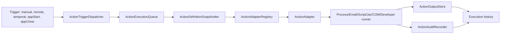
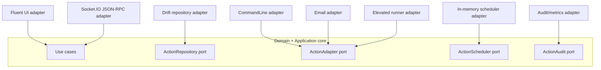

# Plano para Acoes Agendadas e Execucoes

## Objetivo

Adicionar ao Plug Agente uma area de acoes e execucoes para rodar comandos e
processos locais enquanto o aplicativo estiver aberto. A funcionalidade deve
substituir gradualmente cenarios hoje resolvidos por tarefas do Windows e
arquivos `.bat`, mantendo execucao local e execucao via Hub por Socket.IO sem
quebrar o contrato existente.

O plano esta dividido em fases porque o escopo envolve dominio, persistencia,
execucao de processo, elevacao no Windows, contrato JSON-RPC, UI desktop,
seguranca de parametros sensiveis, auditoria, idempotencia, fila de execucao e
historico operacional.

## Decisoes Ja Fixadas

- A primeira versao nao inclui DLL/BPL.
- A funcionalidade so precisa funcionar com o Plug Agente aberto.
- O scheduler de acoes deve operar por usuario/sessao do Windows, nao como
  servico global da maquina.
- Deve existir execucao local pela UI e execucao remota pelo Hub via Socket.IO.
- A evolucao do protocolo deve ser incremental, sem breaking changes.
- A execucao remota deve usar o canal JSON-RPC existente (`rpc:request` e
  `rpc:response`) dentro de `PayloadFrame`; nao criar evento Socket.IO paralelo
  para acoes.
- A implementacao remota deve respeitar o handshake atual: o Hub so pode chamar
  metodos de acoes depois de `agent:capabilities` e, quando negociado, depois do
  `agent:ready`.
- A descoberta do contrato remoto deve continuar por `rpc.discover`, lendo o
  `docs/communication/openrpc.json` atualizado quando os metodos forem
  implementados.
- Execucao remota de acoes deve usar autorizacao propria de acoes, nao
  autorizacao SQL.
- A autenticacao remota pode reutilizar o portador de credencial atual
  (`client_token`, `clientToken` ou `auth`), mas a decisao de permissao deve ser
  feita por um resolver de politica de acoes, separado das regras SQL.
- Autorizacao remota deve usar permissoes explicitas de acoes, como executar,
  cancelar e consultar execucoes, com possibilidade de allowlist por actionId.
- Execucao remota deve ter rate limit proprio por token/agente/acao, alem dos
  limites da fila local.
- `agent.action.run` deve aceitar `idempotency_key` para evitar execucao
  duplicada em retry do Hub.
- Idempotencia de acoes remotas deve ser independente do `id` JSON-RPC e da
  replay protection do transporte; retries do Hub podem usar novo `id` com a
  mesma `idempotency_key`.
- Idempotencia remota de acoes deve persistir o vinculo
  `idempotency_key -> executionId` pelo menos durante a janela operacional
  definida para acoes, nao depender apenas de cache em memoria.
- A execucao remota deve prever modo de validacao sem side effect, por metodo
  futuro `agent.action.validateRun` ou por `options.dry_run=true`, para validar
  autorizacao, parametros, contexto, fila e capability antes de executar.
- A execucao remota deve carregar `runtimeInstanceId` e `runtimeSessionId` do
  agente para reduzir risco de duplicidade quando houver reconnect,
  multi-instancia acidental ou processo antigo ainda vivo.
- A feature deve manter um threat model explicito, revisado antes de habilitar
  execucao remota, elevada ou ad-hoc.
- Acoes devem ter limites de concorrencia, fila e timeout.
- Acoes devem ter estado explicito alem de ativo/inativo, incluindo `paused`,
  para manter configuracao e historico sem aceitar execucao manual, remota ou
  por gatilho.
- Deve existir modo de manutencao operacional para bloquear execucoes remotas e
  agendadas temporariamente sem desligar toda a feature.
- Acoes devem poder restringir execucao por ambiente/perfil do agente, como
  `dev`, `homolog`, `prod` ou outro ambiente configurado localmente.
- Cada acao deve definir politica para chamada concorrente da mesma acao:
  permitir paralelo, enfileirar, ignorar ou rejeitar.
- A politica de concorrencia deve deixar explicito o comportamento quando UI
  local e Hub tentarem executar a mesma acao ao mesmo tempo.
- Comando livre completo deve aceitar pipes, redirecionamentos e composicao de
  linha de comando, executando via `cmd.exe /C`.
- Runners devem definir politica de quoting, encoding/codepage, variaveis de
  ambiente e diretorio de trabalho para evitar comportamento diferente entre UI,
  Hub e helper elevado.
- Execucoes devem ser nao interativas por padrao: stdin fechado, sem prompt
  bloqueante e com politica explicita para janela/console do processo.
- Cada execucao deve usar snapshot/versionamento da definicao da acao no momento
  do enfileiramento, para nao mudar comportamento se a acao for editada depois.
- Cada execucao deve guardar `definitionSnapshotHash` redigido para diagnostico
  e prova operacional da versao executada, sem expor comando sensivel.
- A primeira versao deve definir criterio de sucesso por exit code, com default
  `0` e possibilidade de lista de codigos aceitos por acao.
- Retry automatico deve ser opcional e conservador, nunca aplicado por padrao em
  acoes sensiveis, remotas ad-hoc ou elevadas.
- Arquivos de parametros/contexto aceitos na primeira versao: `.txt` e `.json`.
- Contexto `.json` deve poder ter schema opcional por acao, alem de extensao e
  tamanho, para evitar aceitar JSON arbitrario sem contrato.
- Contexto remoto ou arquivo local deve gerar hash redigido no historico para
  auditoria do conteudo usado sem salvar dados sensiveis.
- Arquivo/contexto e parametros variaveis devem ter modo explicito de injecao:
  argumento, arquivo, variavel de ambiente ou stdin quando este for permitido.
- Agendamentos perdidos enquanto o app estiver fechado devem ser ignorados por
  padrao (`skipMissedRuns`).
- Todas as acoes devem poder usar os mesmos gatilhos comuns: manual, remoto,
  temporal, ao iniciar o app e ao fechar o app.
- Gatilhos temporais devem seguir conceitos semelhantes ao Agendador de Tarefas
  do Windows, mas executando apenas enquanto o Plug Agente estiver aberto.
- Gatilhos temporais usam o timezone local da maquina do agente; horarios
  inexistentes por mudanca de horario devem ser ignorados e horarios duplicados
  devem executar apenas uma vez.
- Gatilho ao iniciar o app equivale a "quando o Plug Agente iniciar", nao
  necessariamente "quando o Windows iniciar", salvo quando o app estiver
  configurado no auto-start.
- Gatilho ao fechar o app deve ser best-effort, com timeout curto, porque nao e
  garantido em crash, kill do processo ou desligamento forcado do Windows.
- Gatilho ao fechar o app deve ter limite mais restritivo e, por padrao, nao
  deve aceitar execucoes longas, elevadas ou remotas.
- O historico de execucoes deve reter dados por 3 dias.
- Cache de idempotencia, saidas capturadas, auditoria redigida e status files
  devem ter politica de limpeza propria, alinhada ou mais restritiva que a
  retencao do historico.
- Cleanup de historico, saida capturada, idempotencia e auditoria nao deve
  remover dados necessarios para execucoes ainda `queued` ou `running`.
- Comandos podem conter parametros sensiveis; segredos nao devem ir para logs,
  historico visivel, Drift em texto puro ou definicao de tarefa do Windows.
- Configuracoes estruturadas devem usar Drift; segredos e credenciais devem usar
  `flutter_secure_storage`.
- Remocao ou rotacao de segredo usado por uma acao deve invalidar teste,
  bloquear execucao quando necessario, registrar failure segura e exigir
  re-aprovacao remota se a acao for remota.
- Kill deve encerrar somente o processo principal registrado, nao a arvore de
  processos.
- Kill deve validar identidade do processo quando possivel, porque PID pode ser
  reutilizado pelo Windows.
- Acoes em execucao durante fechamento do Plug Agente precisam de politica
  explicita: aguardar ate timeout curto, matar processo principal, ou deixar
  rodando quando o sistema permitir.
- Execucoes `queued` ou `running` encontradas no bootstrap apos fechamento ou
  crash anterior devem ser marcadas como interrompidas/orfas antes de reativar o
  scheduler.
- Durante fechamento, migration, update, bootstrap incompleto ou pausa
  operacional, o subsistema de acoes deve entrar em estado `draining` e rejeitar
  novas execucoes remotas com erro seguro antes de aceitar side effects.
- Execucao elevada deve usar uma tarefa elevada registrada uma vez no Windows,
  evitando UAC em toda execucao.
- O runner elevado recomendado e um helper separado, nao o executavel Flutter
  principal.
- O runner elevado deve retornar status por arquivo JSON seguro por execucao.
- A solicitacao para o runner elevado deve usar request file/nonce protegido ou
  mecanismo equivalente, para evitar execucao elevada forjada apenas com
  `executionId`.
- O ciclo de vida do runner elevado deve prever instalar, validar, reparar,
  atualizar caminho apos update do app e remover quando necessario.
- O tipo `developer` deve existir como adapter especifico para ferramentas de
  desenvolvimento. O primeiro subescopo aprovado e executar `Executor.exe`
  para arquivos `.7Proj`, usando o parametro `-p` para o projeto e `-c` para o
  id de conexao do `Data7.Config`.
- A acao `developer` nao deve virar comando livre paralelo. Ela deve montar uma
  invocacao estruturada do Executor, validar `Executor.exe`, `.7Proj`,
  `Data7.Config` e `connectionId`, e entao entrar pela mesma fila, historico,
  auditoria, redacao e gatilhos das demais acoes.
- O `Data7.Config` deve ser descoberto inicialmente em
  `C:\Data7\bin\Data7.Config` e `C:\Data7\Data7.Config`. Se nao for encontrado
  em busca rapida e restrita, a UI deve solicitar o caminho ao usuario.
- O `Data7.Config` pode conter credenciais de banco. A feature deve ler somente
  o necessario para listar conexoes e validar o `connectionId`; nao persistir,
  logar, enviar ao Hub ou exibir `Senha` e outros valores sensiveis brutos.
- Execucao remota conservadora deve iniciar por acoes salvas e aprovadas
  localmente.
- Habilitar execucao remota de uma acao deve registrar aprovacao local
  (`approvedBy`, `approvedAt`, `approvalReason`) e exigir re-aprovacao quando
  mudarem comando, runner, elevacao, contexto, parametros sensiveis ou politica
  remota.
- Comando livre remoto ad-hoc deve continuar desabilitado por padrao e protegido
  por feature flag propria.
- `agent.action.run` deve ser assincrono do ponto de vista remoto: enfileira ou
  inicia a execucao e retorna `execution_id` e status inicial, sem bloquear o
  request ate o processo terminar.
- Status remoto no MVP deve ser consultado por polling com
  `agent.action.getExecution`; notificacoes de progresso ficam como evolucao
  futura.
- Metodos remotos com efeito colateral, como `agent.action.run` e
  `agent.action.cancel`, nao devem aceitar JSON-RPC notification sem `id`.
- Quando uma notification sem `id` chegar para metodo com efeito colateral, o
  agente deve nao executar a acao. Em modo estrito de notification, nao ha
  `rpc:response`; registrar auditoria/metrica local para diagnostico.
- `agent.action.run` nao deve ser permitido em JSON-RPC batch no MVP, salvo
  decisao futura explicita. `agent.action.getExecution` pode ser batchable por
  ser somente leitura.
- O health/diagnostico do agente deve expor estado agregado do subsistema de
  acoes quando a feature estiver habilitada.
- `agent.action.getExecution` deve suportar limite/paginacao de output capturado
  para nao retornar stdout/stderr grande em uma unica response.
- Auditoria de execucao remota deve ser append-only, registrando recebido,
  autorizado/negado, enfileirado, iniciado, cancelamento solicitado e finalizado.
- Exportacao, importacao e backup de acoes devem preservar apenas placeholders
  de segredos, nunca valores reais.
- Falhas de runtime ou capabilities indisponiveis devem degradar a feature de
  acoes sem quebrar o restante do app.
- Quando `enableRemoteAgentActions=false`, a capability `agentActions` deve ser
  omitida e chamadas remotas ainda recebidas devem retornar erro seguro e
  documentado, sem parecer permissao SQL negada.
- Failures de dominio/aplicacao devem ter mapeamento explicito para mensagens
  de UI e erros JSON-RPC seguros.
- A extensao por novos tipos de acao deve seguir um modelo de adapter
  registrado, evitando `switch` central grande e contratos paralelos.

## Fora de Escopo Inicial

Estes itens nao fazem parte da primeira implementacao, mesmo que a arquitetura
deixe caminho para evolucao posterior:

- Plugin dinamico externo carregado em runtime.
- Execucao de acoes com o Plug Agente fechado.
- DLL/BPL.
- Kill de arvore de processos.
- Comando remoto ad-hoc habilitado por padrao.
- Criacao ou alteracao remota de gatilhos temporais pelo Hub.
- Streaming remoto de stdout/stderr em tempo real.
- Garantia forte de execucao em `appClose`, crash, queda de energia ou
  desligamento forcado do Windows.
- Marketplace ou SDK externo para terceiros criarem acoes fora do repositorio.

## Threat Model Inicial

Esta feature executa comandos e processos locais, portanto deve ser tratada
como superficie de alto risco. O threat model deve ser revisado antes de
habilitar remoto, elevado, ad-hoc ou novos tipos de acao.

Ativos sensiveis:

- comandos, argumentos, contexto `.txt`/`.json` e variaveis de ambiente;
- segredos resolvidos em `flutter_secure_storage`;
- credenciais existentes em arquivos externos usados por adapters, como
  `Data7.Config`;
- capacidade de executar processo local, script, e-mail, COM e runner elevado;
- historico, stdout/stderr, auditoria e status files;
- token remoto, policy de autorizacao e idempotency keys;
- integridade do helper elevado e da tarefa registrada no Windows.

Atores e vetores principais:

- Hub autorizado mas mal configurado tentando executar acao fora do escopo;
- token roubado ou com policy permissiva tentando executar acao remota;
- usuario local habilitando remoto/elevado sem perceber risco;
- processo local tentando forjar request elevado ou alterar status file;
- arquivo `Data7.Config` malformado, adulterado ou com multiplas conexoes
  ambiguas levando o usuario a selecionar base errada;
- contexto remoto malicioso tentando path traversal, payload grande ou JSON fora
  do contrato;
- comando com segredo inline vazando em logs, historico ou lista de processos;
- duas instancias do agente aceitando a mesma execucao;
- cleanup removendo evidencia de execucao ainda ativa;
- backup/exportacao vazando placeholders resolvidos ou detalhes sensiveis.

Mitigacoes obrigatorias no plano:

- scopes proprios de acoes, allowlist por actionId e politica por ambiente;
- aprovacao local e re-aprovacao quando campos de risco mudarem;
- feature flags para remoto, ad-hoc e elevado;
- parser seguro para arquivos externos de configuracao, sem persistir senhas ou
  dados sensiveis lidos do arquivo;
- redacao antes de log, historico, telemetria ou response ao Hub;
- schema opcional para contexto JSON, limite de tamanho e hash redigido;
- estado `draining`/maintenance mode para bloquear side effects em momentos
  inseguros;
- idempotencia persistida e runtimeInstanceId/runtimeSessionId;
- request file/nonce/ACL para runner elevado;
- auditoria append-only;
- cleanup que preserva dados de execucoes ativas;
- testes de contrato e fixtures para sucesso, negacao e erro.

TODOs do threat model:

- [ ] TODO: Criar checklist de threat model por tipo de acao antes de habilitar
  remoto, elevado ou ad-hoc.
- [ ] TODO: Revisar threat model em cada mudanca de protocolo remoto,
  permissao, runner elevado, segredo ou contexto.
- [ ] TODO: Registrar riscos aceitos explicitamente nas decisoes pendentes ou em
  documento futuro de seguranca.

## Padrao de Comunicacao Remota a Seguir

A execucao remota deve ser modelada como extensao do Plug JSON-RPC Profile
existente, nao como transporte novo. A leitura de `docs/communication` indica
estas regras para a implementacao futura:

- Todo evento de aplicacao trafega em `PayloadFrame`.
- O payload logico continua sendo JSON UTF-8, com `cmp: gzip` ou `cmp: none`
  negociado por mensagem.
- O Hub envia chamadas de negocio por `rpc:request` e o agente responde por
  `rpc:response`.
- `rpc.discover` publica o OpenRPC carregado de
  `docs/communication/openrpc.json`.
- Schemas por metodo ficam em `docs/communication/schemas/`.
- `api_version` e `meta` sao recomendados para rastreabilidade, com
  `meta.trace_id`, `traceparent`, `tracestate`, `request_id`, `agent_id` e
  `timestamp`.
- `agent:capabilities` negocia `extensions` e `limits`; novas capacidades
  opcionais devem entrar nesse mecanismo.
- O contrato de erro exige `error.data` com `reason`, `category`, `retryable`,
  `user_message`, `technical_message`, `correlation_id` e `timestamp`.
- Notification JSON-RPC sem `id` nao gera response. Para acoes com efeito
  colateral, o agente deve impedir a execucao antes de enfileirar.
- Batch JSON-RPC nao e atomico por padrao. No MVP, evitar `agent.action.run`
  dentro de batch para nao criar varios efeitos colaterais em uma unica
  mensagem.
- Delivery guarantee e replay protection ja existem no transporte; por isso
  `idempotency_key` de negocio e obrigatorio para `agent.action.run`.
- Nao existe API generica de upload/download de arquivo. Contexto remoto deve
  ser serializado no payload logico do metodo e respeitar `max_payload_bytes`;
  contexto grande deve ser rejeitado no MVP, nao enviado fora do frame.
- Assinatura HMAC do `PayloadFrame`, quando negociada, vale tambem para os
  novos metodos sem mudanca de contrato.

Implicacoes praticas para `agent.action.*`:

- [ ] TODO: Nao criar eventos Socket.IO como `agent:action:run`; usar apenas
  `rpc:request` com `method: "agent.action.run"`.
- [ ] TODO: Atualizar `docs/communication/openrpc.json` somente junto da
  implementacao real dos metodos, incrementando a versao do contrato de forma
  minor/aditiva.
- [ ] TODO: Atualizar `socket_communication_standard.md` quando os metodos
  estiverem implementados, porque esse documento descreve o estado atual
  implementado.
- [ ] TODO: Criar schemas separados para params/result de cada metodo:
  `rpc.params.agent-action-run.schema.json`,
  `rpc.result.agent-action-run.schema.json`,
  `rpc.params.agent-action-cancel.schema.json`,
  `rpc.result.agent-action-cancel.schema.json`,
  `rpc.params.agent-action-get-execution.schema.json` e
  `rpc.result.agent-action-get-execution.schema.json`.
- [ ] TODO: Garantir que `rpc.discover` passe a refletir os metodos de acoes
  assim que o OpenRPC for atualizado.
- [ ] TODO: Usar `meta.trace_id`/`traceparent` e `meta.request_id` para
  preencher `traceId`, `requestedBy` e auditoria da execucao.
- [ ] TODO: Tratar `request.id`, `meta.request_id` e `idempotency_key` como
  conceitos diferentes:
  - `request.id`: correlacao JSON-RPC e replay protection do transporte;
  - `meta.request_id`: rastreabilidade operacional;
  - `idempotency_key`: deduplicacao de efeito de negocio da acao.
- [ ] TODO: Se `agent.action.run` chegar em batch no MVP, rejeitar o item antes
  de enfileirar com erro seguro de contrato/metodo nao permitido em batch.
- [ ] TODO: Se `agent.action.cancel` chegar em batch no MVP, rejeitar ou tratar
  como operacao idempotente somente apos decisao explicita; documentar a escolha
  no OpenRPC.
- [ ] TODO: Permitir `agent.action.getExecution` em batch, se a validacao de
  schema e rate limit suportarem o volume.

## Politica de Atualizacao de Documentacao

A documentacao deve acompanhar a implementacao real da feature, sem publicar
contrato como disponivel antes do codigo existir.

Regras gerais:

- [ ] TODO: Cada MVP deve revisar este plano e marcar/ajustar os TODOs
  relacionados ao que foi implementado.
- [ ] TODO: Quando uma decisao tecnica for fechada durante a implementacao,
  atualizar a secao "Decisoes Pendentes" ou mover a decisao para a parte
  definitiva do plano.
- [ ] TODO: Toda mudanca de protocolo deve atualizar, no mesmo ciclo de
  implementacao, os schemas, OpenRPC, documentacao de comunicacao e testes de
  contrato correspondentes.
- [ ] TODO: Nao anunciar metodos remotos em `openrpc.json` nem em
  `agentActions` antes de o dispatcher, schemas, autorizacao e testes basicos
  estarem implementados.
- [ ] TODO: Quando `rpc.discover` passar a expor novos metodos, garantir que o
  arquivo publicado em `docs/communication/openrpc.json` esteja alinhado ao
  runtime.
- [ ] TODO: Quando defaults operacionais mudarem, atualizar o plano e a
  documentacao relevante de configuracao/operacao.
- [ ] TODO: Quando um novo tipo de acao for adicionado, atualizar a matriz de
  riscos, o checklist "Como adicionar uma nova acao", a capability remota se
  aplicavel e o test plan.
- [ ] TODO: Quando uma feature flag mudar de experimental para default, atualizar
  a secao de rollback/desativacao e a documentacao de comunicacao afetada.

Documentos a revisar por area:

- Dominio/persistencia: este plano, migrations planejadas e criterios de aceite.
- UI: este plano, rotas/menu, strings localizadas e comportamento operacional.
- Socket.IO/JSON-RPC: `docs/communication/openrpc.json`,
  `docs/communication/socket_communication_standard.md`,
  `docs/communication/socket_communication_roadmap.md` quando a ordem mudar, e
  `docs/communication/schemas/`.
- Testes E2E/integracao: `docs/testing/e2e_setup.md` quando a feature exigir
  variaveis, setup ou passos novos de homologacao.
- Seguranca/operacao: este plano e qualquer documento operacional futuro que
  descreva segredos, runner elevado, auditoria ou rollback.

Politica para quebrar em subdocumentos:

- [ ] TODO: Quando este arquivo deixar de ser pratico para revisao por MVP,
  manter este plano como indice e criar subdocs menores por contexto.
- [ ] TODO: Subdocs recomendados:
  - `docs/implemente/acoes/contrato_remoto.md`;
  - `docs/implemente/acoes/runner_local.md`;
  - `docs/implemente/acoes/runner_elevado.md`;
  - `docs/implemente/acoes/ui_acoes.md`;
  - `docs/implemente/acoes/seguranca_acoes.md`;
  - `docs/implemente/acoes/tipos_de_acao.md`;
  - `docs/implemente/acoes/developer_data7_executor.md`, se o adapter
    `developer` crescer alem deste plano.
- [ ] TODO: Cada subdoc deve referenciar este plano e manter TODOs menores, sem
  duplicar regra canonica do repositorio.

## Regra para Bifurcacoes Durante a Implementacao

Durante a implementacao, se surgir um ponto nao previsto no plano, uma
bifurcacao tecnica ou uma incompatibilidade entre o plano e o codigo real, a
decisao nao deve ficar implicita no codigo. O plano deve acompanhar a decisao
antes ou junto da implementacao.

Regra operacional:

- [ ] TODO: Quando aparecer bifurcacao tecnica, registrar o ponto neste plano
  antes de seguir se ele afetar comportamento, contrato, seguranca,
  persistencia, UI visivel, testes ou operacao.
- [ ] TODO: Marcar o TODO relacionado como `[ ] TODO (bloqueado)` quando a
  decisao puder mudar arquitetura, contrato, dados persistidos, permissao,
  runner, protocolo ou experiencia do usuario.
- [ ] TODO: Registrar a bifurcacao em "Decisoes Pendentes" quando ela exigir
  confirmacao tecnica ou de produto.
- [ ] TODO: Nao escolher caminho irreversivel, com risco de breaking change ou
  com impacto de seguranca sem decisao explicita registrada.
- [ ] TODO: Quando uma alternativa segura e reversivel for adotada para manter
  progresso, registrar a premissa no plano e transformar em decisao pendente
  se ela precisar ser validada depois.
- [ ] TODO: Se a decisao alterar comportamento ja documentado, atualizar tambem
  criterios de aceite, test plan, rollback e documentacao de comunicacao quando
  aplicavel.

Niveis de autonomia:

| Nivel | Quando aplicar | Acao esperada |
| --- | --- | --- |
| Reversivel e local | Nome interno, organizacao pequena de arquivo, detalhe sem impacto publico | Documentar premissa no TODO e seguir |
| Reversivel mas transversal | Afeta mais de uma camada, testes, UI ou operacao local | Registrar decisao pendente curta e seguir somente se houver fallback claro |
| Sensivel | Afeta protocolo, Drift, seguranca, segredos, remoto, elevado, scheduler, kill/processos ou adapters | Bloquear TODO e solicitar decisao antes de implementar |
| Risco de breaking change | Pode quebrar Hub, schemas, dados existentes, compatibilidade ou seguranca | Nao implementar sem aprovacao explicita e plano de rollback |

Template para registrar bifurcacao:

```text
- [ ] DECISAO MVP X: <titulo curto>
  - Contexto encontrado: <o que apareceu no codigo real ou na implementacao>
  - Opcoes: <opcao A>, <opcao B>, <opcao C se existir>
  - Impacto: <protocolo, seguranca, persistencia, UI, testes, operacao>
  - Recomendacao tecnica: <caminho sugerido e motivo>
  - Decisao tomada: <preencher quando fechado>
  - TODOs afetados: <ids, secoes ou itens do plano>
```

Areas que exigem decisao explicita antes de implementar caminho novo:

- [ ] TODO: Protocolo Socket.IO/JSON-RPC, schemas, OpenRPC, capabilities,
  batch, notifications, erros JSON-RPC e compatibilidade com clientes antigos.
- [ ] TODO: Persistencia Drift, migrations, retencao, cleanup, importacao,
  exportacao e formato de snapshots.
- [ ] TODO: Segredos, `flutter_secure_storage`, placeholders, redacao, logs,
  pacote de suporte e qualquer dado vindo de arquivo externo sensivel.
- [ ] TODO: Execucao remota, autorizacao propria de acoes, scopes, allowlist,
  idempotencia, rate limit e aprovacao local.
- [ ] TODO: Execucao elevada, helper separado, tarefa do Windows, request file,
  nonce, ACL, status file e usuario/contexto da tarefa.
- [ ] TODO: Scheduler, `appStart`, `appClose`, timezone, catch-up,
  multi-instancia e comportamento com app fechado.
- [ ] TODO: Kill, timeout, retry, PID principal, identidade do processo,
  processos orfaos e politica no fechamento do app.
- [ ] TODO: Adapters novos ou alterados, incluindo `commandLine`, `script`,
  `jar`, `email`, `comObject` e `developer`/Data7.
- [ ] TODO: UI operacional quando a decisao muda menu, estados, confirmacoes,
  mensagens localizadas, diagnostico ou fluxo de teste.
- [ ] TODO: Dependencias externas novas ou troca de pacote existente.

Checklist rapido antes de desbloquear um TODO bloqueado:

- [ ] TODO: A decisao foi registrada ou movida para uma secao definitiva do
  plano.
- [ ] TODO: O impacto em testes foi adicionado ao Test Plan.
- [ ] TODO: O impacto em rollback/desativacao foi revisado quando aplicavel.
- [ ] TODO: O impacto em documentacao de comunicacao foi revisado quando houver
  protocolo remoto.
- [ ] TODO: O TODO afetado voltou para `[ ] TODO` ou foi marcado como
  `[ ] TODO (em andamento)` somente depois da decisao.

## Arquitetura Recomendada

Seguir as fronteiras atuais do repositorio:

- `domain`: entidades, value objects, enums de tipo/status, contratos de
  repositories/services e failures especificas de acao.
- `application`: use cases para criar, atualizar, executar, testar, cancelar,
  consultar historico e limpar execucoes expiradas.
- `infrastructure`: Drift, secure storage, runners de processo, scheduler em
  memoria, fila de execucao, runner elevado do Windows, adaptadores
  Socket.IO/JSON-RPC, redator de dados sensiveis e servico de e-mail.
- `presentation`: pagina Fluent, provider/controller, formularios, lista de
  acoes, painel de detalhes, historico, indicadores de fila e feedback de
  execucao.
- `core`: rotas, DI, feature flags, limites globais, capabilities de protocolo e
  metricas transversais.

Componentes recomendados:

- `ActionExecutionQueue`: fila propria com backpressure para acoes, separada da
  fila SQL/ODBC.
- `ActionRedactor`: mascara comando, argumentos, stdout, stderr, payloads
  JSON-RPC e contexto tecnico antes de logar ou persistir.
- `SecretPlaceholderResolver`: resolve placeholders como `${secret:name}` no
  momento da execucao.
- `ActionPathValidator`: canonicaliza caminhos, valida extensoes, tamanho,
  existencia e allowlist opcional de diretorios.
- `ActionPathSnapshotter`: captura metadados redigidos do caminho no momento do
  cadastro/teste, como caminho canonico, tipo esperado, tamanho, data de
  modificacao e hash opcional.
- `ActionExecutionPreflight`: revalida arquivos, diretorios, segredos,
  ambiente e pre-requisitos imediatamente antes de enfileirar/iniciar processo.
- `ActionConfigValidator`: valida configuracoes especificas por tipo de acao
  antes de salvar, testar ou executar.
- `ActionAdapterRegistry`: registra adapters por tipo de acao e resolve
  validator, runner, configuracao, UI metadata e capability daquele tipo.
- `ActionAdapter`: contrato comum para plugar novos tipos de acao sem duplicar
  scheduler, fila, historico, auditoria e seguranca.
- `DeveloperData7ConfigLocator`: localiza `Data7.Config` em caminhos padrao ou
  caminho informado, usando busca rapida e restrita.
- `DeveloperData7ConnectionCatalog`: le o XML do `Data7.Config` e retorna
  apenas resumo seguro das conexoes, como id, descricao, servidor, base e
  RDBMS, sem expor senha.
- `DeveloperExecutorCommandBuilder`: monta a invocacao estruturada de
  `Executor.exe` com `-p` e `-c`, sem concatenar comando livre.
- `DeveloperActionValidator`: valida `Executor.exe`, `.7Proj`, `Data7.Config`,
  `connectionId`, allowlist de diretorios e politicas de remoto/elevado.
- `ActionRuntimeParameterValidator`: valida parametros informados na execucao
  contra o schema permitido pela acao.
- `ActionContextSchemaValidator`: valida contexto `.json` por schema opcional
  da acao, alem de extensao, tamanho e origem.
- `ActionContextHasher`: gera hash redigido de contexto inline ou arquivo local
  para auditoria sem persistir conteudo sensivel.
- `ActionDefinitionSnapshotter`: cria snapshot/versionamento imutavel da
  configuracao usada por cada execucao.
- `ActionEnvironmentResolver`: monta variaveis de ambiente permitidas, aplica
  placeholders de segredo e redige valores antes de persistir ou logar.
- `ActionEnvironmentPolicyGuard`: valida se a acao pode executar no ambiente ou
  perfil local do agente (`dev`, `homolog`, `prod` ou equivalente).
- `ActionCommandNormalizer`: centraliza quoting, shell policy, encoding/codepage
  e montagem segura da invocacao efetiva.
- `ActionProcessLifecyclePolicy`: decide janela/console, stdin, retry, exit
  codes aceitos e comportamento no fechamento do app.
- `ActionOutputStore`: guarda stdout/stderr redigidos com limite de tamanho,
  truncamento e possibilidade de tabela separada por chunks.
- `ElevatedActionRunnerBridge`: integra app, tarefa elevada e status file JSON
  por execucao.
- `ElevatedActionRequestProtector`: protege request file/nonce/ACL usado para
  acionar o helper elevado.
- `ActionAuditRecorder`: registra origem, usuario/credencial, traceId,
  idempotencyKey, actionId e resultado redigido.
- `ActionAuditTrail`: persiste eventos append-only de ciclo de vida remoto e
  local, sem permitir sobrescrever historico de decisoes sensiveis.
- `ActionRemoteAuthorizationService`: resolve autenticacao do request remoto e
  aplica scopes/allowlist de acoes sem usar permissao SQL como atalho.
- `ActionRemoteApprovalGuard`: verifica aprovacao local, validade da aprovacao e
  necessidade de re-aprovacao quando campos de risco mudarem.
- `ActionRemoteRateLimiter`: limita chamadas remotas por token, agente, actionId
  e metodo antes de criar execucao.
- `ActionRemoteValidationService`: valida uma solicitacao remota sem side
  effect, retornando permissao, erros de contrato, limites e estado de fila.
- `ActionSecretRotationGuard`: detecta segredo ausente, removido ou rotacionado
  e invalida teste/aprovacao remota quando necessario.
- `ActionIdempotencyStore`: persiste fingerprint e executionId para chamadas
  remotas idempotentes durante a janela definida.
- `ActionRpcMethodHandler`: integra `RpcMethodDispatcher` aos use cases de
  acoes, mantendo schema validation, notification/batch policy e mapeamento de
  failures no padrao JSON-RPC.
- `ActionRpcSchemaMapper`: converte params/result dos schemas remotos para DTOs
  de aplicacao sem expor entidades internas diretamente no protocolo.
- `ActionTriggerScheduler`: registra e dispara gatilhos temporais e de ciclo de
  vida do app.
- `ActionTriggerDispatcher`: converte qualquer gatilho em uma solicitacao comum
  para a fila de execucao.
- `ActionRateLimiter`: aplica limites locais e politicas compartilhadas antes de
  entrar na fila.
- `ActionRuntimeInstanceGuard`: identifica a instancia/sessao atual do runtime e
  evita aceitar execucoes quando houver conflito de instancia ou estado
  operacional invalido.
- `ActionRuntimeStateGuard`: controla estados `starting`, `ready`, `draining`,
  `degraded` e `disabled`, bloqueando novas execucoes quando necessario.
- `ActionMaintenanceModeGuard`: aplica bloqueio operacional manual para remoto e
  agendado sem desativar a feature inteira.
- `ActionCleanupGuard`: impede cleanup de remover idempotencia, output,
  auditoria ou historico necessario para execucoes `queued` ou `running`.
- `ActionStartupRecovery`: reconcilia execucoes pendentes/orfas no bootstrap.
- `ActionRuntimeCapabilityGuard`: bloqueia apenas os runners indisponiveis em
  runtime degradado.
- `ActionBackupSanitizer`: prepara exportacao/importacao sem vazar segredos.
- `ActionNotificationDispatcher`: opcionalmente mostra notificacoes locais de
  sucesso, falha ou timeout quando o runtime suportar.
- `ActionFailureMapper`: converte failures tipadas para mensagens de UI, logs
  tecnicos e erros JSON-RPC sem vazar detalhes internos.
- `ActionExecutionErrorCatalog`: define codigos estaveis, mensagens seguras,
  acoes corretivas e mapeamento para UI/JSON-RPC para que o usuario saiba o que
  corrigir quando uma tarefa falhar.
- `ActionErrorLocalizer`: mapeia codigos de erro para strings ARB localizadas
  na UI, mantendo detalhes tecnicos redigidos fora das strings visiveis.
- `ActionSupportBundleExporter`: gera pacote de diagnostico redigido para
  suporte, contendo definicao segura, execucao, erro, traceId, versao do app e
  estado dos runners.
- `ActionImportValidationGuard`: importa acoes como `needsValidation` ou
  `disabled` quando caminhos/segredos/pre-requisitos nao forem validos na
  maquina atual.
- `ActionHealthReporter`: publica health/metricas agregadas de fila, runners,
  scheduler, elevated bridge e estado degradado.

Todos os fluxos faliveis devem retornar `Result<T>` com failures tipadas,
preservando contexto tecnico para log e mensagem segura para o usuario. Widgets
e providers nao devem acessar Drift, processos, Socket.IO ou APIs Windows
diretamente.

## Arquitetura de Extensao por Adapters

A base de acoes deve funcionar como nucleo comum, com tipos especificos plugados
por adapters registrados. O objetivo e aproximar a feature do paradigma
Ports and Adapters sem criar plugin dinamico externo na primeira versao.

O nucleo comum deve conter:

- gatilhos e scheduler;
- dispatcher de gatilhos;
- fila e concorrencia;
- idempotencia;
- historico;
- auditoria;
- trilha append-only de auditoria;
- redacao e seguranca;
- threat model e gate de seguranca;
- policies de timeout, retry, captura, ambiente e fechamento;
- policies de ambiente/perfil e modo de manutencao;
- contratos de execution/cancel/getExecution;
- mapeamento de failures e metricas.

Cada tipo de acao deve fornecer apenas o que e especifico daquele tipo:

- config discriminada;
- validator de configuracao;
- validator de parametros runtime;
- runner adapter;
- metadata de UI;
- suporte remoto/capability;
- testes de contrato daquele tipo.

Contrato conceitual do adapter:

```text
ActionAdapter
|-- type
|-- metadata
|-- validateConfig(config)
|-- validateRuntimeParams(params)
|-- buildExecutionPlan(snapshot, params)
|-- run(executionPlan, context)
|-- cancel(executionId)
|-- capabilities()
```

O `ActionAdapterRegistry` deve ser o unico ponto que conhece quais adapters
existem. Application/use cases devem depender de contratos e do registry, nao de
classes concretas de `commandLine`, `email`, `jar` ou qualquer outro tipo.

Tipos desconhecidos devem falhar de forma segura:

- UI mostra a acao como tipo nao suportado, sem crash;
- scheduler nao executa e registra failure tipada;
- Hub recebe erro seguro de tipo nao suportado;
- historico continua legivel;
- dados persistidos nao sao apagados automaticamente.

### Diagramas

Fluxo comum de execucao:



Visao Ports and Adapters:



## Quebra em Contextos Menores

Para reduzir o tamanho dos proximos contextos de decisao e implementacao,
dividir a feature nestes contextos independentes:

1. **Modelo e persistencia base**: entidades, enums, policies, Drift, secure
   storage, migrations e repositories.
2. **Seguranca transversal**: redacao, placeholders de segredo, validacao de
   caminhos, allowlist, catalogo de failures, limites e suporte a diagnostico.
3. **Fila e orquestracao**: `ActionExecutionQueue`, concorrencia, timeout,
   idempotencia, snapshots, auditoria, historico e status.
4. **Runner local de referencia**: `commandLine` por `cmd.exe /C`, captura de
   saida, PID principal, kill e criterios de sucesso por exit code.
5. **UI minima operacional**: menu, pagina, formulario, teste de acao, executar,
   historico, estado de fila e diagnostico basico.
6. **Gatilhos e scheduler**: gatilhos temporais, app start, app close, catch-up,
   timers em memoria e dispatch para a fila comum.
7. **Contrato Hub Socket.IO**: metodos JSON-RPC, schemas, OpenRPC, capability,
   autorizacao propria e idempotencia remota.
8. **Runner elevado Windows**: helper separado, tarefa elevada, status file e
   sincronizacao.
9. **Tipos de acao plugados**: implementacao incremental por `executable`,
   `script`, `jar`, `email`, `comObject` e `developer`.

Cada contexto deve poder virar uma tarefa ou conversa separada. Os contextos de
gatilho, fila, seguranca, historico e protocolo devem ser implementados como
infraestrutura comum, nao duplicados dentro de cada tipo de acao.

Ordem recomendada para reavaliar em contextos menores:

1. Modelo de dados e enums.
2. Seguranca transversal, failures e redacao.
3. Fila, idempotencia, snapshots, historico e auditoria.
4. Runner `commandLine` como adapter de referencia.
5. UI minima de acoes, teste e historico.
6. Gatilhos e scheduler usando a fila comum.
7. Socket.IO remoto usando os mesmos use cases.
8. Runner elevado.
9. Demais tipos de acao, um por vez.

## Fatias de Entrega Recomendadas

Para reduzir risco e permitir validacao incremental, separar implementacao em
fatias menores que possam ser revisadas e testadas isoladamente:

- [ ] TODO MVP 0 - Preparacao: confirmar modelo, migrations, flags, limites,
   policies e rotas vazias sem runners reais.
- [ ] TODO MVP 1 - Execucao local manual: `commandLine` local, execucao manual,
   historico, captura limitada e redacao.
- [ ] TODO MVP 2 - Gatilhos locais: `once`, `interval`, `daily`, `weekly`,
   `monthly`, `appStart` e `appClose` usando a mesma fila.
- [ ] TODO MVP 3 - Hub conservador: `agent.action.run`, `cancel` e
   `getExecution`
   apenas para acoes salvas, aprovadas e com permissao explicita.
- [ ] TODO MVP 4 - Runner elevado: helper separado, tarefa elevada, status file
   seguro, instalacao/reparo e UI de preparacao.
- [ ] TODO MVP 5 - Tipos adicionais: `executable`, `script`, `jar`, `email`,
   `comObject` e `developer`, sempre um tipo por contexto menor.
  Para `developer`, o primeiro contexto menor deve ser o adapter Data7
  Executor, antes de abrir espaco para outros recursos exclusivos.

Cada MVP deve manter compatibilidade com o anterior e evitar contratos
paralelos. A fila, auditoria, redacao, idempotencia, historico e seguranca
devem continuar comuns para todos os tipos.

## Auditoria Geral de Coerencia

Esta auditoria existe para evitar que o plano seja lido como uma lista de
implementacoes independentes. A regra principal e: primeiro criar o nucleo
comum de acoes; depois provar o nucleo com um adapter simples; por ultimo
plugar adapters especificos como e-mail, COM e `developer`.

Achados da revisao:

- O plano ja define arquitetura por adapters, mas a ordem anterior de
  contextos podia sugerir implementar scheduler antes de fila, idempotencia e
  snapshots. A ordem normativa passa a colocar orquestracao e seguranca antes
  dos gatilhos.
- O tipo `commandLine` deve ser tratado como adapter de referencia do MVP, nao
  como excecao ao nucleo. Ele serve para validar fila, redacao, historico, PID,
  timeout, kill e mensagens de erro claras antes dos adapters especializados.
- Gatilhos temporais, `appStart`, `appClose`, UI local e Hub remoto devem
  convergir para o mesmo dispatcher e a mesma fila. Nenhuma origem deve chamar
  runner diretamente.
- Adapters adicionais so devem ser anunciados em UI, capability remota ou
  documentacao de contrato quando passarem pelo checklist "Como adicionar uma
  nova acao".
- Acoes especificas, inclusive `developer`/Data7, nao podem criar fila,
  historico, redator, scheduler, permissao remota ou protocolo proprio.

Ordem normativa de implantacao:

1. [ ] TODO: Implantar dominio, policies, failures, Drift, repositories,
   secure storage, feature flags e migrations.
2. [ ] TODO: Implantar nucleo transversal: redator, path validator, secret
   resolver, snapshotter, runtime parameter validator, failure mapper,
   catalogo de erros, auditoria, historico e pacote de suporte redigido.
3. [ ] TODO: Implantar fila, idempotencia, concorrencia, timeout de fila,
   reconciliacao de bootstrap, estado operacional e cleanup.
4. [ ] TODO: Implantar o adapter `commandLine` local como prova do contrato de
   adapter, usando os mesmos use cases que serao chamados pela UI, scheduler e
   Hub.
5. [ ] TODO: Implantar UI minima para cadastrar, testar, executar, consultar
   historico e diagnosticar falhas do adapter de referencia.
6. [ ] TODO: Implantar gatilhos temporais, `appStart` e `appClose` chamando
   apenas o dispatcher comum.
7. [ ] TODO: Implantar contrato remoto conservador por Socket.IO/JSON-RPC,
   chamando os mesmos use cases, sem evento paralelo e sem comando ad-hoc por
   padrao.
8. [ ] TODO: Implantar runner elevado depois do core local e remoto estar
   estabilizado, mantendo helper separado e status file seguro.
9. [ ] TODO: Implantar adapters adicionais um por contexto menor:
   `executable`, `script`, `jar`, `email`, `comObject` e `developer`/Data7.

Gates obrigatorios antes de plugar qualquer adapter adicional:

- [ ] TODO: O adapter implementa `ActionAdapter` e esta registrado no
  `ActionAdapterRegistry`.
- [ ] TODO: O adapter possui config discriminada, validator de cadastro,
  validator de runtime params e mapeamento Drift/DTO isolados.
- [ ] TODO: O adapter reusa fila, snapshots, idempotencia, historico, redator,
  auditoria, policies de timeout/retry/captura e failure mapper comuns.
- [ ] TODO: O adapter possui teste de configuracao sem side effect e preflight
  antes da execucao real.
- [ ] TODO: O adapter tem threat model revisado e erros acionaveis localizados.
- [ ] TODO: O adapter so aparece em `agentActions.supportedTypes` depois de
  schema, capability, permissao, fixtures e testes remotos estarem prontos.
- [ ] TODO: A UI mostra adapter indisponivel como `disabled` ou
  `needsValidation`, sem apagar dados persistidos.

Gaps a fechar durante MVP 0/MVP 1:

- [ ] TODO: Definir explicitamente se a numeracao de "Fases de Implementacao"
  representa ordem de release ou agrupamento tematico. Ate decisao contraria,
  seguir a "Ordem normativa de implantacao" desta auditoria.
- [ ] TODO: Criar checklist de prontidao do nucleo antes do primeiro runner:
  failures, redacao, path validation, secrets, snapshots, fila, auditoria,
  historico e cleanup precisam estar exercitados por testes.
- [ ] TODO: Definir criterios de bloqueio para adapter que ainda nao tem runner
  real: cadastro pode existir, mas execucao deve falhar com failure segura de
  tipo nao suportado.
- [ ] TODO: Definir padrao de metricas com baixa cardinalidade para nao expor
  paths, comandos, nomes de arquivos ou actionIds sensiveis em labels.
- [ ] TODO: Persistir timestamps em UTC e exibir/agendar em timezone local da
  maquina, documentando conversao em scheduler, historico e JSON-RPC.
- [ ] TODO: Definir trava de instancia do subsistema de acoes para evitar dois
  processos do Plug Agente executando o mesmo scheduler local.

## Modelo Funcional

### Tipos de acao

Tipos previstos para o modelo inicial:

- `none`: valor neutro para telas e estados iniciais.
- `commandLine`: comando livre completo executado por `cmd.exe /C`.
- `executable`: executavel, `.bat` ou arquivo chamavel com argumentos
  estruturados.
- `script`: script PowerShell, CMD, Python ou outro interpretador configurado.
- `jar`: execucao via `java -jar`.
- `comObject`: reservado para automacao COM em fase posterior.
- `email`: envio SMTP usando pacote de e-mail.
- `developer`: execucoes especificas de desenvolvimento. Primeiro adapter:
  Data7 Executor para arquivos `.7Proj`.

DLL/BPL ficam explicitamente fora do escopo da primeira versao.

### Contextos por tipo de acao

Cada tipo de acao deve usar o mesmo contrato de execucao, fila, gatilhos,
auditoria e historico. A diferenca fica apenas no validador e no runner
especifico do tipo.

| Tipo | Contexto de implementacao | Primeira entrega |
| --- | --- | --- |
| `none` | Estado neutro para UI/modelo | Sem runner; usado apenas como valor inicial |
| `commandLine` | Shell livre via `cmd.exe /C` | MVP principal; aceita pipes e redirecionamentos |
| `executable` | Arquivo executavel ou `.bat` com argumentos estruturados | Validar caminho, working directory e args |
| `script` | Interpretador configurado, como PowerShell, CMD ou Python | Validar interpretador, arquivo e policy de execucao |
| `jar` | `java -jar` | Validar Java disponivel e caminho do `.jar` |
| `email` | SMTP via `mailer` | Fase posterior; validar SMTP e segredo |
| `comObject` | Automacao COM via Windows | Fase posterior; exigir allowlist e spike proprio |
| `developer` | Adapter Data7 Executor para `.7Proj` e `Data7.Config` | Validar executor, projeto e conexao antes de executar |

O motor de gatilhos deve conseguir disparar qualquer tipo de acao. Se um tipo
ainda nao tiver runner implementado, a execucao deve falhar com failure clara de
tipo nao suportado, sem fallback silencioso.

### Configuracoes por tipo

Evitar uma definicao unica cheia de campos opcionais sem semantica clara. A
definicao comum deve guardar campos compartilhados e apontar para uma
configuracao discriminada por tipo:

- `CommandLineActionConfig`: comando completo, shell policy, working directory
  e placeholders permitidos.
- `ExecutableActionConfig`: caminho do executavel ou `.bat`, argumentos
  estruturados, working directory e allowlist.
- `ScriptActionConfig`: interpretador, arquivo de script, argumentos, politica
  de execucao e validacao de extensao.
- `JarActionConfig`: caminho do `.jar`, argumentos, working directory e
  validacao de Java disponivel.
- `EmailActionConfig`: servidor SMTP, remetente, destinatarios, assunto,
  corpo, anexos permitidos e referencias de segredo.
- `ComObjectActionConfig`: identificador COM permitido, metodo/operacao e
  parametros validados por allowlist.
- `DeveloperActionConfig`: engine especifico, inicialmente `data7Executor`,
  caminho do `Executor.exe`, caminho do `.7Proj`, caminho opcional do
  `Data7.Config`, `connectionId`, label segura da conexao, working directory,
  politica de descoberta, allowlist e argumentos extras permitidos.

No Dart, avaliar sealed classes/value objects ou mapeadores dedicados para nao
expor campos de infraestrutura diretamente ao dominio.

### Acao developer - Data7 Executor

O primeiro comportamento concreto do tipo `developer` deve ser o adapter Data7
Executor. Ele continua usando os mesmos gatilhos, fila, historico, auditoria,
redacao, timeout, concorrencia, idempotencia e contrato remoto conservador da
base comum. A diferenca fica no validador, no catalogo de conexoes e no runner
especifico.

Comando de referencia:

```cmd
C:\Data7\bin\Executor.exe -p "C:\Data7\Transmissao\Transmissor.7Proj" -c "<connection-id>"
```

Observacoes:

- `CALL` e sintaxe de arquivo `.bat`; o runner estruturado nao deve incluir
  `CALL` quando iniciar `Executor.exe` diretamente.
- O comando efetivo deve ser montado como executavel + lista de argumentos
  (`-p`, caminho `.7Proj`, `-c`, id da conexao), evitando concatenar string de
  shell livre.
- O tipo `developer` nao deve aceitar pipe/redirecionamento como
  `commandLine`; se for necessario pipe, usar uma acao `commandLine` separada
  com risco e aprovacao proprios.
- O exit code aceito deve seguir `successExitCodes`, com default `0`.
- O working directory padrao recomendado e a pasta do `Executor.exe`, salvo
  configuracao explicita validada.

Campos recomendados para `DeveloperActionConfig` no engine `data7Executor`:

- `engine`: `data7Executor`.
- `executorPath`: caminho do `Executor.exe`; default sugerido
  `C:\Data7\bin\Executor.exe`.
- `projectPath`: caminho do arquivo `.7Proj`.
- `data7ConfigPath`: caminho opcional do `Data7.Config`; quando vazio, usar
  descoberta padrao.
- `connectionId`: GUID do item de conexao usado no parametro `-c`.
- `connectionDisplayName`: label segura derivada da descricao da conexao para
  UI/historico, sem senha.
- `connectionSnapshotHash`: hash redigido do item selecionado para detectar
  alteracao relevante sem persistir credenciais.
- `workingDirectory`: opcional, validado por allowlist quando configurada.
- `extraArguments`: inicialmente vazio ou allowlist estrita; nao permitir
  argumento arbitrario remoto no MVP.
- `capturePolicy`: default conservador, com redacao obrigatoria de stdout e
  stderr.
- `remoteRuntimeParameterSchema`: no MVP, remoto deve executar a acao salva sem
  sobrescrever `executorPath`, `projectPath`, `data7ConfigPath` ou
  `connectionId`.

Descoberta do `Data7.Config`:

1. Procurar `C:\Data7\bin\Data7.Config`.
2. Procurar `C:\Data7\Data7.Config`.
3. Se nao encontrar, permitir caminho informado pelo usuario.
4. A busca rapida nao deve varrer o disco inteiro; manter escopo restrito aos
   caminhos padrao do Data7 ou caminho informado.
5. Canonicalizar o caminho encontrado antes de validar allowlist e extensao.

Catalogo de conexoes:

- Usar parser XML estruturado; a dependencia `xml` ja existe no `pubspec.yaml`
  e deve ser preferida a parse manual por string.
- O parser deve suportar os nomes reais das tags do arquivo, inclusive quando
  existirem acentos em `Configuracoes`, `Descricao` e `Conexao`.
- Cada `Item` deve expor para a UI apenas dados seguros: `ID`, descricao, RDBMS,
  servidor e base de dados quando permitido pela politica de redacao.
- `Senha` nunca deve ser persistida no Drift, enviada ao Hub, colocada em log,
  historico, auditoria, metricas ou preview de comando.
- `Usuario` e `Servidor` podem ser sensiveis em alguns ambientes; passar pelo
  `ActionRedactor` antes de historico, auditoria ou resposta remota.
- O parser deve detectar `ID` duplicado e falhar com erro claro antes de salvar
  ou executar.
- XML invalido, tag obrigatoria ausente, encoding inesperado ou arquivo vazio
  devem gerar failure especifica de configuracao invalida.
- A acao deve guardar label segura e hash redigido da conexao selecionada para
  diagnostico, sem guardar senha ou string de conexao completa.
- Se houver uma unica conexao, a UI pode sugerir selecao automatica, mas deve
  mostrar validacao clara antes de salvar.
- Se houver varias conexoes, a UI deve exigir selecao explicita pelo usuario.
- Se o `connectionId` salvo nao existir mais no arquivo, a acao deve falhar no
  teste/configuracao com failure segura e orientar o usuario a selecionar outra
  conexao.
- Se a descricao da conexao mudar, a UI deve indicar que a conexao foi alterada
  desde o ultimo teste e permitir recarregar/confirmar a selecao.
- A UI deve ter acao "Recarregar conexoes" para reler `Data7.Config` e atualizar
  a lista sem recriar a acao.

Validacao antes de salvar, testar ou executar:

- `Executor.exe` existe, e arquivo executavel e esta em diretorio permitido.
- `projectPath` existe, tem extensao `.7Proj` e esta em diretorio permitido.
- `Data7.Config` existe, e XML valido e possui pelo menos um `Item` de conexao.
- `connectionId` e GUID valido e existe no catalogo carregado.
- A acao nao depende de valores sensiveis copiados do XML para a configuracao
  persistida.
- A montagem do comando redigido produz preview seguro, por exemplo:
  `Executor.exe -p "<project.7Proj>" -c "<connection-id>"`.
- O teste de configuracao deve validar arquivos e conexao selecionada sem
  executar o `.7Proj`, salvo se for criado futuramente um modo dry-run real do
  Executor.

Seguranca e remoto:

- Execucao remota deve iniciar apenas para acao salva e aprovada localmente.
- Mudanca em `executorPath`, `projectPath`, `data7ConfigPath`, `connectionId`,
  elevacao, captura ou politica remota deve exigir re-aprovacao remota.
- O Hub nao deve poder enviar caminho de `.7Proj` ou `connectionId` ad-hoc no
  MVP; isso fica para decisao futura com schema e feature flag proprios.
- A capability `agentActions.supportedTypes` so deve incluir `developer` quando
  o adapter Data7 Executor estiver implementado, testado e habilitado.
- Elevacao deve seguir a politica comum. O default recomendado para Data7
  Executor e nao elevado, habilitando elevado apenas com aprovacao explicita.

### Gatilhos de execucao

Separar gatilhos de definicao de acao. Uma mesma acao pode ter zero ou mais
gatilhos ativos.

Gatilhos previstos:

- `manual`: usuario executa pela UI.
- `remote`: Hub executa via Socket.IO.
- `once`: execucao unica em data/hora.
- `interval`: repeticao a cada N minutos/horas enquanto o app estiver aberto.
- `daily`: execucao diaria em horario definido.
- `weekly`: execucao semanal com dias da semana e horario.
- `monthly`: execucao mensal por dia do mes e horario.
- `appStart`: execucao quando o Plug Agente concluir bootstrap e carregar as
  acoes.
- `appClose`: execucao best-effort antes do fechamento do Plug Agente.

Regras dos gatilhos:

- Gatilhos temporais ficam ativos somente com o app aberto ou em tray.
- Gatilhos temporais perdidos com o app fechado usam `skipMissedRuns` por
  padrao.
- `appStart` deve disparar depois da inicializacao de DI, Drift, secure storage
  e scheduler.
- `appClose` deve ter timeout curto e nao deve bloquear fechamento por tempo
  indefinido.
- `appClose` deve ter hard limit proprio e, por padrao, bloquear execucoes
  elevadas, remotas ou longas.
- `appClose` nao e garantido em crash, kill do processo, falha fatal de bootstrap
  ou desligamento forcado do Windows.
- Gatilhos devem sempre passar por `ActionTriggerDispatcher` e pela fila comum,
  exceto se for definido explicitamente um modo best-effort de fechamento.
- Cada gatilho deve registrar `triggerKind`, `triggerId`, horario planejado,
  horario real e politica de catch-up na execucao.
- Gatilhos em horario local devem definir comportamento para mudancas de
  timezone/horario de verao: horario inexistente e ignorado, horario duplicado
  executa apenas uma vez.

### Dados principais

Modelar ao menos:

- definicao da acao: id, nome, tipo, descricao, estado (`active`, `paused`,
  `disabled`, `needsValidation`), origem, comando ou alvo, diretorio de
  trabalho, politica de captura de saida, politica de segredo, elevacao,
  agenda, `remotePolicy`,
  `maxRuntime`, `queuePolicy`, `timeoutPolicy`, `concurrencyPolicy`,
  `allowedContextExtensions`, `retryPolicy`, `successExitCodes`,
  `allowedWorkingDirectories`, `capturePolicy`, `environmentPolicy`,
  `allowedAgentEnvironments`, `maintenancePolicy`, `encodingPolicy`,
  `stdinPolicy`, `windowMode`, `onAppExitPolicy`, `runtimeParameterSchema`,
  `remoteRuntimeParameterSchema`, `contextInjectionMode`,
  `contextJsonSchema`, `remoteContextPolicy`, `notificationPolicy`,
  `backupPolicy`, dados de aprovacao remota, hash de risco para re-aprovacao,
  referencias de segredo e versao/hash dessas referencias, versao da definicao
  e timestamps;
- gatilho da acao: id, actionId, tipo, habilitado, expressao temporal ou dados
  de calendario, timezone local, politica de catch-up, timeout para app close e
  timestamps;
- referencia de caminho: `pathKind` (`executable`, `workingDirectory`,
  `contextFile`, `scriptFile`, `jarFile`, `projectFile`, `configFile`,
  `attachment` ou equivalente), caminho original informado pelo usuario,
  caminho normalizado/canonico no momento do cadastro, extensoes permitidas,
  tipo esperado (`file` ou `directory`), allowlist aplicada, existencia no
  cadastro, tamanho, `lastModifiedAt`, hash opcional quando seguro/viavel,
  ultima validacao, resultado da ultima validacao e politica para mudanca
  posterior (`allowChanged`, `warnIfChanged`, `failIfChanged`);
- execucao: id, actionId opcional, status, trigger local/remoto/agendado,
  `triggerId`, `triggerKind`, horario planejado, `idempotencyKey`,
  `idempotencyFingerprint`, `requestedBy`, `requestSource`, `traceId`,
  `jsonRpcRequestId`, `runtimeInstanceId`, `runtimeSessionId`,
  `queueStartedAt`, `preflightStartedAt`, `preflightFinishedAt`,
  `processStartedAt`, `startedAt`, `finishedAt`, `timeoutAt`, exitCode, pid
  principal, erro seguro, codigo de erro tipado, acao corretiva sugerida,
  contexto tecnico redigido,
  `redactionApplied`, identidade do processo quando disponivel, resumo/hash do
  comando redigido, `definitionSnapshotHash`, bytes capturados, indicador de
  truncamento, offset/cursor de output quando aplicavel, versao/snapshot da
  definicao, tentativa atual, maximo de tentativas e metadados do Hub quando
  aplicavel;
- arquivo de contexto: tipo `.txt` ou `.json`, caminho local ou conteudo
  serializado, hash redigido, tamanho, origem, schema JSON opcional por acao e
  validacao de formato;
- configuracao `developer`/Data7: engine, caminho do Executor, caminho
  `.7Proj`, caminho do `Data7.Config`, `connectionId`, label segura da
  conexao, hash redigido do item de conexao, working directory e policy de
  argumentos extras;
- segredo: referencia logica para valor armazenado em `flutter_secure_storage`,
  nunca valor sensivel em Drift, com metadados suficientes para detectar segredo
  ausente/removido/rotacionado sem persistir o valor real;
- variaveis de ambiente: allowlist de nomes, valores literais nao sensiveis ou
  placeholders de segredo, escopo local/remoto e politica de redacao;
- idempotencia remota: chave, fingerprint canonico dos params/contexto,
  actionId, requester, executionId associado, status do vinculo, criado em,
  expira em e ultimo acesso;
- auditoria: eventos append-only com origem da chamada, metodo, actionId,
  executionId, idempotencyKey, credencial resolvida ou usuario local,
  `clientId`, `tokenId`/`jti`, scopes resolvidos, versao da policy, decisao de
  autorizacao, runtimeInstanceId, runtimeSessionId e resultado redigido.
- modo de manutencao: estado habilitado/desabilitado, motivo, origem local,
  timestamps e se bloqueia remoto, agendado ou ambos.

### Matriz de armazenamento

Separar claramente o que fica em cada storage evita vazamento de segredo e
facilita rollback, importacao e diagnostico.

| Dado | Armazenamento | Observacao |
| --- | --- | --- |
| Definicao da acao | Drift | Config estruturada, sem segredo bruto |
| Config discriminada por tipo | Drift | JSON/colunas tipadas conforme migration definida |
| Caminhos e snapshots redigidos | Drift | Caminho original/canonico, metadados e hash opcional |
| Segredos e credenciais | `flutter_secure_storage` | Apenas por referencia logica na acao |
| `Senha` do `Data7.Config` | Nao persistir | Ler somente para validar/listar quando necessario, nunca salvar |
| Historico de execucao | Drift | Retencao inicial de 3 dias |
| stdout/stderr capturados | Drift ou tabela/chunks propria | Sempre redigido, limitado e paginado |
| Processos ativos/PID | Memoria + snapshot em execucao | Reconciliar no bootstrap; PID pode ficar obsoleto |
| Auditoria append-only | Drift | Evento redigido, sem sobrescrever decisoes sensiveis |
| Idempotencia remota | Drift | TTL alinhado a retry/reconnect e retencao |
| Status file elevado | Arquivo seguro temporario | Sincronizar para Drift e remover/rotacionar |
| Feature flags leves | Preferencias/config local | Sem misturar com segredo |
| Pacote de suporte | Arquivo exportado sob demanda | Gerado redigido, nunca automatico sem acao do usuario |

Importacao/exportacao de acoes:

- exportar apenas configuracao redigida, referencias de segredo e metadados
  seguros;
- nunca exportar valor de segredo, senha do `Data7.Config`, token remoto,
  stdout/stderr completo sensivel ou status file elevado bruto;
- ao importar em outra maquina, marcar a acao como `needsValidation` ou
  `disabled` ate o usuario testar caminhos, segredos e pre-requisitos;
- importar gatilhos como pausados quando a acao depender de paths locais ainda
  nao validados;
- registrar no historico/auditoria que a acao veio de importacao e exige nova
  validacao local.

### Validacao no cadastro, teste e execucao

A validacao deve acontecer em camadas, porque uma acao valida no cadastro pode
falhar depois se um arquivo for apagado, renomeado, movido, bloqueado por
permissao ou alterado por update externo.

No cadastro/salvamento:

- validar formato dos campos obrigatorios por tipo de acao;
- normalizar e canonicalizar caminhos antes de persistir metadados;
- validar se o caminho aponta para arquivo ou diretorio conforme esperado;
- validar extensao permitida, por exemplo `.txt`, `.json`, `.jar`, `.7Proj`,
  `.ps1`, `.bat` ou `.exe` conforme o tipo;
- validar existencia no momento do cadastro quando o campo for obrigatorio;
- validar permissao minima de leitura/execucao quando possivel sem executar a
  acao;
- validar working directory, allowlist de diretorios e tamanho maximo de
  arquivos de contexto;
- calcular metadados redigidos: tamanho, data de modificacao e hash opcional;
- validar segredos referenciados por placeholder sem expor o valor;
- salvar snapshot de validacao para diagnostico futuro, sem tratar o snapshot
  como garantia de execucao.

No botao "Testar acao":

- executar as mesmas validacoes de cadastro;
- validar pre-requisitos do runner sem executar o side effect principal quando
  nao houver dry-run real;
- para `developer`/Data7, validar `Executor.exe`, `.7Proj`, `Data7.Config`,
  XML, `connectionId` e preview redigido sem executar o projeto;
- retornar lista objetiva de pendencias, agrupando por campo quando houver mais
  de um erro.

Na execucao:

- repetir a validacao de paths e pre-requisitos imediatamente antes de iniciar o
  processo;
- falhar antes de enfileirar ou antes de iniciar o processo quando arquivo
  obrigatorio nao existir mais;
- comparar metadados atuais com o snapshot salvo quando a politica exigir
  `warnIfChanged` ou `failIfChanged`;
- validar novamente segredos, ambiente/perfil, modo de manutencao, aprovacao
  remota, timeout, fila e concorrencia;
- registrar no historico qual validacao falhou e em qual fase:
  `saveValidation`, `testValidation`, `preflight`, `processStart` ou
  `processExit`;
- nao tentar "corrigir" caminho automaticamente procurando outro arquivo com
  nome parecido; orientar o usuario a editar a acao.

Exemplos de falhas esperadas:

- `action_path_not_found`: arquivo ou diretorio salvo nao existe mais.
- `action_path_type_mismatch`: era esperado arquivo, mas o caminho aponta para
  diretorio, ou o inverso.
- `action_path_not_allowed`: caminho fora da allowlist configurada.
- `action_extension_not_allowed`: extensao nao permitida para aquele tipo.
- `action_file_changed`: arquivo mudou desde o ultimo teste/snapshot e a policy
  exige bloqueio.
- `action_file_too_large`: arquivo de contexto excede o limite configurado.
- `action_access_denied`: sem permissao para ler ou executar.
- `action_runner_missing`: executavel/interpreter/Java/Executor nao encontrado.
- `action_secret_unavailable`: segredo ausente, removido ou rotacionado.
- `action_precondition_failed`: pre-requisito do adapter nao foi atendido.

Casos especificos de caminho no Windows:

- paths UNC (`\\servidor\share\...`) devem ser permitidos apenas quando a
  policy da acao aceitar rede e o preflight conseguir validar acesso;
- drives mapeados podem nao existir em execucao elevada, outro usuario ou
  sessao diferente; preferir path canonico/UNC quando aplicavel;
- paths longos devem seguir a capacidade real do runtime e retornar erro claro
  se excederem limite suportado;
- symlinks, junctions e atalhos devem ser resolvidos/canonicalizados antes da
  allowlist, para evitar path traversal indireto;
- arquivo bloqueado por outro processo deve gerar failure clara e, se
  apropriado, retryable;
- arquivo removido por antivirus/update deve falhar no preflight com acao
  corretiva para selecionar novamente o arquivo;
- working directory inexistente, removido ou sem permissao deve falhar antes de
  iniciar o processo;
- diferencas de maiusculas/minusculas nao devem criar duplicidade logica de
  path em Windows;
- path relativo deve ser rejeitado ou resolvido explicitamente contra working
  directory validado, nunca contra o diretorio atual acidental do app.

### Matriz de validacao por fase

| Fase | Objetivo | Exemplos de verificacao | Side effect |
| --- | --- | --- | --- |
| `saveValidation` | Bloquear cadastro invalido | Campos obrigatorios, extensao, path canonico, allowlist | Nao executa processo |
| `testValidation` | Provar configuracao local | Paths, segredos, parser XML, Java/interpreter/Executor | Nao executa side effect principal sem dry-run real |
| `preflight` | Revalidar antes de rodar | Arquivo removido, permissao, tamanho, hash/policy, runtime state | Ainda nao iniciou processo |
| `processStart` | Iniciar processo | Falha de CreateProcess/shell, working directory, permissao de execucao | Pode ter tentado iniciar processo |
| `processExit` | Interpretar resultado | exitCode, timeout, stdout/stderr, successExitCodes | Processo ja terminou ou foi encerrado |

Cada adapter deve declarar quais validacoes pertencem a cada fase. A UI e o
Hub devem receber a fase em que a falha ocorreu para reduzir ambiguidade.

### Erros claros e acionaveis

Todo erro de tarefa deve ser claro o suficiente para o usuario corrigir sem
ficar no escuro. O erro seguro exibido na UI e retornado ao Hub deve ter:

- codigo estavel da failure;
- titulo curto;
- mensagem objetiva com o que falhou;
- campo ou recurso afetado, quando aplicavel;
- acao corretiva sugerida;
- se e retryable;
- `executionId`, `actionId`, `traceId`/correlation id e horario;
- detalhes tecnicos redigidos para log/diagnostico, nunca stack trace bruto na
  UI ou no Hub.

Exemplos de mensagens seguras:

- `action_path_not_found`: "O arquivo do projeto nao foi encontrado no caminho
  salvo. Edite a acao e selecione o arquivo novamente."
- `action_runner_missing`: "O executor configurado nao existe ou nao pode ser
  acessado. Confira o caminho do executavel."
- `action_access_denied`: "O Plug Agente nao tem permissao para acessar o
  arquivo. Ajuste permissoes ou escolha outro caminho."
- `action_process_start_failed`: "Nao foi possivel iniciar o processo. Confira
  executor, argumentos e diretorio de trabalho."
- `action_process_exit_failed`: "O processo terminou com codigo de saida nao
  aceito. Consulte a saida capturada redigida e ajuste a configuracao."
- `action_timeout`: "A execucao excedeu o tempo maximo configurado."
- `action_kill_failed`: "A solicitacao de encerramento falhou. O processo pode
  ja ter finalizado ou o Windows negou permissao."

Catalogo inicial recomendado:

| Codigo | Fase comum | Retryable | Acao corretiva |
| --- | --- | --- | --- |
| `action_path_not_found` | `preflight` | false | Selecionar novamente o arquivo ou diretorio |
| `action_path_not_allowed` | `saveValidation` | false | Ajustar allowlist ou escolher caminho permitido |
| `action_path_type_mismatch` | `saveValidation` | false | Trocar arquivo por diretorio, ou inverso |
| `action_extension_not_allowed` | `saveValidation` | false | Escolher arquivo com extensao permitida |
| `action_file_changed` | `preflight` | false | Retestar e aprovar a acao novamente |
| `action_file_locked` | `preflight` | true | Fechar processo que bloqueia o arquivo e tentar de novo |
| `action_access_denied` | `preflight` | false | Ajustar permissao ou escolher outro caminho |
| `action_working_directory_invalid` | `preflight` | false | Selecionar diretorio de trabalho valido |
| `action_runner_missing` | `testValidation` | false | Instalar/configurar executor, Java ou interpretador |
| `action_secret_unavailable` | `preflight` | false | Reconfigurar segredo e testar a acao |
| `action_process_start_failed` | `processStart` | false | Conferir runner, argumentos e working directory |
| `action_process_exit_failed` | `processExit` | depende | Avaliar exit code e saida capturada redigida |
| `action_timeout` | `processExit` | depende | Aumentar timeout ou corrigir tarefa longa |
| `action_kill_failed` | `processExit` | false | Verificar permissao/processo no Windows |
| `developer_data7_config_invalid` | `testValidation` | false | Corrigir ou selecionar outro `Data7.Config` |
| `developer_data7_connection_missing` | `testValidation` | false | Selecionar conexao existente no `Data7.Config` |
| `developer_data7_connection_duplicated` | `testValidation` | false | Corrigir IDs duplicados no `Data7.Config` |

O historico deve guardar o erro seguro e contexto tecnico redigido. A UI deve
mostrar o erro principal, a acao sugerida e um painel de detalhes tecnicos
redigidos para suporte. O Hub deve receber `error.data.reason`,
`user_message`, `technical_message` redigida, `retryable` e correlation id no
padrao do contrato JSON-RPC existente.

### Politica de concorrencia por acao

Definir explicitamente o que acontece quando uma nova execucao chega para uma
acao que ja esta `queued` ou `running`:

- `allowParallel`: permite mais de uma execucao da mesma acao dentro dos limites
  globais.
- `queueIfRunning`: enfileira se ja existir execucao ativa da mesma acao.
- `skipIfRunning`: ignora o disparo e registra resultado seguro de skip.
- `rejectIfRunning`: rejeita com failure tipada.
- `replaceRunning`: manter como opcao futura, porque exige politica de kill
  mais cuidadosa.

Essa politica deve ser aplicada antes da fila global para evitar acumulo
involuntario causado por gatilhos temporais.

Quando origem local e origem remota competirem pela mesma acao, a mesma politica
de concorrencia deve decidir o resultado. A UI local pode exibir uma confirmacao
ou preferencia visual, mas nao deve furar fila/rate limit sem regra explicita e
auditavel.

### Politica remota por acao

Cada acao deve ter uma politica explicita para Hub:

- `localOnly`: so pode rodar pela UI local.
- `remoteRunAllowed`: Hub pode rodar acao salva.
- `remoteApprovedAt`, `remoteApprovedBy` e `remoteApprovalReason`: registram a
  aprovacao local que habilitou execucao remota.
- `remoteApprovalFingerprint`: hash redigido dos campos de risco aprovados.
- `requiresRemoteReapproval`: fica verdadeiro quando mudarem comando, alvo,
  runner, elevacao, contexto, parametros sensiveis, working directory ou
  politica remota.
- `remoteParamsAllowed`: Hub pode enviar parametros permitidos pela acao.
- `remoteRuntimeParameterSchema`: define exatamente quais parametros runtime o
  Hub pode mandar; campos fora do schema devem ser rejeitados.
- `remoteContextAllowed`: Hub pode enviar contexto dentro dos limites aceitos.
- `remoteContextPolicy`: define formatos (`txt`/`json`), tamanho maximo,
  origem permitida (`inline` ou referencia local salva) e se conteudo deve ser
  redigido/descartado apos execucao.
- `allowedRemoteEnvironments`: limita execucao remota a ambientes/perfis
  especificos do agente.
- `remoteAdHocAllowed`: reservado para comando livre remoto, default `false`.
- `elevatedAllowed`: acao pode usar runner elevado quando habilitado.
- `remoteBatchAllowed`: default `false` para `run`; pode ser avaliado depois
  para metodos somente leitura.

### Status de execucao

Usar estados explicitos:

- `queued`
- `running`
- `succeeded`
- `failed`
- `cancelled`
- `killed`
- `timedOut`
- `expired`
- `interrupted`
- `unknown`

Evitar `bool` ou `null` como contrato de sucesso/falha.

`interrupted` deve representar execucao que estava `queued` ou `running` quando
o app encerrou sem finalizar o ciclo normal. `unknown` deve ser usado com
parcimonia para reconciliacoes onde nao ha evidencia suficiente para afirmar o
resultado.

### Estado da acao e do runtime

A definicao de acao deve separar estado de cadastro e estado de execucao:

- `active`: pode receber execucao manual, remota e por gatilho conforme
  policies.
- `paused`: preserva configuracao, historico e gatilhos, mas nao aceita novas
  execucoes.
- `disabled`: fica indisponivel para uso normal e pode ser escondida por filtros
  da UI, sem apagar historico.

O subsistema de acoes tambem deve ter estado operacional:

- `starting`: bootstrap ainda nao terminou.
- `ready`: pode aceitar execucoes.
- `draining`: fechamento, update, migration ou pausa operacional em andamento;
  novas execucoes remotas devem ser rejeitadas com erro seguro antes de side
  effect.
- `maintenance`: modo manual de manutencao; bloqueia remoto e/ou agendado sem
  desligar toda a feature.
- `degraded`: parte dos runners/capabilities indisponivel, bloqueando somente o
  recurso afetado.
- `disabled`: feature flag geral desligada.

Cada processo do Plug Agente deve gerar `runtimeInstanceId` por instalacao e
`runtimeSessionId` por boot para auditoria, health e protecao contra execucao
duplicada em multi-instancia acidental.

## Controle de Implementacao

Esta secao existe para usar o documento como trilha de execucao. Cada TODO pode
ser marcado conforme a implementacao avancar, mantendo decisoes, dependencias e
criterios de pronto visiveis no mesmo arquivo.

### Como marcar progresso

- `[ ] TODO`: item ainda nao iniciado.
- `[ ] TODO (em andamento)`: item iniciado, mas ainda nao entregue.
- `[ ] TODO (bloqueado)`: item depende de decisao, dependencia externa,
  mudanca previa ou bifurcacao tecnica ainda nao resolvida.
- `[x] TODO`: item implementado, revisado e validado conforme o Test Plan.

Quando um TODO for marcado como concluido, adicionar no mesmo item uma nota curta
com PR, commit, arquivo principal ou referencia local quando existir.

### Definition of Done por MVP

- [ ] TODO DoD MVP 0 - Preparacao: modelo de dominio, enums, policies, failures,
  migrations Drift, repositories, flags, limites, threat model, maintenance mode
  e rotas vazias existem e estao cobertos por testes de dominio/application
  relevantes.
- [ ] TODO DoD MVP 1 - Execucao local manual: `commandLine` executa localmente
  pela UI, registra historico, captura saida dentro dos limites, redige dados
  sensiveis e permite teste de configuracao.
- [ ] TODO DoD MVP 2 - Gatilhos locais: scheduler em memoria executa gatilhos
  temporais, `appStart` e `appClose`, respeitando timezone, `skipMissedRuns`,
  fila comum e limites de fechamento.
- [ ] TODO DoD MVP 3 - Hub conservador: metodos `agent.action.*` rodam apenas
  acoes salvas/aprovadas, exigem idempotencia, scopes, rate limit, schemas,
  OpenRPC, capability `agentActions`, auditoria append-only, fixtures de
  contrato, estado `draining`, re-aprovacao remota e output limitado.
- [ ] TODO DoD MVP 4 - Runner elevado: helper separado, tarefa elevada,
  instalacao/reparo, status file seguro, sincronizacao para Drift e fluxo de UI
  de preparacao estao funcionais.
- [ ] TODO DoD MVP 5 - Tipos adicionais: cada tipo novo entra por runner,
  config, validacao, testes e UI proprios, sem duplicar fila, scheduler,
  auditoria, redacao ou historico.

### Dependencias entre TODOs

| Antes | Depois | Motivo |
| --- | --- | --- |
| Enums, entities e policies | Drift, repositories e use cases | Persistencia e aplicacao precisam do contrato de dominio |
| Drift e repositories | Scheduler, fila e UI | Orquestradores precisam de fonte de verdade persistida |
| Failures tipadas | UI, JSON-RPC e logs | Mensagens seguras dependem de mapeamento central |
| Feature flags e limites | Runners e Socket.IO | Execucao precisa poder ser desativada e limitada |
| `ActionRedactor` e placeholders | Runner local, remoto e elevado | Nenhum fluxo deve persistir segredo antes da redacao existir |
| `ActionPathValidator` | `executable`, `script`, `jar`, email com anexos | Caminhos precisam ser canonicalizados antes de executar |
| `ActionDefinitionSnapshotter` | Fila, retry e idempotencia | Execucoes precisam usar configuracao imutavel |
| `ActionProcessLifecyclePolicy` | Runner local, app close e UI | Processo precisa ter stdin, janela, retry e saida definidos |
| `ActionExecutionQueue` | Gatilhos temporais, Hub e UI executar | Toda origem deve passar pela mesma fila |
| Historico e idempotencia | `agent.action.run` | Retry remoto precisa retornar estado consistente |
| Threat model | Remoto, elevado e ad-hoc | Tipos de alto risco nao devem ser habilitados sem revisao |
| Maintenance mode | Scheduler e Hub | Bloqueio operacional precisa acontecer antes de side effect |
| Context schema/hash | Runner local e remoto | Contexto precisa ser validado e auditavel sem vazar conteudo |
| Secret rotation guard | Runner local/remoto/elevado | Segredo removido ou rotacionado nao pode falhar silenciosamente |
| Runner local `commandLine` | UI operacional minima | A tela precisa executar ao menos o MVP principal |
| Runtime/capability guard | UI e runners avancados | Recursos indisponiveis devem degradar sem quebrar o app |
| Spike do helper elevado | Implementacao elevada final | Empacotamento e UAC precisam ser provados antes do fluxo completo |
| Schemas e OpenRPC | Exposicao remota real | Contrato remoto nao deve ser publicado sem documentacao validada |

### Ordem recomendada de implementacao real

1. [ ] TODO: Criar dominio minimo de acoes, status, gatilhos, policies e
   failures.
2. [ ] TODO: Criar tabelas Drift, migrations, repositories e secure storage para
   segredos.
3. [ ] TODO: Criar redator, path validator, secret resolver, failure mapper e
   limites globais.
4. [ ] TODO: Criar snapshotter, runtime parameter validator e lifecycle policy
   de processos.
5. [ ] TODO: Criar use cases de CRUD, teste de configuracao, execucao,
   cancelamento, historico e cleanup.
6. [ ] TODO: Criar fila de execucao, idempotencia e reconciliacao de bootstrap.
7. [ ] TODO: Implementar runner local `commandLine` com captura/redacao de
   saida.
8. [ ] TODO: Criar UI minima com menu, lista, formulario, teste, executar e
   historico.
9. [ ] TODO: Implementar scheduler e gatilhos locais.
10. [ ] TODO: Implementar contrato Socket.IO conservador para acoes salvas,
   com fixtures, auditoria append-only, re-aprovacao remota e bloqueio em
   `draining`.
11. [ ] TODO: Fazer spike e depois implementar runner elevado.
12. [ ] TODO: Implementar tipos adicionais um por vez.

### Checklist de arquivos provaveis por camada

Os nomes finais devem seguir o padrao real encontrado no codigo durante cada
MVP, mas estes caminhos indicam o local esperado por responsabilidade:

- [ ] TODO: `lib/domain/agent_actions/`: entidades, enums, value objects,
  contracts, `ActionAdapter` e failures de acoes.
- [ ] TODO: `lib/application/agent_actions/`: use cases, validators,
  orchestrators, `ActionAdapterRegistry` e mappers de failures.
- [ ] TODO: `lib/infrastructure/agent_actions/`: Drift data sources,
  repositories, runners, scheduler, elevated bridge e Socket.IO adapters.
- [ ] TODO: `lib/presentation/pages/agent_actions/`: pagina, provider,
  controller, formularios e componentes da tela.
- [ ] TODO: `lib/core/routes/`: rota `/agent-actions` e integracao com
  `go_router`.
- [ ] TODO: `lib/presentation/navigation/`: novo `NavDestination` antes de
  `config`.
- [ ] TODO: `lib/l10n/`: labels ARB e geracao de localizacao.
- [ ] TODO: `docs/communication/schemas/`: schemas JSON-RPC dos novos metodos.
- [ ] TODO: `docs/communication/openrpc.json`: contrato OpenRPC versionado.
- [ ] TODO: `test/fixtures/` ou caminho equivalente: fixtures/goldens JSON de
  requests, responses e erros dos metodos `agent.action.*`.
- [ ] TODO: `test/domain/agent_actions/`: testes de enums, policies, status e
  validacao.
- [ ] TODO: `test/application/agent_actions/`: testes de use cases, failures,
  idempotencia, fila e cleanup.
- [ ] TODO: `test/infrastructure/agent_actions/`: testes de runners, Drift,
  scheduler, status file e protocolo.
- [ ] TODO: `test/presentation/agent_actions/`: widget tests da tela e menu.

### Dependencias externas

| Dependencia | Status | Uso esperado | Decisao inicial |
| --- | --- | --- | --- |
| `process` | Avaliar | Runner mockavel e testes de processo | Provavel para MVP 1 |
| `cron` | Avaliar | Scheduler em memoria | Usar apenas se reduzir complexidade real |
| `process_run` | Avaliar | Helpers de shell e descoberta de executaveis | Opcional; evitar se duplicar `process` |
| `mailer` | Avaliar | Acao `email` | Fase posterior |
| `win32` | Avaliar | Task Scheduler, COM e integracoes Windows | Usar por spike especifico |
| `xml` | Ja existente | Parse seguro de `Data7.Config` para acao `developer` | Usar no adapter Data7 Executor |
| `flutter_secure_storage` | Ja obrigatoria | Segredos e credenciais | Usar desde MVP 0 |
| `drift` | Ja obrigatoria | Configuracao, historico, auditoria e migrations | Usar desde MVP 0 |

### Matriz de risco por tipo de acao

| Tipo | Risco principal | Mitigacao minima |
| --- | --- | --- |
| `commandLine` | Execucao arbitraria, pipes e redirecionamentos | Feature flag, local approval, redacao, timeout e limites |
| `executable` | Caminho malicioso ou working directory inseguro | Canonicalizacao, allowlist e argumentos estruturados |
| `script` | Interpretador permissivo e policy de execucao | Validar interpretador, extensao, args e ambiente |
| `jar` | Java ausente, versao errada ou jar nao confiavel | Validar Java, caminho, allowlist e timeout |
| `email` | Vazamento de credenciais, anexos e destinatarios | Secure storage, validacao SMTP, allowlist e redacao |
| `comObject` | Superficie Windows ampla e dificil de auditar | Spike separado, allowlist estrita e testes isolados |
| `developer` | Executor/Data7 pode executar `.7Proj` errado ou vazar dados do `Data7.Config` | Validar `.7Proj`, `connectionId`, redigir XML e bloquear override remoto no MVP |

### Como adicionar uma nova acao

Checklist esperado para plugar um novo tipo sem quebrar a base comum:

1. [ ] TODO: Definir enum/tipo e metadata de exibicao.
2. [ ] TODO: Criar config discriminada do tipo.
3. [ ] TODO: Criar mapper entre Drift/DTO e config de dominio.
4. [ ] TODO: Criar validator de configuracao.
5. [ ] TODO: Criar schema/validator de parametros runtime.
6. [ ] TODO: Criar runner adapter implementando `ActionAdapter`.
7. [ ] TODO: Registrar adapter no `ActionAdapterRegistry`.
8. [ ] TODO: Definir suporte local, remoto, elevado e captura de saida.
9. [ ] TODO: Definir metadata/campos de UI especificos do tipo.
10. [ ] TODO: Atualizar capability `agentActions`, se o tipo puder ser remoto.
11. [ ] TODO: Adicionar testes de dominio, application, infrastructure e UI.
12. [ ] TODO: Adicionar casos de seguranca, redacao, timeout e failure tipada.
13. [ ] TODO: Revisar threat model e politica por ambiente/perfil.
14. [ ] TODO: Definir schema de contexto JSON e hash de contexto, se aplicavel.
15. [ ] TODO: Definir impacto de rotacao/remocao de segredos usados pelo tipo.
16. [ ] TODO: Atualizar documentacao do plano/contrato quando o tipo mudar
    protocolo ou comportamento visivel.

Nenhum tipo novo deve criar scheduler, fila, auditoria, historico, redator,
idempotencia ou contrato remoto proprio. Esses recursos pertencem a base comum.

## Fases de Implementacao

As fases abaixo detalham os blocos tecnicos, mas a ordem de release deve seguir
a "Ordem normativa de implantacao" da auditoria geral quando houver conflito.
Em especial, fila, idempotencia, snapshots, redacao, failures e historico devem
existir antes de qualquer gatilho ou adapter adicional executar side effects.

### Fase 1 - Fundacao de dominio e persistencia

- [ ] TODO: Criar enums, entidades, contratos e failures de acoes em `domain`.
- [ ] TODO: Modelar configuracoes discriminadas por tipo de acao, evitando campos
  opcionais sem dono claro.
- [ ] TODO: Criar politicas de execucao remota, idempotencia, fila, timeout, captura,
  concorrencia por acao, segredo, backup/exportacao e auditoria no modelo.
- [ ] TODO: Criar policies de snapshot/versionamento, parametros runtime,
  retry, exit codes aceitos, stdin, janela/console e fechamento do app.
- [ ] TODO: Modelar estado da acao (`active`, `paused`, `disabled`,
  `needsValidation`) separado do status de execucao.
- [ ] TODO: Modelar estado operacional do subsistema (`starting`, `ready`,
  `draining`, `maintenance`, `degraded`, `disabled`).
- [ ] TODO: Modelar `runtimeInstanceId` e `runtimeSessionId` para auditoria,
  health, idempotencia e reconciliacao de multi-instancia.
- [ ] TODO: Modelar `definitionSnapshotHash` redigido para cada execucao.
- [ ] TODO: Modelar `contextHash` redigido e `contextJsonSchema` opcional por
  acao.
- [ ] TODO: Modelar `ActionPathReference`/equivalente para caminhos usados por
  acoes, com snapshot redigido de validacao e politica de mudanca posterior.
- [ ] TODO: Modelar politica por ambiente/perfil do agente e modo de manutencao.
- [ ] TODO: Modelar metadados de segredo suficientes para detectar segredo
  ausente/removido/rotacionado sem persistir valor sensivel.
- [ ] TODO: Modelar `DeveloperActionConfig` com engine `data7Executor`,
  executor, `.7Proj`, `Data7.Config`, `connectionId`, label segura e
  snapshot/hash redigido da conexao.
- [ ] TODO: Modelar aprovacao remota com `approvedBy`, `approvedAt`,
  `approvalReason`, fingerprint dos campos de risco e flag de re-aprovacao.
- [ ] TODO: Modelar auditoria append-only para eventos de execucao e decisao
  remota.
- [ ] TODO: Criar contrato `ActionAdapter` e `ActionAdapterRegistry` para
  registrar tipos de acao sem contratos paralelos.
- [ ] TODO: Definir taxonomia de failures de acoes e mapeamento para UI,
  logs tecnicos e JSON-RPC.
- [ ] TODO: Definir catalogo inicial de erros acionaveis para validacao,
  preflight, start de processo, exit code, timeout, kill, fila, autorizacao e
  runners especificos.
- [ ] TODO: Definir matriz de armazenamento: Drift, secure storage, memoria,
  auditoria, historico, status files e pacote de suporte redigido.
- [ ] TODO: Definir importacao/exportacao redigida de acoes, marcando dados
  importados como `needsValidation` ou `disabled` ate novo teste local.
- [ ] TODO: Criar use cases basicos em `application` para CRUD de acoes, CRUD de
  gatilhos, teste de configuracao, consulta de execucoes e cleanup.
- [ ] TODO: Criar tabelas Drift para definicoes, gatilhos, execucoes, auditoria redigida
  e cache de idempotencia e saidas capturadas quando necessario, aumentando
  `schemaVersion`.
- [ ] TODO: Criar repository para isolar Drift e secure storage.
- [ ] TODO: Adicionar cleanup de historico com retencao fixa inicial de 3 dias.
- [ ] TODO: Definir cleanup separado para cache de idempotencia, saidas
  capturadas, auditoria redigida e status files.
- [ ] TODO: Garantir que cleanup nao remova dados necessarios para execucoes
  `queued` ou `running`.
- [ ] TODO: Adicionar reconciliacao de bootstrap para marcar execucoes antigas `queued` ou
  `running` como `interrupted` ou `unknown`.
- [ ] TODO: Definir permissoes remotas de acoes, separadas de SQL, com scopes e allowlist
  opcional por actionId.
- [ ] TODO: Adicionar feature flags:
  - `enableAgentActions`;
  - `enableRemoteAgentActions`;
  - `enableRemoteAdHocAgentActions`, default `false`;
  - `enableElevatedAgentActions`, default `false` ate o runner elevado existir;
  - `enableAgentActionsMaintenanceMode`, ou flag/preferencia equivalente para
    bloqueio operacional temporario.
- [ ] TODO: Adicionar limites configuraveis com defaults conservadores:
  - `maxConcurrentActions`;
  - `maxQueuedActions`;
  - `defaultActionQueueTimeout`;
  - `defaultActionMaxRuntime`;
  - `defaultActionMaxRetries`;
  - `maxActionContextBytes`;
  - `maxCapturedOutputBytes`.
- [ ] TODO: Definir estrategia de backup/exportacao sem valores de segredo e com
  placeholders preservados.

### Fase 2 - Gatilhos e scheduler

- [ ] TODO: Implementar modelo de gatilho separado da definicao da acao.
- [ ] TODO: Implementar CRUD de gatilhos com validacao por tipo.
- [ ] TODO: Implementar scheduler em memoria carregado no bootstrap do app.
- [ ] TODO: Garantir que o scheduler rode por usuario/sessao, sem prometer execucao
  global da maquina.
- [ ] TODO: Implementar `manual` e `remote` como gatilhos logicos que entram pela mesma
  fila de execucao.
- [ ] TODO: Definir prioridade/resultado quando UI local e Hub remoto solicitam
  a mesma acao simultaneamente.
- [ ] TODO: Implementar gatilhos temporais iniciais:
  - `once`;
  - `interval`;
  - `daily`;
  - `weekly`;
  - `monthly`.
- [ ] TODO: Implementar `appStart` depois que DI, Drift, secure storage e scheduler
  estiverem inicializados.
- [ ] TODO: Implementar `appClose` como best-effort antes do fechamento, com timeout curto
  por gatilho e sem bloquear indefinidamente a janela.
- [ ] TODO: Aplicar limites mais restritivos em `appClose`, bloqueando por padrao acoes
  longas, elevadas ou remotas.
- [ ] TODO: Registrar `triggerId`, `triggerKind`, horario planejado e horario real em
  cada execucao disparada por gatilho.
- [ ] TODO: Aplicar `skipMissedRuns` como politica default para horarios perdidos enquanto
  o app estava fechado.
- [ ] TODO: Definir comportamento de timezone/horario de verao em testes de scheduler:
  horario inexistente e ignorado; horario duplicado executa uma vez.
- [ ] TODO: Planejar `runOnceOnResume` apenas como opcao futura, sem habilitar no MVP.
- [ ] TODO: Garantir que todos os tipos de acao possam ser disparados por qualquer gatilho
  comum, desde que o runner do tipo ja exista.
- [ ] TODO: Modo de manutencao deve bloquear gatilhos temporais/agendados quando
  configurado, preservando a configuracao para reativacao.

### Fase 3 - Execucao local sem elevacao

- [ ] TODO: Implementar runner local mockavel para processos.
- [ ] TODO: Para `commandLine`, executar `cmd.exe /C <command>` para suportar pipes e
  redirecionamentos.
- [ ] TODO: Para execucao estruturada, usar executavel + argumentos quando nao houver
  necessidade de shell.
- [ ] TODO: Implementar `ActionCommandNormalizer` para quoting, shell policy,
  encoding/codepage e montagem da invocacao efetiva.
- [ ] TODO: Implementar `ActionEnvironmentResolver` para variaveis de ambiente
  permitidas e placeholders de segredo.
- [ ] TODO: Implementar stdin fechado por padrao e modo explicito para entrada
  por stdin quando permitido.
- [ ] TODO: Implementar politica de janela/console do processo, como hidden,
  minimized ou normal quando suportado.
- [ ] TODO: Validar arquivo de contexto `.txt` e `.json` antes da execucao.
- [ ] TODO: Validar contexto `.json` contra schema opcional definido pela acao,
  quando existir.
- [ ] TODO: Calcular e persistir hash redigido do contexto usado na execucao.
- [ ] TODO: Validar schema de parametros runtime e modo de injecao de contexto
  antes da execucao.
- [ ] TODO: Rejeitar execucao quando segredo requerido estiver ausente,
  removido, rotacionado de forma incompativel ou exigir re-aprovacao remota.
- [ ] TODO: Canonicalizar caminhos para evitar path traversal e validar allowlist opcional
  de diretorios.
- [ ] TODO: Validar tamanho maximo de contexto antes de ler ou serializar conteudo.
- [ ] TODO: Implementar preflight de execucao para revalidar paths, permissao,
  tipo de arquivo/diretorio, extensao, tamanho e metadados antes de iniciar o
  processo.
- [ ] TODO: Tratar casos Windows de caminho: UNC, drive mapeado, path longo,
  symlink/junction, arquivo bloqueado, antivirus/update removendo arquivo e
  working directory invalido.
- [ ] TODO: Comparar metadados atuais dos arquivos com snapshot salvo quando a
  politica da acao for `warnIfChanged` ou `failIfChanged`.
- [ ] TODO: Diferenciar erros de cadastro/teste/preflight/start/exit para que a
  UI e o Hub saibam onde a execucao falhou.
- [ ] TODO: Validar pre-requisitos por tipo, como Java disponivel para `jar` e
  interpretador configurado para `script`.
- [ ] TODO: Para `developer`/Data7, validar `Executor.exe`, `.7Proj`,
  `Data7.Config`, parser XML, `connectionId` e preview redigido antes de
  salvar, testar ou executar.
- [ ] TODO: Para `developer`/Data7, usar `DeveloperExecutorCommandBuilder` para
  executar `Executor.exe` com argumentos estruturados `-p` e `-c`, sem montar
  shell livre.
- [ ] TODO: Registrar PID principal e status em memoria e no historico.
- [ ] TODO: Registrar identidade auxiliar do processo quando disponivel, como caminho do
  executavel, horario de inicio do processo e resumo redigido do comando.
- [ ] TODO: Permitir captura configuravel de `stdout`/`stderr`, com limite de tamanho,
  truncamento e redacao de valores conhecidos como sensiveis.
- [ ] TODO: Guardar saida capturada em estrutura propria quando o volume justificar, sem
  inflar a linha principal da execucao.
- [ ] TODO: Expor saida capturada por offset/cursor e limite de bytes, evitando
  retornar stdout/stderr inteiro em uma unica consulta remota ou tela local.
- [ ] TODO: Permitir politica "nao capturar saida" para acoes sensiveis.
- [ ] TODO: Nao registrar comando completo em log quando a acao estiver marcada como
  sensivel ou usar placeholders de segredo.
- [ ] TODO: Criar use case de "testar configuracao" sem executar o comando principal.
- [ ] TODO: Manter validadores especificos por tipo de acao, para que cada contexto do
  enum possa evoluir separadamente.
- [ ] TODO: Garantir que tipo de acao desconhecido falhe com failure segura, sem
  crash na UI, scheduler ou Hub.

### Fase 4 - Fila, historico, observabilidade e kill

- [ ] TODO: Implementar `ActionExecutionQueue` propria, sem compartilhar fila com SQL.
- [ ] TODO: Aplicar politica de concorrencia por acao antes de entrar na fila global.
- [ ] TODO: Aplicar `maxConcurrentActions`, `maxQueuedActions` e timeout de fila.
- [ ] TODO: Rejeitar fila cheia com failure tipada e mensagem segura.
- [ ] TODO: Expor consulta de historico dos ultimos 3 dias.
- [ ] TODO: Registrar metricas de fila, tempo de espera, execucao, timeout, cancelamento,
  kill, falha de autorizacao, rejeicao por limite e skips por concorrencia.
- [ ] TODO: Registrar metricas de cleanup de historico, idempotencia, saida
  capturada e status files.
- [ ] TODO: Cleanup deve pular ou preservar dados vinculados a execucoes
  `queued` ou `running`.
- [ ] TODO: Criar registro em memoria dos processos ativos por executionId.
- [ ] TODO: Implementar cancelamento/kill somente do PID principal.
- [ ] TODO: Nao usar `/T` no `taskkill`, porque essa opcao mata a arvore de processos.
- [ ] TODO: Validar PID antes de matar quando possivel, reduzindo risco de PID reutilizado.
- [ ] TODO: Diferenciar cancelamento solicitado, kill forcado, timeout, falha de permissao
  e processo ja finalizado.
- [ ] TODO: Aplicar `maxRuntime` por acao e `onTimeout` com opcoes iniciais:
  `markFailed` ou `killMainProcess`.
- [ ] TODO: Aplicar `successExitCodes` e `retryPolicy`, garantindo que retry
  nao rode por padrao em acao sensivel, remota ad-hoc ou elevada.
- [ ] TODO: Aplicar `onAppExitPolicy` para processos ativos quando o Plug
  Agente fechar de forma controlada.
- [ ] TODO: Enviar notificacao local opcional de sucesso, falha ou timeout quando o
  runtime suportar notificacoes e a acao permitir.
- [ ] TODO: Expor health/metricas de acoes para diagnostico do agente quando a
  feature estiver habilitada.

### Fase 5 - Execucao elevada no Windows

- [ ] TODO: Fazer spike de empacotamento do runner elevado antes da implementacao final.
- [ ] TODO: Escolher helper separado como caminho padrao, seguindo o padrao conceitual do
  update helper, mas sem reutiliza-lo.
- [ ] TODO: Nao usar o executavel Flutter principal como runner elevado na primeira
  implementacao, para evitar conflito com boot, single instance, tray e UI.
- [ ] TODO: Registrar uma tarefa do Windows uma unica vez com privilegio alto.
- [ ] TODO: Prever comandos/fluxos para instalar, validar, reparar, atualizar caminho e
  remover a tarefa elevada/helper.
- [ ] TODO: A tarefa elevada deve receber apenas `executionId`, nunca comando completo nem
  segredo.
- [ ] TODO: Proteger a solicitacao ao helper elevado com request file/nonce/ACL
  ou mecanismo equivalente.
- [ ] TODO: O runner elevado deve ler a definicao local pelo id, resolver segredos via
  armazenamento seguro permitido e escrever status por arquivo JSON seguro da
  execucao.
- [ ] TODO: O status file deve ficar em diretorio controlado, com nome derivado do
  executionId, ACL endurecida quando possivel e conteudo redigido.
- [ ] TODO: O app deve sincronizar o status file para Drift e remover/rotacionar o arquivo
  apos leitura.
- [ ] TODO: Se a tarefa elevada nao estiver registrada, a UI deve oferecer fluxo de
  preparacao com UAC uma vez.
- [ ] TODO: Manter fallback claro para execucao nao elevada quando a acao nao exigir
  privilegio alto.

### Fase 6 - Socket.IO e JSON-RPC

- [ ] TODO: Adicionar metodos JSON-RPC novos e aditivos:
  - `agent.action.run`;
  - `agent.action.cancel`;
  - `agent.action.getExecution`.
- [ ] TODO: Nao alterar comportamento dos metodos existentes.
- [ ] TODO: Usar apenas o transporte atual `rpc:request`/`rpc:response` dentro
  de `PayloadFrame`; nao criar evento Socket.IO novo para acoes.
- [ ] TODO: Garantir que os metodos so sejam aceitos depois de
  `agent:capabilities` e readiness efetiva do protocolo.
- [ ] TODO: Rejeitar `agent.action.run` quando o subsistema estiver `starting`,
  `draining`, `maintenance`, `degraded` para o runner solicitado ou `disabled`.
- [ ] TODO: Quando `enableRemoteAgentActions=false`, omitir capability e
  retornar erro seguro documentado se algum Hub chamar `agent.action.*`.
- [ ] TODO: Validar ambiente/perfil permitido antes de autorizar execucao
  remota.
- [ ] TODO: Propagar `runtimeInstanceId` e `runtimeSessionId` nos metadados
  seguros de execucao, health e auditoria remota.
- [ ] TODO: Exigir `idempotency_key` em `agent.action.run` remoto.
- [ ] TODO: Persistir idempotencia remota de acoes com fingerprint canonico de
  actionId, params permitidos, contexto permitido e requester.
- [ ] TODO: Retornar a execucao existente quando a mesma `idempotency_key` for
  repetida com fingerprint igual.
- [ ] TODO: Rejeitar com `invalid_params` quando a mesma `idempotency_key` for
  repetida com fingerprint diferente.
- [ ] TODO: Rejeitar `agent.action.run` e `agent.action.cancel` quando vierem
  como JSON-RPC notification sem `id`.
- [ ] TODO: Em modo estrito de notification, nao emitir response para request
  sem `id`; apenas nao executar e registrar auditoria/metrica local.
- [ ] TODO: Rejeitar `agent.action.run` em JSON-RPC batch no MVP antes de criar
  efeito colateral.
- [ ] TODO: Decidir e documentar se `agent.action.cancel` sera permitido em
  batch; default recomendado para MVP e rejeitar.
- [ ] TODO: Permitir `agent.action.getExecution` em batch somente se rate limit,
  schema validation e limites negociados cobrirem a carga.
- [ ] TODO: Aceitar portadores de credencial nos aliases atuais
  `client_token`, `clientToken` e `auth`, mantendo autorizacao por politica de
  acoes.
- [ ] TODO: Autorizar execucao por politica propria de acao, sem reutilizar autorizacao
  SQL como autorizacao de comando do sistema.
- [ ] TODO: Aplicar rate limit remoto por token/agente/actionId antes de enfileirar.
- [ ] TODO: Definir scopes de permissao, como `agent_actions.run`,
  `agent_actions.cancel` e `agent_actions.read_execution`.
- [ ] TODO: Definir se os scopes de acoes entram no modelo de policy existente
  como `global_permissions`/metadata ou em bloco especifico de acoes, sem
  misturar com allow/deny de tabela SQL.
- [ ] TODO: Atualizar schemas em `docs/communication/schemas/`.
- [ ] TODO: Atualizar `docs/communication/openrpc.json` e versionar o contrato.
- [ ] TODO: Atualizar `docs/communication/socket_communication_standard.md`
  somente quando a implementacao estiver pronta, mantendo o documento como
  espelho do estado implementado.
- [ ] TODO: Integrar no `RpcMethodDispatcher` chamando os mesmos use cases da UI.
- [ ] TODO: Atualizar `RpcRequestSchemaValidator` para validar parametros dos novos
  metodos quando schema validation estiver ativa.
- [ ] TODO: Mapear failures de acoes para erros JSON-RPC seguros e
  documentados.
- [ ] TODO: Reservar ou decidir uma faixa de codigos JSON-RPC para dominio de
  acoes, evitando conflito com `-321xx` usado por SQL.
- [ ] TODO: Para MVP, mapear falhas comuns para categorias existentes
  (`validation`, `auth`, `transport`, `internal`) e documentar se uma categoria
  `action` sera adicionada em versao posterior.
- [ ] TODO: Anunciar capability em `ProtocolCapabilities.extensions`, por exemplo:
  `agentActions`.
- [ ] TODO: Incluir limites na capability: tipos suportados, `maxConcurrentActions`,
  `maxQueuedActions`, suporte a cancelamento, suporte a contexto e politica de
  ad-hoc.
- [ ] TODO: Publicar shape estavel para `extensions.agentActions`, incluindo:
  `enabled`, `profile`, `methods`, `supportedTypes`, `requiresIdempotencyKey`,
  `supportsCancel`, `supportsContext`, `supportsElevated`, `remoteAdHoc`,
  `batchPolicy` e `limits`.
- [ ] TODO: Nao usar transferencia de arquivo fora do protocolo; contexto remoto
  deve ser inline e limitado no payload logico ou referencia a contexto salvo
  localmente.
- [ ] TODO: Para `developer`/Data7, remoto deve executar apenas acao salva e
  aprovada; nao aceitar override remoto de `executorPath`, `projectPath`,
  `data7ConfigPath` ou `connectionId` no MVP.
- [ ] TODO: Rejeitar contexto remoto que exceda `max_payload_bytes`,
  `maxContextBytes` ou as extensoes permitidas pela acao.
- [ ] TODO: Validar contexto remoto `.json` contra schema opcional da acao.
- [ ] TODO: Registrar hash redigido do contexto remoto aceito.
- [ ] TODO: Garantir que `agent.action.getExecution` nunca retorne comando bruto,
  segredo, stdout/stderr sem redacao ou request de contexto sensivel.
- [ ] TODO: Adicionar paginacao/limite de output em `agent.action.getExecution`
  (`output_offset`, `output_cursor`, `max_output_bytes`, `truncated` ou shape
  equivalente).
- [ ] TODO: Prever validacao remota sem side effect por `agent.action.validateRun`
  ou `options.dry_run=true`, documentando a escolha antes de publicar contrato.
- [ ] TODO: Integrar health/diagnostico de acoes ao metodo de health existente
  quando a feature estiver habilitada.
- [ ] TODO: Comecar com execucao remota de acoes salvas e aprovadas localmente.
- [ ] TODO: Permitir comando livre remoto somente se `enableRemoteAdHocAgentActions`
  estiver ativo e houver autorizacao explicita.
- [ ] TODO: Registrar auditoria remota com traceId, idempotencyKey, origem e decisao de
  autorizacao.
- [ ] TODO: Registrar auditoria remota append-only para recebido,
  autorizado/negado, enfileirado, iniciado, cancelamento solicitado e
  finalizado.
- [ ] TODO: Criar fixtures/goldens JSON de request, response e erro para
  `agent.action.run`, `agent.action.cancel`, `agent.action.getExecution` e
  validacao/dry-run quando existir.
- [ ] TODO: Usar polling por `agent.action.getExecution` no MVP; notificacoes de progresso
  devem ser planejadas como extensao posterior e aditiva.
- [ ] TODO: Permitir que o Hub dispare apenas o gatilho logico `remote`; criacao ou
  alteracao remota de gatilhos temporais deve ficar fora do MVP, salvo decisao
  explicita futura.

### Fase 7 - UI desktop Fluent

- [ ] TODO: Criar rota nova, recomendada: `/agent-actions`.
- [ ] TODO: Criar pagina operacional para acoes e execucoes.
- [ ] TODO: Inserir novo item em `NavDestination.navOrder` imediatamente antes de
  `config`.
- [ ] TODO: Usar icone Fluent adequado, recomendado: `FluentIcons.processing` ou
  `FluentIcons.developer_tools`.
- [ ] TODO: Adicionar strings localizadas nos ARB e atualizar gerados de l10n.
- [ ] TODO: A tela deve conter:
  - lista de acoes salvas;
  - formulario de criacao/edicao;
  - seletor de tipo de acao;
  - campos para comando, alvo, argumentos, diretorio de trabalho e arquivo de
    contexto;
  - opcoes de elevacao, captura de saida, segredo, timeout e execucao remota;
  - restricao por ambiente/perfil do agente;
  - schema opcional para contexto JSON;
  - estado da acao (`active`, `paused`, `disabled`, `needsValidation`);
  - estado de aprovacao remota e necessidade de re-aprovacao;
  - estado do modo de manutencao quando estiver ativo;
  - botao de testar configuracao;
  - botao de executar;
  - indicadores de fila e processos em execucao;
  - filtros de historico por status, tipo, origem e periodo;
  - etiquetas de risco para remoto, elevado, sensivel e app close;
  - historico dos ultimos 3 dias;
  - estado atual de processos em execucao;
  - painel de diagnostico da execucao com fase da falha, comando redigido,
    working directory, exit code, tempo, timeout, stdout/stderr redigidos e
    acao corretiva;
  - exportacao sob demanda de pacote de suporte redigido;
  - acao de kill do processo principal.
- [ ] TODO: A experiencia deve ser desktop-first, Fluent, com loading/empty/error na
  propria superficie e validacao inline.
- [ ] TODO: A tela deve avisar quando a acao e sensivel e a captura de saida estiver
  desabilitada ou redigida.
- [ ] TODO: A UI deve diferenciar acao local, remota, agendada e elevada.
- [ ] TODO: A UI deve exibir tipo desconhecido como nao suportado, sem apagar
  dados persistidos.
- [ ] TODO: A UI deve exigir confirmacao explicita para habilitar execucao remota,
  comando ad-hoc, execucao elevada ou gatilho `appClose`.
- [ ] TODO: A UI deve mostrar estado degradado quando runtime/capability impedir algum
  runner, notificacao, elevacao ou agendamento.
- [ ] TODO: A UI deve permitir ativar/desativar modo de manutencao para bloquear
  remoto/agendado temporariamente.
- [ ] TODO: A UI deve avisar quando segredo usado por acao estiver ausente,
  removido ou exigir revalidacao.
- [ ] TODO: Mensagens visiveis de erro devem usar ARB/localizacao; detalhes
  tecnicos redigidos ficam em painel de diagnostico e logs, nao em strings
  soltas.
- [ ] TODO: A UI deve marcar acoes importadas, com path alterado ou segredo
  rotacionado como `needsValidation`, bloqueando execucao ate novo teste.
- [ ] TODO: A UI deve permitir gerenciar gatilhos da acao em painel separado do runner,
  para manter claro que qualquer tipo de acao pode ter gatilhos temporais,
  `appStart` e `appClose`.
- [ ] TODO: A UI de `developer`/Data7 deve permitir localizar `Executor.exe`,
  selecionar `.7Proj`, localizar/validar `Data7.Config`, escolher conexao por
  descricao segura e mostrar preview redigido do comando.
- [ ] TODO: Quando o `Data7.Config` tiver uma unica conexao, a UI pode sugerir
  selecao automatica; quando tiver varias, deve exigir escolha explicita.
- [ ] TODO: A UI de `developer`/Data7 deve permitir "Recarregar conexoes" e
  mostrar quando a conexao salva nao existe mais ou mudou desde o ultimo teste.

### Fase 8 - Tipos adicionais

- [ ] TODO: `email`: usar `mailer`; avaliar upgrade do `pubspec.yaml` antes da
  implementacao.
- [ ] TODO: Para `email`, validar SMTP, destinatarios, anexos, segredo de senha/token e
  politica de logs antes de permitir envio.
- [ ] TODO: Para `email`, tratar anexos com allowlist de diretorios, limite de tamanho e
  redacao de nomes sensiveis quando necessario.
- [ ] TODO: `comObject`: planejar separadamente com `win32`/COM, validando riscos de
  automacao generica.
- [ ] TODO: Para `comObject`, exigir configuracao explicita, allowlist e testes isolados
  antes de habilitar execucao real.
- [ ] TODO: Para `script`, validar extensao, interpretador, argumentos e politica de
  execucao antes de permitir runner real.
- [ ] TODO: Para `jar`, validar Java disponivel, arquivo `.jar`, working directory e
  limite de argumentos.
- [ ] TODO: `developer`: implementar primeiro o adapter Data7 Executor para
  `.7Proj`, com descoberta de `Data7.Config`, selecao de conexao e comando
  estruturado `Executor.exe -p <projectPath> -c <connectionId>`.
- [ ] TODO: Para `developer`/Data7, validar que o parser XML nao persiste nem
  loga `Senha`, e que `Usuario`, `Servidor` e `BaseDados` passam pelo redator
  quando forem exibidos fora da UI local de configuracao.
- [ ] TODO: Para `developer`/Data7, bloquear override remoto de caminhos e
  conexao no MVP; remoto deve apenas disparar acao salva e aprovada.
- [ ] TODO: Todo tipo adicional deve entrar por `ActionAdapterRegistry` e seguir
  o checklist "Como adicionar uma nova acao".
- [ ] TODO: Avaliar pacotes auxiliares no momento da implementacao:
  - `cron` para agendamento em memoria enquanto o app estiver aberto;
  - `process` para invocacao mockavel de processos;
  - `process_run` se shell helpers/`which` reduzirem complexidade;
  - `win32` para integracoes nativas do Windows quando necessario.

## Agendamento Enquanto o App Esta Aberto

- O scheduler deve rodar apenas enquanto o Plug Agente estiver aberto ou no
  tray.
- O scheduler deve ser tratado como recurso por usuario/sessao; a primeira
  versao nao promete execucao quando outro usuario do Windows estiver logado.
- Ao iniciar o app, carregar acoes ativas e registrar proximas execucoes em
  memoria.
- Acoes `paused` ou `disabled` nao devem registrar novas execucoes temporais,
  mas devem manter historico e configuracao.
- Modo de manutencao deve impedir disparos temporais/agendados quando essa
  opcao estiver habilitada, registrando skip auditavel.
- Gatilhos temporais devem ser avaliados em horario local da maquina do agente.
- Horarios inexistentes por mudanca de horario devem ser ignorados; horarios
  duplicados devem disparar apenas uma vez.
- Se um horario foi perdido enquanto o app estava fechado, o padrao e ignorar a
  execucao perdida (`skipMissedRuns`).
- Uma opcao futura pode permitir `runOnceOnResume`, mas nao deve ser o default.
- `appStart` deve disparar depois que o app estiver operacional, nao antes da
  inicializacao de persistencia, DI, secure storage e scheduler.
- `appStart` pode ser executado quando o app abrir manualmente ou por auto-start
  do Windows.
- `appClose` deve ser disparado quando o fechamento for controlado pelo app,
  como fechamento da janela, comando de sair no tray ou encerramento gracioso.
- `appClose` deve ter timeout curto por acao e registrar falha se nao conseguir
  concluir antes do limite.
- `appClose` deve rejeitar por padrao acoes elevadas, remotas ou com runtime
  maximo maior que o limite de fechamento.
- `appClose` nao deve prometer execucao em crash, kill pelo Gerenciador de
  Tarefas, queda de energia ou desligamento forcado do Windows.
- Se varias acoes tiverem `appClose`, usar fila com limite proprio para nao
  bloquear o fechamento indefinidamente.
- A UI deve deixar claro que o agendamento nao e equivalente ao Agendador de
  Tarefas do Windows quando o app esta fechado.

## UI e Navegacao

A nova tela deve ficar acima de Configuracoes no menu lateral. A implementacao
esperada toca estes pontos:

- adicionar constante de rota em `lib/core/routes/app_routes.dart`;
- adicionar `GoRoute` em `lib/core/routes/app_router.dart`;
- adicionar novo caso em `lib/presentation/navigation/nav_destination.dart`;
- inserir o novo destino em `navOrder` imediatamente antes de `config`;
- atualizar `fromRoute` para reconhecer a nova rota;
- adicionar label localizado, por exemplo:
  - pt: `Acoes`;
  - en: `Actions`;
- criar pagina em `lib/presentation/pages/` e componentes privados ou
  compartilhados conforme repeticao real.

Como a tela sera operacional, evitar layout de marketing. Priorizar densidade,
comparacao rapida, filtros, estados visiveis, validacao inline e acoes
previsiveis.

Controles de risco recomendados para a UI:

- exigir confirmacao antes de habilitar remoto, elevado, ad-hoc ou app close;
- mostrar etiquetas/indicadores de risco sem bloquear a leitura da tela;
- expor estado degradado por runner, sem esconder acoes ja cadastradas;
- permitir teste de configuracao antes de salvar uma acao sensivel;
- explicar no proprio formulario quando uma saida nao sera capturada por
  politica de seguranca.

## Contrato Remoto

A evolucao remota deve ser aditiva ao contrato atual:

- Transporte fisico: `PayloadFrame`.
- Evento Socket.IO: `rpc:request` do Hub para o agente e `rpc:response` do
  agente para o Hub.
- Payload logico: JSON-RPC 2.0, com `api_version` e `meta` quando disponiveis.
- Descoberta: `rpc.discover` retorna o OpenRPC atualizado.
- Versionamento: proxima versao minor do Plug JSON-RPC Profile no momento da
  implementacao, mantendo major estavel.
- Feature flag: `enableRemoteAgentActions` controla exposicao da capability e
  aceitacao dos metodos.

Exemplo conceitual de capability:

```json
{
  "extensions": {
    "agentActions": {
      "enabled": true,
      "profile": "agent-actions/1.0",
      "runtimeState": "ready",
      "maintenanceMode": false,
      "runtimeInstanceId": "agent-runtime-01",
      "runtimeSessionId": "boot-20260515-001",
      "methods": [
        "agent.action.run",
        "agent.action.cancel",
        "agent.action.getExecution"
      ],
      "optionalMethods": ["agent.action.validateRun"],
      "supportedTypes": ["commandLine", "executable", "script", "jar"],
      "requiresIdempotencyKey": true,
      "supportsDryRun": true,
      "supportsCancel": true,
      "supportsContext": {
        "formats": ["txt", "json"],
        "jsonSchema": true,
        "maxBytes": 65536
      },
      "agentEnvironment": "prod",
      "supportsElevated": false,
      "remoteAdHoc": false,
      "batchPolicy": {
        "run": false,
        "cancel": false,
        "getExecution": true
      },
      "limits": {
        "maxConcurrentActions": 2,
        "maxQueuedActions": 50,
        "maxRuntimeMs": 1800000,
        "maxContextBytes": 65536
      }
    }
  }
}
```

Os nomes e limites finais devem ser alinhados ao codigo real antes de publicar o
OpenRPC. O ponto importante e manter `agentActions` como extensao opcional; hubs
antigos ignoram o bloco e continuam usando os metodos ja existentes.

Quando o adapter `developer`/Data7 estiver implementado, `supportedTypes` pode
incluir `developer`. Antes disso, nao anunciar o tipo como remoto. Mesmo depois
de anunciado, `agent.action.run` deve aceitar apenas `action_id` salvo e
aprovado; o Hub nao deve enviar `Executor.exe`, `.7Proj`, `Data7.Config` ou
`connectionId` ad-hoc no MVP.

Quando `enableRemoteAgentActions=false`, a capability `agentActions` deve ser
omitida. Se um Hub ainda chamar `agent.action.*`, o agente deve retornar erro
seguro e documentado, recomendado `action_feature_disabled` ou equivalente,
sem reaproveitar erro de permissao SQL.

### Autenticacao e autorizacao remota

- O request pode aceitar os aliases ja usados no contrato atual:
  `client_token`, `clientToken` e `auth`.
- O token autentica o chamador e identifica a politica resolvida.
- A execucao deve registrar identidade remota em campos separados:
  `client_id`, `token_id` ou `jti` quando houver, origem Hub, scopes resolvidos
  e versao/hash da policy usada na decisao.
- A permissao para acao deve ser avaliada por scopes proprios, como
  `agent_actions.run`, `agent_actions.cancel` e
  `agent_actions.read_execution`.
- Regras SQL de tabela/view/DDL nao devem autorizar execucao de comando.
- A politica pode conter allowlist por `action_id`, tipo de acao, ambiente,
  comando ad-hoc e elevacao.
- A autorizacao deve validar ambiente/perfil do agente antes de enfileirar.
- O resultado da autorizacao deve ser auditado com actionId, metodo,
  credential hash/identidade, traceId, idempotencyKey e decisao allow/deny.

### Idempotencia remota

- `idempotency_key` e obrigatorio em `agent.action.run`.
- A chave deve ser combinada com fingerprint canonico do request permitido:
  actionId, runtime params, contexto aceito, requester e versao relevante da
  politica.
- O registro idempotente deve armazenar `runtimeInstanceId` e
  `runtimeSessionId` que aceitaram a chamada, para diagnosticar retry,
  reconnect e multi-instancia acidental.
- Repeticao com mesmo fingerprint retorna a mesma execucao ou o estado atual da
  execucao associada.
- Repeticao com fingerprint diferente retorna erro de parametros invalidos,
  equivalente ao comportamento ja documentado para SQL.
- A persistencia deve sobreviver a reconnect/retry dentro da janela definida
  para acoes; cache apenas em memoria nao e suficiente para side effects.
- `request.id` JSON-RPC e `idempotency_key` nao sao a mesma coisa.

### Batch e notifications

- `agent.action.run` e `agent.action.cancel` exigem `id` JSON-RPC.
- Se vierem como notification sem `id`, nao executar side effect.
- Em modo estrito de notification, nao enviar `rpc:response`; registrar
  auditoria/metrica local para troubleshooting.
- `agent.action.run` em batch deve ser rejeitado no MVP antes de enfileirar.
- `agent.action.cancel` em batch deve ser rejeitado por padrao ate decisao
  explicita.
- `agent.action.getExecution` pode ser permitido em batch por ser somente
  leitura, desde que rate limit e schema validation cubram a carga.

### Draining, multi-instancia e validacao sem executar

- O agente deve expor estado operacional agregado do subsistema de acoes:
  `starting`, `ready`, `draining`, `maintenance`, `degraded` ou `disabled`.
- Em `draining`, `maintenance`, `starting` ou `disabled`,
  `agent.action.run` deve ser rejeitado antes de enfileirar, com erro seguro e
  `retryable` coerente com a causa.
- Em `degraded`, rejeitar apenas o tipo/runner afetado.
- `runtimeInstanceId` identifica a instalacao/instancia operacional e
  `runtimeSessionId` identifica o boot atual.
- O Hub pode usar esses IDs para diagnostico, mas nao deve tratar os IDs como
  segredo ou autorizacao.
- Validacao remota sem execucao deve ser planejada como metodo aditivo
  `agent.action.validateRun` ou como `options.dry_run=true`. A decisao final
  deve evitar side effect, nao consumir idempotency key como execucao real e
  retornar apenas validacao, autorizacao, limites e decisao de fila.

### Schemas e OpenRPC futuros

Quando a implementacao chegar, criar estes arquivos:

- `docs/communication/schemas/rpc.params.agent-action-run.schema.json`
- `docs/communication/schemas/rpc.result.agent-action-run.schema.json`
- `docs/communication/schemas/rpc.params.agent-action-cancel.schema.json`
- `docs/communication/schemas/rpc.result.agent-action-cancel.schema.json`
- `docs/communication/schemas/rpc.params.agent-action-get-execution.schema.json`
- `docs/communication/schemas/rpc.result.agent-action-get-execution.schema.json`
- `docs/communication/schemas/rpc.params.agent-action-validate-run.schema.json`,
  se a validacao sem executar virar metodo separado
- `docs/communication/schemas/rpc.result.agent-action-validate-run.schema.json`,
  se a validacao sem executar virar metodo separado

Tambem atualizar:

- `docs/communication/openrpc.json`
- `docs/communication/socket_communication_standard.md`
- `docs/communication/socket_communication_roadmap.md`, se a evolucao alterar
  a ordem planejada do protocolo
- schemas de capabilities/health se o shape publicado passar a ser validado
  formalmente

### `agent.action.run`

Uso inicial recomendado:

- receber `action_id`;
- receber `client_token`/`clientToken`/`auth` quando auth remota estiver ativa;
- receber `idempotency_key` obrigatorio em chamadas remotas;
- receber `runtime_params` permitidos pela politica da acao;
- receber contexto limitado por tamanho, tipo e politica local, preferencialmente
  inline no payload logico ou como referencia a contexto salvo localmente;
- validar contexto `.json` por schema opcional da acao, se definido;
- registrar hash redigido do contexto aceito;
- receber `options` apenas para ajustes permitidos, como preferencia de fila ou
  timeout menor que o maximo local;
- se a decisao for usar `options.dry_run=true`, validar sem side effect e sem
  enfileirar; se a decisao for metodo separado, rejeitar `dry_run` em `run`;
- exigir request JSON-RPC com `id`; notification sem `id` nao deve executar;
- rejeitar batch no MVP;
- executar somente acao salva e aprovada localmente;
- executar somente quando ambiente/perfil do agente for permitido pela acao;
- criar execucao com snapshot/versionamento da definicao da acao;
- validar permissao remota por scope e, quando configurado, por allowlist de
  actionId;
- aplicar rate limit remoto antes de enfileirar;
- retornar `execution_id`, status inicial, decisao de fila, posicao aproximada
  quando permitido e metadados seguros;
- nunca retornar comando efetivo, argumentos sensiveis ou valores de segredo.

Shape conceitual de params:

```json
{
  "action_id": "act-123",
  "idempotency_key": "idem-001",
  "client_token": "token",
  "runtime_params": {
    "customer_id": "123"
  },
  "context": {
    "format": "json",
    "content": { "mode": "daily" },
    "schema_id": "daily-context-v1",
    "sha256": "optional-content-hash"
  },
  "options": {
    "enqueue": true,
    "dry_run": false,
    "timeout_ms": 30000
  }
}
```

Shape conceitual de result:

```json
{
  "execution_id": "exec-123",
  "action_id": "act-123",
  "status": "queued",
  "queued": true,
  "queue_position": 3,
  "accepted_at": "2026-05-15T10:00:00Z",
  "idempotency_reused": false,
  "runtime_instance_id": "agent-runtime-01",
  "runtime_session_id": "boot-20260515-001",
  "definition_snapshot_hash": "sha256-redacted",
  "context_hash": "sha256-redacted",
  "redaction_applied": true
}
```

Comando livre remoto deve ser uma extensao posterior ou protegida por feature
flag, porque representa execucao remota de codigo/comando no Windows.

### `agent.action.cancel`

Uso inicial:

- receber `execution_id`;
- receber `client_token`/`clientToken`/`auth` quando auth remota estiver ativa;
- cancelar ou matar somente o processo principal registrado;
- exigir request JSON-RPC com `id`; notification sem `id` nao deve cancelar;
- rejeitar batch por padrao no MVP;
- validar permissao `agent_actions.cancel` e politica da acao;
- retornar status final ou erro tipado;
- tratar chamadas repetidas como operacao idempotente por `execution_id` sempre
  que possivel.

Erros devem diferenciar:

- `not_found`;
- `already_finished`;
- `permission_denied`;
- `kill_failed`;
- `not_running`;
- `unsupported_for_elevated_runner`.

### `agent.action.getExecution`

Uso inicial:

- receber `execution_id`;
- receber `client_token`/`clientToken`/`auth` quando auth remota estiver ativa;
- permitir `include_output` apenas quando a politica da acao autorizar;
- aceitar `output_offset`, `output_cursor` ou shape equivalente para retornar
  stdout/stderr em partes;
- aplicar limite de bytes retornados mesmo quando `include_output=true`;
- retornar status, timestamps, exitCode, erro seguro e metadados redigidos;
- indicar se redacao foi aplicada;
- retornar saida capturada apenas quando a politica permitir e sempre redigida;
- retornar versao/snapshot da definicao e tentativa atual quando isso ajudar
  diagnostico sem expor segredo;
- nunca retornar comando completo sensivel nem segredos.

Shape conceitual de result:

```json
{
  "execution_id": "exec-123",
  "action_id": "act-123",
  "status": "finished",
  "trigger_kind": "remote",
  "queued_at": "2026-05-15T10:00:00Z",
  "started_at": "2026-05-15T10:00:01Z",
  "finished_at": "2026-05-15T10:00:03Z",
  "exit_code": 0,
  "runtime_instance_id": "agent-runtime-01",
  "runtime_session_id": "boot-20260515-001",
  "definition_snapshot_hash": "sha256-redacted",
  "timed_out": false,
  "cancelled": false,
  "killed": false,
  "redaction_applied": true,
  "output": {
    "captured": true,
    "truncated": false,
    "offset": 0,
    "returned_bytes": 15,
    "next_cursor": null,
    "stdout": "redacted output",
    "stderr": ""
  }
}
```

### `agent.action.validateRun` ou `options.dry_run=true`

Uso recomendado para validacao remota sem execucao:

- validar schema, actionId, estado da acao, aprovacao remota, scopes, allowlist,
  ambiente/perfil do agente, runtime params, contexto/schema JSON, fila,
  capability, segredos requeridos e estado operacional do runtime;
- nao criar processo, nao enfileirar execucao real e nao disparar gatilho;
- nao consumir `idempotency_key` como execucao real;
- retornar decisao segura com `can_run`, motivos de rejeicao, limites aplicados
  e metadados redigidos;
- registrar auditoria de validacao quando vier do Hub, sem misturar com
  auditoria de execucao.

Shape conceitual de result:

```json
{
  "can_run": true,
  "action_id": "act-123",
  "queue_allowed": true,
  "requires_reapproval": false,
  "runtime_state": "ready",
  "agent_environment": "prod",
  "runtime_instance_id": "agent-runtime-01",
  "runtime_session_id": "boot-20260515-001",
  "limits": {
    "max_context_bytes": 65536,
    "max_runtime_ms": 30000
  },
  "redaction_applied": true
}
```

### Erros JSON-RPC para acoes

Decidir a faixa final durante a implementacao. Recomendacao inicial:

- reutilizar `-32602` para parametros invalidos, schema invalido, contexto fora
  da allowlist e fingerprint de idempotencia divergente;
- reutilizar `-32001` e `-32002` para autenticacao/autorizacao;
- reutilizar `-32008` para timeout;
- reutilizar `-32013` para rate limit/fila saturada quando a causa for cota de
  entrada remota;
- reservar uma faixa de dominio `-322xx` para falhas especificas de acoes,
  como `action_not_found`, `action_not_allowed`, `action_queue_full`,
  `action_execution_failed`, `action_already_finished`, `action_kill_failed`,
  `action_paused`, `agent_actions_draining`, `action_reapproval_required` e
  `action_output_window_invalid`, `action_feature_disabled`,
  `action_environment_not_allowed`, `action_context_schema_invalid`,
  `action_secret_unavailable` e `action_cleanup_conflict`.

Qualquer novo codigo ou `reason` deve ser documentado em
`socket_communication_standard.md`, schemas e testes de contrato. O campo
`user_message` deve continuar seguro e localizavel; `technical_message` pode
ter detalhes redigidos para suporte.

### Capability `agentActions`

Anunciar em `ProtocolCapabilities.extensions`:

- feature habilitada/desabilitada;
- tipos de acao suportados;
- suporte a `run`, `cancel` e `getExecution`;
- suporte opcional a `validateRun` ou dry-run;
- scopes exigidos para cada metodo;
- limites de fila e concorrencia;
- limites de rate limit remoto quando aplicavel;
- suporte a contexto `.txt` e `.json`;
- suporte a schema JSON de contexto quando publicado;
- ambiente/perfil local do agente quando seguro expor;
- suporte a execucao elevada;
- politica de comando remoto ad-hoc;
- necessidade de `idempotency_key`.
- estado operacional do subsistema (`ready`, `draining`, `degraded`, etc.);
- limites de janela de output retornavel por `getExecution`;

Notificacoes remotas de progresso devem ficar fora do MVP. Se forem adicionadas
depois, devem ser notificacoes JSON-RPC aditivas e tolerantes a perda, mantendo
`agent.action.getExecution` como fonte consultavel do estado.

## Seguranca

- Tratar execucao de comando como superficie de alto risco.
- Separar comandos salvos, parametros variaveis e segredos.
- Variaveis de ambiente devem ser tratadas como entrada sensivel quando vierem
  de placeholders ou puderem conter credenciais.
- Preferir placeholders de segredo, por exemplo `${secret:name}`, resolvidos
  somente no momento da execucao.
- Bloquear comandos interativos por padrao; stdin deve ficar fechado salvo
  quando a acao declarar explicitamente modo de entrada permitido.
- Validar parametros runtime por schema antes de montar comando, ambiente,
  arquivo de contexto ou stdin.
- Validar contexto `.json` contra schema opcional da acao quando definido.
- Guardar apenas hash redigido do contexto para auditoria, nunca conteudo
  sensivel desnecessario.
- Redigir comando, argumentos, contexto, stdout, stderr e payloads antes de
  persistir, logar ou enviar ao Hub.
- Limitar tamanho de contexto e saida capturada.
- Definir encoding/codepage de stdout/stderr para evitar corrupcao de texto e
  falhas de redacao.
- Exigir feature flag e autorizacao explicita para execucao remota ad-hoc.
- Aplicar rate limit para chamadas remotas antes da fila.
- Nao colocar comando completo em `/TR` de tarefa do Windows.
- Proteger request files do runner elevado com ACL, nonce ou assinatura local
  para evitar solicitacao elevada forjada.
- Nao expor stack trace ou detalhes internos em mensagens da UI/Hub.
- Canonicalizar caminhos antes de validar ou executar.
- Revalidar caminhos imediatamente antes da execucao, porque arquivos podem ser
  removidos, renomeados, movidos ou bloqueados depois do cadastro.
- Usar allowlist opcional de diretorios para contexto, working directory e
  executaveis.
- Rejeitar extensoes de contexto fora de `.txt` e `.json` na primeira versao.
- Desabilitar captura de saida por padrao para acoes marcadas como sensiveis.
- Confirmar explicitamente na UI antes de habilitar remoto, elevado, ad-hoc ou
  app close em uma acao.
- Exigir re-aprovacao local para remoto quando campos de risco mudarem depois
  da aprovacao.
- Bloquear execucao remota quando o subsistema estiver em `draining`,
  `maintenance`, `starting` ou `disabled`.
- Bloquear remoto/agendado em modo de manutencao quando configurado.
- Bloquear execucao quando segredo requerido estiver ausente, removido ou
  rotacionado sem revalidacao.
- Validar ambiente/perfil do agente antes de executar acao restrita por
  ambiente.
- Manter auditoria append-only para decisoes remotas sensiveis.
- Exportacao, importacao e backup devem remover valores sensiveis e preservar
  apenas referencias/placeholders.
- Pacote de suporte deve ser gerado apenas por acao explicita do usuario e deve
  conter somente dados redigidos: definicao segura, execucao, erro, traceId,
  versao do app, runtime state e estado dos runners.
- Arquivos externos com credenciais, como `Data7.Config`, devem ser lidos de
  forma estruturada e redigida; valores como `Senha` nao devem sair do parser
  para logs, historico, Hub, metricas ou Drift.
- Preview de comando da acao `developer` deve mostrar apenas caminhos e ids
  autorizados/redigidos, nunca conteudo do `Data7.Config`.
- Garantir que logs e metricas passem pelo redator antes de persistencia ou
  telemetria.
- Remover ou rotacionar status files do runner elevado apos sincronizacao.
- Tratar falhas de capabilities como degradacao da feature, sem quebrar o
  restante do Plug Agente.
- Evitar retry automatico em acoes sensiveis, elevadas ou ad-hoc remotas salvo
  configuracao explicita e auditable.
- Toda falha deve passar por failure tipada e mensagem segura/acionavel; nunca
  retornar erro generico como "falha ao executar" sem causa, campo afetado ou
  proxima acao sugerida.

## Gate de Revisao de Seguranca

Antes de habilitar qualquer tipo de acao para remoto, elevado ou ad-hoc, aplicar
um gate explicito de seguranca:

- [ ] TODO: Confirmar que o tipo passa pelo `ActionAdapterRegistry`.
- [ ] TODO: Confirmar que config e parametros runtime possuem validators.
- [ ] TODO: Confirmar que threat model do tipo foi revisado.
- [ ] TODO: Confirmar que paths sao canonicalizados e respeitam allowlist quando
  configurada.
- [ ] TODO: Confirmar que paths sao validados no cadastro/teste e revalidados
  no preflight imediatamente antes da execucao.
- [ ] TODO: Confirmar que arquivos removidos, renomeados, alterados ou sem
  permissao geram failures especificas e acionaveis.
- [ ] TODO: Confirmar que contexto JSON usa schema opcional quando a acao exigir
  contrato estruturado.
- [ ] TODO: Confirmar que segredos usam placeholders e `flutter_secure_storage`.
- [ ] TODO: Confirmar comportamento quando segredo for removido ou rotacionado.
- [ ] TODO: Confirmar que comando, argumentos, ambiente, contexto, stdout,
  stderr e payloads passam pelo `ActionRedactor`.
- [ ] TODO: Confirmar que `capturePolicy` permite desabilitar captura de saida
  para acoes sensiveis.
- [ ] TODO: Confirmar que timeout, retry, exit codes e concorrencia estao
  definidos.
- [ ] TODO: Confirmar que remoto exige scope, idempotency key, rate limit e
  action approval local.
- [ ] TODO: Confirmar que mudancas de risco exigem re-aprovacao antes de nova
  execucao remota.
- [ ] TODO: Confirmar que `draining`/`disabled` bloqueia side effects remotos
  antes de enfileirar.
- [ ] TODO: Confirmar que maintenance mode e restricao por ambiente/perfil foram
  avaliados.
- [ ] TODO: Confirmar que remoto nao aceita notification sem `id` em metodo com
  efeito colateral.
- [ ] TODO: Confirmar que elevado usa helper separado, request protection e
  status file seguro.
- [ ] TODO: Para `developer`/Data7, confirmar que `Data7.Config` e lido com
  parser XML, que `connectionId` existe e que credenciais do arquivo nao sao
  persistidas ou retornadas remotamente.
- [ ] TODO: Confirmar que logs, auditoria, metricas e erros JSON-RPC nao vazam
  valores sensiveis.
- [ ] TODO: Confirmar que nenhum erro exibido ao usuario fica generico a ponto
  de esconder o motivo corrigivel da falha.
- [ ] TODO: Confirmar que existem testes de failure path e permissao negada.
- [ ] TODO: Confirmar plano de rollback/feature flag antes de liberar.

## Test Plan

- Dominio:
  - tipos de acao;
  - tipo de acao desconhecido falha de forma segura;
  - tipos de gatilho;
  - configuracoes discriminadas por tipo;
  - politicas remotas;
  - politica de concorrencia por acao;
  - estado da acao `active`/`paused`/`disabled`/`needsValidation`;
  - estado operacional `starting`/`ready`/`draining`/`maintenance`/`degraded`/`disabled`;
  - status de execucao, incluindo `timedOut`;
  - status `interrupted`/`unknown` para reconciliacao de bootstrap;
  - policies de ambiente, encoding e cleanup;
  - policy de ambiente/perfil do agente;
  - modo de manutencao;
  - policies de snapshot, parametros runtime, stdin, janela, retry, exit codes e
    fechamento do app;
  - failures tipadas e mapeamento seguro de mensagens;
  - `ActionPathReference` guarda metadados redigidos de paths e politica de
    mudanca posterior;
  - matriz de armazenamento impede segredo em Drift, historico visivel ou
    pacote de suporte;
  - catalogo de erros possui codigo, mensagem, retryable e acao corretiva;
  - validacao de contexto `.txt` e `.json`;
  - schema opcional de contexto JSON;
  - hash redigido de contexto;
  - `DeveloperActionConfig` valida engine `data7Executor`, `.7Proj`,
    `connectionId` e paths obrigatorios;
  - politica de retencao de 3 dias;
  - comportamento de timezone/horario de verao;
  - redacao de dados sensiveis.
  - hash de snapshot da definicao nao revela comando sensivel.
  - segredo ausente/removido/rotacionado produz failure segura.
- Application:
  - registry resolve adapter correto por tipo;
  - registry retorna failure segura para tipo nao suportado;
  - criar, editar, listar e desativar acoes;
  - pausar e reativar acoes sem apagar configuracao nem historico;
  - criar, editar, listar e desativar gatilhos;
  - testar configuracao sem executar comando principal;
  - salvar cadastro rejeita path obrigatorio inexistente, extensao invalida,
    tipo arquivo/diretorio incorreto e path fora da allowlist;
  - importacao marca acao como `needsValidation` ou `disabled` quando paths,
    segredos ou pre-requisitos nao forem validos;
  - testar configuracao `developer`/Data7 validando executor, projeto,
    `Data7.Config` e conexao sem executar o `.7Proj`;
  - executar acao local;
  - disparar qualquer tipo de acao por gatilho comum quando o runner existir;
  - retornar failure clara quando gatilho disparar tipo ainda sem runner;
  - impedir execucao duplicada por idempotencia;
  - impedir execucao quando acao estiver `paused`;
  - impedir execucao remota quando `requiresRemoteReapproval=true`;
  - validar solicitacao remota sem side effect por dry-run/metodo de validacao;
  - validar ambiente/perfil do agente antes da execucao;
  - bloquear remoto/agendado em modo de manutencao;
  - manter snapshot imutavel quando a acao for editada depois do enfileiramento;
  - preflight rejeita execucao quando arquivo salvo foi removido, renomeado,
    perdeu permissao ou mudou contra a policy definida;
  - aplicar `skipIfRunning`, `rejectIfRunning` e `queueIfRunning`;
  - rejeitar fila cheia com failure segura;
  - aplicar timeout e opcionalmente matar processo principal;
  - aplicar retry somente quando policy permitir;
  - aplicar criterio de sucesso por exit code aceito;
  - aplicar politica de fechamento do app para processos ativos;
  - marcar execucoes orfas como interrompidas no bootstrap;
  - mapear falhas para failures concretas;
  - cancelar/kill processo principal;
  - aplicar rate limit remoto antes da fila;
  - sanitizar exportacao/backup sem valores de segredo;
  - limpar cache de idempotencia, saidas e auditoria conforme politica;
  - cleanup preserva execucoes `queued` e `running`;
  - registrar auditoria append-only em cada transicao importante;
  - consultar historico.
- Infrastructure:
  - adapters implementam contrato comum sem duplicar orquestrador;
  - runner mockavel para `cmd.exe /C`;
  - normalizacao de comando com quoting e shell policy;
  - encoding/codepage de entrada e saida;
  - variaveis de ambiente permitidas e redigidas;
  - stdin fechado por padrao e entrada por stdin quando explicitamente permitida;
  - modo de janela/console quando suportado;
  - captura de PID, exitCode, stdout e stderr;
  - identidade auxiliar do processo para reduzir risco de PID reutilizado;
  - redacao e truncamento de saida;
  - armazenamento de saida fora da linha principal quando necessario;
  - leitura paginada/limitada de stdout/stderr capturados;
  - falha de permissao;
  - processo inexistente;
  - path fora da allowlist;
  - path existente no cadastro, mas removido antes da execucao;
  - path renomeado/movido depois do cadastro;
  - path alterado depois do snapshot com policy `failIfChanged`;
  - permissao negada em leitura ou execucao no preflight;
  - UNC path, drive mapeado, path longo, symlink/junction, arquivo bloqueado e
    working directory inexistente produzem failures especificas;
  - extensao de contexto invalida;
  - schema de contexto JSON invalido;
  - hash de contexto calculado sem persistir conteudo sensivel;
  - segredo ausente/removido/rotacionado;
  - status file elevado lido, redigido, sincronizado e removido;
  - request file/nonce/ACL do runner elevado rejeita solicitacao forjada;
  - instalacao, validacao, reparo e remocao da tarefa elevada/helper;
  - runtime degradado bloqueia apenas runner indisponivel;
  - runtime `draining` rejeita novas execucoes antes de side effect;
  - runtime em modo de manutencao bloqueia remoto/agendado conforme politica;
  - runtimeInstanceId/runtimeSessionId sao estaveis conforme esperado;
  - parser de `Data7.Config` suporta uma e varias conexoes, redige `Senha` e
    retorna failure segura para XML invalido;
  - parser de `Data7.Config` falha para `ID` duplicado, conexao removida,
    arquivo vazio, tag obrigatoria ausente e encoding invalido;
  - builder `developer`/Data7 monta `Executor.exe` com argumentos estruturados
    `-p` e `-c`, sem usar shell livre;
  - `developer`/Data7 falha quando `Executor.exe`, `.7Proj`, `Data7.Config` ou
    `connectionId` estiver ausente/invalido;
  - cleanup Drift;
  - migracoes Drift.
- Scheduler:
  - agendamento roda com app aberto;
  - agendamento perdido e ignorado quando app estava fechado;
  - proximas execucoes sao recarregadas no bootstrap;
  - scheduler roda por usuario/sessao;
  - horario inexistente e ignorado e horario duplicado executa uma vez;
  - `appStart` roda depois do bootstrap operacional;
  - `appClose` e best-effort e respeita timeout curto;
  - `appClose` rejeita por padrao acao longa, remota ou elevada;
  - `appClose` nao bloqueia fechamento indefinidamente;
  - gatilhos registram horario planejado, horario real e `triggerKind`.
- Socket.IO/JSON-RPC:
  - metodos trafegam somente por `rpc:request`/`rpc:response` dentro de
    `PayloadFrame`;
  - schema dos novos metodos;
  - `agent.action.run` exige `idempotency_key`;
  - `idempotency_key` duplicada com mesmo fingerprint retorna execucao existente;
  - `idempotency_key` duplicada com fingerprint diferente retorna erro seguro;
  - `agent.action.run` e `agent.action.cancel` nao executam como notification
    sem `id`;
  - notification sem `id` nao gera response quando contrato estrito estiver
    ativo;
  - `agent.action.run` em batch e rejeitado sem criar side effect;
  - `agent.action.run` rejeita acao `paused` e acao que exige re-aprovacao;
  - `agent.action.run` rejeita quando o subsistema esta `draining`;
  - `agent.action.run` rejeita ambiente/perfil nao permitido;
  - `agent.action.run` rejeita contexto JSON fora do schema;
  - `enableRemoteAgentActions=false` retorna erro documentado se metodo remoto
    for chamado mesmo sem capability;
  - `agent.action.getExecution` em batch funciona ou e rejeitado conforme
    politica documentada;
  - `agent.action.getExecution` retorna output por janela/limite;
  - validacao remota/dry-run nao cria execucao nem processo;
  - dispatcher chamando use cases;
  - feature flags;
  - `enableRemoteAgentActions=false` omite capability e rejeita metodos remotos;
  - autorizacao propria de acao;
  - aliases `client_token`, `clientToken` e `auth` autenticam, mas nao aplicam
    autorizacao SQL como permissao de acao;
  - mapeamento de failures de acoes para erros JSON-RPC seguros;
  - erros remotos preservam `reason`, `user_message`, `retryable` e correlation
    id sem vazar caminho sensivel ou stack trace;
  - codigos/reasons de dominio de acoes nao conflitam com os codigos SQL;
  - scopes `agent_actions.run`, `agent_actions.cancel` e
    `agent_actions.read_execution`;
  - allowlist por actionId quando configurada;
  - rate limit remoto;
  - capability `agentActions`;
  - fixtures/goldens JSON de sucesso e erro para metodos `agent.action.*`;
  - `rpc.discover` retorna OpenRPC com os metodos novos apos implementacao;
  - `api_version` e `meta` preservam rastreabilidade da execucao;
  - `getExecution` nao retorna comando bruto nem segredo;
  - contexto remoto respeita limites de payload, formato `.txt`/`.json` e
    politica local;
  - `developer`/Data7 remoto rejeita override de `executorPath`, `projectPath`,
    `data7ConfigPath` e `connectionId`;
  - contexto remoto registra hash redigido;
  - polling continua suficiente quando nao houver notificacao remota;
  - health/diagnostico inclui estado agregado do subsistema de acoes;
  - compatibilidade com metodos existentes;
  - erros JSON-RPC seguros.
- UI:
  - novo item de menu acima de Configuracoes;
  - rota da nova pagina;
  - estados loading/empty/error;
  - validacao inline;
  - erros de cadastro/teste/preflight/execucao mostram campo afetado, causa e
    acao corretiva;
  - mensagens de erro visiveis usam ARB/localizacao;
  - painel de diagnostico mostra fase, comando redigido, working directory,
    exit code, duracao, timeout e stdout/stderr redigidos;
  - exportacao de pacote de suporte redigido nao contem segredo nem senha;
  - CRUD de gatilhos separado da configuracao do runner;
  - botao "Testar acao" com sucesso e erro;
  - filtros de historico;
  - confirmacao para remoto, elevado, ad-hoc e app close;
  - etiquetas de risco;
  - estado degradado por runner/capability;
  - modo de manutencao visivel e acionavel;
  - aviso de segredo ausente/removido/rotacionado;
  - formulario `developer`/Data7 lista conexoes do `Data7.Config`, exige
    selecao quando houver varias e nao mostra senha;
  - tipo desconhecido aparece como nao suportado sem crash;
  - indicadores de fila/execucao;
  - execucao e kill atraves do provider/controller.
- Seguranca:
  - threat model revisado antes de remoto/elevado/ad-hoc;
  - `Data7.Config` com senha e usuarios reais e sempre redigido antes de logs,
    historico, auditoria, metricas ou Hub;
  - gate de seguranca bloqueia remoto/elevado/ad-hoc quando validator, redator,
    permissao, timeout ou rollback estiverem ausentes;
  - tipo novo nao pode ser habilitado remoto sem capability, scope e testes;
  - payloads de erro, logs e metricas continuam redigidos.
- Rollback/feature flags:
  - `enableAgentActions=false` bloqueia UI, scheduler, fila e runners;
  - `enableRemoteAgentActions=false` omite capability e rejeita metodos remotos;
  - `enableRemoteAdHocAgentActions=false` bloqueia comando remoto ad-hoc;
  - `enableElevatedAgentActions=false` bloqueia apenas runner elevado;
  - falha de scheduler degrada a feature sem impedir o app principal;
  - cleanup/reconciliacao pode rodar mais de uma vez sem duplicar efeitos.

## Criterios de Aceite

- A documentacao de protocolo e OpenRPC so mudam junto com a implementacao dos
  metodos remotos.
- O app continua funcionando sem a feature habilitada.
- A nova entrada de menu aparece acima de Configuracoes quando a UI for
  implementada.
- Nenhum segredo e persistido em Drift ou log de forma legivel.
- Variaveis de ambiente sensiveis tambem passam por placeholders e redacao.
- Caminhos obrigatorios sao validados ao salvar/testar e revalidados no
  preflight de execucao.
- Arquivo removido, renomeado, alterado contra policy ou sem permissao gera
  failure especifica com mensagem clara e acao corretiva.
- O historico de execucao registra codigo de erro, fase da falha, mensagem
  segura e contexto tecnico redigido.
- Existe matriz clara de armazenamento para Drift, secure storage, memoria,
  auditoria, historico, status files e pacote de suporte.
- Importacao de acoes nunca habilita execucao automaticamente quando paths,
  segredos ou pre-requisitos locais exigem nova validacao.
- Acoes importadas ou invalidadas por mudanca de path/segredo podem entrar em
  `needsValidation` ate novo teste local.
- Exportacao, importacao e backup nao carregam valores reais de segredo.
- Historico expira apos 3 dias.
- Kill nao encerra a arvore de processos.
- Kill valida identidade do processo quando houver dados suficientes.
- Execucao elevada nao exige UAC por execucao depois da tarefa elevada estar
  preparada.
- Runner elevado usa helper separado e retorna status por arquivo JSON seguro.
- Runner elevado possui caminho de instalacao, validacao, reparo e remocao.
- Chamadas remotas nao quebram clientes antigos e ficam atras de capability e
  feature flag.
- Chamadas remotas usam o envelope `PayloadFrame` e o fluxo JSON-RPC existente,
  sem evento Socket.IO paralelo.
- Chamadas remotas exigem scopes de acoes e passam por rate limit proprio.
- Autenticacao remota pode reutilizar o token atual, mas autorizacao de acao nao
  deriva de permissao SQL.
- Chamadas remotas registram `client_id`, `token_id`/`jti`, scopes resolvidos,
  policy version, runtimeInstanceId e runtimeSessionId quando disponiveis.
- `agent.action.run` remoto e assincrono, retorna `execution_id`/status inicial
  e nao bloqueia ate o processo terminar.
- `agent.action.run` rejeita acao pausada, re-aprovacao pendente e runtime
  `draining` antes de criar side effect.
- `agent.action.run` rejeita modo de manutencao e ambiente/perfil nao permitido
  antes de criar side effect.
- `enableRemoteAgentActions=false` omite capability e chamadas remotas recebem
  erro seguro documentado.
- Existe caminho de validacao remota sem executar, por metodo aditivo ou
  `dry_run`, antes de liberar execucao remota ampla.
- `agent.action.run` em batch nao cria side effect no MVP.
- Notifications sem `id` para metodos com side effect nao executam a acao.
- `agent.action.getExecution` limita/pagina output capturado e nunca devolve
  stdout/stderr grande sem controle.
- `rpc.discover` reflete os metodos novos quando o OpenRPC for atualizado.
- Novos tipos de acao sao plugados por `ActionAdapterRegistry`, sem scheduler,
  fila, auditoria, historico ou contrato remoto paralelo.
- Tipo de acao desconhecido nao causa crash e retorna failure segura na UI,
  scheduler e Hub.
- Gate de revisao de seguranca e obrigatorio antes de habilitar remoto, elevado
  ou ad-hoc para qualquer tipo.
- Execucoes remotas duplicadas por retry usam idempotencia.
- Execucoes carregam `definitionSnapshotHash` redigido para auditoria.
- Auditoria remota e append-only para eventos importantes do ciclo de vida.
- Aprovacao remota exige re-aprovacao quando campos de risco mudam.
- Acao `paused` preserva historico/configuracao e bloqueia novas execucoes.
- Contexto JSON pode ser validado por schema opcional da acao.
- Contexto usado em execucao gera hash redigido para auditoria.
- Segredo removido ou rotacionado invalida teste/aprovacao quando aplicavel e
  falha com mensagem segura.
- Cleanup nao remove dados necessarios para execucoes `queued` ou `running`.
- Threat model existe e e revisado antes de habilitar remoto, elevado ou
  ad-hoc.
- Execucoes pendentes apos fechamento/crash anterior sao reconciliadas no
  bootstrap.
- Cache de idempotencia, saidas capturadas, auditoria e status files sao limpos
  conforme politica definida.
- Comandos estruturados e shell livre possuem politica explicita de quoting,
  ambiente e encoding.
- `developer`/Data7 monta `Executor.exe -p <projectPath> -c <connectionId>`
  como executavel + argumentos, valida `.7Proj` e le `Data7.Config` sem vazar
  credenciais.
- `developer`/Data7 detecta `Data7.Config` invalido, conexao removida,
  `ID` duplicado, arquivo vazio e mudanca de conexao com erro claro.
- `developer`/Data7 remoto executa apenas acao salva/aprovada e nao aceita
  override de caminhos ou conexao no MVP.
- Execucoes usam snapshot/versionamento da definicao da acao.
- Comandos sao nao interativos por padrao, com stdin fechado salvo configuracao
  explicita.
- Sucesso, retry e comportamento no fechamento do app seguem policies
  persistidas e auditaveis.
- Metodos remotos com efeito colateral nao executam como JSON-RPC notification
  sem `id`.
- Health/diagnostico expoe estado agregado do subsistema de acoes quando a
  feature estiver habilitada.
- Fila cheia, timeout, permissao negada e contexto invalido retornam failures
  claras e seguras.
- Paths obrigatorios sao revalidados antes da execucao; remocao, renomeacao,
  alteracao bloqueada por policy ou permissao negada retornam erro claro.
- Casos Windows de caminho, como UNC, drive mapeado, path longo,
  symlink/junction, arquivo bloqueado e working directory invalido, possuem
  comportamento definido e testado.
- Erros de execucao indicam fase, causa, recurso afetado e acao corretiva,
  mantendo detalhes tecnicos redigidos para suporte.
- UI usa mensagens localizadas para erros visiveis e oferece painel/pacote de
  diagnostico redigido para suporte.
- Politica de concorrencia por acao e aplicada antes da fila global.
- Agendamentos perdidos com o app fechado sao ignorados por padrao.
- Gatilhos temporais respeitam timezone local e comportamento definido para
  horarios inexistentes/duplicados.
- Gatilhos temporais, `appStart` e `appClose` sao modelados separadamente da
  acao e podem disparar qualquer tipo com runner implementado.
- `appClose` e documentado e implementado como best-effort, sem garantia em
  encerramento forcado.
- `appClose` nao permite por padrao execucao longa, elevada ou remota.
- Runtime degradado bloqueia somente a parte indisponivel da feature.
- Cada tipo de acao pode ser implementado e testado em contexto menor, sem
  duplicar scheduler, fila, seguranca, auditoria e historico.

## Rollback e Desativacao

A feature deve ser desenhada para poder ser desligada sem impedir o uso normal
do Plug Agente:

- [ ] TODO: `enableAgentActions=false` deve esconder/bloquear a UI de acoes e
  impedir scheduler, fila e runners, mantendo dados persistidos para reativacao.
- [ ] TODO: `enableRemoteAgentActions=false` deve remover/omitir capability
  `agentActions` e rejeitar metodos remotos com erro seguro.
- [ ] TODO: Modo de manutencao deve ser reversivel sem migration e sem apagar
  acoes, gatilhos ou historico.
- [ ] TODO: `enableRemoteAdHocAgentActions=false` deve manter comando remoto
  ad-hoc indisponivel mesmo quando a feature remota estiver ativa.
- [ ] TODO: `enableElevatedAgentActions=false` deve bloquear apenas runner
  elevado, mantendo execucao local nao elevada.
- [ ] TODO: Falha no bootstrap do scheduler deve desativar scheduler de acoes e
  registrar failure segura, sem impedir conexao Socket.IO/ODBC existente.
- [ ] TODO: Falha de migration deve seguir politica geral do app para Drift e
  nao tentar recriar dados de acoes silenciosamente.
- [ ] TODO: Falha no helper elevado deve marcar runner elevado como degradado e
  orientar reparo, sem apagar tarefa ou status files automaticamente.
- [ ] TODO: Falha na protecao de request file/nonce do helper elevado deve
  bloquear execucao elevada e registrar failure segura.
- [ ] TODO: Rollback de protocolo deve ser feito por capability/feature flag,
  nao removendo metodos ja publicados sem versao nova.
- [ ] TODO: Durante rollback/update, colocar subsistema em `draining` antes de
  desligar runners ou alterar protocolo remoto.
- [ ] TODO: Cleanup e reconciliacao devem ser idempotentes para permitir
  reexecucao apos rollback parcial ou crash.
- [ ] TODO: Cleanup em rollback nunca deve remover dados de execucoes ativas ou
  evidencias necessarias para auditoria recente.

## Decisoes Pendentes

Estas decisoes devem ser fechadas antes ou durante o MVP correspondente, evitando
assumir detalhes tecnicos sem validacao no codigo real.

- [ ] DECISAO MVP 0: nome final do modulo/pasta da feature:
  `agent_actions`, `actions` ou outro padrao alinhado ao repositorio.
- [ ] DECISAO MVP 0: assinatura final do contrato `ActionAdapter` e se o
  `ActionAdapterRegistry` fica em `domain`, `application` ou dividido entre
  contrato e composicao em DI.
- [ ] DECISAO MVP 0: formato final das tabelas Drift para configs
  discriminadas: tabelas separadas por tipo ou coluna JSON validada por mapper.
- [ ] DECISAO MVP 0: formato final da matriz de armazenamento e quais dados
  podem aparecer em pacote de suporte redigido.
- [ ] DECISAO MVP 0: se `needsValidation` sera estado principal da acao ou
  flag separada de validacao, mantendo `active`/`paused`/`disabled`.
- [ ] DECISAO MVP 0: politica default para importacao de acoes:
  `needsValidation` ou `disabled`.
- [ ] DECISAO MVP 0: catalogo final de codigos de erro e chaves ARB
  correspondentes para mensagens visiveis.
- [ ] DECISAO MVP 0: valores default de `maxConcurrentActions`,
  `maxQueuedActions`, `defaultActionQueueTimeout`, `defaultActionMaxRuntime`,
  `maxActionContextBytes` e `maxCapturedOutputBytes`.
- [ ] DECISAO MVP 0: valores default de `successExitCodes`,
  `defaultActionMaxRetries`, `stdinPolicy`, `windowMode` e `onAppExitPolicy`.
- [ ] DECISAO MVP 0: status final para execucoes orfas: usar sempre
  `interrupted` ou permitir `unknown` somente em casos especificos.
- [ ] DECISAO MVP 0: estrategia de `runtimeInstanceId` e `runtimeSessionId`:
  origem, persistencia, renovacao por boot e relacao com single instance.
- [ ] DECISAO MVP 0: se a aplicacao deve ter lock/mutex explicito para impedir
  multi-instancia ou apenas detectar conflito e degradar a feature de acoes.
- [ ] DECISAO MVP 0: schema final de auditoria append-only e retencao dos
  eventos de auditoria em relacao ao historico de 3 dias.
- [ ] DECISAO MVP 0: nomes e valores do ambiente/perfil do agente (`dev`,
  `homolog`, `prod` ou outro modelo).
- [ ] DECISAO MVP 0: shape final do modo de manutencao e se ele bloqueia remoto,
  agendado ou ambos por configuracao.
- [ ] DECISAO MVP 0: formato para schema opcional de contexto JSON por acao.
- [ ] DECISAO MVP 0: politica de hash redigido de contexto e algoritmo usado.
- [ ] DECISAO MVP 0: comportamento padrao quando segredo referenciado e removido
  ou rotacionado.
- [ ] DECISAO MVP 0: ponto em que o plano sera quebrado em subdocs menores.
- [ ] DECISAO MVP 1: pacote principal para processo mockavel: `process`, API
  Dart nativa encapsulada, ou outro wrapper local.
- [ ] DECISAO MVP 1: encoding/codepage default para stdout/stderr no Windows.
- [ ] DECISAO MVP 1: formato de armazenamento de stdout/stderr: colunas
  truncadas na execucao, tabela separada ou chunks.
- [ ] DECISAO MVP 1: contrato de paginacao de output capturado:
  `output_offset`, `output_cursor`, chunks ou resumo por execucao.
- [ ] DECISAO MVP 1: modo de injecao de contexto padrao: argumento, arquivo,
  variavel de ambiente ou stdin desabilitado por padrao.
- [ ] DECISAO MVP 1: politica final para paths Windows especiais: UNC, drive
  mapeado, path longo, symlink/junction e arquivo bloqueado.
- [ ] DECISAO MVP 2: usar pacote `cron` ou scheduler proprio com timers e
  calculo local de proxima execucao.
- [ ] DECISAO MVP 2: comportamento visual do app quando houver acoes `appClose`
  pendentes no fechamento controlado.
- [ ] DECISAO MVP 3: nomes finais de scopes remotos e integracao com a policy
  atual de client tokens.
- [ ] DECISAO MVP 3: versao OpenRPC a ser usada quando os metodos forem
  publicados.
- [ ] DECISAO MVP 3: shape final de `extensions.agentActions` e se limites de
  acoes ficam dentro desse bloco ou tambem em `capabilities.limits`.
- [ ] DECISAO MVP 3: politica final para JSON-RPC batch:
  `agent.action.run` rejeitado sempre no MVP, `cancel` rejeitado ou idempotente,
  `getExecution` permitido ou limitado.
- [ ] DECISAO MVP 3: faixa final de codigos JSON-RPC para dominio de acoes e se
  sera adicionada uma categoria `action` ao catalogo oficial.
- [ ] DECISAO MVP 3: TTL e persistencia da idempotencia remota de acoes,
  considerando reconnect, retry do Hub e retencao de historico de 3 dias.
- [ ] DECISAO MVP 3: formato final de contexto remoto inline e tamanho maximo
  inicial, alinhado a `max_payload_bytes` e `maxContextBytes`.
- [ ] DECISAO MVP 3: validacao remota sem side effect deve ser metodo separado
  `agent.action.validateRun` ou `options.dry_run=true` em `agent.action.run`.
- [ ] DECISAO MVP 3: campos exatos que invalidam aprovacao remota e exigem
  re-aprovacao local.
- [ ] DECISAO MVP 3: formato final de fixtures/goldens JSON para contrato Hub e
  onde esses fixtures ficarao no repositorio.
- [ ] DECISAO MVP 3: erro final quando `enableRemoteAgentActions=false` e o Hub
  ainda chamar metodo `agent.action.*`.
- [ ] DECISAO MVP 4: tecnologia do helper elevado: executavel Dart/console,
  binario nativo pequeno, PowerShell assinado ou outro empacotamento.
- [ ] DECISAO MVP 4: diretorio seguro para status files elevados e politica de
  ACL por usuario/sessao.
- [ ] DECISAO MVP 4: mecanismo de protecao da solicitacao elevada: request file
  com ACL, nonce, assinatura local ou combinacao desses mecanismos.
- [ ] DECISAO MVP 4: usuario/contexto da tarefa elevada e impacto no acesso ao
  `flutter_secure_storage`.
- [ ] DECISAO MVP 5: ordem de implementacao dos tipos adicionais depois de
  `commandLine`: `executable`, `script`, `jar`, `email`, `comObject` ou
  `developer`.
- [ ] DECISAO MVP 5: pacote e abordagem COM, caso `comObject` seja aprovado.
- [ ] DECISAO MVP 5 Developer: confirmar se o primeiro engine do tipo
  `developer` sera nomeado `data7Executor` no dominio e no Drift.
- [ ] DECISAO MVP 5 Developer: confirmar caminhos default finais de
  `Executor.exe` e `Data7.Config`, e se a busca rapida tera outros caminhos
  alem de `C:\Data7\bin` e `C:\Data7`.
- [ ] DECISAO MVP 5 Developer: confirmar se o usuario pode editar
  `executorPath` livremente ou apenas escolher caminhos dentro de allowlist.
- [ ] DECISAO MVP 5 Developer: confirmar se `Servidor`, `BaseDados` e
  `Usuario` podem aparecer na UI local ou se devem ser parcialmente redigidos
  tambem na tela de configuracao.
- [ ] DECISAO MVP 5 Developer: confirmar se remoto sempre usa a conexao salva
  ou se uma versao futura aceitara override de `connectionId` por schema,
  feature flag e re-aprovacao.
- [ ] DECISAO MVP 5 Developer: confirmar se `Executor.exe` possui modo dry-run
  real; ate la, "Testar acao" deve validar configuracao sem executar `.7Proj`.
- [ ] DECISAO MVP 5 Developer: confirmar se a acao Data7 pode exigir elevacao
  em algum ambiente e qual sera o default operacional.

## Riscos e Pontos de Atencao

- Comando livre remoto e equivalente a execucao remota de comando; manter
  desabilitado por padrao.
- Criar evento Socket.IO paralelo para acoes quebraria o perfil atual; manter
  tudo em JSON-RPC dentro de `PayloadFrame`.
- Permitir `agent.action.run` em batch pode multiplicar side effects em uma
  unica mensagem; rejeitar no MVP reduz risco operacional.
- Notification JSON-RPC sem `id` nao tem response por contrato; o agente deve
  bloquear o side effect antes da fila e depender de auditoria local para
  diagnostico.
- Idempotencia somente em memoria pode duplicar side effects apos reconnect ou
  restart; persistir a associacao para chamadas remotas.
- Se duas instancias do agente aceitarem execucao remota ao mesmo tempo, side
  effects podem duplicar; usar single-instance lock ou deteccao com degradacao.
- Publicar `agent.action.run` sem validacao/dry-run dificulta homologacao do Hub
  sem risco operacional; prever caminho sem side effect.
- Acao `developer`/Data7 pode parecer apenas "executar projeto", mas na pratica
  executa regra externa contra uma base selecionada; tratar escolha de
  `connectionId` como campo de risco.
- `Data7.Config` contem credenciais em texto no arquivo de origem; qualquer
  parser, preview, erro ou fixture deve usar dados artificiais/redigidos.
- Se o runtime aceitar execucao durante fechamento/update/migration, a execucao
  pode ficar orfa; usar estado `draining`.
- Sem re-aprovacao remota apos mudanca de comando ou elevacao, uma acao antes
  aprovada pode passar a executar comportamento mais perigoso.
- Retornar stdout/stderr completo em `getExecution` pode estourar
  `max_payload_bytes` e vazar dados; retornar por janela e sempre redigido.
- Auditoria mutavel dificulta investigacao; eventos sensiveis devem ser
  append-only e redigidos.
- Sem threat model, novos tipos podem ser habilitados remotamente sem revisar
  vetores de ataque especificos.
- Modo de manutencao sem auditoria pode esconder execucoes perdidas; registrar
  skips e motivo.
- Se ambiente/perfil do agente for mal definido, uma acao de homologacao pode
  rodar em producao.
- Contexto `.json` sem schema pode virar entrada arbitraria demais para a acao.
- Sem hash redigido de contexto, fica dificil auditar qual entrada foi usada sem
  guardar conteudo sensivel.
- Rotacao/remocao de segredo pode quebrar execucoes agendadas; falhar de forma
  clara e exigir revalidacao.
- Cleanup agressivo pode apagar evidencia de execucao ainda ativa; preservar
  `queued` e `running`.
- Se feature remota desligada retornar erro generico ou method not found de
  forma inconsistente, o Hub pode fazer retry errado.
- `cmd.exe /C` e necessario para pipes, mas dificulta parse seguro e redacao de
  segredos inline.
- Mesmo com redacao, argumentos de linha de comando podem ficar visiveis para o
  proprio processo e ferramentas do sistema por uma janela de tempo.
- Comandos interativos podem travar a fila se stdin/prompt nao forem bloqueados
  por padrao.
- Retry automatico pode duplicar efeitos externos; manter conservador e
  auditavel.
- Editar a definicao da acao enquanto ha execucao na fila pode causar
  comportamento ambiguo se snapshot/versionamento nao for aplicado.
- Se o processo principal for `cmd.exe` ou `powershell.exe`, matar apenas esse
  processo pode deixar filhos vivos; isso e coerente com a decisao atual.
- PID pode ser reutilizado pelo Windows; validar identidade do processo quando
  possivel antes do kill.
- Mesmo com validacao, identidade de processo pode nao estar disponivel em todos
  os cenarios; nesses casos a failure deve ser conservadora.
- Status file do runner elevado precisa de limpeza e permissao restrita para nao
  virar vazamento de diagnostico.
- Request file do runner elevado tambem precisa de protecao; receber apenas
  `executionId` nao basta se outro processo local conseguir acionar a tarefa.
- Runner elevado pode nao acessar o mesmo secure storage dependendo do usuario
  ou contexto da tarefa.
- Atualizacao do app pode mudar o caminho do helper elevado; precisa existir
  validacao/reparo.
- Polling remoto simplifica o MVP, mas pode aumentar latencia percebida pelo Hub
  em execucoes longas.
- Saidas grandes de processo podem afetar memoria e banco local se limites e
  truncamento nao forem aplicados cedo.
- Backup/exportacao pode virar vetor de vazamento se nao passar pelo sanitizador.
- COM Object generico pode abrir superficie grande demais; tratar em fase
  propria.
- Atualizacoes de Drift exigem migracao, gerados e testes dedicados.
- Fila de acoes nao deve competir com a fila SQL/ODBC nem bloquear a UI.
- Gatilhos de fechamento podem ser interrompidos pelo sistema operacional; nao
  usar `appClose` para tarefas que exijam garantia forte de execucao.
- Separar demais a implementacao por tipo de acao nao deve criar contratos
  paralelos; todos os runners devem passar pelo mesmo orquestrador comum.
